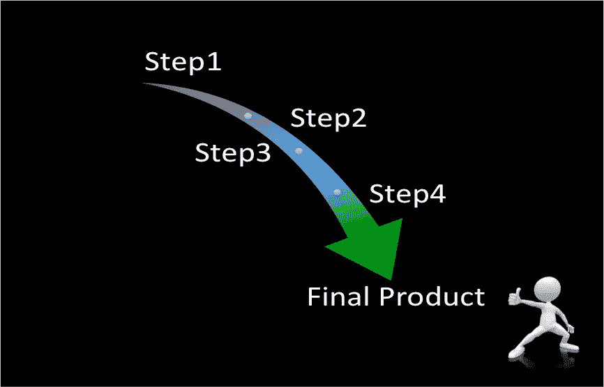
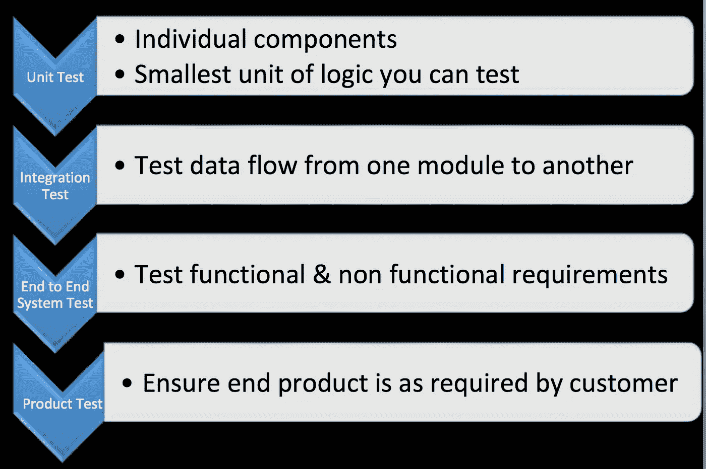

# 给每个数据工程师或数据科学家的提示

> 原文：<https://towardsdatascience.com/14-tips-for-every-data-engineer-or-scientist-e4b47fbd8498?source=collection_archive---------49----------------------->

## **提示作为一名初露头角的数据分析专家，我希望自己知道这些**

以下是我发现作为数据专业人员至关重要的 10 件简单的事情。这些技巧虽然显而易见，但却能区分普通的数据专家和杰出的数据专家。这里讨论的技巧与定义问题、生产好的产品和个人发展有关。

编辑过的照片由[玛琳·莱帕宁](https://www.pexels.com/photo/close-up-photo-of-person-holding-bulb-1434984/)原创

## 1.理解你工作的背景

要生产一个好的产品，你必须了解要制造什么，为什么需要它，你要和谁一起做，什么时候做，在哪里做。这基本上就是应用 5 Ws 了。这里有一些问题。

*什么*:需要做什么，业务影响或理由是什么？有什么要求？你的范围是什么？

*为什么*:为什么一定要做？

*谁:*谁是利益相关者——谁是您的最终用户，谁是您需要与之合作的其他团队？

项目必须在什么时候完成？现有系统何时会关闭或数据集何时会过时？

*哪里:*你的产品或流程需要在哪里发生？

这里的目标是获得一套清晰完整的资源、要求和时间表。

## 2.起草一份你的理想解决方案的计划

这将指导你“如何”做项目。很多时候，你不能实现一个理想的解决方案，而是在你的当前状态和你的理想解决方案之间。

**图 1:创建解决方案的计划(由作者创建)**

## 3.进行一些流程或数据发现

这是了解当前状态和可用资源，并确定主题专家的研究。发现通常会导致需求、方法和时间表的变化。

## 4.创建好的代码

人们很容易忘记用于创建数据输出的代码是数据产品的一部分。要创建好的代码:

I .从小处着手并迭代——使用小数据集快速确保代码按预期运行。不断完善。它不会是完美的，这没关系。

二。代码检查——试着想一想什么会破坏你的代码逻辑，以及你如何积极主动地处理它。对于一些关键元素，创建失败保存。

三。优化代码——这可能是 10 分钟代码和 4 小时代码的区别。这对于实时系统尤其重要，因为在实时系统中，客户希望得到即时响应。

四。注释你的代码——你的代码应该让任何人在高层次上都容易理解每一步发生了什么。

动词 （verb 的缩写）建立一个基线来验证你的产品。

## 5.使自动化

尝试创建可以完全自动化的流程或模型。避免手动输入。

## 6.测试，测试，再测试！

测试花费的精力和时间取决于您的更改是否可逆。如果流程一旦实施就不可逆转，那么要确保有足够的时间和精力来测试流程和产品的弹性、可靠性和正确性。应该对每个产品执行的一些测试包括:

产品开发的关键测试(由作者创建)

## 7.监控您的产品

建立指标和流程来监控您的产品，并在需要改变时发出警报。

## 8.沟通

这可以说是处理数据时最重要的技能之一。沟通至关重要，因为它设定了期望。交流-

a.在整个过程中与利益相关者一起细化需求和范围。

b.确保适当使用他们的数据集或产品。

c.与其他团队合作，了解其他技术规范。如果您的流程被部署，它会影响任何其他现有的特性吗？

d.通过尽可能多地评论你的代码、版本和文档，与你未来的自己和其他队友交流。

e.与最终用户和企业一起设定正确的期望值，创建服务级别协议，并就变更流程达成一致。

人们谈论的数据来源: [fauxels](https://www.pexels.com/photo/photo-of-person-holding-mobile-phone-3183153/)

## 9.记住没有人是完美的

认识到你不会总是有一个完美的产品，也不会总是有答案。有人向你征求意见通常是有帮助的。

## 10.检查你的成长

最后但同样重要的是，定期检查您的编码或解决问题的技能是否随着时间的推移而提高。心中有一个目标会有所帮助。对我来说，我通常会查看并尝试模仿我发现最有帮助的包的编码风格。

通过练习，一切皆有可能。来源: [Tranmautritam](https://www.pexels.com/photo/photo-of-gray-and-white-tabby-kitten-sitting-on-sofa-2194261/)

感谢阅读！请随时联系我，让我知道你的想法！😄