# 从数据到洞察的 15 种数据探索技术

> 原文：<https://towardsdatascience.com/15-data-exploration-techniques-to-go-from-data-to-insights-93f66e6805df?source=collection_archive---------3----------------------->

## 构建数据探索的艺术

照片由 [Unsplash](https://unsplash.com/s/photos/data-girl?utm_source=unsplash&utm_medium=referral&utm_content=creditCopyText) 上的 [h heyerlein](https://unsplash.com/@heyerlein?utm_source=unsplash&utm_medium=referral&utm_content=creditCopyText) 拍摄

我们都面临过看着原始数据并思考下一步该做什么的焦虑。尽管数据科学算法已经非常成熟，但如何从原始数据发展出真知灼见仍然是一门手艺。

那么，一个人如何构建一门艺术呢？可以做的事情之一是制定某种列表或构建模块。以英语为例。积木是字母 A、B、C 等。有了这些基本的字母积木，我们就能造出漂亮的单词

因此，在本文中，我试图列出最有效的数据探索技术。这个列表绝不是任何详尽的列表，但我在这里的尝试是给数据探索的艺术带来一些结构

为了说明这些数据探索技术，让我举一个汽车的样本数据集。

汽车数据集示例

现在让我举例说明数据探索技术

# 1.唯一值计数

在数据探索过程中，首先要做的事情之一是查看分类列中有多少唯一值。这给出了数据是关于什么的概念。此处显示了 cars 数据集中分类列的唯一值计数。

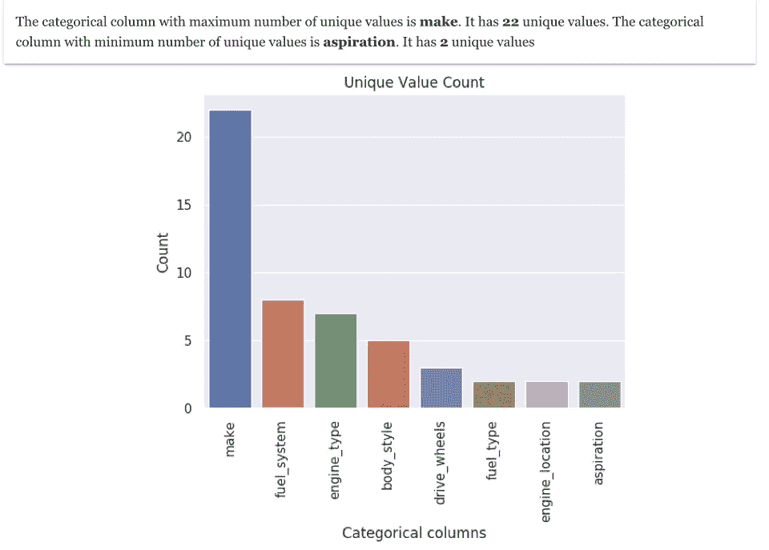

唯一值计数

正如您将观察到的，唯一值的最大数量在“品牌”列中，这意味着数据集主要围绕不同品牌的汽车

# 2.频率计数

频率计数是查找列中单个值出现频率。例如，下面是列“make”的频率计数。

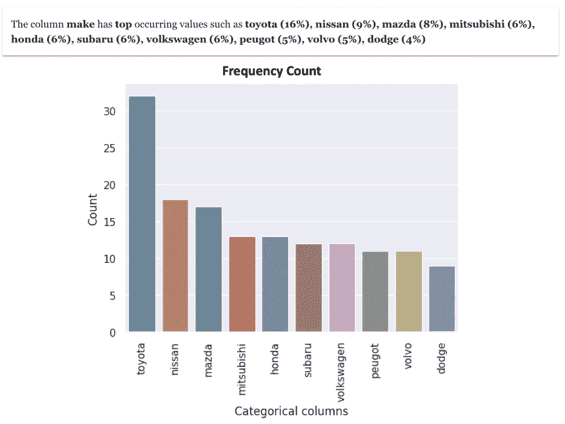

频率

它显示，在品牌栏中，丰田的价值出现最多(16%)，道奇的价值出现最少(4%)。通过这种分析，您可以很好地了解分类变量的内容

# 3.差异

在分析数值时，一些基本信息如最小值、最大值和方差非常有用。方差很好地说明了值是如何分布的。

这是显示 car 数据集中数值列中数值分布的可视化。

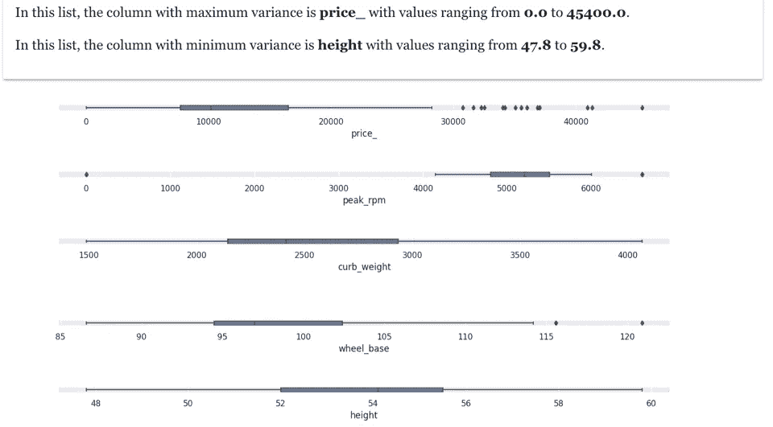

差异

上面的可视化是以这样一种方式组织的，即在顶部显示具有高变化的场，在底部显示具有低变化的场。例如，对于我们的汽车数据集，方差最大的字段是价格，方差最小的字段是高度

# 4.帕累托分析

帕累托分析是一种关注重要事物的创造性方法。帕累托 80-20 法则可以有效地用于数据探索。在汽车数据集中，我们可以对价格列应用帕累托分析，如下所示

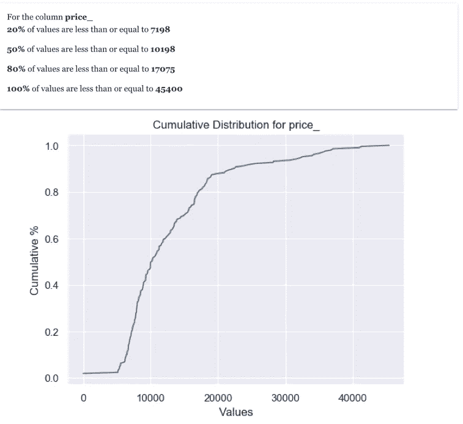

帕累托分析

正如分析表明，80%的价格低于 17075。这是一个很好的信息，可以让你深入了解什么是可以被认为是高的价格水平

# 5.柱状图

直方图是数据科学家最喜欢的数据探索技术之一。它给出了大部分值的值域信息。它还提供了关于数据中是否存在任何偏差的信息。如果我们在价格栏中制作一个直方图，它将指示具有最大值的价格范围和具有最小值的价格范围

柱状图

# 6.所有数字列之间的关联热图

术语相关性指的是两个事物之间的相互关系或关联。几乎在任何业务中或出于个人原因，用与他人的关系来表达某事是有用的。寻找相关性在数据探索中非常有用，因为它给出了列如何相互关联的想法

查看数字列之间相关性的最佳方式之一是使用热图。在 cars 数据集中，这是数字列之间的关联热图

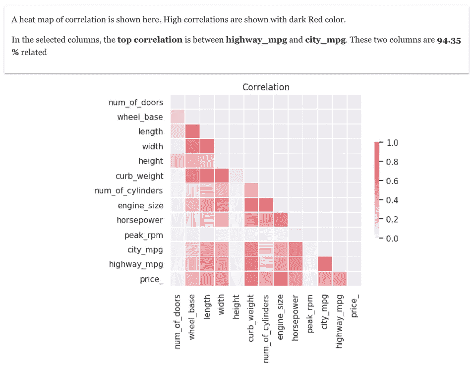

相关热图

因为相关性热图显示公路英里数和城市英里数之间的高度相关性。您还可以看到其他列之间的相关性

# 7.两个数值列之间的 Pearson 相关性和趋势

一旦可视化了关联热图，下一步就是查看两个特定数字列之间的关联趋势。例如，以下是汽车数据集中城市 mpg 和公路 mpg 之间的关联

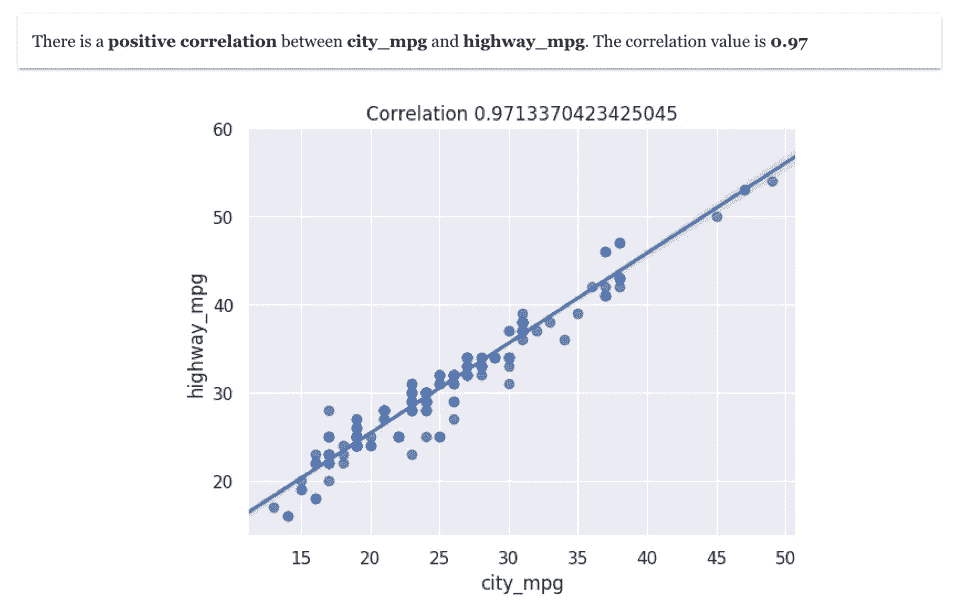

皮尔逊相关

这种相关性可视化清楚地显示了两个柱之间非常正的相关性

# 8.所有分类列之间的 Cramer-V 相关性

Cramer-V 是一种非常有用的数据探索技术，用于发现分类变量之间的相关性。Cramer-V 的结果也可以使用热图来可视化。

在 cars 数据集中，有许多分类列。这是基于所有分类列之间的 Cramer-V 相关性生成的热图

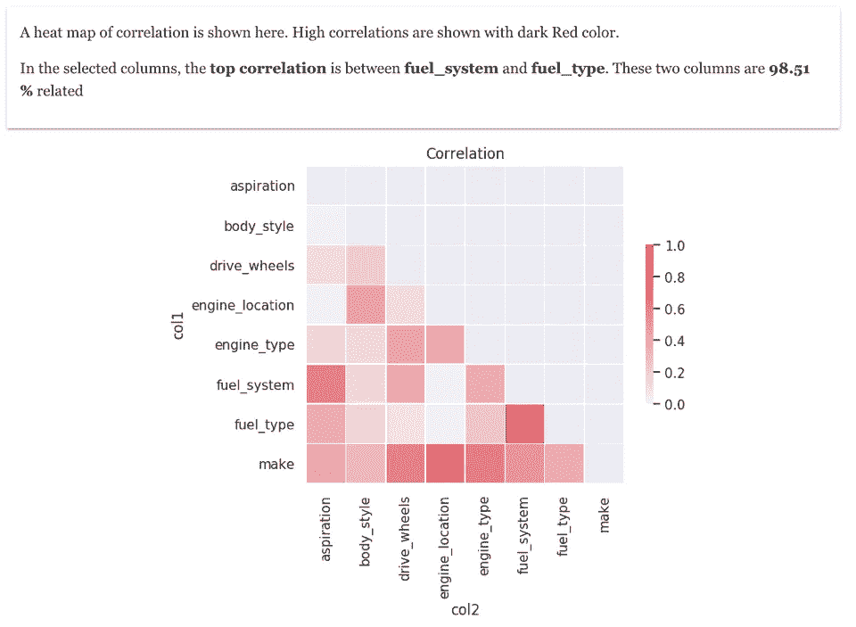

克拉默-V 相关矩阵

正如我们可以看到的，列 fuel_system 和 fuel_type 高度相关

# 9.两个特定分类列之间的相关性

一旦使用 Cramer-V 相关矩阵检查了分类列之间的相关性，就可以进一步研究任意两个分类列之间的相关性。这可以使用两列之间的气泡图来完成，气泡的大小表示出现的次数

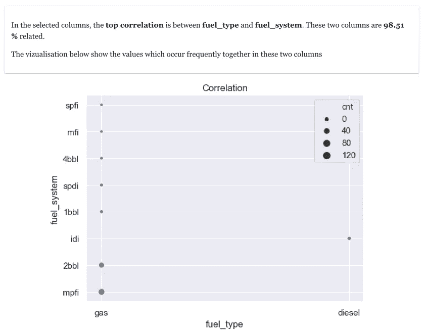

分类列之间的相关性

你会发现大多数燃料系统都有一种燃料类型的气体，证实了这两个领域之间的强相关性

# 10.聚类大小分析

我们生活在一个拥有海量数据的世界。很容易陷入数据过载的困境。为了在这个不断增长的数据世界中生存，我们需要从高层次的角度来看待事物。

将事物组合在一起可以让我们有一个高层次的视角。成组的数据允许我们首先查看成组的而不是单个的数据点。您更喜欢查看数百万条数据记录还是查看几组数据？答案显然是以后，因为我们人类更喜欢以自上而下的方式理解

数据科学可以帮助我们完成从大量数据中创建少数群体的惊人壮举。在数据科学术语中，分组的过程也称为聚类或分段。制作数据段是一种很好的数据探索技术，因为它提供了一个很好的数据概览

作为分段的第一步，对聚类大小进行分析是有用的。聚类大小分析显示了如何将数据分成不同的组。

聚类大小分析

正如我们可以观察到的，如果我们将所有数据分为 3 组，那么我们将拥有大小大致相同的簇

# 11.聚类或分割

一旦确定了簇的数量，下一步就是将所有数据分成特定数量的簇或段。

此处显示的是将所有数据分为三类的结果。这一结果在数据探索中非常有用

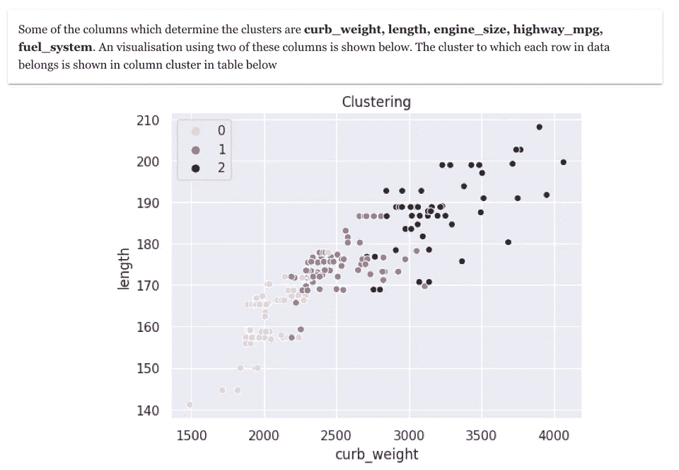

使聚集

为了使聚类成为更有效的数据探索工具，有必要了解聚类的含义。在本例中，我们观察到决定聚类的重要列是整备质量和长度。基于此，我们可以看到汽车可以分为三类——小型车、中型车和大型车。这种聚类练习在数据探索中非常有用

# 12.异常值概述

在数据中发现一些不寻常的东西称为离群点检测(也称为异常检测)。这些异常值代表一些不寻常的、罕见的、异常的或特殊的东西。离群值不一定意味着负面的东西。异常值分析极大地帮助提高探索性数据分析的质量

数值列中的异常值可以通过各种技术获得，如标准偏差分析或隔离森林等算法。异常值概述分析给出了所有数字列中异常值的概述。

气泡图显示具有很低或很高值的列。气泡越大，意味着列中存在的异常值越多

异常值概述

上面显示了 cars 数据集中数值列的异常值概述。它显示大多数异常值都在“气缸数量”列中

# 13.单个数值列的异常值分析

一旦您检查了哪些列具有非常高或非常低的值，您就可以分析各个列。

可视化中显示了一个方框图。在方框图中，正常范围由最左侧和最右侧的垂直线表示。超出正常范围的点是异常值。左侧的点是非常低的值，最右侧的点是非常高的值

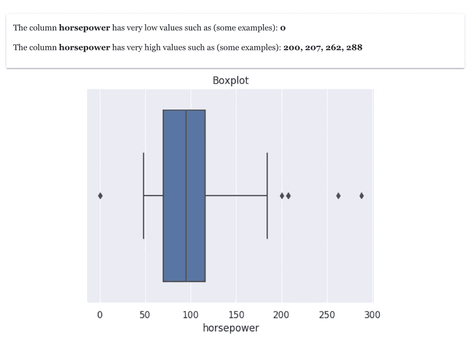

单个数值列的异常值

作为上面的例子，cars 数据集中列马力的异常值分析如上所示

# 14.多个列的异常值分析

探索性数据分析的一个重要步骤是基于多列(行级)发现异常值。这可以使用各种算法来实现，例如隔离森林

显示散点图，异常值用不同颜色标记(标签 1)。散点图的轴基于列，因此该行是异常值。

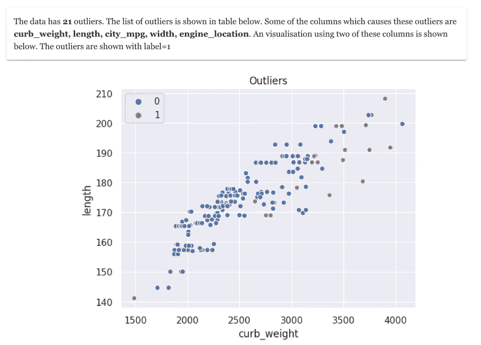

多个列的异常值分析

在异常值分析过程中，获取数据点或数据行是异常值的原因也很重要。在 cars 数据集的示例中，您可以看到大多数异常值都与高权重和高长度相关

# 15.专业可视化

到目前为止，你所看到的大多数可视化都是经典的，比如条形图、散点图等..然而，在数据勘探过程中，添加一些专门的可视化工具非常有价值，如雷达图、神经网络可视化工具或 Sankey 图表

这有助于更好地理解数据。雷达图有助于比较。而神经网络可视化可以帮助理解哪些列的组合可能是重要的特征，或者还可以帮助理解隐藏或潜在的特征。桑基图在进行路径分析时非常有用

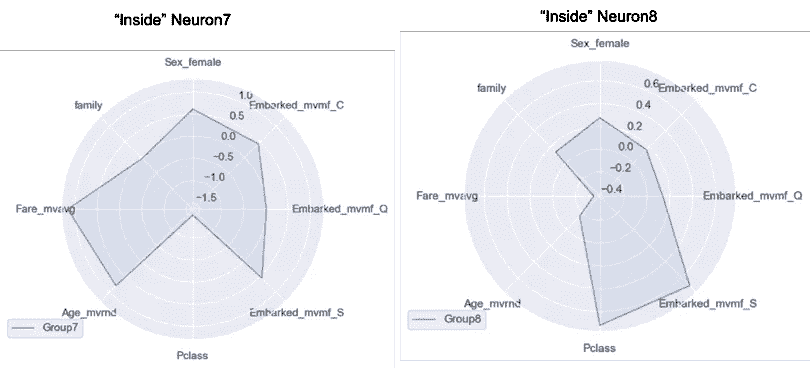

用于比较的雷达图

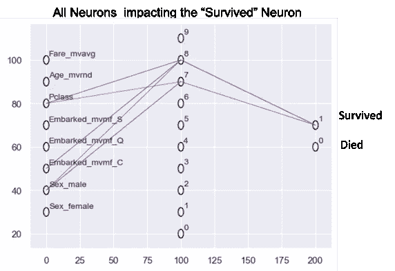

理解隐藏或潜在特征的神经网络

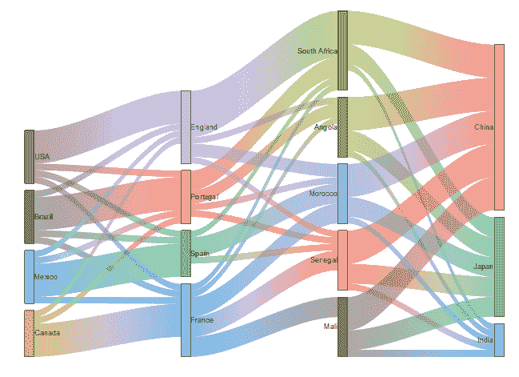

用于路径分析的 Sankey 图

还有很多数据探索技术，但是上面的 15 个会给你一个好的开始。下次您看到一些原始数据时，借助这些数据探索技术，您将很快获得真知灼见

# 额外资源

# 网站(全球资讯网的主机站)

你可以访问我的网站进行零编码分析。[https://experiencedatascience.com](https://experiencedatascience.com)

请**订阅**每当我发布一个新的故事时，请及时通知我。

 [## 每当 Pranay Dave 发表文章时，您都会收到电子邮件。

### 每当 Pranay Dave 发表文章时，您都会收到电子邮件。通过注册，您将创建一个中型帐户，如果您还没有…

pranay-dave9.medium.com](https://pranay-dave9.medium.com/subscribe) 

你也可以通过我的推荐链接加入 Medium。

 [## 通过我的推荐链接加入 Medium—Pranay Dave

### 作为一个媒体会员，你的会员费的一部分会给你阅读的作家，你可以完全接触到每一个故事…

pranay-dave9.medium.com](https://pranay-dave9.medium.com/membership) 

https://www.youtube.com/c/DataScienceDemonstrated 的 YouTube 频道
这里是我的 Youtube 频道
[的链接](https://www.youtube.com/c/DataScienceDemonstrated)