# 15 张图显示了冠状病毒如何改变我们的搜索

> 原文：<https://towardsdatascience.com/15-graphs-which-show-how-coronavirus-is-changing-what-we-search-for-bc07bc4302a3?source=collection_archive---------29----------------------->

## 在整个西方世界，新冠肺炎病例的迅速增加不仅改变了我们的行为方式，也改变了我们寻找的东西。

随着新冠肺炎病例在整个西方世界的迅速增加，我们许多人转向谷歌获取信息也就不足为奇了。我们不只是研究病毒本身；新冠肺炎正在改变我们搜索旅游、娱乐和金融信息的方式。

为了了解案件的增加如何影响我们的搜索行为，我使用谷歌趋势 API 提取了一系列不同搜索趋势的数据，这些数据与冠状病毒搜索量的增加或正或负相关。下面是我发现的一些最有趣的图表。

# 旅行

不足为奇的是，全球新冠肺炎病例的增加对我们的旅游态度产生了巨大影响，并随之影响了我们的搜索内容。随着热门度假目的地的病例增加，以及边境关闭的威胁不断增加，越来越多的人开始询问如何取消航班预订:

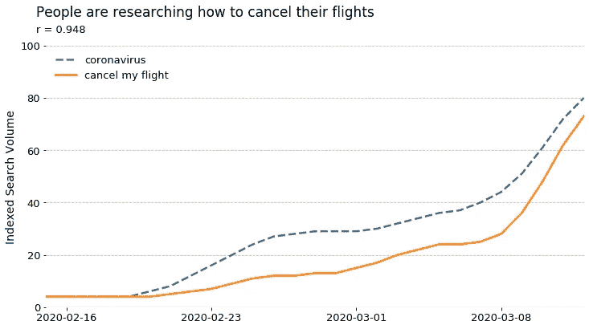

上升的不仅仅是取消；那些有旅行计划的人越来越多地希望申请保单，并购买新的保单:

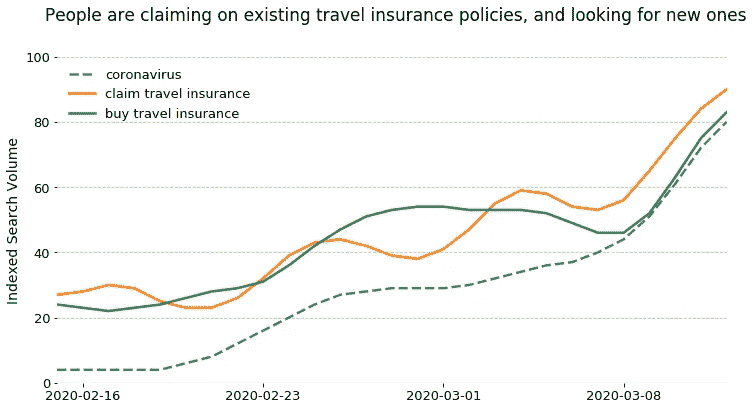

虽然 Skyscanner 等价格聚合器的搜索量有所下降，但通过更通用的搜索词寻找降价航班的人数却有所增加:

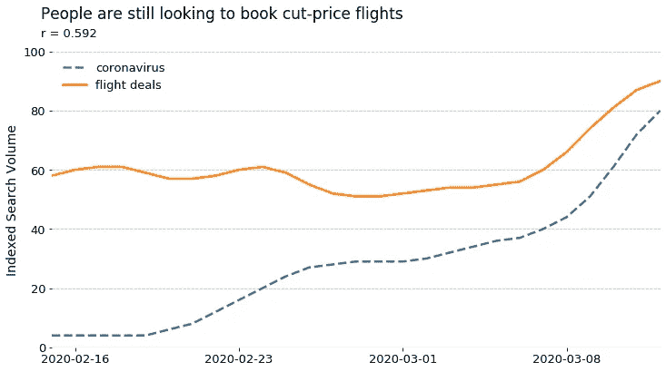

这并不一定意味着人们仍然在预订航班。搜索量已经从品牌关键词(*、【英国航空】、*)转向通用关键词(*、【机票】、*)，这一事实可能表明，消费者只是在研究那里有什么，还没有购买的意图。

# 金融

过去几周的话题之一是冠状病毒恐惧对全球金融体系的影响。由于大量行业的供应链受到冠状病毒爆发的影响，消费者担心他们的金融未来也就不足为奇了。

一个直接影响是，寻求将资产转移出股市、甚至利用这种不确定性的人增多了:

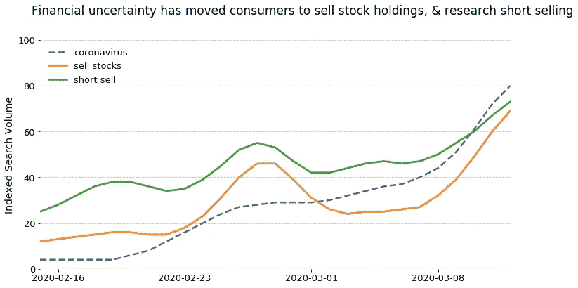

鉴于目前的市场动荡，消费者越来越担心经济衰退的前景就不足为奇了。这张图表追踪了过去 3 个月对*衰退*的搜索，以真正强调担忧的增加以及它与对冠状病毒的兴趣有多么密切的关联:

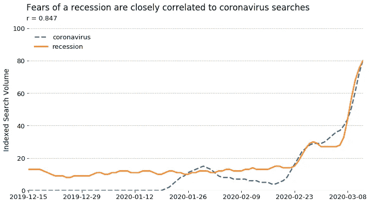

上图中有趣的一点是，在一月底冠状病毒*搜索的第一次上升期间，关于*衰退*的搜索似乎没有显著增加。当时 mainland China 的病例正在上升，但在西方很少观察到病例。*

这表明，在普通谷歌用户真正担心衰退的可能性之前，西方的案例有所增加。

# 运动

随着许多体育比赛和赛事的取消，一个大问题仍然存在:东京奥运会会如期举行吗？

虽然在撰写本文时还不知道这个问题的答案，但消费者越来越担心奥运会将被取消:

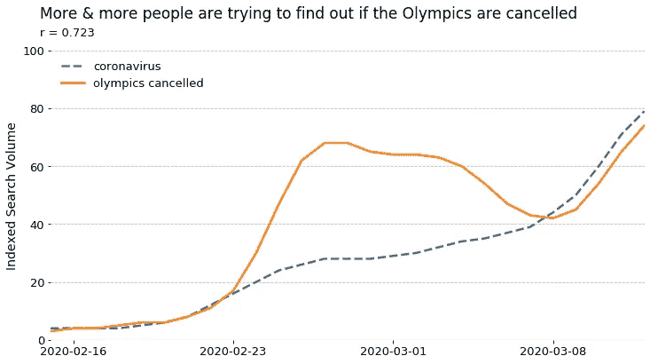

无论奥运会是否如期举行，搜索量趋势显示，由于消费者对冠状病毒的担忧加剧，门票需求大幅下降:

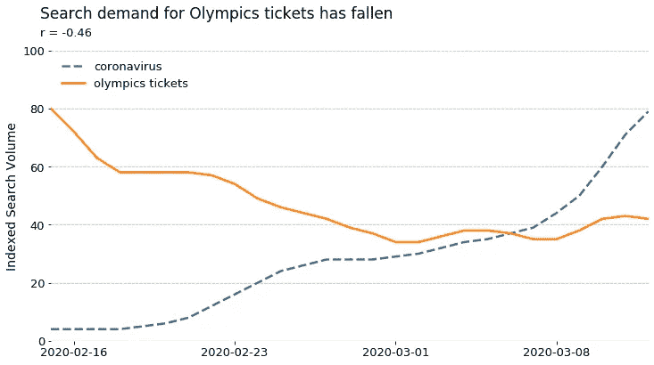

‍

# 健康

随着冠状病毒成为一种健康流行病，病例的增加影响了我们搜索健康信息的方式也就不足为奇了。

我发现一个有趣的数据切割方法是查看对新冠肺炎主要症状的搜索:

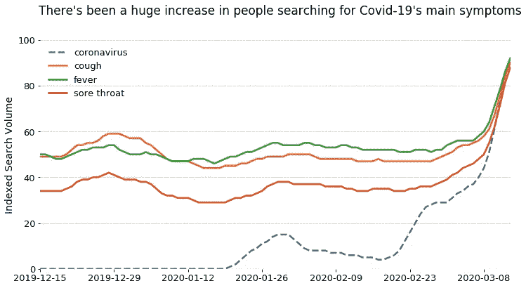

有趣的是，这些词的搜索量一直或多或少保持稳定，直到 3 月中旬才急剧上升。这可能是因为随着冠状病毒在西方国家传播，这些症状的发病率增加，而谷歌在西方国家是最常用的。

或者，在围绕冠状病毒的恐慌中，人们更有可能通过谷歌搜索这些症状来确认或拒绝他们是否患有新冠肺炎。毕竟，大多数人都很熟悉喉咙痛，他们通常不会在网上搜索信息。然而，面对感染新冠肺炎病毒的前景，有可能会有更多的人转向谷歌，不管他们是否真的感染了病毒。

另一个有趣的健康趋势与用户在线寻找的健康信息类型有关。虽然对在线医生的搜索(令人惊讶地)保持相当平稳，但人们已经开始越来越多地转向在线症状检查器寻求医疗建议:

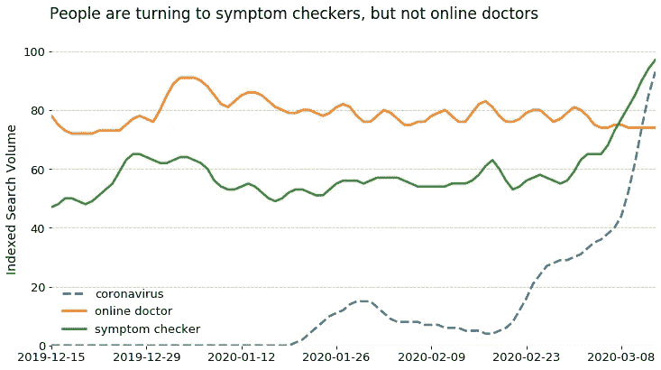

# 工作

随着越来越多的西方公司关闭了他们的物理办公室，对远程工作和视频会议的搜索出现了大幅增长:

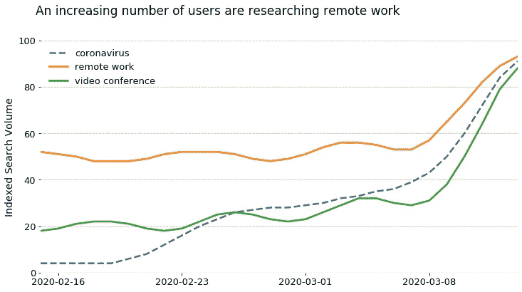

上图中特别有趣的是，橙色和绿色线条直到 3 月 8 日左右才真正开始上升。这可能反映出，尽管新冠肺炎病例越来越多，但在 3 月 9 日周一开始的一周之前，很少有公司实施远程工作。

关于团队沟通软件品牌如 Zoom 和 Slack 如何从向远程工作的转变中获益的新闻已经很多了，看看它们的搜索量就可以反映出:

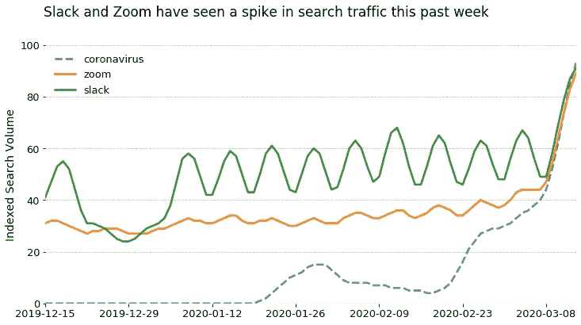

虽然上图中最明显的特征是最右边的巨大跳跃，但也值得注意的是，Zoom 和 Slack 的搜索量在过去两个月里稳步增长。

这可能是由于许多非西方公司在转向远程工作时更早地采用了这些品牌。

# 娱乐和活动

最后但同样重要的是，西方对冠状病毒日益增长的担忧也改变了我们闲暇时的行为。OpenTable 的首席运营官 Andrea Johnston 已经指出了一个明显的趋势，那就是消费者越来越不愿意外出就餐:

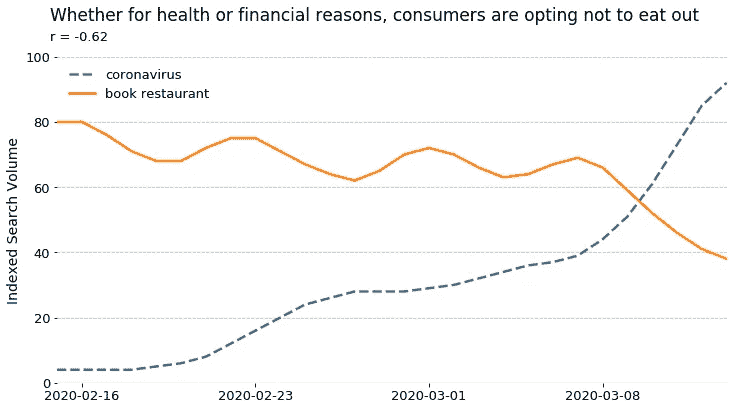

然而，不仅仅是餐馆受到冠状病毒恐惧的严重打击，电影院的搜索流量也在下降:

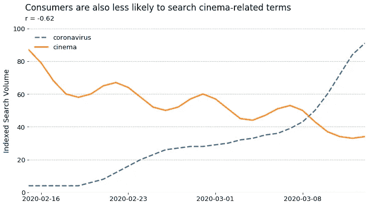

上述两种趋势都是可以预测的；谁会愿意在一个封闭的空间里，在一场流行病中，与可能有数百人在一起呢？

你可能期望看到的一些其他趋势似乎还没有出现。随着越来越多的人留在疫情，许多人预计像网飞这样的公司将在整个冠状病毒中繁荣发展。但到目前为止，谷歌趋势并没有显示任何支持这一点的数据:

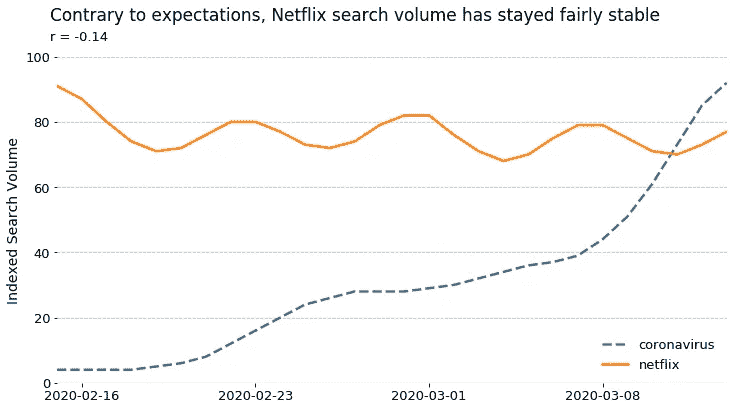

许多人预计在这种环境下蓬勃发展的其他品牌是 Peloton 和 Zwift，这两家最受欢迎的室内锻炼提供商:

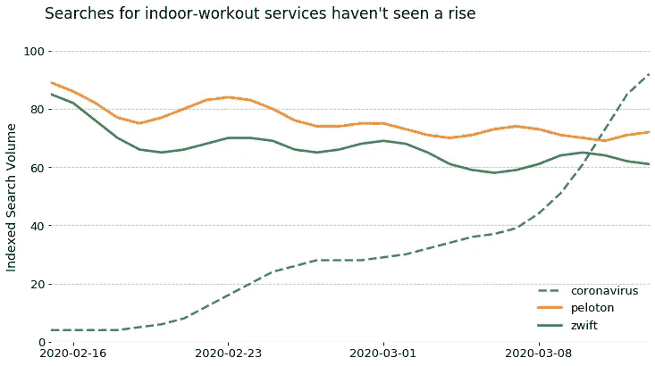

上面的数据显示，这两个网站的搜索流量都没有显著增加，如果有的话，可能在最近几周有所下降。

也许像网飞和 Peloton 这样的室内友好型品牌期待看到增长还为时过早。也许我们要等到更多的西方国家实施检疫措施后，人们对这些品牌的兴趣才会开始回升。

# 最后

上面的图表显示，对冠状病毒的日益关注与搜索行为的一些有趣变化相关；无论是我们寻求的金融建议，还是我们寻求的医疗信息。

毫无疑问，这些趋势中的许多可能在几周内看起来完全不同，我们可能会看到我们现在甚至无法预测的新趋势。

你对趋势有什么想法吗？我很想在推特上听到你的想法:[@ mackgenfell](https://twitter.com/MackGrenfell)

【https://mackgrenfell.com】最初发表于**。**