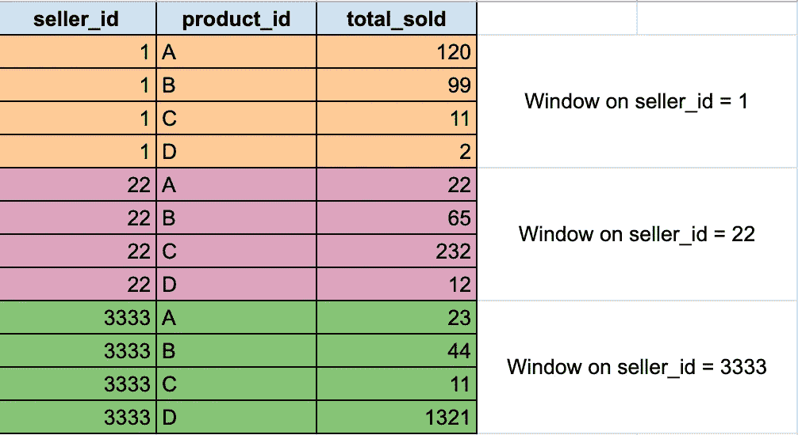
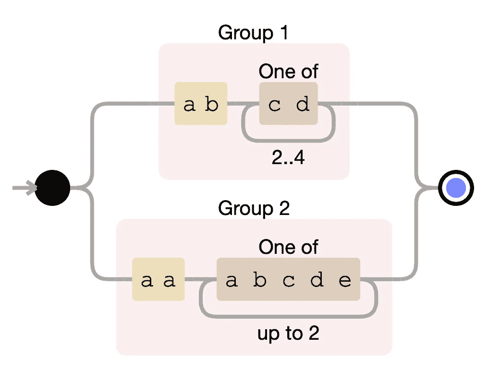
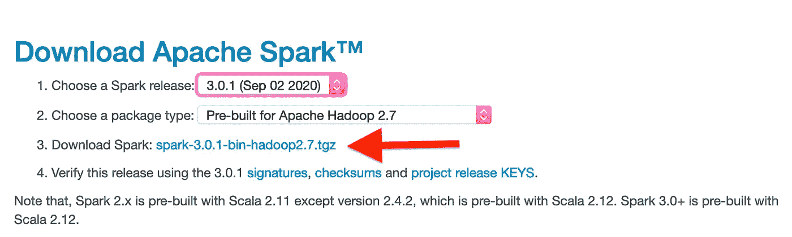
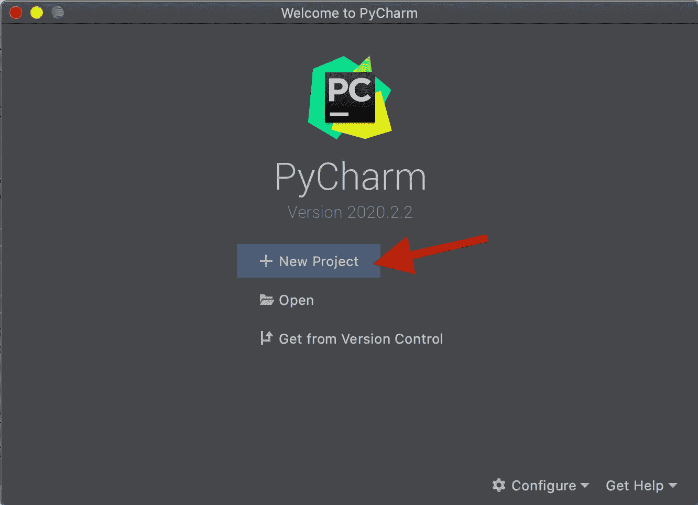
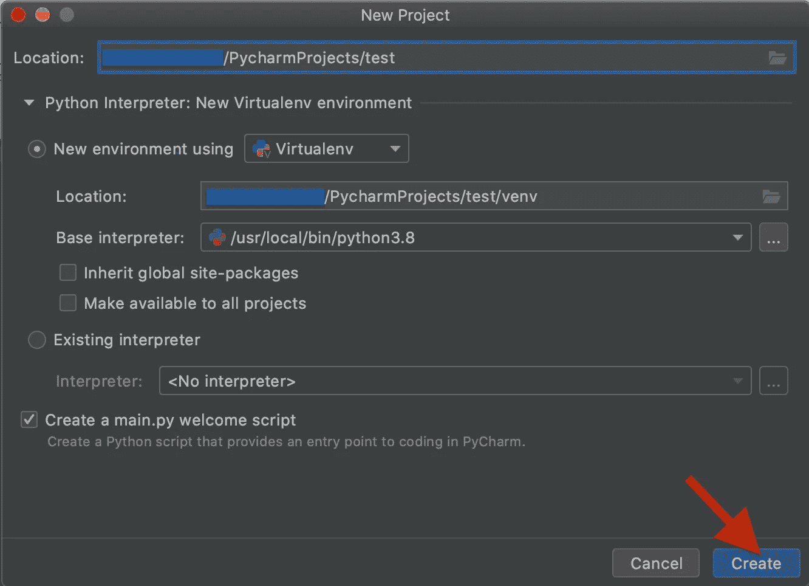
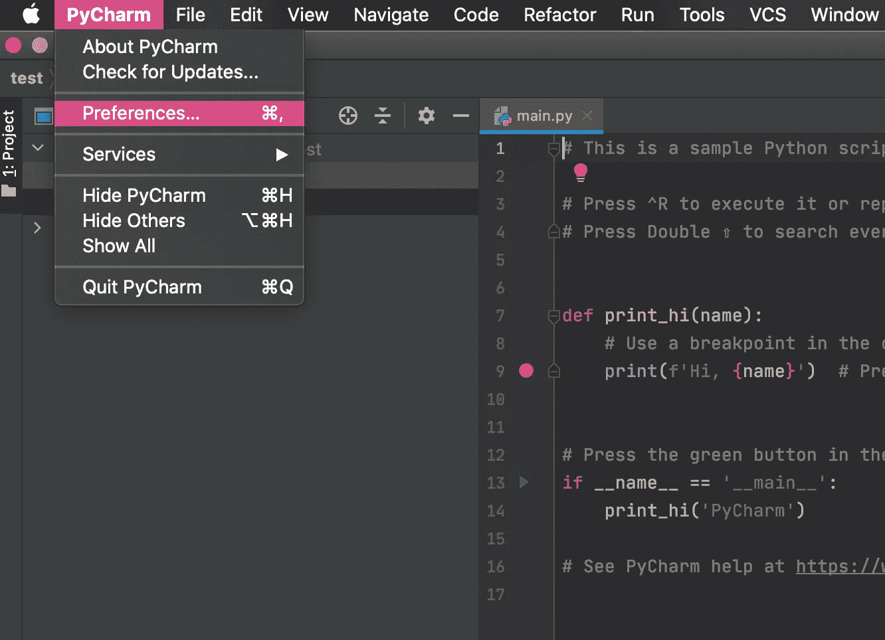
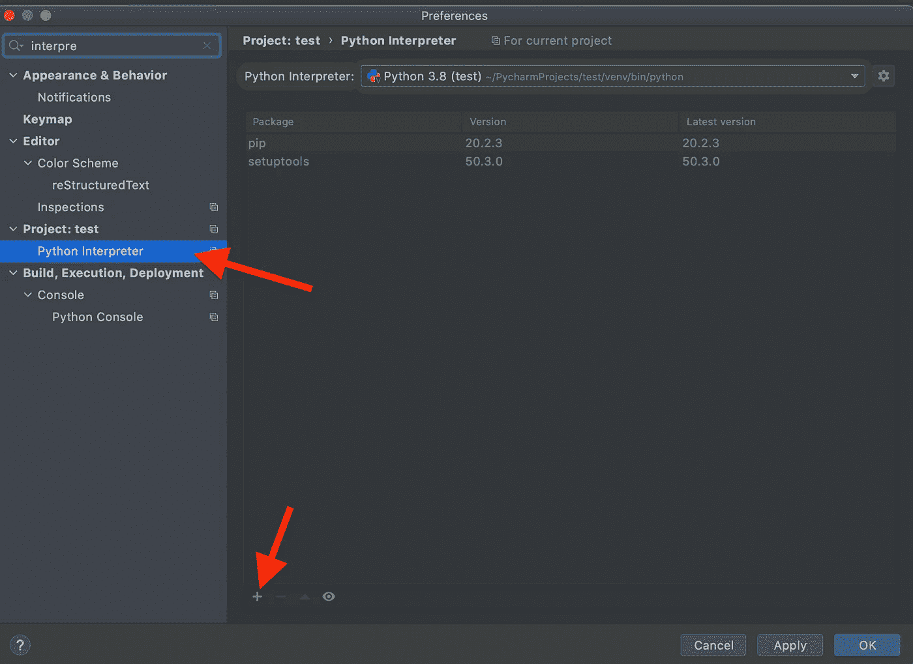
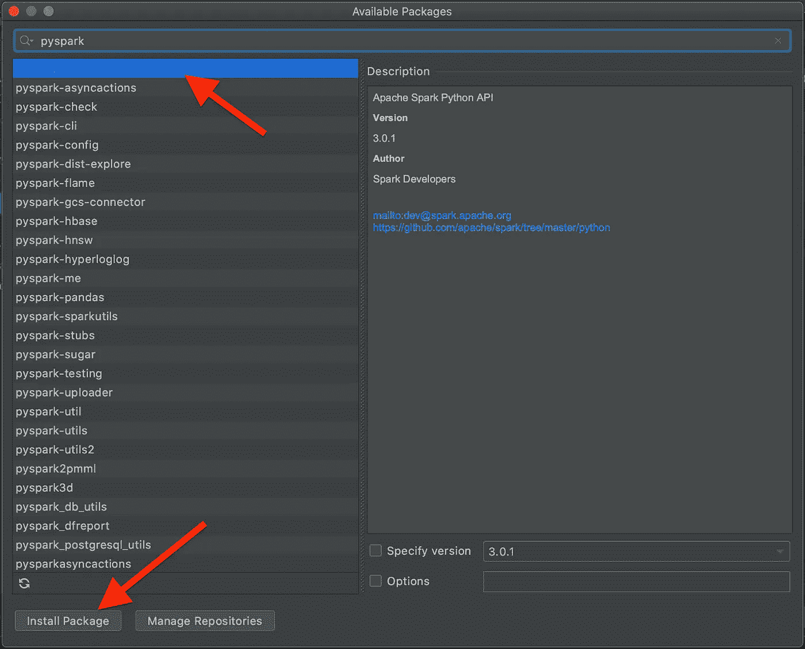
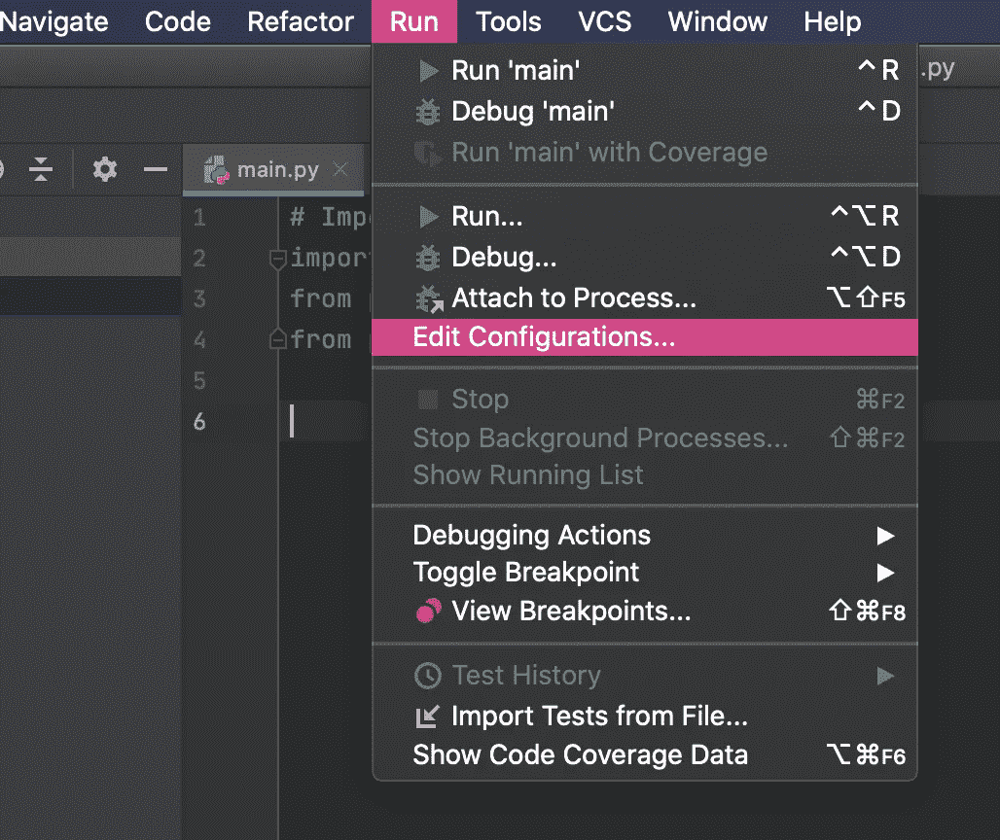

# 15 分钟后点火

> 原文：<https://towardsdatascience.com/15-minutes-to-spark-89cca49993f0?source=collection_archive---------30----------------------->

## 从配置到 UDF，像老板一样在 900 秒内开始工作


Jukan Tateisi 在 [Unsplash](https://unsplash.com/s/photos/stairs?utm_source=unsplash&utm_medium=referral&utm_content=creditCopyText) 上拍摄的照片

正如我在[写的几乎所有关于这个工具的文章](https://medium.com/@andrea.ialenti)一样，Spark 和 SQL 一样超级好用。但是不管我花多少时间写代码，**我就是不能在我的大脑中永久存储 Spark APIs】(有人会说我的内存就像 RAM，小而易失(:)。**

无论您是想要 Spark SQL 的**快速入门，还是不耐烦编写您的第一个查询，或者您和我一样需要一个**备忘单**，我相信您会发现这篇文章很有用。**

这篇文章的想法是涵盖 Spark SQL 的所有主要功能/特性，并且在片段中，您总是可以看到原始的 SQL 查询及其在 PySpark 中的翻译。

我将在 [**上执行我的代码。这个数据集**](https://drive.google.com/file/d/1kCXnIeoPT6p9kS_ANJ0mmpxlfDwK1yio/view) : 是我几个月前为另一篇中型文章创建的，名为[**六个 Spark 练习，用来管理所有这些练习**](/six-spark-exercises-to-rule-them-all-242445b24565?utm_source=tr.im&utm_medium=no_referer&utm_campaign=tr.im%2F1Triu&utm_content=direct_input) **—** ，它由三个简单的表格组成:


# 基础知识

Apache Spark 是一个用于大规模并行数据处理的**引擎**。这个框架的一个惊人的特点是**它用多种语言**公开 API:我通常用 **Scala** 与它交互，但其他很多人用 **SQL** 、 **Python** ，甚至 **Java** 和 **R** 。

当我们编写一个 Spark 程序时，首先要知道的是，当我们执行*代码*时，我们不一定对数据执行任何操作。事实上，该工具有两种类型的 API 调用:*转换*和*动作*。Spark *转换*背后的范例被称为**惰性评估**，这意味着**实际的数据处理不会开始，直到我们调用*动作*** 。
为了理解这个概念，想象一下你需要做一个`SELECT`和一个列的重命名:**而没有调用一个*动作*** (比如一个`collect`或者一个`count`)，你的代码只是定义了所谓的 ***Spark 执行计划*** ，也就是一旦一个*动作*被触发，将要执行的一组操作。

Spark 在一个**有向无环图**(非常著名的 **DAG** )中组织执行计划。该结构描述了将要执行的确切操作，并使调度器能够决定在给定时间执行哪个任务。

正如宫城先生教导我们的:

1.  **蜡上**:定义 DAG ( *变换*)
2.  **打蜡**:执行 DAG ( *动作*)

# 与火花互动

太好了，我们从哪里开始？使用 Spark 有多种方式:

*   **使用 IDE** :我会推荐 IntelliJ 或者 PyCharm，但是我想你可以选择你想要的。**查看附录中的 PyCharm 快速入门(在本地运行查询)**。我认为可以从您的本地环境中使用远程 Spark executor(使用 [Livy](https://livy.apache.org/) 肯定可以，不确定没有它是否容易)，但说实话，我从未经历过那种配置。
*   **Jupyter 笔记本+Spark magic**:*Spark magic 是一套通过*[*Livy*](https://livy.incubator.apache.org/)*、Spark REST 服务器* [ [1](https://github.com/jupyter-incubator/sparkmagic) ]与远程 Spark clusters 进行交互工作的工具。**这是你在 AWS、Azure 或谷歌云等云系统上工作时使用 Spark 的主要方式。大多数云提供商都有在大约 10 分钟内配置集群和笔记本电脑的服务。**
*   **通过使用** `**spark-shell**`的终端:有时你不想在你和你的数据之间有任何东西(例如，在一个表上做一个超级快速的检查)；在这些情况下，您可以只打开一个终端并启动`spark-shell`。

下面的代码很大程度上是针对 IDE 的。

在编写任何查询之前，我们需要导入一些库并启动一个 Spark 会话(使用**数据集和 DataFrame API** 编程 Spark 的入口点)。以下 PySpark 和 Scala 代码片段将加载您需要的所有内容(假设您已经配置了您的系统)。之后，为了简单起见，我们只看 PySpark 代码。除了一些细微差别之外，Scala APIs 非常相似。

## PySpark

## 斯卡拉

解释数据集、数据帧和 rdd 之间的差异在我承诺的 15 分钟内无法完成，所以我将跳过这一部分，假装它不存在。

# 基本操作

您可以编写的最简单的查询可能是您曾经使用过的最重要的查询。让我们看看如何使用`Sales`表进行基本操作。

## 简单的 Select 语句和显示数据

我们在代码片段中做的第一件事是定义执行计划；**只有当我们输入了显示*动作*** 时才会执行。

我们可以对 Spark 计划采取的其他行动包括:

*   `collect()` —返回我们的整个数据集
*   `count()` —返回行数
*   `take(n)` —从数据集中返回`n`行
*   `show(n, truncate=False)` —显示`n`行。您可以决定截断结果或显示所有长度的字段

另一个有趣的注意事项是**列由** `**col**` **对象**标识。在本例中，**我们让 Spark 推断这些列属于哪个数据帧。**

我们可以使用语法`execution_plan_variable["column_name"]`到**来指定列来自哪个执行计划**。使用这种替代语法，我们得到:

**当我们处理连接**时，限定字段的源表尤为重要(例如，两个表可能有两个同名的字段，因此仅使用`col`对象不足以消除歧义)。Scala 中的语法略有不同:

```
// Qualify the source execution plan in Scala
sales_table.col("order_id")
```

## 重命名和添加列

有时我们只是想重命名一个列，或者我们想添加一个新的列进行一些计算(例如一个`CASE WHEN`):

## 简单聚合

Spark 支持**所有主要的聚合功能**。下面的例子仅指“简单”的(如*平均值*、*总和*、*计数*等)。).稍后将描述数组的聚合。

## 显示表模式

显示“*表*”模式是一种误导性的措辞；更精确的定义应该是“*显示执行计划的输出模式*”。**有了 Spark APIs，我们可以一个接一个地用管道传输多个操作**；使用`printSchema` API，**我们输出如果我们将执行计划的结果写到磁盘**上，最终的表会是什么样子。

在下面的示例中，我们重命名了几列，进行了聚合，并添加了另一列。

`printSchema`的输出是:

```
root
 |-- product_id: string (nullable = true)
 |-- total_pieces: double (nullable = true)
 |-- fake_column: integer (nullable = false)
```

注意`**printSchema**` **不会触发*动作****；*相反，Spark 会评估执行计划，以了解 DAG 在输出列方面的走向。**由于这个原因，这个操作比** `**show**` **要快得多，后者反而触发 DAG** 的执行。

## 解释执行计划

当*动作*被触发时，引擎将做什么的更详细解释可以通过`explain` API 获得。在这种情况下，我们将不会获得最终 DAG 节点的简单模式作为输出，但是**我们将获得 Spark** 将执行的操作的详细说明。让我们调用前面查询中的`explain`:

```
== Physical Plan ==
*(2) HashAggregate(keys=[product_id#361], functions=[sum(cast(pieces#379 as double))])
+- Exchange hashpartitioning(product_id#361, 200)
   +- *(1) HashAggregate(keys=[product_id#361], functions=[partial_sum(cast(pieces#379 as double))])
      +- *(1) Project [product_id#361, num_pieces_sold#364 AS pieces#379]
         +- *(1) FileScan parquet [product_id#361,num_pieces_sold#364] Batched: true, Format: Parquet, Location: InMemoryFileIndex[file:<PATH_TO_FILE>/sales_parquet], PartitionFilters: [], PushedFilters: [], ReadSchema: struct<product_id:string,num_pieces_sold:string>
```

老实说，我从来没有发现`explain` API 太有用，尤其是当 DAG 开始变得庞大和复杂的时候。**一个更好的视图可以在**[**Spark UI**](https://spark.apache.org/docs/3.0.0-preview/web-ui.html)**中找到，它展示了相同信息的图形表示**。

## 选择不同

## 什么情况下

Spark 非常好地实现了`CASE WHEN`操作(不需要专门的 UDFs 让我们简单地用`sales_table`将每一行插入到不同的桶中，这取决于`num_pieces_sold`:

## 联合所有

有时我们需要将我们的流分成多个部分，然后**将所有内容合并到一个表中**；在 SQL 中，这用`UNION ALL`表示。在 Spark 2.1 中，在执行`UNION ALL`操作之前，必须对列进行排序。**幸运的是，Spark 2.3 使用列名**来对齐正在被合并的执行计划。在下面的例子中，我们首先将我们的表一分为二，然后将各部分合并在一起(完全没有必要，但它将显示如何使用 API):

让我们来看看`explain`的幕后发生了什么:

```
Union
**:- *(1) Project [order_id#483, product_id#484, seller_id#485, date#486, num_pieces_sold#487, bill_raw_text#488]**
:  +- *(1) Filter (isnotnull(num_pieces_sold#487) && (cast(num_pieces_sold#487 as int) > 50))
:     +- *(1) FileScan parquet [order_id#483,product_id#484,seller_id#485,date#486,num_pieces_sold#487,bill_raw_text#488] Batched: true, Format: Parquet, Location: InMemoryFileIndex[file:<FILE_PATH>/sales_parquet], PartitionFilters: [], PushedFilters: [IsNotNull(num_pieces_sold)], ReadSchema: struct<order_id:string,product_id:string,seller_id:string,date:string,num_pieces_sold:string,bill...
**+- *(2) Project [order_id#483, product_id#484, seller_id#485, date#486, num_pieces_sold#487, bill_raw_text#488]**
   +- *(2) Filter (isnotnull(num_pieces_sold#487) && (cast(num_pieces_sold#487 as int) <= 50))
      +- *(2) FileScan parquet [order_id#483,product_id#484,seller_id#485,date#486,num_pieces_sold#487,bill_raw_text#488] Batched: true, Format: Parquet, Location: InMemoryFileIndex[file:<FILE_PATH>/sales_parquet], PartitionFilters: [], PushedFilters: [IsNotNull(num_pieces_sold)], ReadSchema: struct<order_id:string,product_id:string,seller_id:string,date:string,num_pieces_sold:string,bill...
```

粗体的两行是被合并在一起的表。

# 加入火花

当我们的代码出现性能问题时，连接通常是我们想查看的第一个地方。Spark 引擎在并行化非连接操作方面非常出色，但在处理`join`任务时可能需要调整。 [**关于这个话题**](/the-art-of-joining-in-spark-dcbd33d693c) **我写了一整篇文章，所以就不深究这个了**:如果你想了解更多，或者你正遇到一些关于 joins 性能的问题，我绝对建议看看！

同时，这里是加入的语法。在示例中，我们将连接`Sales`和`Sellers`表。

除了传统的加入类型(`left`、`right`、`inner`、`cross`等)。)，Spark 也支持`semi`和`anti`加入；**这两种基本上是一种方式来表达** `**IN**` **和** `**NOT IN**` **在 Spark** 中的操作:

# 窗口功能

**窗口函数对特定的行子集执行计算，定义为*帧*或*窗口*** 。经典的例子是子群的排序。在我们的玩具数据集中，假设我们想知道，对于每个卖家，卖得最多的产品是什么。为了提取这些信息，我们需要:

1.  **定义我们将应用排名函数**的“分区”——我们需要对每个`seller_id`销售的产品执行一次排名操作
2.  **应用我们的首选排序函数** n — `dense_rank`、`rank`、`row_number`。这里是 Spark 中的窗口函数列表。

下图是我们希望如何对数据进行分区的示例:



# 用线串

数据科学家在处理数据时面临的另一组非常常见的操作，包括从字符串中提取信息。当然，有很多 Spark APIs 可以对文本数据进行几乎任何(基本)操作。让我们从简单的`LIKE`操作符开始，然后逐步了解正则表达式的用法。对于 API 的完整列表，[我会参考文档](https://spark.apache.org/docs/latest/api/python/pyspark.sql.html#module-pyspark.sql.functions)；下面，大概是用的最多的那些。

## 喜欢

在下面的例子中，我们想要使用`sales`表来选择所有的字符串，其中`bill_raw_text`是`LIKE 'ab%cd%'`(即从字符串`ab`开始，中间有一个字符串`cd`)。

有时候我们想要寻找的模式更复杂，不能用简单的通配符来表达。**在这种情况下，我们需要使用正则表达式**。让我们深入研究几个函数。在下面的例子中，我们总是要应用相同的正则表达式。



```
(ab[cd]{2,4})|(aa[abcde]{1,2})
```

## 像正则表达式(Regex)

## 用正则表达式提取模式

# 操纵数组

在大数据领域定义表模式/数据集市时，数组是一种可能会更多使用的数据类型。Spark 实现了很多操作数组的函数(准确的说是**从 2.4 版**开始就是这样)。让我们深入研究基础知识。

## 数组聚合

**将列转换成数组就像调用聚合函数**一样简单。Spark 2.3 有两种主要类型的数组聚合函数`collect_set`和`collect_list`:第一种只包含唯一元素，而后者只是一个组到一个列表的转换。

## 分解数组

聚合的逆操作是“数组爆炸”，**意味着从一个水平数组中，我们要生成一个“垂直”列**。为此，我们可以使用`explode`功能。

## 其他数组操作(从 Spark 2.4 开始)

**不幸的是，Spark 2.3 不支持太多的数组操作**。很幸运， **Spark 2.4 确实**！从 Spark 2.4 开始提供的一些功能包括:

*   `array_except(array1, array2)` —返回 array1 中而不是 array2 中的元素的数组，没有重复。
*   `array_intersect(array1, array2)` — *返回* `*array1*` *和* `*array2*` *交集中元素的数组，不重复。*
*   `array_join(array, delimiter[, nullReplacement])` — *使用分隔符和替换空值的可选字符串连接给定数组的元素。如果* `*nullReplacement*` *没有设置值，则过滤任何空值。*
*   `array_max(array)` — *返回数组中的最大值。* `*NULL*` *元素被跳过。*
*   `array_min(array)` — *返回数组中的最小值。* `*NULL*` *元素被跳过。*
*   `array_sort(array)` — *按升序对输入数组进行排序。输入数组的元素必须是可排序的。* `*NULL*` *元素将被放在返回数组的末尾。*

诸如此类。以上定义直接取自[参考文献](https://spark.apache.org/docs/2.4.0/api/sql/index.html#array_except)。我建议你去了解更多的细节！

# UDF

最后，用户定义的函数。**当我们在默认的 API**中找不到*转换*时，UDF 就是我们要走的路。UDF 是一个自定义函数，程序员可以定义它并将其应用于列，就像我们到目前为止看到的所有 API 一样。它们允许最大的灵活性(我们可以在其中编写几乎任何代码)；**缺点是 Spark 将它们视为黑盒，因此内部 Spark 引擎优化器(**[**Catalyst**](https://databricks.com/glossary/catalyst-optimizer)**)无法进行任何优化:**UDF 可能会降低我们代码的速度。

举个例子，让我们实现一个模拟函数`array_repeat(element, count)`的 UDF，该函数返回一个包含`element` `count`次的数组。

除了 UDF 的语法，我建议关注上面使用的`lit`函数。**一些 Spark 函数只接受列作为输入:如果我们需要使用一个常量，我们可能需要将这个常量转换成一个“** `**Column**` **”。** `**lit**` **创建一个** `**Column**` **的文字值**。

# 接下来呢？

太棒了。我希望我能够展示出 Spark 并不比 SQL 更难，它基本上是一样的东西，只是用了类固醇。

可以想象，这篇文章的标题有点言过其实:**要精通这个工具**需要的时间远远超过 15 分钟；我相信以上是一个很好的快速入门，但 Spark 可以提供更多！

从这里去哪里？**首先，我的建议是开始使用上面的 API，因为它们将覆盖 70%的用例**。当你对基础知识有信心的时候，**我会推荐下面两篇文章，是一位值得信赖的作者( *lol* )几个月前写的**。第一个将向您挑战使用该工具开发时遇到的一些经典问题，而第二个将深入探讨 Spark Joins。

**更多关于你的文章可以** [**关注我中的**](https://medium.com/@andrea.ialenti) ！

[](/the-art-of-joining-in-spark-dcbd33d693c) [## 火花中加入的艺术

### Spark 中加速连接的实用技巧

towardsdatascience.com](/the-art-of-joining-in-spark-dcbd33d693c) [](/six-spark-exercises-to-rule-them-all-242445b24565) [## 六个星火练习来统治他们

### 一些具有挑战性的 Spark SQL 问题，易于在许多现实世界的问题上提升和转移(带解决方案)

towardsdatascience.com](/six-spark-exercises-to-rule-them-all-242445b24565) 

# 附录—配置 PyCharm

在本地(非分布式)环境中安装 Spark 是一个**非常简单的任务**。在本附录中，我将向您展示 PyCharm Community Edition 的**基本配置，以便使用 Python** 运行 Spark。有五个简单的步骤:

1.  **下载 PyCharm 社区版**
2.  **下载星火**
3.  **安装 PySpark**
4.  **配置 PyCharm 执行正确的火花执行器**
5.  测试是否一切正常

细节之前的两个注意事项:

*   我假设你已经在你的系统中正确安装了 Java。
*   在 **Windows** 上，你需要安装 **Winutils** ，这是运行 Hadoop 所需的一组二进制文件。[查看 Git repo 了解更多信息](https://github.com/steveloughran/winutils)。

## 下载 PyCharm 社区版

幸运的是，JetBrains 有 PyCharm 的开源版本。我们可以从他们的网站下载最新版本。安装很简单。

## 下载 Spark

我们只需要从 Spark 官方网站下载一个 zip 文件[。我在写的时候有两个主要版本可用:`3.0.1`和`2.4.7`。对于文章的范围，我们可以选择其中之一。](https://spark.apache.org/downloads.html)



一旦下载完成，**我们只需要在合适的位置**解压软件包。

## 安装 PySpark

是时候运行 **PyCharm 并安装所有需要的包了**。首先，让我们**打开 PyCharm，创建一个新项目和一个新的虚拟环境**。



最后，直接从 PyCharm，我们可以简单地安装 PySpark:



注意，为了**启用提示**，我们还应该**安装** `**pyspark-stubs**` **包**。

## 配置 PyCharm 来执行正确的 Spark 执行器

希望我们没有出错，所以**我们只需要指示 PyCharm 运行正确的 Spark 执行器**。这位于我们解压 Spark 本身的文件夹中。让我们为 PyCharm 项目创建一个`Run Configuration`。



## 测试是否一切正常

要测试 Spark 是否工作，只需运行下面的代码片段

```
# Import Libraries
import pyspark
from pyspark.sql import SparkSession
from pyspark.sql.functions import *

#   Initialize the Spark session
spark = SparkSession.builder \
    .master("local") \
    .appName("SparkLikeABoss") \
    .getOrCreate()

print(spark.version)
```