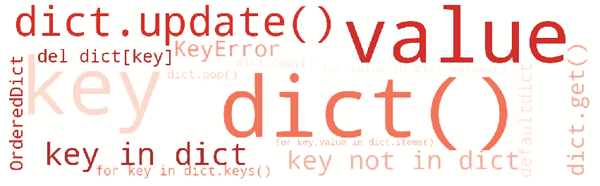
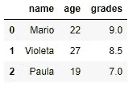
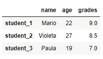
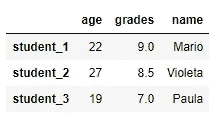
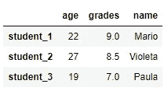
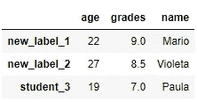
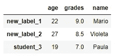
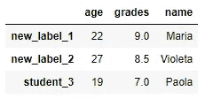

# 关于 Python 中的字典，你应该知道的 15 件事

> 原文：<https://towardsdatascience.com/15-things-you-should-know-about-dictionaries-in-python-44c55e75405c?source=collection_archive---------1----------------------->

## Python 中词典的使用指南

# 1.什么是 Python 字典？

字典是一个**无序**和**可变** Python **容器**，它存储唯一**键到值**的映射。字典用花括号({})书写，包括用逗号(，)分隔的**键值**对。冒号(:)将每个**键**与其**值**分开。

下面显示了三个字典，包含了德国最大的五个城市的人口，产品列表和学生的成绩。

# 2.用 dict()构造函数创建字典

也可以使用内置函数 **dict(**kwarg)** 创建字典。该函数接受任意数量的**关键字参数**(前面带有标识符 **kwarg=value** 的参数)作为输入。

我们还可以使用**另一个字典**结合**关键字参数** ( **dict(mapping，**kwarg)** )创建一个字典，如下所示:

或者，我们可以使用一个 iterable(例如**元组列表**)来构建一个字典。每个元组必须包含两个对象。第一个对象成为**键**，第二个成为**字典**的**值**。

最后，我们可以使用两个列表创建一个字典。首先，我们必须使用 **zip(*iterables)** 函数构建元组的**迭代器。然后，我们使用 **dict([iterable，**kwarg])** 函数来构建字典，就像我们之前做的那样。**

# **3。访问字典中的值**

为了访问字典**值**，我们不能使用数字索引(就像我们对列表或元组所做的那样)，因为字典是无序的**容器。相反，我们用方括号([])将**键**括起来。如果我们试图使用一个未定义的**键来访问一个值，就会产生**键错误**。

为了避免出现未定义键的异常，我们可以使用方法 **dict.get(key[，default])** 。如果**键**在**字典**中，该方法返回**键**的**值**，否则返回默认值。如果没有提供默认值，它将返回 **None** (但不会引发异常)。

# 4.在词典中插入元素

要在字典中插入元素，我们可以使用方括号，如下所示:

要一次插入多个条目，我们可以使用方法**dict . update(【other】)**。这个方法用来自其他的**键/值对**更新字典，覆盖现有的**键**。

如上图，**。update()** 方法不仅接受另一个**字典**作为参数，还接受元组列表或**关键字参数**作为参数。这个方法就地修改字典，返回 **None** 。

# 5.更改字典中的元素

我们可以通过使用方括号([])访问**键**来更改项目的**值**。要一次修改多个值，我们可以使用**。update()** 方法，因为该函数会覆盖现有的**键**。

随后，我们将一个沙发的价格提高了 100 个单位，我们修改了两个学生的成绩。

# 6.删除字典中的元素

要删除字典中的元素，我们可以使用 **del dict[key]** 关键字或 **dict.pop(key[，default])** 方法。

**del dict[key]** 关键字从字典中删除给定的元素，如果**键**不存在，则引发 **KeyError** 。

如果**键**存在于字典中，则 **dict.pop(key[，default])** 方法从字典中删除带有给定**键**的**项**，并返回其**值**。相反，如果**键**在字典中不存在，该方法返回**缺省值**。如果没有提供**默认**值，并且**键**不存在，则**。pop()** 方法会引发一个**异常** ( **KeyError** )。

# 7.检查密钥是否存在

为了检查**键**是否存在于**字典**中，我们必须使用一个**成员操作符**。成员运算符用于测试是否在序列中找到某个值(例如字符串、列表、元组、集合或字典)。有两个成员资格运算符，如下所述。

*   中的**→如果左侧的对象**包含在右侧的对象**中，则评估为真。**
*   **不在**中→如果左侧的对象**不在右侧的对象**中，则评估为真。

如上所示，成员操作符(中的**和**中的**)可以用来检查一个键是否存在于字典中，但是它们也可以以下面的方式用于其他序列。**

# 8.复制一本字典

要复制一个字典，我们可以简单地使用 **dict.copy()** 方法。这个方法返回字典的一个**浅拷贝**。我们必须小心使用**浅拷贝**，因为如果你的字典包含另一个**容器对象**如列表、元组或集合，它们将被再次引用而不会重复。

为了避免这个问题，我们可以使用 **copy.deepcopy(x)** 函数(在 **copy** 模块中定义)创建一个**深度复制**，如下所示:

**浅拷贝**和**深拷贝**之间的区别仅在字典包含列表等其他对象时才相关，因为这些对象将被引用而不是被复制(**浅拷贝**)。为了创建原始字典的完全独立的克隆，我们必须制作一个**深度副本**。

如果你想知道更多关于如何抄字典的知识，你可以阅读下面这篇文章，其中详细解释了**浅抄**和**深抄**的区别。

 [## Python:如何复制字典|浅层复制 vs 深层复制

### 在本文中，我们将讨论如何用 Python 创建字典的浅层和深层副本。Python 的字典…

thispointer.com](https://thispointer.com/python-how-to-copy-a-dictionary-shallow-copy-vs-deep-copy/) 

记住 **=操作符**不会复制字典是很重要的。这只是引用同一词典的另一个名称，意味着对新词典的任何修改都会反映在原始词典中。

# 9.确定字典的长度

要确定字典包含多少个**键-值**对，我们可以使用 **len()** 函数。这个函数返回一个对象的项数。函数的输入可以是字典，也可以是另一种类型的序列，如字符串、列表、元组或集合。

# 10.循环查阅字典

## 遍历键

为了迭代**键**，我们可以在循环的**中直接使用字典，如下所示:**

或者，我们可以使用 **dict.keys()** 方法。这个方法返回一个视图对象，包含字典的**键**。

## 遍历值

如果您只需要处理字典的**值**，那么您可以在循环的**中使用 **dict.values()** 方法。该方法返回一个视图对象，该对象包含字典的**值**。**

我们可以使用 **dict.values()** 方法计算出有多少人居住在德国最大的 5 个城市，如下所示:

正如我们所观察到的，将近 900 万人居住在德国最大的五个城市。

## 遍历项目

当你使用字典时，你可能需要使用**键**和**值**。要在两者之间循环，可以使用 **dict.items()** 方法。该方法返回一个视图对象，包含作为元组列表的**键值**对。

我们可以使用 **dict.items()** 方法结合 **for 循环**来确定考试分数最低的学生，如下所示:

如上图，诺曼多是考试成绩最低的学生(2.5)。

# 11。词典释义

Python **for-loops** 在处理重复性编程任务时非常得心应手；然而，还有另一种方法可以更有效地达到同样的效果。

**字典理解**允许使用优雅简单的语法创建字典:**{ key:iterable 中变量的值}。**此外，它们比传统的 **for-loops** 更快。

我们可以使用传统的 **for 循环**和**字典理解**来过滤价格低于 100 欧元的产品。

正如我们所观察到的，**字典理解**以一种更优雅的方式提供了与传统的 **for 循环**相同的结果。

# 12.嵌套词典

**嵌套字典**是包含其他字典的字典。我们可以创建一个**嵌套字典**，就像我们使用花括号({})创建一个普通字典一样。

下面的**嵌套字典**包含了 5 个著名艺术作品的信息，我们可以观察到，该字典的**值**也是其他字典。

我们还可以使用 **dict()** 构造函数创建先前的**嵌套字典**，将 **key: value** 对作为**关键字参数传递。**

为了访问嵌套字典中的元素，我们使用多个方括号([])来指定键。

如果你想了解更多关于**嵌套字典**的内容，你可以阅读下面这篇文章，其中详细解释了如何使用**嵌套字典**(例如更新条目、改变元素、循环遍历)。

 [## Python 嵌套字典——通过示例学习

### 一个字典可以包含另一个字典，而另一个字典又可以包含字典本身，以此类推，直到任意…

www.learnbyexample.org](https://www.learnbyexample.org/python-nested-dictionary/) 

# 13.替代容器:OrderedDict、defaultdict 和 Counter

**集合**模块提供了内置 Python 容器的替代容器数据类型。在使用 Python 时，包含在**集合**模块中的三个字典子类非常方便:(1) **OrderedDict** 、( 2) **defaultdict** 和(3) **Counter** 。

## 有序直接

**OrderedDict** 由一个字典组成，该字典记住其内容被添加的顺序。在 Python 3.6+中，字典也是**插入有序的，**意味着它们记住了插入条目的顺序。然而，为了保证跨其他 Python 版本的元素顺序，我们必须使用**有序直接**容器。

如上所示， **OrderedDict** 接受字典方法和函数。此外，可以像普通字典一样插入、更改或删除元素。

## 默认字典

**Defaultdicts** 是一个字典子类，当一个键丢失(它还没有被设置)时，它分配一个**默认值**。如果我们试图访问一个字典中没有的条目，他们永远不会抛出一个 KeyError。

**Defaultdicts** 以一个函数作为参数，用函数返回的值初始化缺失的键。在下面的示例中，根据用作第一个参数的函数，键被初始化为不同的值。

正如我们所观察到的，我们可以传递一个**字典**或**关键字**作为第二个参数(可选)来初始化 **defaultdict** 容器。

## 计数器

一个**计数器**是一个字典子类，用于计算 hastable 对象。该函数返回一个计数器对象，其中元素存储为**键**，它们的计数存储为**值**。使用这个函数，我们可以很容易地计算一个列表的元素，如下所示。

如上所示，我们可以很容易地用**获得最频繁的元素。**最常用(【n】)方法。该方法返回 n 个最常见元素及其计数的列表。

# 14.根据字典创建一个熊猫数据框架。

Pandas **DataFrame** 是一个二维表格数据，其中每个**行**代表一个观察值，每个**列**代表一个变量。熊猫数据框架可以使用**熊猫创建。DataFrame** 构造器。该函数接受各种 python 容器(例如列表、字典或 numpy 数组)作为输入。然而，在本文中，我们只解释了使用字典创建数据框架的方法。

## 从字典创建数据帧

我们可以从一个**字典**中创建一个**数据帧**，其中**键**表示列名，而**值**以如下方式表示列数据:

正如我们所观察到的，默认索引只是行号(从 0 开始的整数索引)。我们可以通过将索引列表传递给 DataFrame 构造函数来修改这些索引。

## 从字典列表中创建一个数据框架

字典列表**也可以用来创建**数据框架**，其中**键**代表列名。和以前一样，我们可以通过将索引列表传递给 **DataFrame** 函数来更改索引。**

# 15.熊猫使用字典的功能

Pandas 中有几个函数使用字典作为输入值，例如， **pandas。DataFrame .重命名**和**pandas . data frame . replace .**

## 熊猫。DataFrame .重命名

这个函数返回一个带有重命名轴标签的数据帧。我们可以使用**字典**作为输入，其中**键**引用旧名称，而**值**引用新名称。字典中未包含的标签保持不变。

如上所示，我们可以更改**索引标签**，为索引参数提供一个**字典**。或者，我们可以修改列名，将**字典**提供给**列**参数。

## 熊猫。数据框架.替换

该功能用其他值动态替换**数据帧**的值。我们可以使用具有替换功能的字典来修改**数据帧**，其中**键**表示现有条目，而**值**表示替换条目。

文章完了！🍀正如你所看到的，字典是 Python 中非常有用的工具。我希望这篇文章能为你在用 Python 编码时充分利用它们提供指导。💪