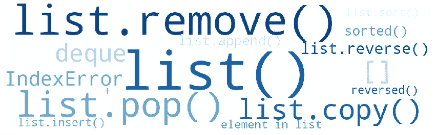
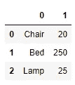
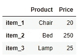

# 关于 Python 中的列表，你应该知道的 15 件事

> 原文：<https://towardsdatascience.com/15-things-you-should-know-about-lists-in-python-c566792eca98?source=collection_archive---------8----------------------->

## Python 中列表的使用指南

# 1.什么是 Python 列表？

一个**列表**是一个**有序**和**可变**的 Python 容器，是 **Python** 中最常见的数据结构之一。为了创建一个**列表**，元素被放在方括号( **[]** )中，用逗号分隔。

如上所示，列表可以包含不同类型的元素以及重复的元素。

# 2.用 list()构造函数创建一个列表

**列表**也可以用内置函数**list(【iterable】)**创建。该函数将 iterable(即任何类型的序列、集合或迭代器)作为参数，返回一个包含输入对象项的列表。

如上所示，我们不仅可以从 **Python 内置容器**中创建列表，还可以从 **Numpy** 数组和 **Pandas** 系列以及其他可迭代对象中创建列表。

我们也可以使用没有任何输入参数的 **list()** 构造函数。在这种情况下，构造函数返回一个空列表。

# **3。访问列表中的元素**

**列表**是元素的有序序列，像 Python 中的其他有序容器一样，它们使用起始索引 0 进行索引。为了访问列表中的元素，我们提供方括号( **[]** )内的索引(整数)，如下所示。

如上所示，当试图访问列表范围之外的索引时，会引发一个 **IndexError** 。

我们还可以使用一个负值**从列表的末尾访问一个项目，其中-1 表示最后一个元素，-2 表示倒数第二个元素，依此类推。**

为了访问多个元素，我们使用 python 的切片操作符:

> **【开始:停止:步进】**

切片时，记住**开始**索引是**包含**的，而**结束**索引是**不包含的，这一点很重要。**

请记住，我们可以访问和切片**列表**的元素，因为它们是**有序**容器。在 Python 中，容器可以是有序的(顺序定义的)，或者是无序的元素序列(顺序未定义的)，我们只关心对象是否包含元素，而不关心它的位置。例如，我们可以很容易地访问列表中的值，就像我们之前解释的那样；然而，如果我们试图访问集合**中的一个元素**，我们会得到一个**类型错误**，因为元素在集合中没有特定的位置。

# 4.修改列表中的项目

我们可以通过在赋值操作符的左边(当我们访问或分割一个列表时)给定方括号中的一个或多个索引，并在右边给定新值来修改列表中的一项。

下面的代码显示了我们如何更新一个列表中的单个或多个元素，如前所述。

可以就地修改**列表**，因为列表是可变对象。**可变性**指改变对象值的可能性。**可变对象**可以改变它们的值，而不可变对象不能被改变。例如，我们可以修改**列表**中的一项；然而，不可能就地改变一个**元组**，因为元组是不可变的对象；它们的值不能修改。

# 5.从列表中删除元素

从列表中删除元素有三种方式:

*   使用 **del 关键字**
*   使用 **list.remove(x)** 方法
*   使用 **list.pop([x])** 方法

## **del 关键字**

我们可以使用 **del 关键字**删除列表中的一个或多个条目，以下面的方式在方括号( **[]** )中提供我们想要删除的索引:

如上所示，我们不仅可以使用 **del 关键字**从列表中删除条目，还可以删除对对象的引用。

## **流行方法**

**list.pop([x])方法**移除给定索引处的项目，并返回它。如果没有提供索引， **list.pop()方法**移除并返回列表的最后一项。当试图移除列表范围之外的索引时，会引发**索引错误**。

## 该移除方法

**list.remove(x)** 方法从列表中删除第一个匹配元素，并返回 **None** 。如果元素不在列表中，则引发 **ValueError** 异常。

# 6.在列表中插入元素

要在列表中插入一个元素，我们可以使用:

*   **list.insert(i，x)** 方法
*   **list.append(x)** 方法

## 插入方法

**list.insert(i，x)** 方法在给定索引 **i** 处插入一个元素 **x** ，并返回 **None** 。

如上所示，第一个参数 **i** 是我们在它之前插入一个项目的元素的索引。这就是为什么，如果我们提供索引-1 作为输入，元素会被插入到倒数第二个位置，而不是列表的末尾。要在列表的末尾插入一个条目，我们必须提供列表的长度作为输入。

我们不仅可以用**插入方法**添加一个**原始数据类型**(整型、浮点型、字符串型或布尔型)，还可以添加一个 Python **容器**(例如一个列表)，如下所示。

## append 方法

**list.append(x)方法**在列表末尾添加一个项目，相当于 **list.insert(len(list)，x)** 。

如上所示。 **append()** 方法就地修改列表，返回 **None** 。

# 7.对列表排序

## 排序函数

为了对列表中的元素进行排序，我们可以同时使用**排序函数**和**排序方法**。**排序函数**返回一个排序列表，但是作为输入提供的列表保持不变。

该函数具有以下语法:

> ***排序(iterable[，key][，reverse])***

第一个参数是我们想要排序的 **iterable** (在本例中是一个列表)。以下两个参数**键**和**反转**是可选的，允许我们进行更复杂的排序。我们以后会看到的！

## 排序方法

与**排序函数**不同，**排序方法**就地排序列表，返回 **None** 。

sort 方法具有以下语法和两个可选参数: **key** 和 **reverse** 。

> ***list.sort(key=…，reverse=…)***

下面的代码展示了我们如何使用**排序函数**和**排序方法**对列表中的元素进行排序。

## 附加参数:反向和键控

**排序函数**和**排序方法**按升序对元素进行排序，除非我们另有说明，提供参数 **reverse=True** 。

另一个重要参数是**键**。我们可以根据 key 参数中提供的函数返回的值对列表进行排序。我们将函数应用于列表中的每个元素，然后根据该函数返回的值对元素进行排序。**键**参数可以包含内置、匿名或普通函数以及方法。

在下面的例子中，我们使用**关键参数**来:

1.  按长度对字符串列表进行排序。

2.按照元音的数量对字符串列表进行排序。

3.按第三个值对嵌套列表进行排序。

# **8。反转列表**

## 反向函数

为了反转列表中的元素，我们可以同时使用 **reversed(seq)函数**和 **list.reverse()** **方法**。**反转函数**返回给定序列的反转迭代器，保持作为输入提供的序列不变。与**排序函数相比，****反转函数**不返回列表，所以如果我们想要获得列表，我们必须使用 **list()** 构造函数。

## 反向方法

与**反转功能**不同，**反转方法**原地反转列表，返回 **None** 。

# 9.连接两个列表

在 **Python 中有多种方法可以连接两个**列表**。****+运算符**是最简单的方法之一；事实上，我们也可以使用这个操作符来连接另一种类型的容器，比如字符串或元组。

**+操作符**也允许你连接两个以上的列表。

另一种连接两个列表的方法是使用 **list.extend(iterable)** 方法。该方法通过追加 iterable 中的所有项来扩展列表。

如上图所示， **list.extend(iterable)** 方法就地修改了**列表**，在**列表**的末尾添加了来自 **iterable** 的元素。作为输入提供的 **iterable** 保持不变，方法返回 **None** 。

正如我之前提到的，有多种方式来连接列表。下面的文章解释了在 Python 中连接两个列表的可选模式。

 [## Python 添加列表/连接/连接两个或多个列表

### 本教程涵盖以下主题- Python 添加列表。它描述了在…中加入/连接/添加列表的各种方法

www.techbeamers.com](https://www.techbeamers.com/python-add-lists-join-concatenate/) 

# 10.检查列表中是否存在元素

为了检查一个元素是否存在于**列表**中，我们必须使用一个**成员操作符**。成员运算符用于测试是否在序列中找到某个值(例如字符串、列表、元组、集合或字典)。有两个成员资格运算符，如下所述。

*   中的**→如果左侧的对象**包含在右侧的对象**中，则评估为**真**。**
*   **不在**中→如果左侧的对象**不在右侧的对象**中，则评估为**真**。

如上图所示，成员运算符(中的**和**中的**)可用于检查一个元素是否存在于**列表**中，但它们也可以以如下方式用于其他序列。**

# 11.复制列表

要复制一个列表，我们可以简单地使用 **list.copy()** 方法。这个方法返回一个列表的**浅拷贝**。我们必须小心使用**浅拷贝**，因为如果你的列表包含另一个**容器对象**像其他列表、元组或集合一样，它们将被再次引用而不会重复。

为了避免这个问题，我们可以使用 **copy.deepcopy(x)** 函数(在 **copy** 模块中定义)创建一个**深度复制**，如下所示:

**浅拷贝**和**深拷贝**之间的区别只在列表包含其他对象如列表(**嵌套列表**)时相关，因为那些对象将被引用而不是被复制(**浅拷贝**)。为了创建原始列表的完全独立的克隆，我们必须制作一个**深度副本**。

切记 **=操作符**不会复制列表，这一点很重要。这只是引用同一个列表的另一个名称，意味着对新列表的任何修改都会反映在原始列表中。

# 12.确定列表的长度

要确定列表包含多少个**元素**，我们可以使用 **len()** 函数。这个函数返回一个对象的项数。函数的输入可以是列表，也可以是另一种类型的序列，如字符串、字典、元组或集合。

# 13.列出理解

**For 循环**可用于在 **Python** 中创建列表；然而， **list comprehensions** 提供了一个更优雅和简单的语法来重写循环。此外，对于循环，它们比传统的**更快。**

> ***语法:iterable 中变量的表达式]***

在下面的代码块中，我们创建了一个新的城市列表，包含大写的名称。

如上所示，我们分三步创建一个新列表。

1.  创建空列表(cities_capitalized)
2.  循环浏览列表(城市)
3.  将大写的名称追加到新列表中(cities_capitalized)

然而，通过使用列表理解，我们只用一行代码就可以得到相同的结果。

我们也可以使用**条件语句**和**列表理解**来过滤掉不需要的数据。在下面的代码块中，条件语句从列表中筛选出奇数。

如您所见，列表理解是创建列表的一种优雅而简洁的方式。然而，非常长的理解列表会使读者感到困惑。因此，它的使用应该仅限于简单的语句。

# 14.替代集装箱:德克

**deque** 对象(在**集合**模块中定义)是一个 **like-list** 容器，为添加和删除两边(右边和左边)的项目进行了优化。

我们可以使用方法**。追加(x)** 和**。扩展(iterable)** 将元素添加到 deque 对象的右侧，就像我们之前对**列表**所做的那样。然而，与列表不同，deque 对象支持方法**。左追加(x)** 和**。extendleft(iterable)** 向左侧添加元素。

除了添加项目，**队列**对象还支持**。pop()** 和**。popleft()** 从两边移除元素的方法。

如果您想了解更多关于容器的信息，可以浏览一下文档。

 [## 8.3.集合-高性能容器数据类型- Python 2.7.18rc1 文档

### 源代码:Lib/collections.py 和 Lib/_abcoll.py 这个模块实现了专门的容器数据类型，提供了…

docs.python.org](https://docs.python.org/2/library/collections.html#collections.deque) 

# 15.从列表中创建一个熊猫数据框架。

Pandas **DataFrame** 是一个二维表格数据，其中每个**行**代表一个观察值，每个**列**代表一个变量。熊猫数据框架可以使用**熊猫创建。DataFrame** 构造器。尽管该函数接受多个 **Python** 容器作为输入，但创建数据框的最常见方式之一是使用**嵌套列表**作为输入。

正如我们所观察到的，默认索引是整数(从 0 开始)。我们可以通过向参数 **index** 和**列**传递一个列表来修改这些索引。

正如我之前所说，有多种方法来创建熊猫数据框。想知道更多的方法，可以访问下面的链接。:)

 [## 创建熊猫数据框架的不同方法

### Pandas DataFrame 是一个带有潜在不同类型列的二维标签数据结构。一般是…

www.geeksforgeeks.org](https://www.geeksforgeeks.org/different-ways-to-create-pandas-dataframe/) 

列表是最重要的 Python 内置容器，是用 Python 编程时正确理解它们的一个关键方面。除了官方的 Python 文档之外，还有多个网页提供了如何使用列表的详细解释和示例。

 [## Python 列表

### Python 编程语言中有四种集合数据类型:列表是有序的集合，并且…

www.w3schools.com](https://www.w3schools.com/python/python_lists.asp)  [## Python 列表- GeeksforGeeks

### 列表就像动态大小的数组，用其他语言声明(C++中的 vector 和 Java 中的 ArrayList)。列表需要…

www.geeksforgeeks.org](https://www.geeksforgeeks.org/python-list/)  [## Python 编程简介| Udacity

### 在本课程中，您将学习 Python 编程语言的基础，以及编程最佳…

www.udacity.com](https://www.udacity.com/course/introduction-to-python--ud1110) 

我打算写一组关于 Python 容器的文章。到目前为止，使用字典和列表的指南已经完成！

 [## 关于 Python 中的字典，你应该知道的 15 件事

### Python 中词典的使用指南

towardsdatascience.com](/15-things-you-should-know-about-dictionaries-in-python-44c55e75405c) 

集合、字符串和元组将在以后介绍💪

感谢阅读👧

阿曼达