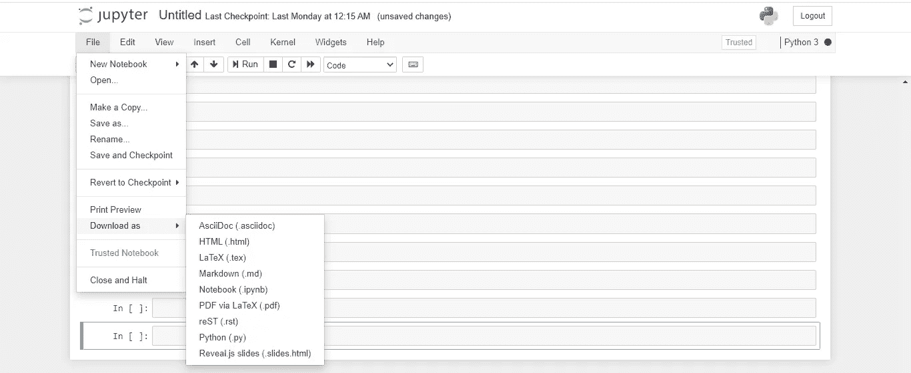
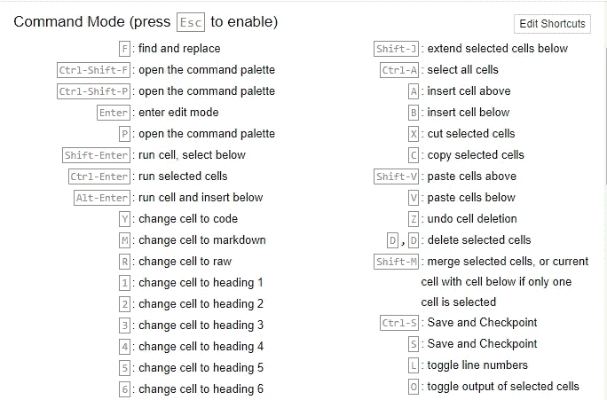

# Jupyter 笔记本的 15 个技巧和窍门将会减轻您的编码体验

> 原文：<https://towardsdatascience.com/15-tips-and-tricks-for-jupyter-notebook-that-will-ease-your-coding-experience-e469207ac95c?source=collection_archive---------3----------------------->

## 使用这些技巧优化您在 Jupyter 笔记本中的工作


图片来自 [Pixabay](https://pixabay.com/?utm_source=link-attribution&amp;utm_medium=referral&amp;utm_campaign=image&amp;utm_content=4905013)

Jupyter Notebook 是一个基于 REPL (read eval print loop)的浏览器，建立在 IPython 和其他开源库的基础上，它允许我们在浏览器上运行交互式 Python 代码。

它不仅运行 python 代码，还拥有许多有趣的插件和神奇的命令，极大地增强了 python 编码体验。

# 1.计算一个单元的执行时间:

我们可以在 jupyter 笔记本单元的开头使用魔法命令来计算该单元的执行时间。它计算**墙时间**，该墙时间可被称为执行该单元所需的总时间。


# 2.进度条:

人们可以使用 python 外部库来创建进度条，它可以实时更新代码的进度。它让用户了解正在运行的代码脚本的状态。你可以在这里获得库[的 Github 库。](https://github.com/tqdm/tqdm)

首先，你需要**安装**库，

```
pip3 install tqdm
```

或者您也可以使用`!`将其安装在 jupyter 笔记本电池中。


`tqdm`功能可以通过导入其包来使用，使用和实现可以观察如下:


# 3.自动代码格式化程序:

使用`nb_black`库，可以将单元格中的代码片段格式化为适当的格式。有时 jupyter 笔记本单元格中的代码片段格式不正确，这个库有助于获得代码片段的正确格式。

`nb_black` 是 Jupyter Notebook 和 Jupyter Lab 的简单扩展，自动美化 Python 代码。

**库的安装:**

```
pip3 install nb_black
```

**Jupyter 笔记本的用法:**

```
%load_ext nb_black
```


(作者图片)，无格式单元格


(图片由作者提供)，使用 nb_black 格式化的单元格

# 4.安装包:

Jupyter 笔记本可以在笔记本本身安装任何 python 包。要在 jupyter 笔记本单元格中使用 pip 命令安装任何 python 包，请在命令前输入一个`!`。

安装 pandas 包:输入`! pip install pandas`并运行单元。


# 5.文档:

Jupyter Notebook 可以显示您正在调用函数的文档。按`Shift+Tab`查看文档。这非常有帮助，因为您不需要每次都打开文档网站。此功能也适用于本地自定义功能。

**用法:**

*   写下你想实现的函数的名字
*   按下`Shift+Tab`查看文档。
*   点击文档右上角的`^`在页面中查看。
*   点击`+`垂直增长文档串。
*   点击`x`关闭文档字符串。


(图片作者)，熊猫 read_csv 函数的 Docstring

# 6.自动完成:

Jupyter 笔记本可以显示任何函数名或变量的建议。要查看建议，输入代码，按键盘上的`Tab`，建议将出现在自上而下的菜单中。按下`arrow-up` 或`arrow-down`键向上或向下滚动菜单。您也可以使用鼠标滚动。单击关键字或在选定的关键字上按 enter 键以确认您的建议。

您还将获得定制函数和变量的建议。


(图片由作者提供)，熊猫套餐的建议

# 7.调整输出视图:

Jupyter Notebook 可以在单元格正下方打印每个单元格的输出。当您有大量输出时，您可以通过单击输出的左侧面板来减少它所占用的空间。这将把输出变成一个滚动窗口。双击输出左侧以完全折叠输出面板。

您可以重复单击或双击的过程来更改查看“输出”面板的格式。


(Gif by Author)，点击面板左侧可更改输出屏幕的视图

# 8.单元格执行功能:

Jupyter Notebook 具有某些单元执行特性，可以减轻程序员的工作负担。

*   Shit+Enter 将运行当前单元格并突出显示下一个单元格，如果没有单元格，它将创建一个新的单元格。
*   Alt+Enter 将运行当前单元格，插入一个新单元格并高亮显示它。

# 9.降价:

Jupyter 笔记本电池不仅可以运行代码片段，还可以用来写文本。减价单元格可用于编写文本描述。是比用评论更好的表达方式。

**用法:**

*   单击单元格将其转换为降价。
*   从下拉菜单中选择降价选项


(图片由作者提供)，从暗码单元格到降价单元格


([来源](https://www.google.com/url?sa=i&url=https%3A%2F%2Fmlwhiz.com%2Fblog%2F2019%2F06%2F28%2Fjupyter_extensions%2F&psig=AOvVaw0YFVG9ELfMkucT-jl28V71&ust=1599415062886000&source=images&cd=vfe&ved=0CAIQjRxqFwoTCNCqmbrL0usCFQAAAAAdAAAAABAO))

# 10.在笔记本中运行不同语言的代码:

Jupyter Notebook cells 还可以使用 IPython magic 命令编译和运行不同语言的代码。使用 IPython Magics，在您想要使用该单元的每个单元的开头使用您的内核名称:

*   `%%bash`
*   `%%HTML`
*   `%%python2`
*   `%%python3`
*   `%%ruby`
*   `%%perl`


(图片由作者提供)，jupyter 笔记本单元格中的 HTML 代码片段

# 11.多光标:

Jupyter Notebook 支持同时使用多个光标编辑代码。要立即选择要编辑的代码，按下`Alt`键并用鼠标选择代码片段。选择之后，您现在可以一次使用多个光标编辑代码。


# 12.从 Jupyter 笔记本创建演示文稿:

Jupyter 笔记本可以用来创建 PowerPoint 风格的演示文稿。在这里，笔记本的每个单元或单元组可以被视为每个幻灯片。

*   首先，使用 conda: `conda install -c damianavila82 rise`安装[上升](https://github.com/damianavila/RISE)
*   进入/退出上升幻灯片按钮出现在笔记本工具栏中。在视图>单元格工具栏>幻灯片显示下也会出现一个幻灯片显示选项
*   要准备幻灯片，点击视图>单元格工具栏>幻灯片，并为每张幻灯片选择 jupyter 笔记本单元格。
*   选择每张幻灯片后，单击笔记本工具栏中的“幻灯片放映”按钮。

访问[此处](https://www.youtube.com/watch?v=sXyFa_r1nxA&feature=youtu.be)了解详细的视频指南使用方法。


([来源](https://www.google.com/url?sa=i&url=https%3A%2F%2Fmedium.com%2F%40mjspeck%2Fpresenting-code-using-jupyter-notebook-slides-a8a3c3b59d67&psig=AOvVaw0c5sZP46q6d1YE14C9O2K-&ust=1599415417279000&source=images&cd=vfe&ved=0CAIQjRxqFwoTCJDOm-PM0usCFQAAAAAdAAAAABAT))

# 13.分享 Jupyter 笔记本:

代码完成后，您有几个选项来共享您的 jupyter 笔记本。

*   下载你的 jupyter 笔记本为 HTML，pdf，ipynb，py 文件等。



*   您可以使用 [JupyterHub](https://jupyterhub.readthedocs.io/) 来创建一个多用户 Hub，它产生、管理和代理单用户 Jupyter 笔记本服务器的多个实例。
*   您可以直接从 jupyter 笔记本发布到 medium。阅读[这个](/publishing-to-medium-from-jupyter-notebooks-53978dd21fac)就知道步骤了。

# 14.在笔记本中绘图:

Jupyter 笔记本是用于数据分析和可视化的最佳工具。它可用于使用不同的 python 或 R 库生成不同类型的图。一些用于生成图的 python 库包括:

*   [Matplotlib](https://matplotlib.org/)
*   [Seaborn](https://seaborn.pydata.org/)
*   [散景](https://bokeh.org/)
*   [阴谋地](https://plotly.com/)


([来源](/a-new-plot-theme-for-matplotlib-gadfly-2cffc745ff84))，不同类型的地块

# 15.键盘快捷键:

快捷键的使用节省了程序员大量的时间，缓解了编码体验。Jupyter 笔记本有很多内置的键盘快捷键，你可以在`**Help**` 菜单栏下找到:`**Help>Keyboard Shortcuts**`。

Jupyter Notebook 还提供了编辑键盘快捷键的功能，以方便程序员。您可以编辑键盘快捷键:`**Help>Edit Keyboard Shortcuts**`。



(图片由作者提供)，命令模式快捷键


(图片由作者提供)，编辑模式快捷键

# 结论:

Jupyter Notebook 是数据科学领域工作人员使用的最好的可扩展工具之一，因为它具有交互式 UI。上面讨论的 15 个提示和技巧将帮助您轻松体验 jupyter 笔记本编码。它有很多本文没有讨论的内置魔法命令，你可以在这里阅读。让我知道你最喜欢的技巧和评论，如果你知道更多的技巧。

*   *文章中使用的图片由作者引用或生成*

> 感谢您的阅读