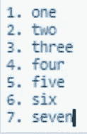
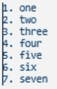

# 更有效使用 Jupyter 笔记本的 15 个技巧和窍门

> 原文：<https://towardsdatascience.com/15-tips-and-tricks-to-use-jupyter-notebook-more-efficiently-ef05ede4e4b9?source=collection_archive---------17----------------------->

## 用这些技巧优化你在 Jupyter 的工作

# 概观

在数据科学社区中，Jupyter notebook 是一个受欢迎的工具，被广泛采用。本文旨在分享一些很酷的技巧和窍门，帮助你在使用 Jupyter 笔记本时变得更有效率。了解如何从 Jupyter 执行终端命令，通过隐藏输出来加速您的笔记本，为您的笔记本添加额外的功能，等等！

# 提示#1 —使用常用快捷方式快速导航

知道这些捷径可以帮你节省时间。我用黄色突出显示了我经常使用并且发现非常有用的工具。如果您忘记了快捷方式，您可以随时进入命令模式并按 H 键查看完整列表。Jupyter 笔记本还允许你创建自己的快捷方式，如果你想。点击编辑快捷按钮来设计你自己的热键。


# 提示#2 —在输出中显示多个项目

Jupyter notebook 一次只显示一个输出，如下所示。在本例中，只显示了最后一个变量的输出。


但是，您可以添加下面的代码来显示单元格中的所有输出。请注意，现在两个变量都显示出来了。


# 技巧 3——向 Jupyter 笔记本添加图片

如果您想要插入图像，您必须首先将单元格类型从代码更改为标记。您可以在页面顶部的下拉框中完成此操作，或者进入命令模式并按 m 键。一旦单元格降价，只需将图片拖放到单元格中即可。

一旦您将图像放入单元格，应该会出现一些代码。运行单元格(Shift + Enter)来查看图像。


# 技巧 4——在 Jupyter 笔记本中直接执行 Shell 命令

与其让 Jupyter notebook 执行 shell 命令，不如使用感叹号(！)在你命令的开始。例如，您可以安装一个软件包。

```
!pip install matplotlib-venn
```

# 技巧 5——使用内置的魔法命令

神奇命令是有助于提高工作效率的特殊命令。

您可能最熟悉下面这个神奇的命令，它可以让您的绘图在笔记本中呈现。

```
%matplotlib inline
```

以下是一些其他有用的神奇命令:

```
**%pwd** #print the current working directory
**%cd** #change working directory
**%ls** #show contents in the current directory
**%load [insert Python filename here]** #load code into the Jupyter notebook
**%store** **[insert variable here]** #this lets you pass variables between Jupyter Notebooks
**%who** #use this to list all variables
```

对于%who，您也可以指定变量类型。例如，下面的代码将列出所有 int 类型的变量。

```
**%**who int
```

关于魔法命令的完整列表:

```
%lsmagic #show all magic commands
```

# 技巧#6 —测量单元执行时间

使用`%%time`获得整个单元格的墙壁时间。


# 技巧 7——使用多光标加速工作

假设您有多行代码，如下所示，您想删除每行代码中的所有数字。你可以一次删除所有的数字，而不是一行一行的删除。



按住`Alt`键，选择整个单元格内容。按左箭头，您将看到现在有多个光标(下面代码片段中的黑线)，每行一个。从这里，你可以点击`delete`键删除所有的数字。如果您想将光标移动到末尾，请使用右箭头键。



# 提示# 8——为代码完成创建一个警报

如果您有需要一段时间运行的代码，您可以添加代码，让 Python 告诉您它何时完成运行。

## 对于 Windows:

```
**import** winsound
duration **=** 1000  *#milliseconds* freq **=** 440  *#Hz* winsound.Beep(freq, duration)
```

这将在代码完成时发出警报。

## 对于 Mac:

```
**import** os
os.system('say "your program has finished"')
```

来源:[https://stack overflow . com/questions/16573051/sound-alarm-when-code-finishes/16573339 # 16573339](https://stackoverflow.com/questions/16573051/sound-alarm-when-code-finishes/16573339#16573339)

# 技巧 9 —添加 Jupyter 笔记本扩展以提高工作效率

Jupyter 笔记本扩展是为您提供更多功能的简洁工具。

以下是您可以启用的可配置扩展列表。一些对我有用的是可折叠标题，代码折叠，便笺和拼写检查。


我建议查看这些扩展，找到对您的工作有用的内容。

如需在计算机上安装 Jupyter 笔记本扩展的帮助，请点击此链接。[https://jupyter-contrib-nb extensions . readthedocs . io/en/latest/install . html #](https://jupyter-contrib-nbextensions.readthedocs.io/en/latest/install.html)

# 提示#10 —展示方法文档

如果您忘记了特定方法的参数，请使用 Shift + Tab 获取该方法的文档。单击右上角的+箭头展开文档。


# 提示#11 —扩展熊猫中显示的列数和行数

pandas 表格中显示的行数和列数是有限的，但是您可以根据自己的喜好自定义限制。

这里，我将行和列的最大输出设置为 500。

```
**import** pandas **as** pd
pd.set_option('display.max_rows', 500)
pd.set_option('display.max_columns', 500)
```

# 提示# 12——加粗或着色你的输出，让它突出

为了突出输出的重要部分，您可以添加粗体和/或颜色。我还没有试过这个，但我认为这是 Stas Bekman 提供的一个非常酷的技巧。参见下面的片段。


# 技巧# 13 —隐藏输出以提高笔记本电脑速度

你发现你的 Jupyter 笔记本滞后了吗？这可能是因为你有很多正在渲染的图形。

将鼠标悬停在图表左侧的区域(见下面的红色矩形),双击该区域以隐藏输出。这将大大加快你的笔记本电脑的速度！


# 技巧#14 —隐藏恼人的 Matplotlib 文本

当你创建一个图表时，你可能会在图表的正上方看到这个文本“<matplotlib.collections.pathcollection at="">”(下面突出显示黄色)。</matplotlib.collections.pathcollection>


我个人觉得那很烦人，所以要隐藏那一行文字，可以在代码末尾加个分号。


# 提示# 15——组织和记录你的分析

使用 markdown 单元格，很容易记录您的工作。您可以使用“#”符号创建字体层次结构来组织笔记本，如下所示。


一旦上面的执行，这就是字体层次的样子。


如果您创建了这些不同的标题，并将其与技巧 9 中提到的可折叠标题扩展结合起来，那么隐藏一大块单元格以及能够快速导航和移动部分将会非常有用。


感谢阅读！如果你有任何喜欢的技巧和诀窍没有在文章中列出，我很乐意在评论中听到它们。

## 要获得满足您的数据科学和数据分析需求的更多便利文章，请查看以下内容:

> [Matplotlib 为赶时间的人准备的指南](/all-your-matplotlib-questions-answered-420dd95cb4ff)
> 
> [为匆忙的人们准备的熊猫](/pandas-for-people-in-a-hurry-59d966630ae0)
> 
> [为赶时间的人准备的数字指南](/numpy-guide-for-people-in-a-hurry-22232699259f)

如果你想下载 Jupyter 笔记本，你可以在这里找到它。