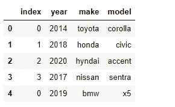
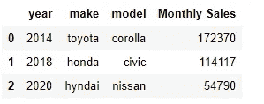

# 创建熊猫数据框架的 15 种方法

> 原文：<https://towardsdatascience.com/15-ways-to-create-a-pandas-dataframe-754ecc082c17?source=collection_archive---------0----------------------->

## *关于用熊猫创建*数据框的不同方法的学习参考


作者图片

# 动机

在进行 EDA(探索性数据分析)或开发/测试模型时，使用强大而优雅的 pandas DataFrame 来存储和操作数据是非常常见的。通常，它从“创建数据帧”开始。

我在用 pandas 开始一些 EDA 或建模时，通常会遇到以下场景:

> 我需要快速创建一些记录的数据帧来测试代码。
> 
> 我需要将 csv 或 json 文件加载到数据帧中。
> 
> 我需要从网页中读取一个 HTML 表格到数据帧中
> 
> 我需要在不创建 json 文件的情况下将类似 json 的记录加载到 dataframe 中
> 
> 我需要在不创建 csv 文件的情况下将类似 csv 的记录加载到数据帧中
> 
> 我需要合并两个数据帧，垂直或水平
> 
> 我必须将数据帧中的一列转换成一个热列

每一个场景都让我每次都用谷歌搜索语法或查找文档，直到我通过几个月或几年的练习慢慢记住它们。

理解了查找的痛苦，我认为在 pandas 中创建数据帧的多种方法的快速查找表可以节省一些时间。这可能会帮助学习者，直到他们成为经验丰富的数据分析师或数据科学家。

这里有几种方法可以创建一个数据框架。如果任何读到这里的人发现了其他优雅的方式或方法，请随时评论或给我发消息；我很乐意将它们添加到您的参考页面中。

# 使用 DataFrame 构造函数 pd。数据帧()

pandas DataFrame()构造函数提供了许多不同的方法来创建和初始化 DataFrame。

*   **方法 0** —初始化空白数据帧，并不断添加记录。columns 属性是成为数据帧的列的字符串列表。loc 方法通过索引引用数据帧行(类似于列表)。例如，数据帧 df 中的第一条记录将被 df.loc[0]引用，第二条记录将被 df.loc[1]引用。通过设置 df.loc[i] = <记录属性为列表>，可以直接在位置 I 增加一行

```
*# method 0**# Initialize a blank dataframe and keep adding*df = pd.DataFrame(columns = ['year','make','model'])*# Add records to dataframe* *using the .loc function*df.loc[0] = [2014,"toyota","corolla"] 
df.loc[1] = [2018,"honda","civic"] df
```

*   **方法 1** —在 DataFrame 构造函数中使用 numpy 数组。传递 2D numpy 数组—每个数组都是数据帧中的相应行

```
*# Pass a 2D numpy array - each row is the corresponding row required in the dataframe*

data = np.array([[2014,"toyota","corolla"], 
                 [2018,"honda","civic"], 
                 [2020,"hyndai","accent"], 
                 [2017,"nissan","sentra"]]) 

*# pass column names in the columns parameter* 
df = pd.DataFrame(data, columns = ['year', 'make','model'])
df
```


*   **方法 2** —在 DataFrame 构造函数中使用字典。字典键成为数据帧中的列名。字典值成为列的值。列值根据指定的顺序组合在一行中

```
data = {'year': [2014, 2018,2020,2017], 
        'make': ["toyota", "honda","hyndai","nissan"],
        'model':["corolla", "civic","accent","sentra"]
       }

*# pass column names in the columns parameter* 
df = pd.DataFrame(data)
df
```


*   **方法 3** —在 DataFrame 构造函数中使用字典列表。每本词典都是一个记录。字典键成为数据帧中的列名。字典值成为列的值

```
data = [{'year': 2014, 'make': "toyota", 'model':"corolla"}, 
        {'year': 2018, 'make': "honda", 'model':"civic"}, 
        {'year': 2020, 'make': "hyndai", 'model':"nissan"}, 
        {'year': 2017, 'make': "nissan" ,'model':"sentra"}
       ]
*# pass column names in the columns parameter* 
df = pd.DataFrame(data)
df
```


*   **方法 4** —在 from_dict 方法中使用字典。字典键成为数据帧中的列名。字典值成为列的值。列值根据它们被指定的顺序组合在一行中*。*

```
data = {'year': [2014, 2018,2020,2017], 
        'make': ["toyota", "honda","hyndai","nissan"],
        'model':["corolla", "civic","accent","sentra"]
       }

*# pass column names in the columns parameter* 
df = pd.DataFrame.from_dict(data)
df
```


**注意** : *虽然方法 2 和方法 4 都是字典，但两者还是有区别的。使用 from_dict，我们能够选择任何列作为数据帧的索引。如果我们上面使用的列名需要成为索引——比如早期数据的转置——会怎么样？为转置后生成的列指定 orient = "index "并传递列名*

```
df = pd.DataFrame.from_dict(data, orient='index',columns=['record1', 'record2', 'record3', 'record4'])
df
```


# 使用 pandas 库函数— read_csv、read_json

*   **方法 5** —使用 pandas 库的 read_csv 方法从 csv 文件中获取。这是为 EDA 创建数据帧的最常见方式之一。csv 文件中的分隔符(或分隔符)、标题和索引列的选择是可配置的。默认情况下，分隔符是逗号，标题是从第一行推断出来的(如果找到的话)，索引列不是从文件中提取的。该文件如下所示:


```
df = pd.read_csv('data.csv' , sep = ',', header = 'infer', index_col = None)
df
```


*   **方法 6** —使用熊猫库*的 read_csv 方法从一串 csv 记录中。*当我们不想创建文件但手头有记录结构时，这特别有用——我们所做的就是使用 StringIO 库函数将 csv 记录“字符串”转换为文件句柄。

```
from io import StringIO*# f is a file handle created from a csv like string*f = StringIO('year,make,model\n2014,toyota,corolla\n2018,honda,civic\n2020,hyndai,accent\n2017,nissan,sentra')df = pd.read_csv(f)
df
```


*   **方法 7** —当 json 文件每行都有记录时，使用 pandas 库的 read_json 方法从 json 文件中获取。设置 lines=True 意味着每行将文件作为 json 对象读取。下面是 json 文件的样子:


```
df = pd.read_json('data.json',lines=True)
df
```


*   **方法 8** —使用 pandas 库的 read_json 方法从一串 json 记录中。当我们不想创建文件，但手头有 json 记录结构时，这特别有用。

```
from io import StringIO*# f is a file handle created from json like string*f = StringIO('{"year": "2014", "make": "toyota", "model": "corolla"}\n{"year": "2018", "make": "honda", "model": "civic"}\n{"year": "2020", "make": "hyndai", "model": "accent"}\n{"year": "2017", "make": "nissan", "model": "sentra"}')df = pd.read_json(f,lines=True)
df
```


*   **方法 9** — *最有趣的方法之一* —使用 read_html 中内置的 pandas 库从 HTML 页面中读取表格。这将生成一个数据帧列表；在后台，它抓取 html 页面中的任何<表>标签，并试图将该表捕获到一个数据帧中。即使页面中只有一个表，也会创建一个数据帧列表，因此需要使用列表下标来访问它。下面的例子展示了如何捕获一个 HTML 页面，然后加载表——这使用请求库来获取 HTML 内容。

```
import requests

url = 'https://www.goodcarbadcar.net/2020-us-vehicle-sales-figures-by-brand'r = requests.get(url)*#if the response status is OK (200)*
if r.status_code == 200: *# from the response object, pass the response text 
    # to read_html and get list of tables as list of dataframes*

     car_data_tables = pd.read_html(r.text)

*# display the first table*
car_data_tables[0]
```


# 从其他数据帧

*   **方法 10** —作为另一个数据帧的副本*。*

```
df_copy = df.copy()   # copy into a new dataframe object
df_copy = df          # make an alias of the dataframe(not creating 
                      # a new dataframe, just a pointer)
```

**注意**:上面显示的两种方法是不同的——copy()函数创建一个全新的独立于原始数据帧的数据帧对象，而变量 copy 方法只是为原始数据帧创建一个别名变量——没有创建新的数据帧对象。如果原始数据帧有任何更改，也会反映在别名中，如下所示:

```
*# as a new object using .copy() method - new dataframe object created independent of old one*a = pd.DataFrame({'year': [2019],'make': ["Mercedes"],'model':["C-Class"]})b = a.copy()*# change old one*
a['year'] = 2020*# new copy does not reflect the change*
b
```


```
*# as variable copy - new variable is just an alias to the old one*a = pd.DataFrame({'year': [2019],'make': ["Mercedes"],'model':["C-Class"]})b = a*# change old one*
a['year'] = 2020*# alias reflects the change*
b
```


*   **方法 11** —垂直连接—一个在另一个之上

```
data1 = [{'year': 2014, 'make': "toyota", 'model':"corolla"}, 
        {'year': 2018, 'make': "honda", 'model':"civic"}, 
        {'year': 2020, 'make': "hyndai", 'model':"nissan"}, 
        {'year': 2017, 'make': "nissan" ,'model':"sentra"}
       ]df1 = pd.DataFrame(data1)data2 = [{'year': 2019, 'make': "bmw", 'model':"x5"}]df2 = pd.DataFrame(data2)*# concatenate vertically
# NOTE: axis = 'index' is same as axis = 0, and is the default 
# The two statements below mean the same as the one above*df3 = pd.concat([df1,df2], axis = 'index') *#OR*df3 = pd.concat([df1,df2], axis = 0)*# OR*df3 = pd.concat([df1,df2])df3
```


在上面的例子中，第二个数据帧的索引保留在连接的数据帧中。要重置索引以匹配整个数据帧，请使用数据帧的 reset_index()函数

```
df3 = pd.concat([df1,df2]).reset_index()*#OR*df3 = pd.concat([df1,df2], ignore_index = True)
df3
```



*   **方法 12** —水平连接—并排追加，不用任何键连接

```
data1 = [{'year': 2014, 'make': "toyota", 'model':"corolla"}, 
        {'year': 2018, 'make': "honda", 'model':"civic"}, 
        {'year': 2020, 'make': "hyndai", 'model':"nissan"}, 
        {'year': 2017, 'make': "nissan" ,'model':"sentra"}
       ]df1 = pd.DataFrame(data1)data2 = [{'year': 2019, 'make': "bmw", 'model':"x5"}]df2 = pd.DataFrame(data2)df3 = pd.concat([df1,df2], axis = 'columns')*#OR*df3 = pd.concat([df1,df2], axis = 1)df3
```

**注意:**对于水平拼接，

*   数据帧的行按照它们的位置(索引)顺序连接
*   如果其中一个数据帧中有任何记录丢失，则串接的数据帧中的相应记录将丢失。这与在索引上进行左外连接是一样的(参见下面的合并)


*   **方法 13** —水平连接—相当于 SQL 连接。

内部连接

```
data1 = [{'year': 2014, 'make': "toyota", 'model':"corolla"}, 
        {'year': 2018, 'make': "honda", 'model':"civic"}, 
        {'year': 2020, 'make': "hyndai", 'model':"nissan"}, 
        {'year': 2017, 'make': "nissan" ,'model':"sentra"}
       ]df1 = pd.DataFrame(data1)data2 = [{'make': 'honda', 'Monthly Sales': 114117}, 
        {'make': 'toyota', 'Monthly Sales': 172370}, 
        {'make': 'hyndai', 'Monthly Sales': 54790}
       ]df2 = pd.DataFrame(data2)*# inner join on 'make'
# default is inner join*df3 = pd.merge(df1,df2,how = 'inner',on = ['make'])
df3 = pd.merge(df1,df2,on = ['make'])df3
```



左连接

```
*# for a left join , use how = 'left'*
df3 = pd.merge(df1,df2,how = 'left',on = ['make'])df3
```


*   **方法 14** —作为另一个数据帧的转置

```
*# To transpose a dataframe - use .T method*
df4 = df3.T*# To rename columns to anything else after the transpose*
df4.columns = (['column1','column2','column3','column4'])df4
```


*   **方法 15** —使用 pandas get_dummies 函数转换为一个热点列(用于学习算法建模)。

One-Hot 基本上是将一个列值转换成一组派生列，就像二进制表示一样。one-hot 列集合中的任何一个都是 1，其余的是 0。

如果我们知道一辆汽车的车身类型=轿车、SUV、货车、卡车，那么车身= '轿车'的丰田卡罗拉将成为 one-hot 编码为

```
body_SEDAN   body_SUV    body_VAN   body_TRUCK
1             0               0         0
```

每个热列的格式基本上都是 *<原始 _ 列名> _ <可能 _ 值>*

下面是一个例子:

```
data1 = [{ 'make': "toyota", 'model':"corolla", 'body':"sedan"}, 
        {'make': "honda", 'model':"crv", 'body':"suv"}, 
        {'make': "dodge", 'model':"caravan", 'body':"van"}, 
        {'make': "ford" ,'model':"f150", 'body':"truck"}
       ]df1 = pd.DataFrame(data1) 

df2 = pd.get_dummies(df1,columns = ['body'])
df2
```


我希望这个“备忘单”在学习 EDA 或建模的初始阶段有所帮助。当然，随着时间的推移和不断的练习，所有这些都会被记住。

那么祝你一切顺利:)

如果您有任何其他创建数据帧的好方法，或者有任何新的函数可以为某些特定目的创建数据帧，请分享您的宝贵意见。

这个笔记本的 git 链接是这里的。