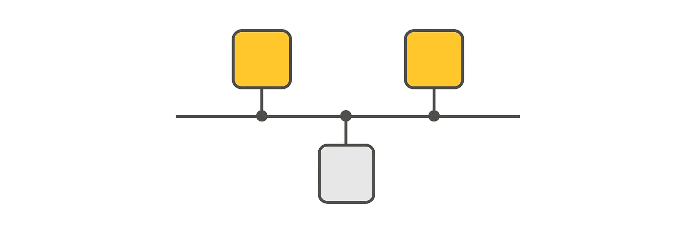

# 数据工程中听到的 150 多个概念

> 原文：<https://towardsdatascience.com/150-concepts-heard-in-data-engineering-a2e3a99212ed?source=collection_archive---------14----------------------->

## 面向数据工程师的综合词汇表

古斯塔夫·古尔斯特兰德在 [Unsplash](https://unsplash.com?utm_source=medium&utm_medium=referral) 拍摄的照片

数据工程是一个很有吸引力的领域。它始于你，一个单独的数据文件和一台个人电脑，终于堆积如山的数据和雄伟的“云”。

在本文中，我整理了一个词汇表，包含了数据工程师日常生活中听到的 150 个概念。我将这个术语表分为几个主题，如数据、模式、*数据编码、分布式系统、架构、即服务、云、数据存储、缓存、数据结构、硬件、数据安全、*和*措施*。

概念用足够多的行数来解释，让你理解背后的意思。每当我使用其他信息来源时，我都会在本节末尾引用该来源。如果您想深入了解，请考虑这些来源。我尽最大努力选择对每个概念都有最佳解释的资料来源。

该术语表在许多方面都很有用，其中包括:

*   您想学习数据工程，并将这个术语表用作路线图。
*   你是一名数据工程师，你想更新数据工程的概念。
*   你正在准备一次数据工程面试，你想确保没有任何主题/概念逃过你的注意。
*   你是一名面试官，你用这个词汇表作为一个问题库。

在查看术语表之前，我有两件事需要澄清:

1.  这个词汇表将来肯定会更新。如果我遗漏了什么，请写一个回复，我会确保把它包括在内。
2.  我跳过了解释特定的工具，比如 Python、Spark 或 Kafka。这些是我正在写的另一篇关于数据工程中听到的顶级技术的文章的一部分。(那篇文章一发表，我就会在这里附上链接)。

快乐学习。

*快注意！如果你对数据工程感兴趣，也可以看看我的另一篇文章“开发人员应该知道的 50 多个实时数据处理概念”。*

 [## 开发人员应该知道的 50 多个实时数据处理概念

### 下面是在流数据处理领域经常听到的一组概念。我为每一个概念量身定做…

medium.com](https://medium.com/@dardanx/50-real-time-data-processing-concepts-devs-should-know-830ee0441843) 

# #数据

> 事实的集合，如数字、文字、测量和对现象的观察。

**#原始数据:**原始状态下未加工的数据。(即。因为它是从源传送的)。

**#已处理数据:**处理后的原始数据。处理的主要目的是使数据比原始数据更容易使用。

**#大数据:**描述由于*的量、速度、多样性、准确性*而无法用传统数据处理工具处理的数据。当有人问你什么是大数据时，请阅读我的文章[中关于大数据的不同定义的更多信息。](/when-someone-asks-you-what-big-data-is-5acfc28e9eaa)

**#数据质量:**评估数据是否服务于特定用例的预期目的的过程。在评估数据质量时，我们通常检查数据的*准确性*、*完整性*、*可靠性*、*相关性*和*及时性*。更多信息，请阅读雷切尔·利维·萨芬关于数据质量的 5 个特征的文章。

**#主数据:**根据 [Gartner](https://www.gartner.com/en/information-technology/glossary/master-data-management-mdm#:~:text=Master%20data%20is%20the%20consistent,hierarchies%20and%20chart%20of%20accounts.) ，“主数据是一组一致且统一的标识符和扩展属性，用于描述企业的核心实体，包括客户、潜在客户、公民、供应商、地点、层级和会计科目表。”[1].

**# SSOT:(单一事实来源):**公司中的一种数据组织，数据集中保存，可从外部其他组件和人员访问。如果对系统中其他地方的数据进行了更改，这种更改应该反映在 SSOT 中。例如，如果一家公司在中央数据库中保存客户联系信息，如果联系信息发生变化，只有一个地方需要更新(即 SSOT)。

**#时间序列数据:**收集的数据点以及指示数据点生成时间的时间戳。例子包括*监控数据、传感器数据、网络数据、用户点击数据、*等。

# **Cookie** :根据[维基百科](https://en.wikipedia.org/wiki/HTTP_cookie)的说法，“……是用户在浏览时，由网络浏览器从网站发送并存储在用户电脑上的一小段数据。”[2].

**#开放数据:**根据[维基百科](https://en.wikipedia.org/wiki/HTTP_cookie)的说法，“开放数据是一种理念，即一些数据应该免费提供给每个人，让他们按照自己的意愿使用和重新发布，而不受版权、专利或其他控制机制的限制。[3].

**#个人数据:**根据[欧盟委员会的规定](https://ec.europa.eu/info/law/law-topic/data-protection/reform/what-personal-data_en)、“个人数据是指任何与已识别或可识别的活着的个人相关的信息。不同的信息收集在一起可以识别特定的人，也构成个人数据。”[4].

_____________

[1]主数据管理。[https://www . Gartner . com/en/information-technology/glossary/master-data-management-MDM](https://www.gartner.com/en/information-technology/glossary/master-data-management-mdm#:~:text=Master%20data%20is%20the%20consistent,hierarchies%20and%20chart%20of%20accounts.)

[2] HTTP cookie。[https://en.wikipedia.org/wiki/HTTP_cookie](https://en.wikipedia.org/wiki/HTTP_cookie)

[3]开放数据。[https://en.wikipedia.org/wiki/Open_data](https://en.wikipedia.org/wiki/Open_data)

[4]个人资料:[https://EC . Europa . eu/info/law/law-topic/data-protection/reform/what-Personal-data _ en](https://ec.europa.eu/info/law/law-topic/data-protection/reform/what-personal-data_en)

# #数据序列化

> 数据序列化(编码、编组)是将结构化数据转换为一种格式的过程，这种格式允许以允许恢复其原始结构的形式共享或存储数据[1]([Python 的搭便车指南](https://docs.python-guide.org/scenarios/serialization/))

**# Parquet:** 以列方式对数据进行编码。在 parquet 中编码的数据是二进制格式的(因此不可读)。查询(尤其是聚合)在 parquet 中编码的数据之上执行得更快。由于高效的列式压缩，数据量大大减少。压缩是逐列进行的，因此不同的列可以使用不同的编码类型。

**# Avro:** 以行方式编码数据。Avro 中编码的数据是二进制格式(因此不可读)。指定用 JSON 编码的数据的模式，该模式定义与数据一起写入一个文件。Avro 的一个关键特性是对随时间变化的模式的健壮支持(模式进化)。

**# JSON(JavaScript Object Notation):**这是一种广泛使用的 *key: value* 数据编码格式。JSON 提供了一种轻量级的数据交换格式。对人类来说，读和写很容易。机器很容易解析生成。

YAML: (YAML 不是标记语言):这是一种人类可读的数据编码格式。YAML 通常用于配置文件，并以其极简的语法著称。

**# XML(可扩展标记语言):**是一种标记语言，它定义了一组规则，用于以人类可读和机器可读的格式对文档进行编码。为了执行编码，XML 使用开始和结束标记。属性进一步丰富了这些标签。

**# CSV(逗号分隔值):**一种编码格式，将值存储在由分隔符(大多数情况下是逗号，但也可能是分号、制表符或其他字符)分隔的行中。文件的每一行都是一条数据记录。CSV 文件通常存储表格数据，在这种情况下，每一行都有相同数量的字段。CSV 文件是人类可读的。

_____________

[1]序列化。[https://docs.python-guide.org/scenarios/serialization/](https://docs.python-guide.org/scenarios/serialization/)

# #模式

> 描述数据在数据存储区中的组织方式的框架/结构(数据库、文件等)

**# Schema-on-write:** 我们在处理数据之前定义模式。例如，如果不首先定义模式(表、列名、数据类型等等)，我们就不能在 MySQL 中存储和查询数据。比如说，当我们因为列的数据类型发生变化而需要更改模式时，就会出现挑战。我们需要删除模式并再次加载所有数据。多见于 SQL 数据库。

**# Schema-on-read:** 我们在定义模式之前处理数据。在这种情况下，我们在数据到达时立即存储，而不必将其转换为严格的格式。读取数据的时刻就是推断模式的时刻。它主要出现在 NoSQL 的数据库中。一篇值得一读的好文章是 luminousmen 的[读时模式与写时模式](https://luminousmen.com/post/schema-on-read-vs-schema-on-write)。

**# Schema evolution:** 数据不断发展，模式应该反映对数据所做的更改。当发展模式时，为了不丢失它，使它与您拥有的数据兼容是很关键的。在添加新列或需要更改列的数据类型时，模式演化是必要的。

# #分布式系统

> “…分布式系统是位于不同机器上的独立组件的集合，这些组件为了实现共同的目标而相互共享消息。”[1] ( [汇合](https://www.confluent.io/learn/distributed-systems/))

**#集群**:它是一组相互连接的机器(节点)，它们一起工作来完成任务。机器之间的连接是在软件级别完成的。从外部看，群集看起来像一个系统。

**# Node:** 作为集群一部分的单个机器/服务器/虚拟机。

**#商用硬件:**据 [Suse](https://susedefines.suse.com/definition/commodity-hardware/) ，“商用硬件，有时被称为现成的硬件，是一种相对便宜、可广泛获得且易于与其他同类硬件互换的计算机设备或 IT 组件。”[2].

**#可伸缩性:**分布式系统的一种品质，能够通过向系统添加或移除资源来应对负载(请求、数据等)。

**#容错:**分布式系统的一种品质，即使部分系统出现故障，也能持续工作。

**# Robustness:** 分布式系统的一种质量，不仅在预期情况下，而且在强调设计者假设的情况下都表现良好。

**#滚动升级:**分布式系统中升级软件的一种策略，一次将更新的软件逐步部署到几个节点，而不是同时部署到所有节点。

**#垂直扩展:**通过在单台机器上添加更多资源进行扩展，如 *CPU* 、 *RAM、*或*磁盘*。

**#水平扩展:**通过向现有资源池中添加其他机器来进行扩展。

**#复制**:在通过网络连接的不同机器上复制相同的数据。通过复制数据，我们确保了系统的容错能力。当复制的数据分布在不同的地理位置时，我们减少了延迟或读取。

**# Partitioning:** 将一个大数据集拆分成若干部分，分布在不同的节点上。当查询在不同的节点上工作时，分区通过分布来确保可伸缩性。

**#数据局部性:**将计算移动到数据驻留的地方，而不是将数据移动到计算驻留的地方。使用大数据系统是为了通过移动计算而不是数据来减少网络流量。

**#重新平衡分区:**将数据从一个集群节点移动到另一个集群节点的过程。通常在数据分区大小不均匀增长时，或者在集群中添加或删除节点时执行。

**#** [**CAP 定理**](https://www.educative.io/edpresso/what-is-the-cap-theorem?aid=5082902844932096&utm_source=google&utm_medium=cpc&utm_campaign=edpresso-dynamic&gclid=Cj0KCQjw6ar4BRDnARIsAITGzlB9MoVXPSdkRscTyAvZop-2OrClab0_cERwfvJ9GwUHSGesrXDSMk0aArSqEALw_wcB)**:**It**陈述了一个分布式系统可能最多同时具备以下两个品质:*一致性*，*可用性*，*分区容忍度*。详细讲这个的一篇很棒的文章是[什么是 CAP 定理？](https://www.educative.io/edpresso/what-is-the-cap-theorem)。**

****#写后读一致性:**在写入更改后立即查看更改(读取最新数据)的能力。**

****#最终一致性:**在对系统进行写入/更新后，系统需要一些时间来更新您的写入影响的所有节点的数据点。如果发出立即读取请求，则有机会接收旧数据。**

**# **小文件问题:**在 Hadoop 中，当数据存储在 HDFS 的许多小文件中时，计算性能会显著下降。**

**_____________**

**[1]分布式系统。[https://www.confluent.io/learn/distributed-systems/](https://www.confluent.io/learn/distributed-systems/)**

**[2]商用硬件。[https://susedefines.suse.com/definition/commodity-hardware/](https://susedefines.suse.com/definition/commodity-hardware/)**

# **#建筑**

> **“……计算系统的总体设计及其组件之间的逻辑和物理相互关系被定义为体系结构。该架构规定了整个**系统中使用的硬件、软件、访问方法和协议[1].([高德纳](https://www.gartner.com/en/information-technology/glossary/architecture))****

********

******#共享内存架构**:将 CPU、RAM 芯片、磁盘等多种资源连接在一起，形成一台机器。在这种资源组织中，任何 CPU 都可以访问内存或磁盘的任何部分。这些机器的容错能力较差，可伸缩性是通过增加 CPU、RAM 芯片和磁盘(即垂直缩放)。****

******#无共享架构**:商用机器通过网络链接在一起，独立访问自己的机器。可伸缩性是通过向资源池添加其他独立的机器来实现的。节点之间的协调是在软件级别完成的。****

******# Producer:** 产生事件(数据)的组件。例如，考虑一个每当客户下订单时都会生成一个事件的软件组件。****

******# Consumer:** 消费事件的组件。例如，考虑一个软件组件，它通过向进行购买的用户发送确认电子邮件来对收到的订单事件做出反应。****

******#事件流架构:**由产生事件流的生产者和消费这些事件的消费者组成的架构。事件有不同的类型，如:放入购物车的产品、订购的产品、配送的订单等。消费者组件消费这些事件并对其做出反应。****

******#批处理架构:**由一个或多个数据存储(数据湖、数据库等)组成的架构，其中收集数据并定期(例如每天一次)运行作业，以处理大块数据(或所有数据)来转换或执行分析。处理后的数据以期望的格式进一步存储在目标系统中。****

******# Lambda 架构:**将流和批处理的优势结合到一个架构中。流式处理部分负责实时处理传入的数据以获得近似的结果，而批处理部分负责处理在某个时间间隔内收集的整组数据以从数据中获得精确的结果。****

******#高可用架构**:不会受到负载、错误和外部威胁(自然灾害)的负面影响，从而牺牲其性能和可用性的架构。这种体系结构包含地理上分散的组件，这些组件可以根据传入的负载进行伸缩，并且副本可以在部分系统出现故障时升级。****

******#无服务器计算:**据[维基百科](https://en.wikipedia.org/wiki/Serverless_computing)“它是一种云计算执行模型，由云提供商运行服务器，并动态管理机器资源的分配。”*【2】。*****

*******#无服务器架构:**组件完全是无服务器组件的架构*。*这种架构不太复杂，运行成本更低，开发和维护所需的工程时间也更少。*****

*******#增量架构:**一种从小规模开始、模块化、专注于领域并由高度解耦的组件组成的架构。*****

*******# ETL(Extract Transform Load):**描述了从多个源中提取数据，将它们转换/处理成所需的格式，并将数据加载到最终目标中作为数据库或数据仓库或数据湖的过程。*****

*******#实时处理**:数据可用后立即处理。例如雷达等关键系统。*****

*****# **近实时:**当数据可用后，在允许的几秒或几分钟的等待时间内进行处理。*****

*****_____________*****

*****[1]建筑。https://www . Gartner . com/en/information-technology/glossary/architecture*****

*****[2]无服务器计算。[https://en.wikipedia.org/wiki/Serverless_computing](https://en.wikipedia.org/wiki/Serverless_computing)*****

# *****#作为服务*****

> *****描述产品(软件、基础架构等)的业务模型，该产品由所有者维护和运行，并以订购或现购现付的方式向客户提供*****

**********

*******# IaaS(基础设施即服务):**提供计算基础设施(虚拟机、物理机)、对象存储、文件系统、负载平衡器、网络等。IaaS 例子有:*亚马逊 EC2* 、 *Windows Azure* 、*谷歌计算引擎、*等。*****

*******# PaaS(平台即服务):**据[微软](https://azure.microsoft.com/en-us/overview/what-is-paas/)“…PaaS 是云中的一个完整的开发和部署环境，其资源使您能够交付从简单的基于云的应用程序到复杂的、支持云的企业应用程序的一切。”[1].PaaS 的例子有 *AWS 弹性豆茎*、 *Windows Azure* 、 *Heroku* 、 *Google App Engine* 等。*****

*******# SaaS(软件即服务):**由一家公司开发、运行和维护的软件，该公司以订阅的方式向客户授予许可。SaaS 的例子有: *Google Apps* 、 *Dropbox* 和 *Salesforce* 。*****

*****FaaS(作为服务的功能):这也被称为无服务器计算。这使得开发人员可以只编写业务逻辑并执行它，而无需处理资源供应和管理。*****

*******# BaaS(后端即服务):**根据[cloud flare](https://www.cloudflare.com/learning/serverless/glossary/backend-as-a-service-baas/)“BaaS 是一种云服务模式，开发人员将 web 或移动应用程序的所有后台工作外包出去，这样他们只需编写和维护前端。”[2].*****

*****_____________*****

*****[1]什么是 PaaS。[https://azure.microsoft.com/en-us/overview/what-is-paas/](https://azure.microsoft.com/en-us/overview/what-is-paas/)*****

*****[2]支持和服务。[https://www . cloud flare . com/learning/server less/glossary/back end-as-a-service-baas/](https://www.cloudflare.com/learning/serverless/glossary/backend-as-a-service-baas/)*****

# *****#云*****

> *****“…指通过互联网访问的服务器，以及在这些服务器上运行的软件和数据库。”[1].(云闪)*****

**********

*******#云计算:**根据[微软](https://azure.microsoft.com/en-us/overview/what-is-cloud-computing/)“云计算是通过互联网交付计算服务，包括服务器、存储、数据库、网络、软件、分析和智能*。*【②】。*****

*******#虚拟化:**根据 [RedHat](https://www.redhat.com/en/topics/cloud-computing/cloud-vs-virtualization) " *…* 虚拟化是一种技术，它允许您从单个物理硬件系统创建多个模拟环境或专用资源。"[3].*****

*******# Hypervisor:** 根据[Vmware](https://www.vmware.com/topics/glossary/content/hypervisor)“Hypervisor 也称为虚拟机监视器或 VMM，是创建和运行虚拟机(VM)的软件。虚拟机管理程序允许一台主机通过虚拟共享其资源(如内存和处理能力)来支持多个来宾虚拟机。”[4].*****

*******# AWS(Amazon Web Services):**一个提供了很多服务的云平台，其中以下服务在数据工程中使用最多: *S3* (简单存储服务) *EMR* (弹性地图还原) *Kinesis* ( *流*，*分析*，*消防水管*，*数据管道*，*红移******

********# Microsoft Azure:** 一个提供了很多服务的云平台，其中以下服务在数据工程中使用最多: *Blob Storage* ， *Azure Databricks* ， *Azure Stream Analytics* ， *HDInsight* ， *Azure Cosmos DB* ， *Event Hubs* ， *Azure Data Lake Storage* ，******

*********# GCP(Google Cloud Platform):**一个提供很多服务的云平台，其中在数据工程中使用最多的有:*云存储*，*计算引擎*，*大查询*，*数据流*，*云函数*，*云 SQL* ，*云 Bigtable。********

********#现收现付:**云提供商使用的一种支付模式，您只需为您需要的个人服务付费，只要您使用这些服务，不需要长期合同或复杂的许可。您只需为所消费的服务付费，一旦您停止使用这些服务，就不会产生额外的费用或终止费。******

********#按需服务:**云计算服务的一个特性，允许用户随时随地根据需要提供云资源。******

********# Lambda Functions:**AWS Lambda 中的一个函数，您可以在其中运行代码，而无需提供或管理服务器。AWS Lambda 仅在需要时(响应事件，或通过 API 调用触发时)执行您的代码，并自动伸缩。类似的还有微软 Azure 的 Azure 功能和谷歌云平台的云功能。******

********#云迁移:**这是将数据库、应用程序和 It 流程从内部转移到云或从一个云转移到另一个云的过程。******

******_____________******

******【1】什么是云。[https://www . cloud flare . com/learning/cloud/what-is-the-cloud/](https://www.cloudflare.com/learning/cloud/what-is-the-cloud/)******

******【2】什么是云计算。[https://azure . Microsoft . com/en-us/overview/what-is-cloud-computing/](https://azure.microsoft.com/en-us/overview/what-is-cloud-computing/)******

******[3]云与虚拟化。[https://www . red hat . com/en/topics/云计算/云计算与虚拟化](https://www.redhat.com/en/topics/cloud-computing/cloud-vs-virtualization)******

******[4]虚拟机管理程序。[https://www.vmware.com/topics/glossary/content/hypervisor](https://www.vmware.com/topics/glossary/content/hypervisor)******

# ******#数据存储******

> ********数据存储库**是用于持久存储和管理数据集合的存储库，不仅包括数据库等存储库，还包括文件等更简单的存储类型[1].([维基百科](https://en.wikipedia.org/wiki/Data_store))******

************

********#数据库**:根据[维基百科](https://en.wikipedia.org/wiki/Database)“*数据库是一个有组织的数据集合，通常通过计算机系统以电子方式存储和访问。”* [2]。******

********#关系数据库(SQL):** 数据用实体(表)和属性(列)组织的数据库，其中关系表示表之间的连接(关系)。一些比较知名的关系数据库有: *MySQL* ， *SQL Server* ， *PostgreSQL* ， *Oracle。*******

********# Table:** 关系数据库中的表表示以表格格式构造相关数据的唯一实体。******

******# **属性(列，字段，特征，特性):**表示表格中的一列数据。例如，表“*Car”*包含“*brand”*作为其属性之一。******

********# Record (tuple，data point):** 表格中的一行。******

********# Query:** 对数据库的定制请求，用于检索必要的数据。结果可能由单个表或多个表的数据组成。******

********# RDBMS(关系数据库管理系统):**用于维护关系数据库的软件系统。******

********#主键:**一个或多个列的组合，为表中的每条记录生成一个标识符。主键代表每行的唯一值。例如，列" *name"* 不是主键，但是" *passport_id"* 是主键。******

********#规范化:**根据[维基百科](https://en.wikipedia.org/wiki/Database_normalization)**“*数据库规范化是* *按照一系列所谓的范式 1NF、2NF、3NF 和 BCNF 来结构化关系数据库的过程，以减少数据冗余，提高数据完整性。”*【3】。数据完整性是通过确保在插入、更新和删除的情况下不会发生异常来实现的。********

**********# Transaction:** 事务是一个逻辑工作单元，包含一个或多个 SQL 语句，在数据库中执行定义的操作。********

**********#ACID:** 描述了一组保证，如*原子性*、*一致性*、*隔离性*和*持久性*，数据库事务做出这些保证以确保即使在错误、电源故障等情况下的有效性。********

**********# Index** :在数据库中执行查询时，需要快速定位到所需的数据。索引有助于这一点。当您索引一个列时，将会创建一个数据结构。这个数据结构将保存列值和数据在磁盘中存储位置的指针。这个数据结构主要是一个 B 树，但它可以是任何东西。当在索引列中执行查询时，可以快速找到所需的记录，从而避免了扫描整行的最坏情况。********

**********# Hash 函数:**是将任意长度的给定值转换成另一个固定大小值的算法。哈希函数的输出称为哈希值。最著名的哈希算法是 MD5(消息摘要 5)和 SHA(安全哈希算法)1 和 2。********

********# **非关系数据库(NoSQL):** 所有以其他格式而非表格组织数据的数据库都属于这一类。在这里你可以找到以*文档、分栏、键值、*和*图形格式组织数据的数据库。*********

**********# Key: Value 数据库:**以“*Key:Value”*格式存储数据——也称为*字典*或*散列表*。使用*键*存储和检索数值。每个记录可能有不同的数量和不同类型的字段。其他数据库，例如文档数据库，是建立在" *key: value"* 数据库之上的。例子有 *Redis* ， *Couchbase* ， *Hazlecast* ， *Memcached* ， *ArangoDB* 等。********

**********#面向文档的数据库:**文档就是关系数据库中的一行。这些数据库以“*key:value”*格式存储数据，其中的值以 JSON、XML 或 YAML 或 BSON 等二进制格式编码。文档可以有灵活数量的文件和数据类型。通过查询文档的内容来检索数据。例子有 *MongoDB* 、 *Couchbase* 、 *CouchDB* 、 *RethinkDB* 、 *Elasticsearch* 、 *ArangoDB* 等。********

**********#图形数据库:**以图形格式组织数据，其中顶点(节点)表示一个实体，如*一个人*和表示两个顶点之间关系的边。用于存储适合这种组织模式的数据，如社交网络数据、公共交通、网络拓扑等。例子有 *AllegroGraph* 、 *ArangoDB* 、 *Apache* 、 *Giraph* 、 *Neo4J* 、 *OrientDB* 等。********

**********#面向列的数据库:**以列而不是行来组织数据。这些数据库在分析查询处理方面非常有效。例子有*亚马逊* *DynamoDB* 、 *Bigtable* 、 *Cassandra* 、Scylla、 *HBase* 、 *Hypertable、*等。********

**********#内存数据库**:主要依靠内存进行数据存储的数据库，与将数据存储在磁盘上的数据库形成对比。这些数据库在游戏和实时分析等响应时间至关重要的环境中非常有用。例如 Redis、Hazelcast、H2、Memcached 等。********

********# **时序数据库:**针对时序数据优化的数据库。这些数据库附带了许多功能，便于您处理时间序列数据。例子有 *InfluxDB，普罗米修斯，时标 DB，德鲁伊，*等。********

**********# Collection:** 什么表是关系数据库，集合是非关系数据库。集合可以存储文档，即使它们具有不同的结构。********

**********# Document:** 什么行在关系数据库，文档在非关系数据库。********

**********#数据仓库:**这是一个中央存储库，收集了来自不同来源的数据。此外，数据仓库为 BI(商业智能)提供了分析和报告功能。通常，数据仓库会保存数兆字节或数千兆字节的结构化数据。数据仓库解决方案的例子有 *Oracle* 、*红移*、 *MarkLogic* 等。********

**********#数据湖:**数据湖简单来说就是用来存储来自各种数据源的各种格式的原始数据的存储器。数据湖的例子有 *AWS S3* 、 *Azure Blob、Google 云存储*等。********

**********# OLAP(在线分析处理):**根据 [IBM](https://www.ibm.com/cloud/learn/olap) ，“作为数据仓库实现的核心组件，OLAP 为商业智能(BI)和决策支持应用提供了快速、灵活的多维数据分析。”[4].在 OLAP，通常是历史数据—比如说过去 5 年—被查询。这种处理的一个例子是“公司 X 比较地点 A*2020 年第一季度与第二季度的销售额”。*********

**********# OLTP(在线事务处理):**描述了在数据仓库之外完成的其他处理。例如，在数据库中插入、删除、更新少量数据的查询就属于这一类。OLTP 涉及电子商务网上银行、POS 终端等的日常运营。********

**********#脏读:**当事务 B 从数据库中读取从事务 A 写入的数据，而 A 尚未提交或中止时。********

**********#脏写:**当事务 B 覆盖事务 A 写入的数据且 A 尚未提交或中止时。********

**********#文件存储:**根据 [IBM](https://www.ibm.com/cloud/learn/file-storage) 的说法，“文件存储是一种分层存储方法，用于在计算机硬盘或网络附加存储(NAS)设备上组织和存储数据。在文件存储中，数据存储在文件中，文件组织在文件夹中，文件夹组织在目录和子目录的层次结构下*。*【⑤】。********

**********#块存储:**数据被分割成块，然后存储在整个系统的不同部分。每个块都分配有一个唯一的标识符。为了访问文件，服务器的操作系统使用唯一的地址将块一起拉回到文件中，这比通过目录和文件层次结构导航来访问文件花费的时间更少。块存储的例子有 *SAN* 、 *iSCSI* 和*本地磁盘。*********

**********#对象存储:**根据 [IBM](https://www.ibm.com/cloud/learn/object-storage) 的说法，“对象是存储在结构扁平的数据环境中的离散数据单元。”[6].每个对象都是一个简单的自包含存储库，其中包括数据、元数据(与对象相关联的描述性信息)和唯一的标识 ID 号。这种存储的例子有 *AWS S3* 、 *Azure Blob 存储*和*谷歌云存储*。********

**********# Backup:** 您的数据的副本，在您的生产数据被破坏的情况下，您可以重复使用该副本。********

********_____________********

********[1]数据存储。[https://en.wikipedia.org/wiki/Data_store](https://en.wikipedia.org/wiki/Data_store)********

********[2]数据库。[https://en.wikipedia.org/wiki/Database](https://en.wikipedia.org/wiki/Database)********

********[3]数据库规范化。[https://en.wikipedia.org/wiki/Database_normalization](https://en.wikipedia.org/wiki/Database_normalization)********

********[4] OLAP。[https://www.ibm.com/cloud/learn/olap](https://www.ibm.com/cloud/learn/olap)********

********[5]对象存储。[https://www.ibm.com/cloud/learn/object-storage](https://www.ibm.com/cloud/learn/object-storage)********

# ********#缓存********

> *********“缓存是存储数据的硬件或软件组件，以便将来可以更快地处理对该数据的请求……”[1]。(* [*百科*](https://en.wikipedia.org/wiki/Cache_(computing)) *)*********

****************

**********#缓存命中:**描述在缓存中找到请求的数据时的事件。********

**********#缓存未命中:**描述在缓存中找不到请求的事件。********

**********# TOL(生存时间):**定义的时间间隔，对象可以在缓存中生存。TOL 到期时，对象将被删除或刷新。********

**********# Eviction policy:** 当缓存已满时，决定丢弃哪个元素的策略。驱逐策略的例子有 *LRU* (最近最少使用)、 *FIFO* (先进先出)、 *RR* (随机替换)等。********

********_____________********

********[1]缓存。[https://en . Wikipedia . org/wiki/Cache _(计算)](https://en.wikipedia.org/wiki/Cache_(computing))********

# ********#数据结构********

> ********数据结构以某种格式(列表、映射、队列……)组织数据，并提供访问和修改数据的功能”。********

****************

**********# Queue:** 一种线性数据结构，其中项目按 FIFO(先进先出)顺序处理。项目总是被附加在队列的末尾，并从队列的开头开始使用。********

**********# Stack:** 一种线性数据结构，其中项目按后进先出(LIFO)顺序处理。项目总是附加在开头，并从开头开始消耗。********

**********# B-Tree:** 根据 [CalPonyPomona](https://www.cpp.edu/) ，“B-Tree 是一种树形数据结构，它保持数据有序，并允许在对数摊销时间内进行搜索、插入和删除……针对读写大型数据块的系统进行了优化。它最常用于数据库和文件系统。[1].********

********_____________********

********[1] B 树。[https://www.cpp.edu/~ftang/courses/CS241/notes/b-tree.htm](https://www.cpp.edu/~ftang/courses/CS241/notes/b-tree.htm)********

# ********#网络********

> ********两台或多台计算机连接在一起共享资源。********

****************

**********# IP 地址(互联网协议地址):**根据[维基百科](https://en.wikipedia.org/wiki/IP_address)，“IP 地址是分配给连接到使用互联网协议进行通信的计算机网络的每个设备的数字标签。”[1].IP 地址的一个例子是`192.0.2.1`。********

**********# TCP/IP(传输控制协议/互联网协议)**:是一系列网络协议，规范数据在网络中传输的方式。这个家族包含的协议有 *IP(互联网协议)、TCP(传输控制协议)、UDP(用户数据报协议)*和 *ICMP(互联网控制消息协议)。*********

**********# UDP(用户数据报协议)**:一种具有轻量级机制的协议，用于向网络上的其他主机发送数据。它不提供握手，保证消息的传递和排序。********

**********# OSI(开放系统互连)**:是描述网络系统如何工作的概念框架。将网络系统功能分为 7 个部分进行描述:*物理*、*数据链路*、*网络*、*传输*、*会话*、*展现*和*应用*。********

**********# SSH(安全 Shell):** 是一种从一台计算机安全远程登录到另一台计算机的方法。********

**********#握手:**根据[维基百科](https://en.wikipedia.org/wiki/Handshaking)的说法，“握手是两个参与者之间的自动协商过程……通过在通信开始时建立通信链路协议的信息交换，在全面通信开始之前。”[2].********

**********# FTP(文件传输协议):**网络中连接的机器使用的标准协议，用于在彼此之间传输文件。********

**********# Certificate:** 根据 [computerhope](https://www.computerhope.com/jargon/c/certific.htm) 的说法，“证书或数字证书是唯一的、数字签名的文档，它权威地标识个人或组织的身份。使用公钥加密技术，可以验证其真实性，以确保您正在使用的软件或网站是合法的。”[3].********

**********#代理服务器:**根据[what ismip](https://www.whatismyip.com/what-is-a-proxy/)，“代理服务器基本上是另一台计算机，它作为一个中枢，通过它处理互联网请求。”[4].********

**********# Ping:** Ping 是一个用来测试 ip 地址是否可达的工具。通过命令`ping <ip-address>`通过终端访问 Ping。********

**********# Heartbeat:** 根据[维基百科](https://en.wikipedia.org/wiki/Heartbeat_(computing))，“…heart beat 是由硬件或软件产生的周期性信号，用以指示正常运行或同步计算机系统的其他部分。”[5].********

********# **NAS(网络附加存储):**它是一个连接到网络的单个文件存储服务器，为一组客户端提供数据访问。NAS 的主要缺点是它不具备容错能力。如果服务器出现故障，机器将无法再访问数据。********

********# **SAN(存储区域网络):**存储大量数据并提供访问的连接存储的高速网络。这是一个存储网络(多个存储)。数据在网络中的不同存储之间共享和复制，从而使 SAN 具有容错能力。********

********_____________********

********[1] IP 地址。https://en.wikipedia.org/wiki/Internet_Protocol********

********[2]握手。【https://en.wikipedia.org/wiki/Handshaking ********

********[3]证书。[https://www.computerhope.com/jargon/c/certific.htm](https://www.computerhope.com/jargon/c/certific.htm)********

********[4]什么是代理。[https://www.whatismyip.com/what-is-a-proxy/](https://www.whatismyip.com/what-is-a-proxy/)********

********【5】心跳。[https://en.wikipedia.org/wiki/Heartbeat](https://en.wikipedia.org/wiki/Heartbeat_(computing))********

# ********#数据安全性********

> ********一套旨在保护数字数据免受未经授权的访问和物理灾难的实践。********

****************

**********#公钥加密:**根据 [Globalsign](https://www.globalsign.com/en/ssl-information-center/what-is-public-key-cryptography) ， **"** 公钥加密，或称非对称加密，是一种使用两种数学上相关但不相同的密钥的加密方案——公钥和私钥……公钥用于加密，私钥用于解密*。*【①】。********

**********#公钥:**在密码系统中，公钥是用来加密数据的。公钥可以自由地与其他人共享。从公钥计算私钥是不可行的。********

**********#私钥:**私钥用于解密数据。私钥在所有者处保密(即不与任何其他人共享)。用特定公钥 *K123-public* 加密的数据只能用精确关联的私钥 *K123-private 解密。*********

**********# GDPR(通用数据保护法规):**欧盟设计的法规，2018 年 5 月 25 日生效。该法规确保欧盟公民对其个人数据的使用有更多的控制权。要了解更多关于 GDPR 的信息，请访问欧盟官方网站。********

**********#数据匿名化:**据[维基百科](https://en.wikipedia.org/wiki/Data_anonymization)、**数据匿名化是从数据集中去除个人身份信息的过程，使数据描述的人保持匿名。*【2】*。*数据要么被删除，要么被替换成乱码。***********

**********#数据泄露(Data Leak):** 数据泄露是指有意或无意地向公众发布私人(机密)信息。********

**********#服务条款:**服务条款是服务提供商和想要使用该服务的人之间的法律协议。********

**********#勒索软件:**据[卡巴斯基](https://www.kaspersky.com/resource-center/definitions/what-is-ransomware)，**“**勒索软件是一种恶意软件，它会感染你的电脑，并显示要求付费的消息，以使你的系统重新工作……它有能力锁定电脑屏幕或用密码加密重要的、预先确定的文件。”[3].********

**********# SHA-2:** 一组六个加密哈希函数，命名为 SHA-224、SHA-256、SHA-384、SHA-512、SHA-512/224 和 SHA-512/256。数字表示每个哈希值使用的位数。********

**********# RSA(Rivest-sha mir-ad leman):**一种广泛使用的公钥密码系统。在密码系统中，公钥用于加密数据，私钥用于解密数据。********

********_____________********

********[1]什么是公钥密码学。[https://www . globalsign . com/en/SSL-information-center/what-is-public-key-cryptography](https://www.globalsign.com/en/ssl-information-center/what-is-public-key-cryptography)********

********[2]数据匿名化。[https://en.wikipedia.org/wiki/Data_anonymization](https://en.wikipedia.org/wiki/Data_anonymization)********

********[3]勒索软件。[https://www . Kaspersky . com/resource-center/definitions/what-is-ransomware](https://www.kaspersky.com/resource-center/definitions/what-is-ransomware)********

# ********措施********

****************

**********# Bit:** 数字信息的基本单位，取二进制值 1 或 0。********

**********#** **字节:**通常包含 8 位的位块。********

**********# Terabyte:** 在 1 TB = 1024GB 的情况下测量数据的大小。********

**********#** **Petabyte:** 测量数据的大小 1PB = 1024TB。********

**********#** **一个数量级**:据[研究](https://study.com/academy/lesson/order-of-magnitude-definition-examples.html)，“一个数量级通常写成 10 的 n 次方。n 代表数量级。如果你把一个数字提高一个数量级，你基本上是把这个数字乘以 10。如果你把一个数字减少一个数量级，基本上就是把这个数字乘以 0.1。”[1].********

**********# IOPS(每秒输入输出操作数):**测量存储系统的输入输出性能。********

**********#吞吐量:**衡量系统在给定时间内处理的信息单位。例如“*此数据管道每分钟处理 25GB 数据”*。********

**********# Latency:** 请求/响应从发送方传输到接收方所需的时间。********

**********#响应时间:**从发送方提交请求到收到响应的总时间。********

**********#带宽:**描述在给定时间内，通过互联网连接传输的最大数据量。********

********_____________********

********[1]数量级定义示例。[https://study . com/academy/lesson/order-of-magnitude-definition-examples . html](https://study.com/academy/lesson/order-of-magnitude-definition-examples.html)********

# ********#硬件********

> ********描述计算机的物理部件。********

****************

**********# HDD(硬盘):**根据[维基百科](https://en.wikipedia.org/wiki/Hard_disk_drive)“硬盘是一种机电数据存储设备，它使用磁性存储来存储和检索数字数据，使用一个或多个涂有磁性材料的刚性快速旋转的盘片。”[1].硬盘是廉价的机械设备，仍然广泛用于存储系统。********

**********# SDD(固态硬盘):**根据[维基百科](https://en.wikipedia.org/wiki/Solid-state_drive)“固态硬盘是一种固态存储设备，它使用集成电路组件来持久存储数据，通常使用闪存……”[2]。固态硬盘比硬盘贵得多，主要用于对数据访问速度要求很高的场合。********

**********# RAM(随机存取存储器):**也称为主存储器，RAM 是易失性、短期快速存储器，它从辅助存储器(即硬盘或固态硬盘)，以加快 CPU 的访问速度。随机访问 RAM 中的数据具有相同的延迟。********

********_____________********

********[1]硬盘驱动器。[https://en.wikipedia.org/wiki/Hard_disk_drive](https://en.wikipedia.org/wiki/Hard_disk_drive)********

********[2]固态硬盘。【https://en.wikipedia.org/wiki/Solid-state_drive 号********

# ********结论********

********这个词汇表是根据几个来源汇编的。来源主要取自互联网网页链接，如维基百科、IBM、亚马逊、azure、redhat 等。
包含一个链接的概念是从该链接中指定的来源中提取的。********

********如果您想更深入地了解这些概念，首先考虑提供的参考资料。接下来，如果你想理解这里提出的概念，我强烈推荐你阅读下面的书。********

*   ********[Martin Kleppman](https://www.oreilly.com/library/view/designing-data-intensive-applications/9781491903063/)的《设计-数据密集型应用》(对于每个认真考虑数据工程的人来说都是必不可少的)，********
*   ********内森·马茨和詹姆斯·沃伦的《可扩展实时数据系统的大数据原则和最佳实践》********
*   ********Andrew Tanenbaum 的《分布式系统:原则和范例》********

> ********最后，这篇文章容易更新。当新概念出现时，我会更新它。不要犹豫，写信给我的概念，错过了包括。********