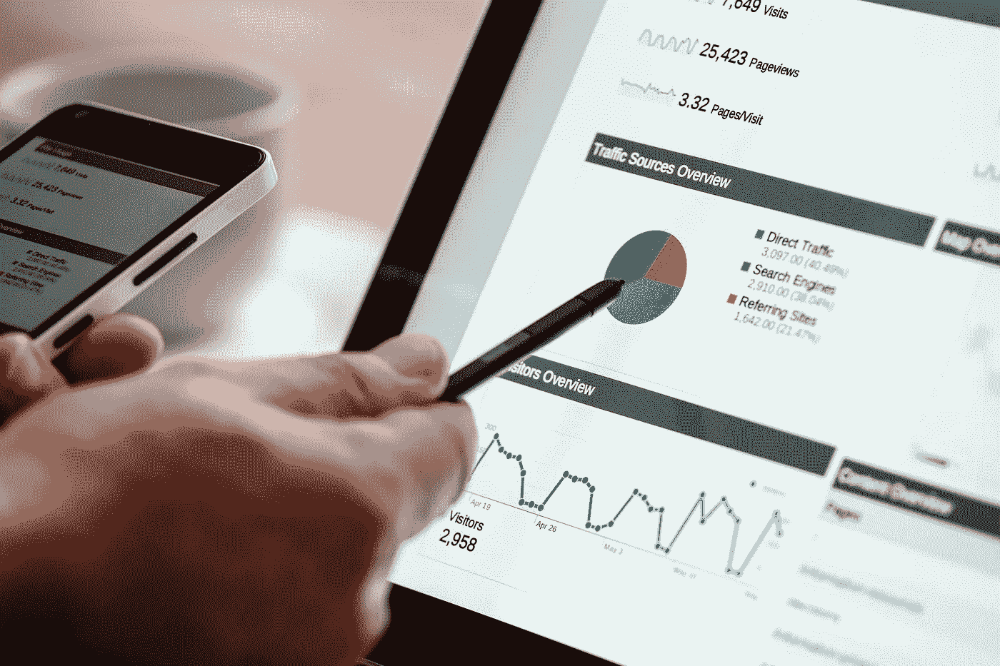
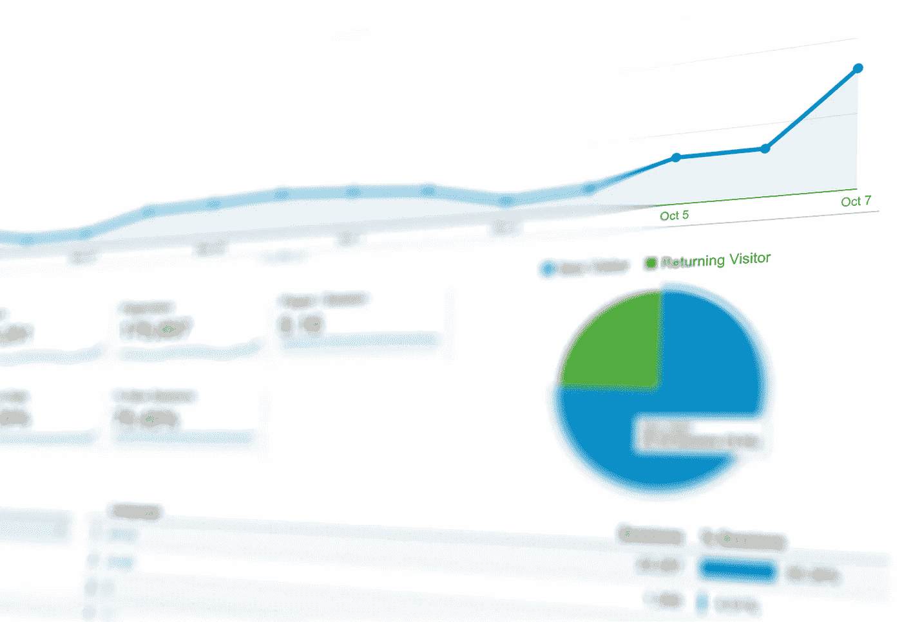
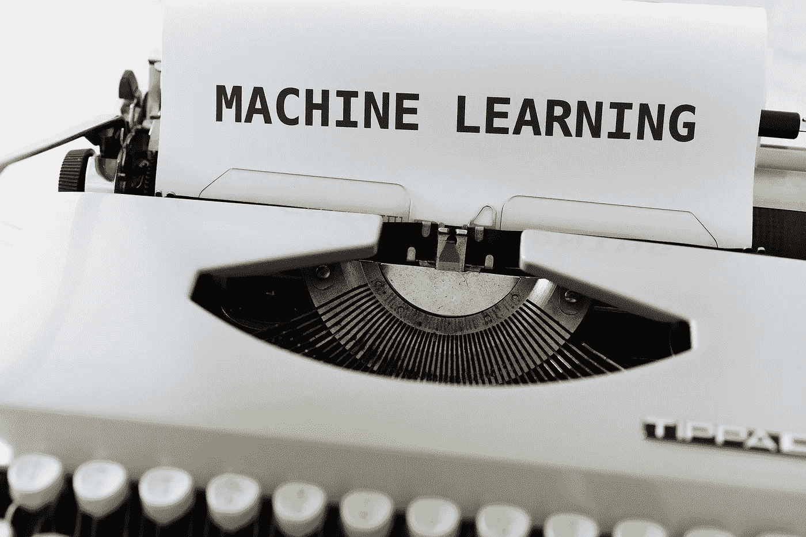

# Coursera 中的 16 门在线课程，开启您的数据科学生涯

> 原文：<https://towardsdatascience.com/16-online-courses-in-coursera-to-start-your-data-science-career-447de4347c9?source=collection_archive---------18----------------------->

由[诺德塞赫](https://pixabay.com/users/Nordseher-6327161/)在 [Pixabay](https://pixabay.com/photos/blue-lake-lake-constance-nature-2702172/) 上拍摄的照片

## Coursera 上关于数据分析、可视化和机器学习的最佳课程

在全球新冠肺炎疫情的阴影下，我们大多数人都有更多的时间来提高自己的技能，从而在工作环境中更具竞争力。

如果你想在数据科学道路上开始你的职业生涯，在线课程可能是最好的选择之一，因为它们通常成本低，按需定制，可以自定进度。最重要的是，我们可以远程学习。

在这篇文章中，我在 Coursera 上组织了一些课程，我认为这些课程会对想进入这个领域的人有所帮助。如果你已经是一名非常有经验的数据分析师/数据科学家/机器学习工程师，我相信大多数课程可能都有点肤浅。

为了方便起见，这些课程分为不同的类别。

*   基本的
*   程序设计语言
*   数据分析
*   数据可视化
*   机器学习

当然，我不会说这些课程你什么都要钉。根据个人需求和职业路径偏好，可能会挑选一部分给自己热身。

# 基本的

由[曼弗雷德里希特](https://pixabay.com/users/manfredrichter-4055600/)在 [Pixabay](https://pixabay.com/photos/tranquility-base-wooden-bench-bank-2906699/) 拍摄的照片

★ **大数据简介**
*加州大学圣地亚哥分校*

 [## 大数据简介

### 由加州大学圣地亚哥分校提供。有兴趣增加您对大数据领域的了解吗？这个…

www.coursera.org](https://www.coursera.org/learn/big-data-introduction) 

我相信你可能对数据库、SQL 等有所了解。然而，如今您需要知道什么是大数据，才能胜任大多数数据分析和数据科学任务。

本课程介绍了大数据的核心概念及其重要性。它还训练我们如何以可扩展的方式思考问题，这使我们在遇到与数据相关的问题时能够有更进一步的视野。

如果您对本课程感到满意，它也是一个系列，将继续沉浸在大数据的应用中，包括大数据中的机器学习，但它意味着更多的理论而不是大量的实践。

★ **数据科学家的工具箱**
*约翰·霍普金斯大学*

 [## 数据科学家的工具箱

### 由约翰霍普金斯大学提供。在本课程中，您将了解……中的主要工具和思想

www.coursera.org](https://www.coursera.org/learn/data-scientists-tools#syllabus) 

如果你没有太多的编程背景，这个课程会很有帮助。它列出了“数据科学家的工具箱”中最受欢迎的东西，并进行了解释。

在本课程中，你将学习 R 等基础编程，以及 RStudio 等开发环境。此外，作为一名数据科学家，您需要知道如何在 Git 中与同事协作。

# 程序设计语言

[Pixies](https://pixabay.com/users/Pixies-1021586/) 在 [Pixabay](https://pixabay.com/photos/technology-keyboard-computing-785742/) 上的照片

★**Python 交互式编程入门**
*莱斯大学*

 [## Python 交互式编程介绍(第 1 部分)

### 由莱斯大学提供。这两个部分的课程旨在帮助学生很少或没有计算…

www.coursera.org](https://www.coursera.org/learn/interactive-python-1) 

你必须知道 Python 是数据科学领域最流行的编程语言。所以，如果你还没有开始使用它，这个课程将帮助你成为一名 Python 程序员。

本课程的预期受众是那些非计算机科学背景的人。所以，从基础做起。所以，如果你以前从未使用过编程语言，也不要担心会被卡住。另外值得一提的是，本课程的重点不是数据分析或机器学习，而是编程技能。

★ **应用数据科学与 Python 专业化**
*密歇根大学*

 [## 使用 Python 的应用数据科学

### 由密歇根大学提供。密歇根大学专业的 5 门课程向学习者介绍了…

www.coursera.org](https://www.coursera.org/specializations/data-science-python) 

请注意，这是一个专业化，这意味着它包含多个课程。

本课程面向那些已经拥有 Python 经验但从未使用它进行数据分析的人。事实上，我想说的是，当我使用 Python 来编写 web 服务和数据可视化应用程序时，情况有所不同。本课程将帮助您转换现有的编程技能，以适应您在 Python 中的数据分析/机器学习职业。

★ **R 编程**
*约翰霍普金斯大学*

 [## r 编程

### 由约翰霍普金斯大学提供。在这门课程中，你将学习如何用 R 编程，以及如何使用 R 进行有效的编程

www.coursera.org](https://www.coursera.org/learn/r-programming) 

当然，Python 并不是数据分析和机器学习的唯一选择。当人们提到这些领域时，R 不能缺席。

如果你更喜欢用 R，完全没问题。在本课程中，您将从头到尾学习 R 编程，包括环境配置、在统计问题中应用 R、利用第三方库、调试等。还有一个好处是，这门课还提供了一些来自行业的数据分析实例，让你的技巧更加实用。

# 数据分析

由 [PhotoMIX-Company](https://pixabay.com/users/PhotoMIX-Company-1546875/) 在 [Pixabay](https://pixabay.com/photos/digital-marketing-seo-google-1725340/) 上拍摄的照片

★ **数据驱动型公司的业务指标**
*杜克大学*

 [## 数据驱动型公司的业务指标

### 由杜克大学提供。在本课程中，您将学习如何使用数据分析进行任何…

www.coursera.org](https://www.coursera.org/learn/analytics-business-metrics) 

如果你想学习目的驱动的数据分析，这个课程是最适合你的。它使用所有行业示例展示数据分析技能，不仅教您知识，还教您实践技能。

你将了解成为一名典型的数据分析师到底需要什么。如何使用数据分析在激烈的竞争中帮助您的公司。你会在这里找到答案。

★ **数据分析工具**
*卫斯理大学*

 [## 数据分析工具

### 卫斯理大学提供。在本课程中，您将开发并测试关于您的数据的假设。你会学到一个…

www.coursera.org](https://www.coursera.org/learn/data-analysis-tools) 

如果你想深入研究那些流行的数据分析、数据挖掘和统计技术，这个课程会很有帮助。它侧重于统计技术，如假设检验，方差分析，卡方检验，皮尔逊相关等。

★ **在 Excel 中掌握数据分析**
*杜克大学*

 [## 掌握 Excel 中的数据分析

### 由杜克大学提供。重要:本课程的重点是数学，特别是数据分析的概念和…

www.coursera.org](https://www.coursera.org/learn/analytics-excel/) 

我知道使用 Excel 听起来不是很酷，但我不得不说，有时它是一个不错的选择。例如，当您已经在 Excel 中获得数据，并且想要一些快速且一次性的结果时，它可能仍然是最佳选择。此外，如果你已经掌握了不错的 Excel 技能，本课程将帮助你探索 Excel 更多的可能性和潜力。

# 数据可视化

照片由 [Pexels](https://pixabay.com/users/Pexels-2286921/) 在 [Pixabay](https://pixabay.com/photos/analytics-chart-data-graph-1841554/) 上拍摄

★**Power BI 桌面入门**
*Amit Yadav，Coursera 项目网*

 [## 开始使用 Power BI 台式机

### 由 Coursera 项目网提供。在这个 2 小时的项目课程中，您将学习使用电力的基本知识…

www.coursera.org](https://www.coursera.org/projects/power-bi-desktop) 

作为最流行的数据可视化和 BI 前端工具之一，如果您的公司是微软商店，Power BI 是一个好的开始。

我强烈推荐这门课程来开始你的数据可视化之旅。这是 Coursera 指导的项目课程之一，这意味着它为您提供了一个在线工作空间，这是一个位于您浏览器中的云桌面，无需下载。然后，您可以与指导视频并排进行动手任务，非常方便，体验良好。

★ **数据可视化与交流与 Tableau**
*杜克大学*

 [## 数据可视化和与 Tableau 的通信

### 由杜克大学提供。出色的业务数据分析师的一项技能是能够…

www.coursera.org](https://www.coursera.org/learn/analytics-tableau) 

Tableau 是另一个数据可视化工具，在这个市场中占有很大的比重。在本课程中，您将学习如何使用 Tableau 讲述数据故事，如何可视化数据分析或机器学习模型的结果，以及如何通过数据更好地与他人交流。

★ **数据可视化**
*伊利诺伊大学香槟分校*

 [## 数据可视化| Coursera

### 学习数据挖掘的一般概念以及基本方法和应用。然后深入一个子领域…

www.coursera.org](https://www.coursera.org/learn/datavisualization#syllabus) 

本课程不是介绍数据可视化的具体工具，而是提供概念层面的指导。例如，在什么情况下应该使用什么样的数据可视化，对于数值和非数值数据有什么典型的数据可视化方法等等。

# 机器学习

由 [viarami](https://pixabay.com/users/viarami-13458823/) 在 [Pixabay](https://pixabay.com/photos/machine-learning-typewriter-5290464/) 上拍摄的照片

★ **机器学习**
*吴恩达斯坦福大学*

 [## 斯坦福大学的机器学习| Coursera

### 机器学习是让计算机在没有明确编程的情况下行动的科学。在过去的十年里…

www.coursera.org](https://www.coursera.org/learn/machine-learning) 

这是有史以来最好的机器学习课程，没有之一。如果你希望我只为初学者推荐一门关于机器学习的课程，那就是这门课。到目前为止(2020 年 8 月)，Coursera 上已经有超过 340 万的学习者注册了这门课程。

更重要的是，这门课已经在 Coursera 上免费了，虽然我觉得它值几千美元。

★ **应用数据科学与 Python 专业**
*密歇根大学*

 [## Python 中的应用机器学习

### 由密歇根大学提供。本课程将向学习者介绍应用机器学习，重点是…

www.coursera.org](https://www.coursera.org/learn/python-machine-learning) 

如果你已经学习了吴恩达的课程，并想探索其他课程，这是一个不错的选择。内容与前者有很多重叠，但如果你想的话，有另一个来加强你的学习是很好的。

★ **推荐系统**
*明尼苏达大学*

 [## 推荐系统

### 由明尼苏达大学提供。推荐系统是一个寻求预测用户偏好的过程。这个…

www.coursera.org](https://www.coursera.org/specializations/recommender-systems) 

如果你已经有了机器学习的基础知识，想知道 ML 能做什么样的应用，这个课程是最好的之一。

推荐系统一直是并且仍然是机器学习最热门的应用领域之一。当你在 ebay.com 购物时，他们的推荐系统会“学习”你的偏好，并向你推荐其他你可能也会购买的商品。这是推荐系统的一个例子。

★ **回归模型**
*约翰霍普金斯大学*

 [## 回归模型

### 由约翰霍普金斯大学提供。线性模型，顾名思义，将一个结果与一组预测因素联系起来…

www.coursera.org](https://www.coursera.org/learn/regression-models) 

回归是统计学习中最常用的技术之一。本课程着重于回归，并深入探讨各种不同的回归，如线性回归、逻辑回归、多变量回归、残差、泊松回归等。它还告诉你如何选择最佳的回归模型。

★ **神经网络与深度学习**
*吴恩达，deeplearning.ai*

 [## 神经网络和深度学习| Coursera

### 从 deeplearning.ai 学习神经网络和深度学习，如果你想打入前沿 ai，这门课…

www.coursera.org](https://www.coursera.org/learn/neural-networks-deep-learning) 

如果你是一个科技爱好者，你一定知道 Alpha Go，这是一个打败过最优秀的人类围棋选手的 AI，其背后的技术是深度学习。

如果你想学习深度学习，这是来自吴恩达的最佳课程。别担心。它从浅层神经网络开始，因此对初学者来说相当友好，尽管我仍然建议初学者应该从本节的第一课开始。

# 摘要

由 [StockSnap](https://pixabay.com/users/StockSnap-894430/) 在 [Pixabay](https://pixabay.com/photos/writing-writer-notes-pen-notebook-923882/) 上拍摄的照片

由于新冠肺炎，每个人都被锁在家里，而有些人却在琐碎的事情上花费时间来“消磨”时间。然而，如果我们能够利用这段时间来提高我们的数据科学技能，我相信当一切恢复正常时，我们在就业市场上将更具竞争力。

> 不要浪费每一次危机！

 [## 通过我的推荐链接加入 Medium 克里斯托弗·陶

### 作为一个媒体会员，你的会员费的一部分会给你阅读的作家，你可以完全接触到每一个故事…

medium.com](https://medium.com/@qiuyujx/membership) 

如果你觉得我的文章有帮助，请考虑加入 Medium 会员来支持我和成千上万的其他作者！(点击上面的链接)