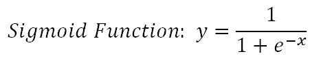

# 关于机器学习算法的 16 个技巧

> 原文：<https://towardsdatascience.com/16-tips-about-machine-learning-algorithms-7c5eaaf4bf45?source=collection_archive---------47----------------------->

## 加深您对常见机器学习算法的了解

你可能听说过瑞士军刀。如果没有，就看看下图。它包含许多刀片和工具。每个人都专门从事一项特定的任务。在某些情况下，不同的刀片可以执行相同的任务，但性能程度不同。

图片来自 [Pixabay](https://pixabay.com/?utm_source=link-attribution&utm_medium=referral&utm_campaign=image&utm_content=2186)

我认为机器学习算法是瑞士军刀。有许多不同的算法。某些任务需要使用特定的算法，而有些任务可以用许多不同的算法来完成。根据任务和数据的特征，性能可能会有所变化。

在这篇文章中，我将分享 16 个技巧，我认为它们会帮助你更好地理解算法。我的目标不是详细解释算法是如何工作的。我宁愿给出一些提示或细节。

一些技巧会更通用，而不是集中在某个特定的算法上。例如，日志损失是与所有分类算法相关的成本函数。

我假设你对算法有基本的了解。即使你不知道，你也可以挑选一些细节来帮助你。

我们开始吧。

## 1.支持向量机的 c 参数(SVM)

SVM 的 c 参数为每个错误分类的数据点增加了一个惩罚。如果 c 很小，则对误分类点的惩罚也很低，因此以更大数量的误分类为代价选择了具有大余量的决策边界。

如果 c 很大，SVM 试图最小化由于高惩罚导致的错误分类的例子的数量，这导致了具有较小裕度的决策边界。对于所有错误分类的例子，惩罚是不同的。它与到决策边界的距离成正比。

## 2.基于 RBF 核的 SVM 伽玛参数

RBF 核 SVM 的 Gamma 参数控制单个训练点的影响距离。低 gamma 值表示较大的相似性半径，这将导致更多的点被组合在一起。

对于高 gamma 值，这些点需要彼此非常接近，才能被视为在同一组(或类)中。因此，gamma 值非常大的模型往往会过度拟合。

## 3.什么使逻辑回归成为线性模型

逻辑回归的基础是逻辑函数，也称为 sigmoid 函数，它接受任何实数值并将其映射到 0 到 1 之间的值。

(图片由作者提供)

它是一个非线性函数，但逻辑回归是一个线性模型。

下面是我们如何从 sigmoid 函数得到一个线性方程:

(图片由作者提供)

取两侧的自然对数:

(图片由作者提供)

在等式(1)中，代替 x，我们可以使用线性等式 **z** :

(图片由作者提供)

那么等式(1)变成:

(图片由作者提供)

假设 y 是正类的概率。如果它是 0.5，那么上面等式的右边变成 0。

我们现在有一个线性方程要解。

## 4.主成分分析中的主要成分

PCA(主成分分析)是一种线性降维算法。PCA 的目标是在减少数据集的维数(特征数量)的同时保留尽可能多的信息。

信息量是用方差来衡量的。具有高方差的特征告诉我们关于数据的更多信息。

主成分是原始数据集特征的线性组合。

## 5.随机森林

随机森林是使用一种叫做**装袋**的方法建立的，其中每个决策树都被用作并行估计器。

随机森林的成功高度依赖于使用不相关的决策树。如果我们使用相同或非常相似的树，总体结果将不会比单个决策树的结果有太大的不同。随机森林通过**自举**和**特征随机性**实现不相关的决策树。

(图片由作者提供)

## 6.梯度推进决策树(GBDT)

GBDT 使用**提升**方法来组合个体决策树。Boosting 是指将一个学习算法串联起来，从许多顺序连接的弱学习器中实现一个强学习器。

每棵树都符合前一棵树的残差。与装袋不同，增压不涉及自举取样。每次添加新树时，它都适合初始数据集的修改版本。

(图片由作者提供)

## 7.增加随机森林和 GBDT 的树木数量

增加随机森林中的树木数量不会导致过度拟合。在某个点之后，模型的准确性不会因为添加更多的树而增加，但是也不会因为添加过多的树而受到负面影响。由于计算原因，您仍然不希望添加不必要数量的树，但是没有与随机森林中的树的数量相关联的过度拟合的风险。

然而，梯度提升决策树中的树的数量在过度拟合方面非常关键。添加太多的树会导致过度拟合，所以在某个时候停止添加树是很重要的。

## 8.层次聚类与 K-均值聚类

分层聚类不需要预先指定聚类的数量。必须为 k-means 算法指定聚类数。

它总是生成相同的聚类，而 k-means 聚类可能会根据质心(聚类中心)的初始化方式产生不同的聚类。

与 k-means 相比，层次聚类是一种较慢的算法。运行时间很长，尤其是对于大型数据集。

## 9.DBSCAN 算法的两个关键参数

DBSCAN 是一种聚类算法，适用于任意形状的聚类。这也是一种有效的检测异常值的算法。

DBSCAN 的两个关键参数:

*   **eps** :指定邻域的距离。如果两点之间的距离小于或等于 eps，则认为这两点是相邻的。
*   **minPts:** 定义一个聚类的最小个数据点。

## 10.DBSCAN 算法中的三种不同类型的点

基于 eps 和 minPts 参数，点被分类为核心点、边界点或异常点:

*   **核心点:**如果一个点在其半径为 eps 的周边区域内至少有 minPts 个数的点(包括该点本身)，则该点是核心点。
*   **边界点:**如果一个点可以从一个核心点到达，并且其周围区域内的点数少于 minPts，那么这个点就是边界点。
*   **离群点:**如果一个点不是核心点并且从任何核心点都不可达，那么这个点就是离群点。

[图源](https://en.wikipedia.org/wiki/DBSCAN)

在这种情况下，minPts 是 4。红色点是核心点，因为在其半径为 eps 的周围区域内至少有**4 个点。该区域在图中用圆圈表示。黄色点是边界点，因为它们可以从核心点到达，并且其邻域内的点少于 4 个。可到达意味着在核心点的周围区域。点 B 和 C 在其邻域(即半径为 eps 的周围区域)内有两个点(包括点本身)。最后，N 是一个异常值，因为它不是一个核心点，不能从核心点到达。**

## 11.朴素贝叶斯为什么叫朴素？

朴素贝叶斯算法假设特征是相互独立的，特征之间没有相关性。然而，现实生活中并非如此。这种特征不相关的天真假设是这种算法被称为“天真”的原因。

所有特征都是独立的假设使得朴素贝叶斯算法**比复杂算法**更快。在某些情况下，速度优先于更高的精度。

它可以很好地处理文本分类、垃圾邮件检测等高维数据。

## 12.什么是日志丢失？

对数损失(即交叉熵损失)是机器学习和深度学习模型的广泛使用的成本函数。

交叉熵量化了两个概率分布的比较。在监督学习任务中，我们有一个目标变量，我们试图预测。使用交叉熵比较目标变量的实际分布和我们的预测。结果是交叉熵损失，也称为对数损失。

## 13.原木损失是如何计算的？

对于每个预测，计算真实类的预测概率的负自然对数。所有这些值的总和给出了对数损耗。

这里有一个例子可以更好地解释这个计算。

我们有一个 4 类的分类问题。我们的模型对特定观测值的预测如下:

(图片由作者提供)

来自该特定观察(即数据点或行)的对数损失是-log(0.8) = 0.223。

## 14.为什么我们用 log loss 代替分类精度？

在计算对数损失时，我们取预测概率的自然对数的负值。我们对预测越有把握，测井损失就越低(假设预测是正确的)。

例如，-log(0.9)等于 0.10536，而-log(0.8)等于 0.22314。因此，90%的把握比 80%的把握会导致更低的测井损失。

传统的度量标准，如分类准确度、精确度和召回率，通过比较预测类和实际类来评估性能。

下表显示了两个不同模型对一个由 5 个观察值组成的相对较小的集合的预测。

(图片由作者提供)

两个模型都正确地对 5 个观察值中的 4 个进行了分类。因此，在分类精度方面，这些模型具有相同的性能。然而，概率揭示了模型 1 在预测中更确定。因此，总体而言，它的表现可能会更好。

对数损失(即交叉熵损失)提供了对分类模型的更稳健和准确的评估。

## 15.ROC 曲线和 AUC

**ROC 曲线**通过组合所有阈值处的混淆矩阵来总结性能。 **AUC** 将 ROC 曲线转化为二元分类器性能的数字表示。AUC 是 ROC 曲线下的面积，取 0 到 1 之间的值。AUC 表示一个模型在区分正类和负类方面有多成功。

## 16.精确度和召回率

精确度和召回率度量将分类准确性向前推进了一步，并允许我们获得对模型评估的更具体的理解。选择哪一个取决于任务和我们的目标。

**Precision** 衡量我们的模型在预测为正时有多好。精度的焦点是**正面预测**。它表明有多少积极的预测是正确的。

**回忆**测量我们的模型在正确预测积极类方面有多好。召回的重点是**实际正班**。它表示模型能够正确预测的阳性类别的数量。

## 结论

我们已经介绍了一些基本信息以及关于机器学习算法的一些细节。

有些点与多种算法有关，比如关于日志丢失的算法。这些也很重要，因为评估模型和实现它们一样重要。

所有的机器学习算法在某些任务中都是有用和有效的。根据你正在做的工作，你可以掌握其中的一些。

然而，了解这些算法的工作原理是很有价值的。

感谢您的阅读。如果您有任何反馈，请告诉我。