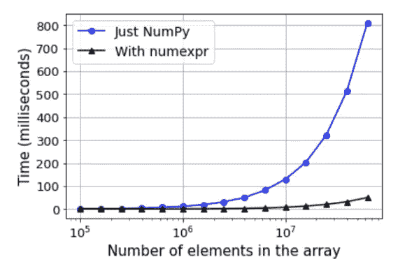
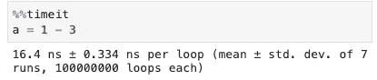
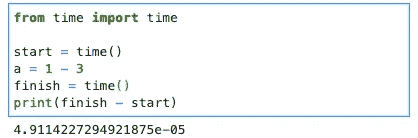

# 处理数据、大数据甚至更大数据的 17 种策略

> 原文：<https://towardsdatascience.com/17-strategies-for-dealing-with-data-big-data-and-even-bigger-data-283426c7d260?source=collection_archive---------3----------------------->

## 加速 Python 代码的技巧和库

处理大数据可能很棘手。没有人喜欢内存不足的错误。☹️没有人喜欢等待代码运行。⏳没有人喜欢离开 Python。🐍

不要绝望！在本文中，我将提供一些技巧，并介绍一些新兴的库来帮助您高效地处理大数据。我还将向您介绍不适合内存的代码的解决方案。在使用 Python 的过程中。👍

我们到桥的另一边去吧！资料来源:pixabay.com

[Python](https://www.python.org/) 是科学和数值计算最流行的语言。[熊猫](https://pandas.pydata.org/)最受清理代码和探索性数据分析的欢迎。

与使用 Microsoft Excel 或 Google Sheets 相比，使用 pandas 和 Python 可以处理更多的数据。

SQL 数据库在存储数据方面非常受欢迎，但在表达性、测试、再现性以及快速执行数据分析、统计和机器学习的能力方面，Python 生态系统比 SQL 有许多优势。

不幸的是，如果您在本地工作，pandas 可以处理的数据量会受到您机器上内存量的限制。如果你在云中工作，更多的内存需要更多的钱。💵

不管你的代码在哪里运行，你都希望操作快速发生，这样你就可以 GSD(完成任务)！😀

# 总是要做的事情

如果你曾经听到或看到过关于加速代码的建议，你就会看到这个警告。⚠️ **不要过早优化！** ⚠️

这是个好建议。但是了解一些技巧也是很聪明的，这样你就可以在第一时间写出干净快速的代码。🚀

去追它！资料来源:pixabay.com

以下是适用于任何规模数据集的三种良好编码实践。

1.  尽可能避免嵌套循环。[下面是关于 Big-O 符号和算法分析的简单介绍。嵌套在另一个`for`循环中的一个`for`循环通常会导致多项式时间计算。如果你要搜索的项目不止一个，你可能要等一段时间。看到一个漂亮的图表和解释](https://stackabuse.com/big-o-notation-and-algorithm-analysis-with-python-examples/)[这里](https://skerritt.blog/big-o/)。
2.  在 Python 中尽可能使用列表理解(和字典理解)。按需创建一个列表比重复加载和附加属性到一个列表要快得多——堆栈溢出的提示答案[这里](https://stackoverflow.com/a/30245465/4590385)。然而，一般来说，不要为了速度而牺牲清晰性，所以要小心嵌套列表理解。⚠️
3.  在 pandas 中，使用内置的矢量化函数。这个原理和列表和字典理解的原理是一样的。一次对整个数据结构应用一个函数比重复调用一个函数要快得多。

如果你发现自己伸手去拿`apply`，想想你是否真的需要。`apply`在行或列上循环。矢量化方法通常速度更快，代码更少，因此它们是多方面的胜利。🚀

同样，避免其他循环遍历数据的 pandas 系列和 DataFrame 方法，例如`applymap`、`itterrows`和`ittertuples`。如果有意义的话，在 DataFrame 上使用`map`或`replace`方法，而不是其他任何方法，这样可以节省很多时间。

请注意，这些建议可能不适用于非常少量的数据，但在这种情况下，风险很低，所以谁在乎呢。😉

# 这给我们带来了最重要的规则

## **能留在熊猫就留在熊猫。🐼**

这是一个快乐的地方。😀

如果没有问题，并且不希望数据或内存空间膨胀，就不要担心这些速度和内存问题。

但在某个时候，风暴云会聚集。⛈:你会遇到一个大数据集，然后你会想知道该怎么做。来看看一些小技巧吧。

# 与大量数据(大约数百万行)相关的事情

就像数百万颗沙粒。资料来源:pixabay.com

1.  如果你在做机器学习，使用你的数据子集来探索、清理和制作一个基线模型。快速解决 90%的问题，节省时间和资源。这项技术可以帮助你更快地得到一个好的模型！⏳
2.  当读入数据帧时，只加载需要使用`[usecols](https://pandas.pydata.org/pandas-docs/stable/user_guide/scale.html#load-less-data)`参数的列。少数据 in =赢！
3.  有效地使用数据类型。将数字列向下转换为对`pd.to_numeric()`有意义的最小数据类型。将基数低(只有几个值)的列转换为分类数据类型。这是一份关于高效类型的熊猫指南。
4.  scikit 中的并行模型培训-学习尽可能使用更多处理内核。默认情况下，scikit-learn 只使用您机器的一个内核。许多计算机都有 4 个或更多内核。通过传递关键字参数`n_jobs=-1`，您可以将它们全部用于可并行化的任务。
5.  以羽毛或泡菜格式保存熊猫数据帧，以加快读写速度。向 Martin Skarzynski 致敬，他在这里链接到证据和代码。
6.  使用`[pd.eval](https://pandas.pydata.org/pandas-docs/stable/reference/api/pandas.eval.html#pandas.eval)` 加速熊猫的行动。将您通常的代码以字符串形式传递给该函数。它的运算速度要快得多。这是一个 100 列数据框架的测试图表。

图片来自[Tirthajyoti Sarkar](/speed-up-your-numpy-and-pandas-with-numexpr-package-25bd1ab0836b)[关于该主题的这篇好文章](https://medium.com/u/cb9d97d4b61a?source=post_page-----283426c7d260--------------------------------)

`[df.query](https://pandas.pydata.org/pandas-docs/stable/reference/api/pandas.DataFrame.query.html#pandas.DataFrame.query)`基本上与`pd.eval`相同，但是作为一个 DataFrame 方法，而不是一个顶级的 pandas 函数。

查看文档，因为有一些问题。⚠️

熊猫正在引擎盖下使用 [numexpr](https://numexpr.readthedocs.io/projects/NumExpr3/en/latest/intro.html) 。Numexpr 也可以和 NumPy 一起使用。Chris Conlan 在他的书 [Fast Python](https://chrisconlan.com/fast-python/) 中为我指出了@Numexpr。Chris 的书是学习如何提高 Python 代码速度的绝佳读物。👍

# 事情与真正的大数据有关(大约几千万行或更多)

更多数据！资料来源:pixabay.com

1.  使用[数字巴](https://pandas.pydata.org/pandas-docs/stable/user_guide/enhancingperf.html#using-numba)。如果你在做数学计算，Numba 会大大提高你的速度。安装 numba 并导入它。然后，当您需要遍历 NumPy 数组并且不能使用矢量化方法时，使用`@numba.jit` decorator 函数。它只适用于 NumPy 数组。在 pandas 数据帧上使用`.to_numpy()`将其转换为 NumPy 数组。
2.  在有意义的时候使用[稀疏矩阵](https://docs.scipy.org/doc/scipy/reference/sparse.html)。Scikit-learn 用一些转换器自动输出稀疏数组，比如 CountVectorizer。当您的数据大部分是 0 或缺少值时，您可以在 pandas 中将列转换为稀疏 dtypes。点击阅读更多[。](https://pandas.pydata.org/pandas-docs/stable/user_guide/sparse.html)
3.  使用 [Dask](https://dask.org/) 将数据集并行读取到 pandas 的数据块中。Dask 还可以在多台机器上并行处理数据操作。它模仿熊猫和 NumPy APIs 的子集。 [Dask-ML](https://ml.dask.org/) 是一个姐妹包，用于在多台机器上并行化机器学习算法。它模仿 scikit-learn API。Dask 与其他流行的机器学习库(如 XGBoost、LightGBM、PyTorch 和 TensorFlow)配合得很好。
4.  使用 PyTorch，不管有没有 GPU。在 GPU 上使用 PyTorch 可以获得很大的加速，我在这篇关于排序的文章[中发现了这一点。](/surprising-sorting-tips-for-data-scientists-9c360776d7e)

# 未来处理大数据时需要关注/尝试的事情

盯着他们！资料来源:pixabay.com

以下三个包是截至 2020 年年中的最新产品。预计配置问题和 API 变化。如果您在本地 CPU 上工作，这些包可能不适合您的需要。但是看起来都很有希望，值得关注。👀

1.  您是否可以访问大量的 cpu 内核？您的数据是否超过 32 列(从 2020 年中期开始需要)？然后考虑[摩丁](https://modin.readthedocs.io/en/latest/)。它模仿 pandas 库的子集来加速大型数据集的操作。它使用阿帕奇箭(通过射线)或引擎盖下的 Dask。Dask 后端是实验性的。在我的测试中，有些东西不是很快——例如从 NumPy 数组中读取数据很慢，内存管理是个问题。
2.  可以用 [jax](https://github.com/google/jax) 代替 NumPy。Jax 是一款开源的谷歌产品，非常前沿。它通过使用以下五种工具来加速操作:自动签名、XLA、JIT、矢量器和并行化器。Jax 在 CPU、GPU 或 TPU 上工作，可能比使用 PyTorch 或 TensorFlow 获得速度提升更简单。Jax 对深度学习也有好处。截至 2020 年中期，它适用于 NumPy，但不适用于熊猫。但是，您可以将 DataFrame 转换为 TensorFlow 或 NumPy 对象，然后使用 jax。点击阅读更多[。](https://iaml.it/blog/jax-intro-english)
3.  [Rapids cuDF](https://github.com/rapidsai/cudf) 通过类似熊猫的 API 在 GPU 上使用 Apache Arrow。是 NVIDIA 的开源 Python 包。Rapids 与 Dask 配合得很好，因此您可以让多个 GPU 并行处理数据。对于最大的工作负载，它应该提供一个不错的提升。

# 关于代码速度和大数据的其他知识

## 计时操作

如果你想在 Jupyter 笔记本上为一个操作计时，你可以使用
`%time`或`%timeit`魔法命令。当单个%是前缀时，它们都在单行上工作；当双%%是前缀时，它们都在整个代码单元上工作。

`%time`运行你的代码一次，`%timeit`运行代码多次(默认为七次)。请务必查看文档[以了解一些微妙之处。](https://ipython.readthedocs.io/en/stable/interactive/magics.html#magic-time)

如果您正在使用 Python 脚本或笔记本，您可以导入时间模块，检查运行代码前后的时间，并找出差异。

或者，您可以使用`time.perf_counter`或`time.process_time`。区别在[堆栈溢出问题](https://stackoverflow.com/q/52222002/4590385)中讨论。

测试时间时，请注意不同的机器和软件版本会导致差异。此外，如果您正在进行重复测试，缓存有时会误导您。和所有的实验一样，保持你能保持不变的东西不变。👍

## 存储大数据

GitHub 的最大文件大小是 [100MB](https://docs.github.com/en/github/managing-large-files/what-is-my-disk-quota) 。如果你想用 GitHub 版本化大文件，你可以使用 Git 大文件存储扩展。

此外，确保你没有将文件自动上传到 Dropbox、iCloud 或其他自动备份服务，除非你想这样做。

## 想了解更多？

pandas 文档中有关于增强性能和扩展到大型数据集的章节。我的一些想法改编自那些章节。

有其他提示吗？我很想在[推特](https://twitter.com/@discdiver)上听到他们的声音。🎉

# 包装

您已经了解了如何编写更快的代码。您还看到了如何处理大数据和真正的大数据。最后，您看到了一些新的库，它们可能会继续变得更受欢迎，以处理大数据。

我希望这个指南对你有所帮助。如果你有，请在你最喜欢的社交媒体上分享，这样其他人也可以找到它。😀

我写关于 [Python](https://memorablepython.com) 、 [SQL](https://memorablesql.com) 、 [Docker](https://memorabledocker.com) 和其他技术主题的文章。如果你对这些感兴趣，请注册我的[邮件列表，那里有很棒的数据科学资源](https://dataawesome.com)，点击这里阅读更多内容，帮助你提高技能[。👍](https://medium.com/@jeffhale)

资料来源:pixabay.com

大数据时代快乐！😀