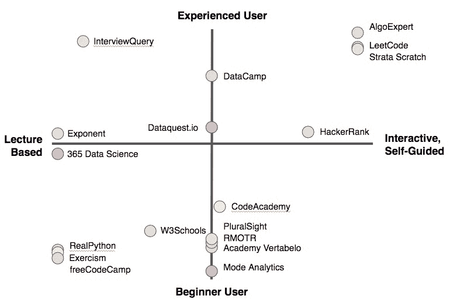
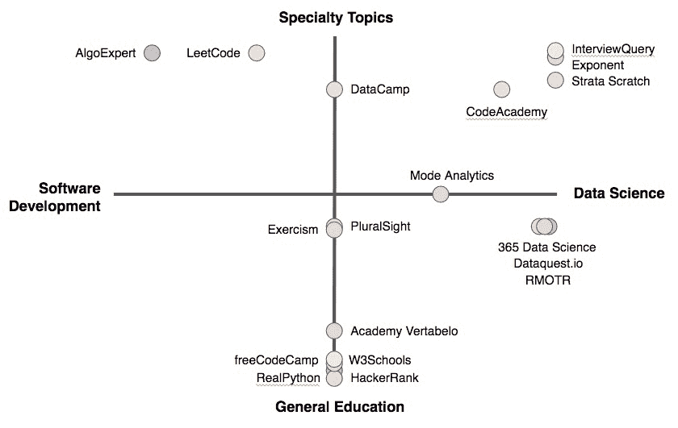
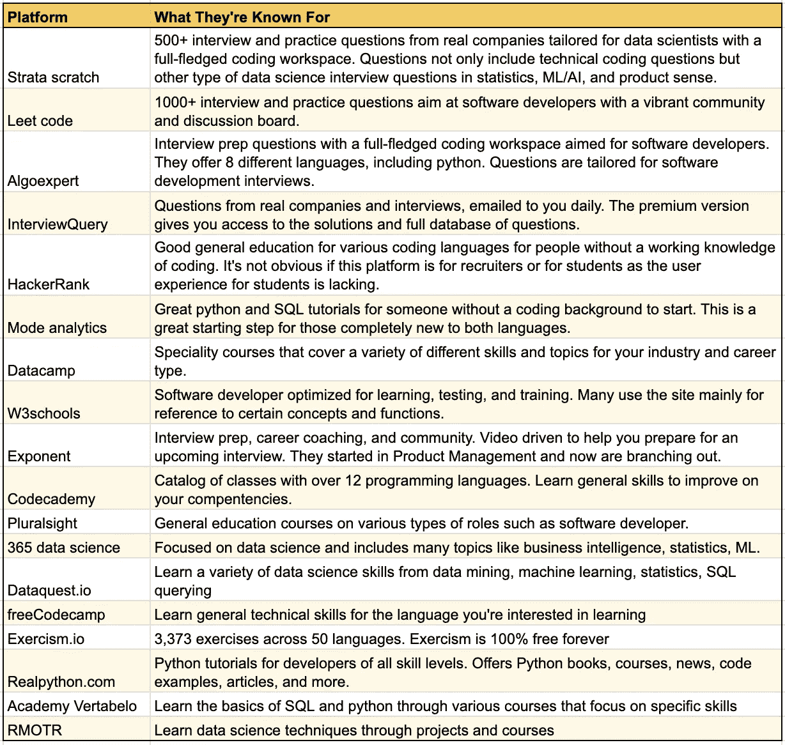
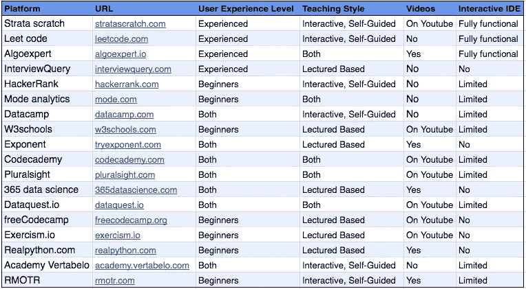
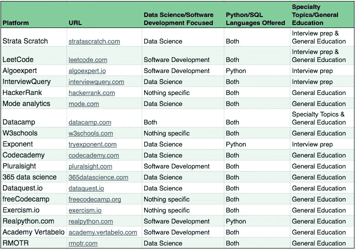
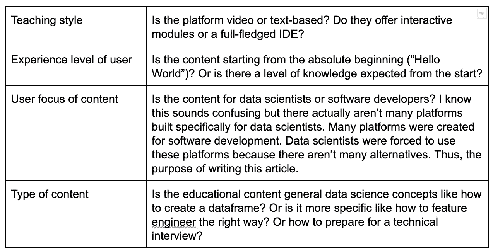

# 学习 Python 和 SQL 最值得推荐的 18 个数据科学平台

> 原文：<https://towardsdatascience.com/18-of-the-most-recommended-data-science-platforms-to-learn-python-and-sql-f969f61b6d70?source=collection_archive---------12----------------------->

## **社区最受欢迎的数据科学学习平台综合指南**

数据科学是当今市场上最热门的职业之一。公司总是在雇佣数据科学家，总有很多人想成为一名数据科学家。但是数据科学并没有像其他技术学科一样存在那么久，所以不像软件开发那样，没有那么多专门针对数据科学的学习平台来帮助有抱负和有经验的科学家做好准备。当然还有 Coursera 和 Udemy，还有一些大的品牌平台，比如 DataCamp。此外，还有十几个或更多更小的利基平台，旨在以他们的方式培训数据科学家。

我评估了数据科学社区的人推荐的 18 个平台。根据您的学习风格和需求，总有一个平台适合您。本文的前半部分是我对这些平台的最终评估，最后是一个完整的平台列表，其中包含了帮助我评估它们的所有细节。文章的第二部分详细介绍了我评估平台的方法——了解不同的用户类型、采购平台和要评估的变量。所以有时间的话先跳到最后了解一下我的评价标准再看结果。如果你时间紧迫，就去下一部分。

# TL；大卫:我的评估

我创建了两个图表来映射我的变量。它们是带有象限的图表，你可以在所有白皮书中看到。老实说，我有点惭愧我选择了这种可视化(感觉就像在 Excel 中制作 3D 饼图)，但我认为它将允许您快速找出哪个平台最适合您。

## 图表 1:学习风格和体验

**问自己:**我的学习风格是什么？我是喜欢一头扎进去开始编码，还是喜欢先看视频？我在这方面完全是新手，需要更多的帮助吗？或者我可以直接跳进去吗？

通过用户体验学习风格[图片由 N. Rosidi 创建]

基于讲座的平台的极端是纯粹的被动讲座，如网页上的文本或人们在视频上的交谈。通常这些平台会要求你自己安装软件，我认为这是一种懒惰，因为安装所有软件来提供完整的开箱即用体验是如此容易。用户并不总是先进的——这就是他们学习的原因——所以为他们提供一种可以通过浏览器轻松访问软件、库和数据集的体验现在是必须的——至少对我来说是这样。

互动的、自我指导的学习允许你按照自己的进度工作，选择你想学习或练习的任何主题。在极端情况下，有一个全功能的 IDE，允许您像在真正的专业环境中一样探索、交互和操作数据。但它不仅仅是完全自我指导的，因为有解决方案可以帮助您解决问题和理解概念。这里的方法是立即开始编码，并在遇到困难时学习解决方案。这些平台非常适合有经验的用户，即使你只是中等经验。

中间地带是讲座和互动自主学习的结合。有了这些平台，你就有了从头到尾学习一系列概念的“课程”和“路径”。向您展示文本和/或视频，然后要求您在一个交互式但有限的 IDE 中应用您所学的内容，在这个 IDE 中，您会被问到一些复杂的问题。交互式但有限的 IDE 意味着 IDE 只接受回答提示问题的输入，因此您不能偏离正道去探索数据或尝试不同的功能和技术，您知道，这是一个优秀的数据科学家会做的事情。这对那些从零开始学习并试图从头开始学习新东西的人来说是完美的。

## 图表 2:内容焦点

**问自己:**我是在努力学习 python 吗？还是我在努力学 python 做数据科学家？我是在为面试做准备吗？还是我在尝试建立我的第一个机器学习模型？还是只是想学基础？

按技术重点分类的教育主题[图片由 N. Rosidi 创建]

专业主题是有特定目的的教育内容。例如，为技术面试做准备——数据科学或软件开发。就是用 python 学习金融建模或者构建梯度推进决策树。这些平台服务于小众人群，但他们做得非常好，让他们的用户群满意。

普通教育仅仅是对基本概念的介绍，这些概念是熟练掌握这门语言的基础，比如如何创建熊猫数据框来操作数据。一旦你掌握了这些概念，下一步将是深入到满足你需求的特定主题。

平台是以用户为中心设计的。在这种情况下，你是数据科学家还是软件开发人员？如果你正在读这篇文章，你可能是一个数据科学家，但是正如我之前提到的，有更多的教育平台是为教授软件开发而创建的。有时这些平台提供 python 教育，但它们的内容和示例并不总是面向数据科学家。这有点像给一个软件添加一个插件(它不是原生的，有时感觉有点粗糙)。

# 对每个平台的详细评估

以防图表对你来说不够。

## 每个平台的特点以及它们的独特之处

链接到谷歌表单:[https://bit.ly/2UknbZ3](https://bit.ly/2UknbZ3)

## 哪种类型的用户会从每个平台中受益最多

链接到谷歌表单:【https://bit.ly/2YaNlhR 

## 按用户体验级别划分的教学风格和特点

链接到谷歌表单:【https://bit.ly/3f0SPm9 

## 按技术重点分类的教育主题(数据科学和软件开发)

链接到谷歌表单:[https://bit.ly/30kaqkS](https://bit.ly/30kaqkS)

因此，根据你的职业目标和你喜欢的学习方式，每个人都有一个平台。在您的旅程中，您可能会使用其中的一些平台，因为每个平台都专注于特定的优势。选择一个数据科学平台，让您了解您所处阶段需要学习的内容。我希望这个列表有所帮助。

请参见下文，了解我评估平台的方法…

# 附录:我评估 18 个平台的方法

## 1.用户角色

我从对用户——你——的理解开始。当思考什么类型的人会对学习数据科学感兴趣时，我想到了 3 种不同的用户角色:

*   **经验丰富的数据科学家:**这些是当前的数据科学家。他们要么有几年的经验和服务过的公司，要么在第一份工作中是数据科学家。无论如何，这些人要么在寻找新工作，需要准备/更新他们的面试技能，要么想学习其他数据科学技能，以进入数据科学的另一个学科。
*   **技术型、缺乏经验/有抱负的数据科学家:**这些人可能是计算机科学专业的学生或当前的业务分析师。他们编写代码，并不需要太多的手把手，因为他们开始在数据科学方面提高技能。他们可能对转向数据科学的职业感兴趣。
*   **非技术人员、缺乏经验/有抱负的数据科学家:**这些人可能是学生或在公司担任非技术职务的人。他们不写代码，也不知道从哪里开始，但他们对数据科学职业或涉足技术领域感兴趣。

## 2.采购公司(包括和排除)

我问自己，有人会如何发现数据科学平台。除了简单的谷歌搜索，大多数人要么选择他们认可的品牌，要么选择基于推荐的平台。

我选择从热门子网站的推荐中寻找平台，比如:

*   r/数据科学
*   r/编程
*   r/python
*   r/sql

Reddit 有一个活跃的数据科学社区，所以这是一个很好的起点。我补充了 Quora，Google，Youtube。

我有意识地选择排除(MOOCs)大规模开放在线课程(如 Udemy、EdX 和 Coursera)、训练营和大学课程，因为质量取决于讲师和课程，所以我很难进行一对一的评估。此外，我不认为有经验的数据科学家真的会上关于如何成为一名数据科学家的 Udemy 课程——但我可能错了。

对于每个平台，我都注册并使用了一段时间。我没有注册高级版本，除非我无法根据我的标准正确评估该平台。

## 3.我的评估中使用的变量

我根据我认为对上述每个用户角色都很重要的 4 个主要变量来评估每个平台。

回到我的评估部分阅读结果！