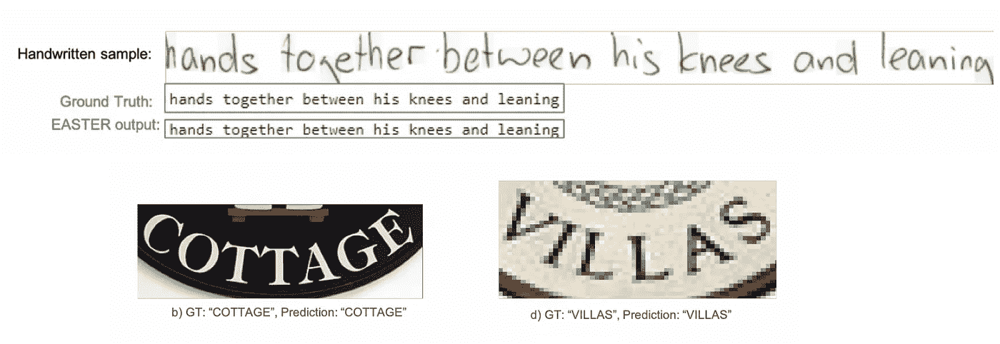
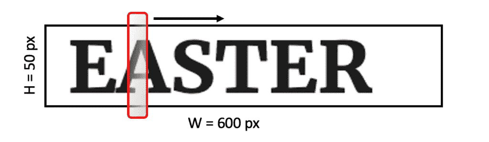
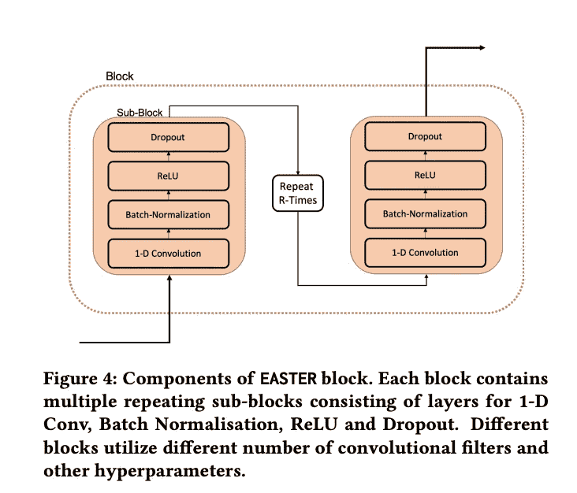
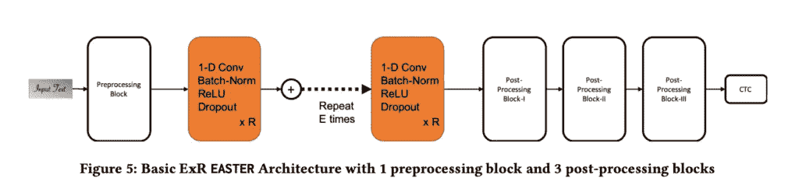
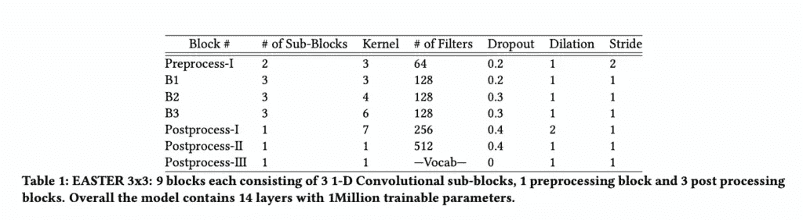
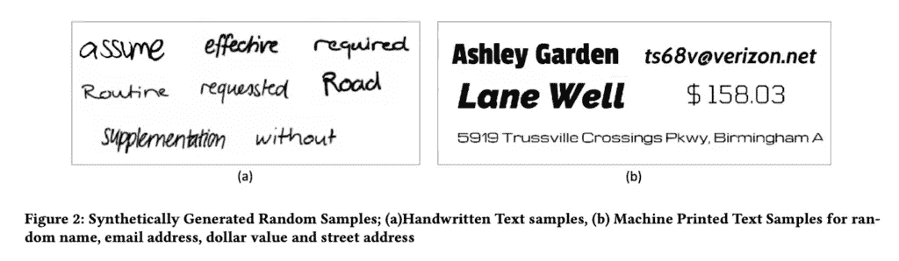
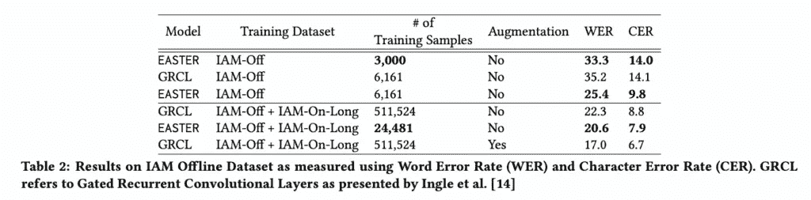
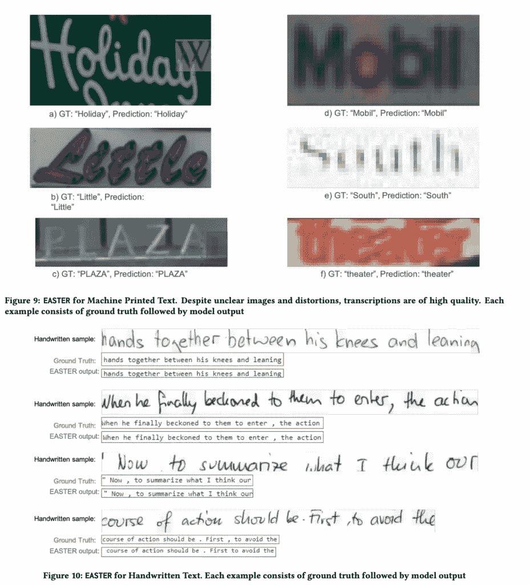

# 基于 1D-CNN 的手写识别全卷积模型

> 原文：<https://towardsdatascience.com/1d-cnn-based-fully-convolutional-model-for-handwriting-recognition-7853976f5784?source=collection_archive---------28----------------------->

## EASTER 模型解释了快速、高效和可扩展的 HTR/OCR

手写识别也称为 HTR(手写文本识别)，是一种机器学习方法，旨在赋予机器从现实世界的文档(图像)中读取人类笔迹的能力。

传统的光学字符识别系统(OCR 系统)被训练来理解机器打印文本(来自文档/图像)中的变化和字体风格，并且它们在实践中工作得非常好(例如 Tesseract)。另一方面，手写识别是一项更具挑战性的任务，因为人们的笔迹存在大量差异。

照片由**约翰·詹宁斯**拍摄自 Unsplash **|** [**图片来源**](https://unsplash.com/photos/IcT8l8DDek8)

深度学习的最新进展导致了高效 OCR/HTR 解决方案的开发。尽管这些模型在实践中表现出色，但由于以下限制，它们不容易训练、理解和部署

1.  *它们需要海量的标注训练数据。*
2.  *由于训练参数多，训练难，推理慢。*
3.  *因为它们速度慢，所以需要巨大的部署成本(硬件要求)来使它们在实时应用中有用。*
4.  *模型本质复杂，难以扩展(堆叠 LSTMs、复杂关注层)。*

在本文中，我们将讨论一种新颖的深度学习架构(EASTER)，它在一定程度上解决了上述挑战。这种架构快速、可扩展、简单，并且比许多复杂的 OCR 和 HTR 任务选择更有效。

EASTER 模型仅利用一维卷积层来完成 HTR 和 OCR 的任务。

复活节模型结果来自原论文| [图片来源](https://arxiv.org/pdf/2008.07839.pdf)

> *原文链接:*
> 
> [*复活节:高效可扩展的文本识别器*](https://arxiv.org/pdf/2008.07839.pdf)

这是这篇文章将要涉及的关于复活节模型的项目列表-

1.  ***复活节概述***
2.  ***1D——CNN 上的图片？真的吗？怎么会？***
3.  ***复活节模型建筑***
4.  ***具有零训练数据的 OCR/HTR 能力***
5.  ***结果***
6.  ***总结***

# 复活节概述

EASTER(高效且可扩展的文本识别器)是一个完全卷积的架构，在编码器中仅使用 1-D 卷积层，并在末尾添加了 CTC-解码器(连接主义时间分类)。

复活节设置了一种新的方式来可视化和有效地解决光学字符识别/HTR 任务，只有 1-D 卷积层。

以下是复活节建筑的几个要点

1.  *可在 GPU 上并行训练的全卷积架构。*
2.  *只有 1-D 卷积层，速度更快，参数更少。*
3.  *即使在训练数据有限的情况下也能很好地工作。*
4.  *没有复杂的层次(简单易懂)。*
5.  *适用于生产线级 OCR/HTR 任务。*

除了 EASTER 架构之外，本文还介绍了一个带有增强设置的合成数据生成管道。这意味着您可以训练自己的 OCR/HTR 系统，而不需要任何训练数据。

现在问题来了——如何在二维图像上应用一维卷积。这是一个非常有效的问题，下一段解释了它-

# 1D-美国有线电视新闻网的图像？真的吗？怎么会？

考虑一个尺寸为 600 X 50(宽 X 高)的输入图像，如下图所示。

在这里，如果你在这个图像中画一条垂直线，你将只剪切一个字符(如果不是在空白中画的)，如果你画一条水平线，你将可能最终剪切所有的字符。

换句话说，我在这里想说的是——沿着图像的高度，你只会发现单个字符的属性，而沿着宽度，当你从左向右移动时，你会发现所有不同的字符。

复活节模型中的一维卷积滤波器运动| [**图片作者**](https://dropsofai.com)

所以基本上，宽度可以被认为是一个时间维度，如果你沿着时间移动，你会发现不同的后续字符，而高度代表一个字符在给定时间戳的属性。

内核大小为 3 的一维过滤器实际上意味着在时间维度(沿着宽度，每次 3 个像素)中覆盖 50 个像素(H)的总高度的维度 3 的过滤器。因此，基本上内核大小为 3 的过滤器意味着 3x50(或 3xH)维的过滤器(就像 1-D CNN 适用于 NLP 单词嵌入)。

如上图所示，这个红色矩形框是一个一维卷积过滤器，它在时间维度(宽度)上从左向右移动时扫描图像的整个高度。每次扫描存储被观察字符(或字符的一部分)的信息。

该信息最终被传递到 softmax 层，该层给出了沿宽度的每个时间步长的所有可能字符的概率分布。这个概率分布然后被传递到 CTC 解码层，以生成最终的输出序列。

# 复活节模型建筑

Easter 模型架构非常简单，仅利用一维卷积层来执行 OCR 和 HTR 任务。

Easter 编码器部分由多个堆叠的一维卷积层组成，其中内核大小随着模型的深度而增加。在 ASR(自动语音识别)领域中，已经证明了基于堆叠 1-D 卷积的网络处理序列到序列任务的有效性。

# 复活节街区

复活节积木的基本结构如下图所示。每个块具有多个重复的子块。每个子模块由 4 个有序组件组成-

1.  一维卷积层
2.  批量标准化层
3.  激活层
4.  辍学者

复活节子块| [图片来源](https://arxiv.org/pdf/2008.07839.pdf)

# 最终编码器

整个编码器是多个重复 EASTER 块的堆栈(在最后一段中讨论过)。除了重复块之外，总体架构中还有四个额外的 1-D 卷积块，如下图所示。

## 预处理块(下采样块)

这是模型的第一个模块，包含两个 1-D 卷积层，步长为 2。该块用于将图像的原始宽度下采样到宽度/4。除了步距之外，sub 0-块的所有其它部分与上面讨论的类似。

## 后处理模块

在编码器部分的末端有三个后处理块，其中第一个是膨胀为 2 的膨胀 1-D 卷积块，第二个是正常 1-D 卷积块，而第三个后处理块是“滤波器数目”等于可能结果(模型词汇长度)的数目并且具有 softmax 激活层的 1-D 卷积块。这一层的输出被传递给 CTC 解码器。

复活节编码器| [图片来源](https://arxiv.org/pdf/2008.07839.pdf)

# CTC 解码器

EASTER 编码器将编码序列的输出概率分布传递给 CTC 解码器进行解码。

为了将预测的输出字符映射到结果输出序列中，EASTER 模型使用了加权 CTC 解码器。这种加权 CTC 解码器导致模型的快速收敛，并且当训练数据有限时，给出比普通 CTC 更好的结果。

该加权 CTC 解码器的配置在原始论文中有详细描述。

# 3x3 架构变体

EASTER 3X3:使用下表可以构建一个 14 层的变体。这是一个非常浅/简单的架构，只有 100 万个参数，但对于 OCR/HTR 的任务非常有效。

复活节 3X3 | [图片来源](https://arxiv.org/pdf/2008.07839.pdf)

该型号可以轻松扩展以提高性能/容量。在本文所示的实验中，5x3 变体在 HTR 和 OCR 任务中实现了最先进的性能。

# 零训练数据的光学字符识别/HTR 能力

除了新颖的体系结构之外，EASTER 论文还描述了为机器打印和手写识别任务综合生成训练数据的方法。

使用这些方法(在论文中有很好的描述)，你可以训练一个光学字符识别系统(OCR)或者你自己的手写识别系统(HTR ),而不需要任何标记数据。因为本文中显示的可配置数据生成器将为您准备合成的带标签的训练数据集。

下图显示了一些从纸上合成生成的样本，它们看起来非常逼真-

合成生成的样本| [图像来源](https://arxiv.org/pdf/2008.07839.pdf)

# 结果

本文展示了在 IAM-脱机行识别任务上的一些惊人的结果。在手写识别任务上的实验证明，即使在训练数据有限的情况下，EASTER 模型也能很好地工作。

复活节的手写识别结果与谷歌的一篇关于“可扩展的手写文本识别系统”(又名 GRCL)的论文进行了比较，作者在这篇论文中用有限的训练数据集展示了良好的手写行识别结果。如下表所示，即使训练样本较少，EASTER 模型的表现也优于 GRCL 模型。

IAM 离线测试数据集上的手写识别结果| [图片来源](https://arxiv.org/pdf/2008.07839.pdf)

EASTER 进一步示出了在场景文本识别(机器打印)任务上的 SOTA 结果，没有任何增强，并且具有贪婪搜索解码机制(没有语言模型解码)。

这是一张手写和机器打印的模型结果的屏幕打印

复活节模型手写识别结果| [图片来源](https://arxiv.org/pdf/2008.07839.pdf)

# 摘要

在本文中，我们讨论了一种新颖的完全卷积(只有一维卷积)、端到端的 OCR/HTR 管道，它简单、快速、高效且可扩展。

除了架构之外，我们还了解了一维卷积滤波器如何对待识别图像进行处理。

最后，我们讨论了合成数据生成管道以及原始论文中显示的识别结果。

要了解更多细节，你可以在这里阅读原文[，因为它对我们在本文中涉及的所有方面都有详细的解释。](https://arxiv.org/pdf/2008.07839.pdf)

感谢阅读！希望这篇文章对你有帮助。请通过评论让我知道你的反馈。下一篇文章再见。

> 本文原载[此处](https://dropsofai.com/1d-cnn-based-fully-convolutional-model-for-handwriting-recognition/)。

# 参考

1.  复活节论文:【https://arxiv.org/pdf/2008.07839.pdf 
2.  https://arxiv.org/pdf/1904.09150.pdf[GRCL 纸](https://arxiv.org/pdf/1904.09150.pdf)

# 阅读下一页>>

1.  [利用量化技术优化张量流模型](https://dropsofai.com/optimizing-tensorflow-models-with-quantization-techniques/)
2.  【PyTorch 深度学习:简介
3.  [用 PyTorch 进行深度学习:第一个神经网络](https://dropsofai.com/deep-learning-with-pytorch-first-neural-network/)
4.  [OpenCV:Python 中的简介和简单技巧](https://dropsofai.com/1d-cnn-based-fully-convolutional-model-for-handwriting-recognition/Introduction%20and%20Simple%20Tricks%20in%20Python)