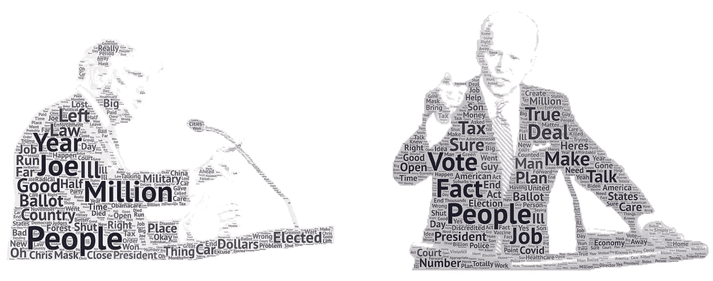
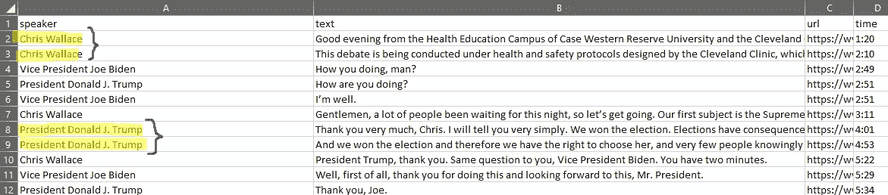
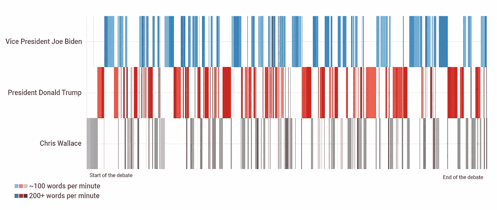
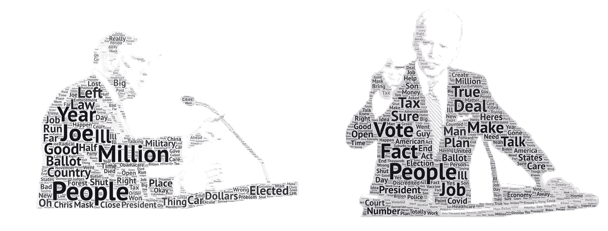
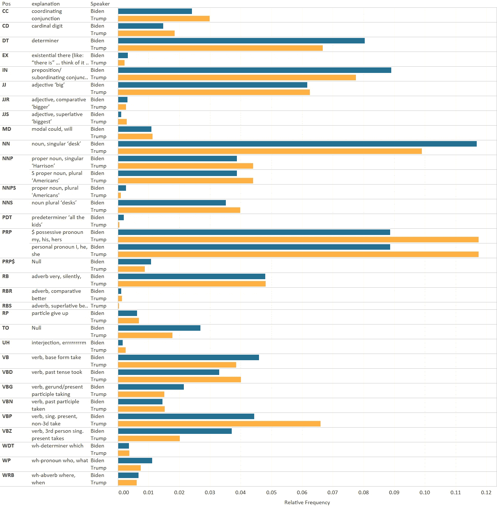

# 第一次总统辩论:按数字

> 原文：<https://towardsdatascience.com/1st-presidential-debate-by-the-numbers-dee50b35f4ac?source=collection_archive---------22----------------------->



作者图片

第一场辩论很乱。但就像今天的大多数新闻一样，随着下一个故事的出现，它无疑会褪色(例如 Trump 对 COVID 的检测呈阳性)。所以，在辩论退居幕后之前，让我们用一些数据科学和工具来尽快分析和可视化辩论吧！

与其他许多以数据科学为导向的文章不同，我将更多地关注快速而肮脏的数据处理、分析和可视化方法，因为在完全透明的情况下，尽管上面和下面的视觉效果可能看起来很有趣，并能吸引眼球，但它们并不令人难以置信地深刻，也没有讲述太多超越表面水平的故事。然而，文本数据本身是相当丰富的，我鼓励您自己进一步探索这些数据！[(我已经把数据上传到 Kaggle 这里了)。](https://www.kaggle.com/theogoe/first-pres-debate-2020)

# 当你时间很紧的时候该做什么

在我从事目前的工作之前，我在《国家杂志》工作，这是大西洋媒体(印刷和在线媒体公司)的政治/政策部门，我们的团队每天都会即时创建可视化效果。为了创造下面的视觉效果，这里有一些我推荐的技巧。


作者图片

> 第一个问题:数据里有故事吗？
> 
> 第二个问题:它容易争论吗？

当我观看辩论时，我首先想想象的是贯穿始终的打断次数。但是这容易争论吗？遗憾的是，没有。通过快速的谷歌搜索，我找到了一份来自 Rev.com 的辩论记录，似乎他们在停顿时将每位发言者的发言分开了。



文本抄本将单个发言分成多个片段。

换句话说，除了手动通读和连接这些重叠的区域，没有快速和可靠的方法来识别说话者是否打断了另一个人，被打断了，或者转录只是在搞笑。

事实上，如果我们不考虑前一位发言者是谁，只分析这些事件的发生频率，特朗普总统有 150 次，拜登副总统有 136 次——这一比例与现实相去甚远。下面是检查这一点的代码:

```
import pandas as pddf = pd.read_csv('debate_csv.csv')  # read in the csv# split into a list of words then count length of list
df['num_words'] = df['text'].str.split().str.len() # subset for only 8 words or less
df = df[df['num_words'] <= 8]# check count by speaker
d_count = df.groupby('speaker').count()
print(d_count)
```

# 使用 Excel

可以，用 Excel。对我来说，这是从 Rev 网站复制并粘贴原始转录的最快方式，并使用文本到列和 F5 ->选择空白->删除选定的行来创建数据集。

# 创建时间图

编码时可视化需要时间。因为我不容易分析我感兴趣的第一个故事角度，所以我决定想象每个演讲者发言的时间。

为了创建时间序列，我使用了[fluorescent Studio](https://flourish.studio/2020/07/16/heatmap-template/)。虽然我不是他们的免费层的最大粉丝，这要求你的所有数据集都是公开的…对于像这样的快速项目来说，当“新闻价值”溜走时，时间是至关重要的，这是一个很好的工具。(其他快速但有吸引力的 viz 工具还包括 [DataWrapper](https://www.datawrapper.de/) (与 fluid 相同的公共数据要求)和[Raw Graphs](https://rawgraphs.io/)——这是完全开源的，让你保持隐私，双赢)。

快速浏览了一下 fluorescent 的样本数据，我意识到我自己的数据的结构应该是一行= 1 秒，其中 X 轴是经过的秒数(连续变量)，Y 轴是说话者(分类变量)。在处理之前，辩论数据集对每个发言人有一行，一列是发言人开始讲话的分:秒。

```
import pandas as pddf = pd.read_csv('debate_csv.csv')  # read in the csv# function to convert the time to seconds
def time_to_sec(text):
    minsec = text.split(':')
    minutes = minsec[0]
    seconds = minsec[1]
    tseconds = (int(minutes) * 60) + int(seconds)
    return tseconds# convert timestamp (string) to seconds (int)
df['seconds'] = df['Time'].apply(time_to_sec)

# create multiple rows based on the number of seconds spoken# replace 0 seconds spoken with 1
df['seconds_spoken'] = df['seconds_spoken'].replace(0, 1)
# fill empty values
df['seconds_spoken'] = df['seconds_spoken'].fillna(1)
# now we can run repeat to create one row per second
df = df.loc[df.index.repeat(df.seconds_spoken)]# by resetting the index and making it a column
# we can have a column that increases +=1 seconds
df = df.reset_index(drop=True)
df['running_seconds'] = df.index# export this file
df.to_csv('export.csv')
```

在导入这个文件并设置轴之后，我们得到了最终的图表(我截屏了这个可视化，并使用 [Photopea](https://www.photopea.com/) (免费 Photoshop)添加了最后的润色，就像图例一样)。



作者图片

# 创造单词云

很明显，我会说我不是文字云的粉丝。他们不能有效地交流信息，而且用不讨人喜欢的调色板看起来很廉价。我的团队知道永远不要给我带来单词云。

话虽如此，但如果它们是为了吸引读者而恰当地创作出来的，它们并不是世界末日。

我使用了来自 [Shashank Kapadia](https://medium.com/u/cc7314ace45c?source=post_page-----dee50b35f4ac--------------------------------) 的关于主题建模的[数据科学文章](/end-to-end-topic-modeling-in-python-latent-dirichlet-allocation-lda-35ce4ed6b3e0)的代码，并对其进行了最小的编辑，以返回一个数据帧，其中包含最频繁使用的单词及其对应的每个说话者的频率。顺便说一句，我推荐他的文章，它全面而中肯，有助于我们新的数据科学实习生掌握 LDA。

在运行他的代码之前，我很快清理了文本，以确保 wordcloud 没有被冠词和介词占据。

```
# quick text cleaning
def remove_accented_chars(text):
    text = unidecode.unidecode(text)
    return textdef expand_contractions(text):
    text = list(cont.expand_texts([text], precise=True))[0]
    return textcustom_remove_string = ['a','and','its','it','did','going','want','know','look','said','got','just','think','crosstalk','say','tell','00','way','like','lot','does','let','happened','came','doing','000','47','seen','shall','are']def remove_custom_words(text):
    text = text.split()
    text = [w for w in text if w not in custom_remove_string]
    text = ' '.join(text)
    return text# run remove accented characters
df['text'] = df['text'].apply(remove_accented_chars)
# lowercase the text and remove punctuation
df['text'] = df['text'].str.lower().apply(lambda x: re.sub(r'[^\w\s]','',x))# run expand contractions and remove custom words
df['text'] = df['text'].apply(expand_contractions)
df['text'] = df['text'].apply(remove_custom_words)
```

虽然你可以使用 Python Wordcloud 库，但这个项目的目标是尽可能快地建立这些库，所以我在辩论中使用了[WordArt.com](https://wordart.com/)和特朗普总统和拜登副总统的相应字符串。



作者图片

# 词性分析

可视化的最后一部分是词性分析。

这是其中最快的一个，互联网上有很多关于如何做到这一点的资料。下面是我创建可视化数据集所需的所有代码。

```
from nltk.tag import pos_tag
from nltk.tokenize import word_tokenize
from collections import Counter# subset the data and create a string of the words used by Trump
trump = df[df['speaker'] == 'President Donald J. Trump '].text.tolist()
trump = " ".join(trump)# use nltk's libraries to determine pos
trump_text = pos_tag(word_tokenize(bid))count= Counter([j for i,j in pos_tag(word_tokenize(bid))])# determine relative usage of each part of speech
total = sum(count.values())
tcount = dict((word, float(co)/total) for word,co in count.items())# convert output to dataframe
tcount = pd.DataFrame(tcount.items())
```

然后，我将这个脚本的输出拖到 Tableau，并创建了一个快速图表(Tableau 对学生来说是[免费的一年](https://www.tableau.com/academic/students)，作为一个提醒)。我在 [preferences.tps 文件中设置了一个自定义调色板，而不是标准调色板。](https://help.tableau.com/current/pro/desktop/en-us/formatting_create_custom_colors.htm)然后我用[加入了词性输出文件，这个文件定义了每个词性缩写](https://pythonprogramming.net/part-of-speech-tagging-nltk-tutorial/)(复制/粘贴到 excel →文本到列)。



作者图片

# 外卖食品

如果你正在进行像这样的快速、探索性的数据可视化，要记住的最重要的事情之一是在触摸键盘之前设置你将追求的故事/叙述/假设问题。与此同时，设想最终产品可能是什么样子——不是根据您将要编写的代码，而是根据查看者将看到的内容。

这将最大限度地减少你最终要做的工作，因为每一步都变成了一个可以勾掉的复选框，而不是一个永无止境的数据探索阶段，这导致了 100 个视觉效果，其中没有一个足够有凝聚力来讲述一个令人信服的故事。

如果你是这个领域的初学者，当你想到分析数据的 101 种方法时，这种方法可以帮助减轻不知所措的感觉。如果你熟悉我用来制作这些视觉效果的标准 NLP 库和工具，这种“故事优先”的方法仍然有助于减少项目所需的时间。

作为参考，这个项目花了大约 2 个半小时完成——从谷歌搜索“2020 年辩论记录”到一起拍照(写这篇文章需要更长时间😂).

从所有这些分析中，一个实际的收获是特朗普总统使用的所有格代词的数量(例如，“我”“我的”“我的”“我们的”等)。当我看到那件事时，我笑了。

> **关于我:**Basil Labs 的创始人，Basil Labs 是一家大数据消费者智能初创公司，帮助组织量化消费者的去向和价值。
> 
> 热爱音乐，开放数据政策和数据科学。更多文章关注我[中](https://medium.com/@theo_goe)。
> 如果你对数据伦理、开放数据和/或音乐充满热情，请随时在 [Twitter](https://twitter.com/theo_goe) 上添加我。