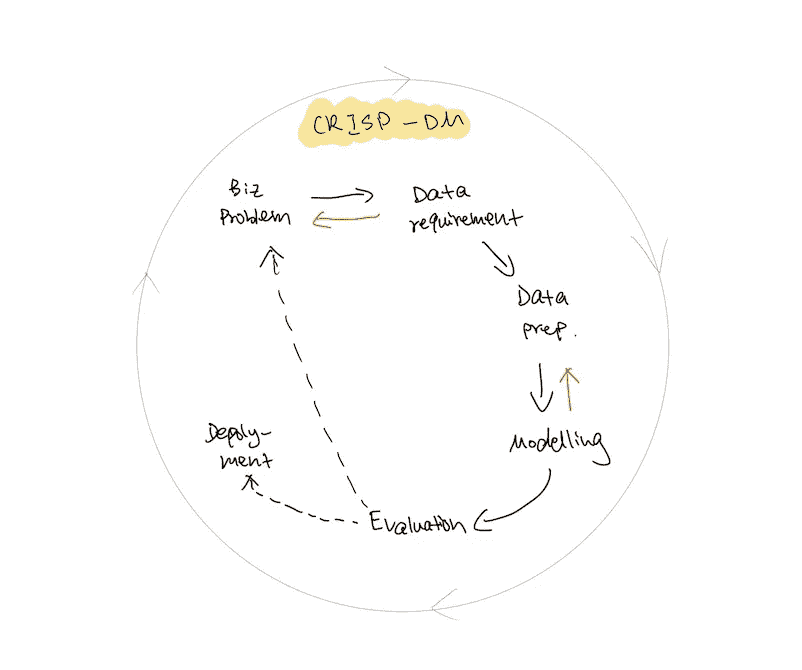
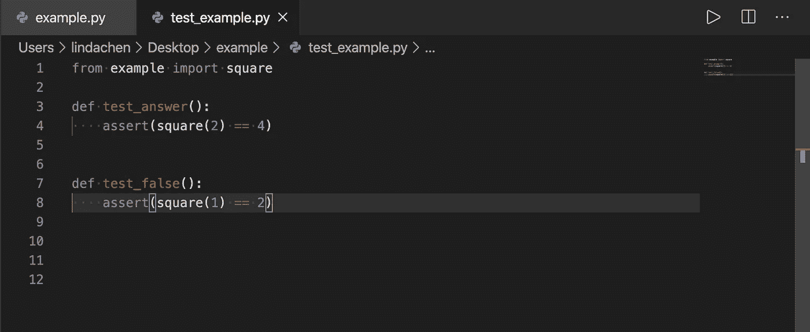
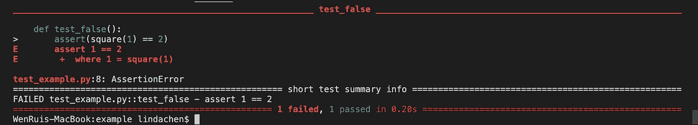

# 数据科学在线课程没有教给你的两件重要事情

> 原文：<https://towardsdatascience.com/2-crucial-things-that-data-science-online-courses-didnt-teach-you-2da0ae3267bd?source=collection_archive---------73----------------------->

## 艰难的教训，真正的秘诀

## 如果你的数据科学在线课程大纲看起来像…


蒂尔德·舒尔茨在 [Unsplash](https://unsplash.com?utm_source=medium&utm_medium=referral) 上的照片

## 简介:

如果你的数据科学在线课程大纲是这样的，那么你会发现这个博客很有帮助。

> SQL，Python →统计，数学→机器学习

我的第一个数据科学课程大纲看起来也和上面的一样。在广泛的求职和与许多人交谈后，我意识到这些技能不足以让我真正开始作为一名数据科学家工作。他们缺乏与现实的联系。

所以我创办了 Udacity 的数据科学纳米学位。它比在线课程要全面得多。我现在已经进行到一半了，我想分享一些我到目前为止学到的非常实用的东西。

1.  清爽的 DM 工艺
2.  测试您的代码和 TDD

## 清爽的 DM 工艺

CRISP DM 过程是一个通常用于指导数据挖掘过程的框架。这件事的好处是它很全面。它还包含了数据科学家需要的所有必要技能。



图 1

如图 1 所示，这个过程有六个步骤。

*   第一步:首先要理解你要解决的商业问题。作为一名商学院毕业生，我可以告诉你，这一步往往不像听起来那么简单
*   第二步:需要理解回答业务问题需要什么数据。如果我们无法访问这些数据，我们将需要重新审视业务问题并重新定义它。
*   第三步:在我们对两者都有了清晰的认识之后，就是数据角力的时候了！这可能需要…永远…
*   第四步:最后我们可以开始建模。
*   第五步:然后我们评估我们的模型，不仅通过它的准确性或 ROC 和 AUC，而且通过评估模型是否解决了我们的业务问题。如果没有，那么我们回去重新定义我们的业务问题，重新开始这个过程。
*   第六步:如果一切看起来不错，我们可以开始与工程团队合作，并将其投入生产！

标准数据科学课程的问题在于，它诱使你认为数据科学 70%是建模，30%是数据争论。

GIF via [GIPHY](https://media.giphy.com/media/hPPx8yk3Bmqys/giphy.gif)

事实是，可能只有 5%的建模，80%的数据争论，还有其他重要的组成部分。

这提醒我们，当我们寻找数据科学工作时，我们应该展示出我们具备所有六个步骤的技能，而不仅仅是这两个步骤。**例如，当我们通过分析公共数据集来构建我们的投资组合时，从陈述业务问题开始，而不是直接跳到 EDA。**

## 测试您的代码和 TDD

TDD 代表测试驱动开发。它不同于测试你的代码，因为 TDD 意味着你甚至在编写代码之前就要编写测试。下面我举个例子。对于软件工程师来说，这是一种常见的做法，但它在最近几年才开始融入数据科学。

大多数标准的在线课程甚至没有提到测试你的代码，更不用说 TDD 了。作为一个新手，这些术语对我来说听起来也很陌生，但下面是你必须知道它们的原因。

例如，您设计了一个模型来预测哪些客户可能会流失。然后工程团队把你的模型纳入公司的系统。现在，每次客户数据库更新后，客户经理都可以自动看到结果。意味着实实在在的影响！

对于将要投入生产的代码，您不希望您的代码仅仅因为有人输入了一些不同的客户数据而中断。您希望确保代码运行顺畅，并且已经考虑了所有可能发生的情况。为此，我们需要测试。


戴维·特拉维斯在 [Unsplash](https://unsplash.com?utm_source=medium&utm_medium=referral) 上拍摄的照片

下面是对测试的介绍:

## 基础—我们在标准在线课程中学到的内容:

```
def square(x):
    return x*xprint(square(2)) --> 4
```

问题:每次要测试，都需要重新打印这段代码。如果我需要运行许多测试，这是非常耗费人力的。此外，我需要手动检查结果是否与 4 匹配。换句话说，这个方法没有直接告诉我测试是通过了还是失败了。

## Pytest

Pytest 自动为您运行测试，并告诉您通过/失败。这是你开始使用它的方法。

```
$ pip install pytest
```

然后，您创建了一个包含测试函数文件的文件夹。这里的两个关键技巧是:

*   您的测试文件名必须以“test_”开头
*   您的测试函数名必须以“test_”开头

否则，Pytest 将不会运行任何测试。



注意我的文件名和函数名

确保您在包含您的测试文件的目录中。然后你只需要在终端输入“pytest”。

```
$ WenRuis-MacBook:example lindachen$ pytest
```

Pytest 自动运行所有的测试，并告诉您多少测试通过，多少测试失败，以及哪个测试失败。正如我们所料，我 1 次不及格，1 次及格。



在 Python 中我们还可以使用其他形式的测试。比如嘲弄和假设。如果你想进一步阅读，这里有一个很好的指南，介绍了所有的方法。我还在博客的末尾附上了额外的资源。

[](https://docs.python-guide.org/writing/tests/) [## 测试你的代码 Python 的搭便车指南

### 一些通用的测试规则:是 Python 标准库中包含电池的测试模块。它的 API 将是…

docs.python-guide.org](https://docs.python-guide.org/writing/tests/) 

## 那么 TDD 怎么样呢？

TDD 仅仅意味着我们在编写任何函数之前编写测试文件。所以我们所有的测试一开始都会“失败”,我们的工作就是编写能够通过所有测试的代码。虽然只是顺序上的不同，但在产量上却有很大的不同。原因如下:

1.  它迫使你在着手解决问题之前考虑问题的约束和界限。没有这一步，我们自己很容易不经过任何仔细的思考，就认为自己已经理解了问题。这里有一个很棒的博客谈到了这个问题！

[](https://medium.com/uk-hydrographic-office/test-driven-development-is-essential-for-good-data-science-heres-why-db7975a03a44) [## 测试驱动的开发对于好的数据科学是必不可少的。原因如下。

### 数据科学/分析有许多有趣的事情:

medium.com](https://medium.com/uk-hydrographic-office/test-driven-development-is-essential-for-good-data-science-heres-why-db7975a03a44) 

2.至少对我个人来说，在写代码之前写测试让我写出更好的测试。换句话说，在我写完代码后写测试，我很容易忘记考虑一些情况。

我认为这是因为在我们编写代码之后，我们的头脑已经被我们编写代码时的思维过程所束缚。跳出自己的框框是很难的。这也是为什么我们总是希望别人阅读我们的文章，因为我们很难做到这一点。我们需要一双新的眼睛。

我发现很多时候，在线课程就像一个食谱，只给你配料。它没有告诉你香料，你也需要带出香气或使菜肴更美味。


蒂尔德·舒尔茨在 [Unsplash](https://unsplash.com?utm_source=medium&utm_medium=referral) 上的照片

我希望我的博客有所帮助。下周，我想谈谈 ETL 管道。下周见！

其他资源:

*   [奈德·巴彻德开始测试](https://speakerdeck.com/pycon2014/getting-started-testing-by-ned-batchelder)
*   [数据科学出错的四种方式以及测试驱动的数据分析如何有所帮助](https://www.predictiveanalyticsworld.com/machinelearningtimes/four-ways-data-science-goes-wrong-and-how-test-driven-data-analysis-can-help/6947/)