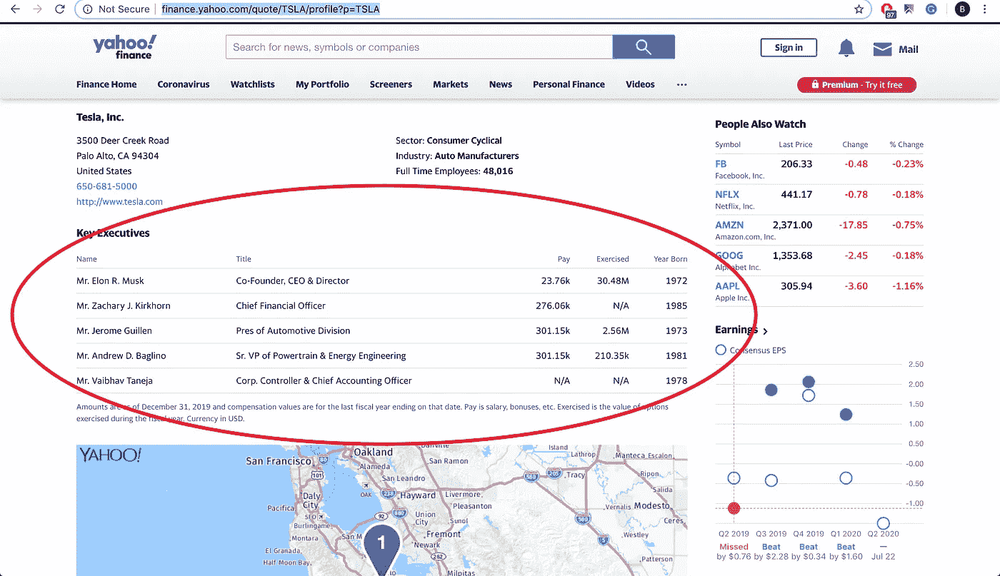
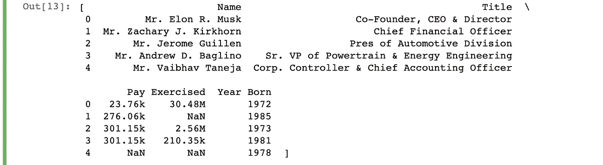
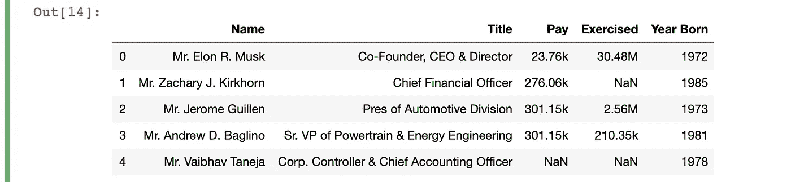
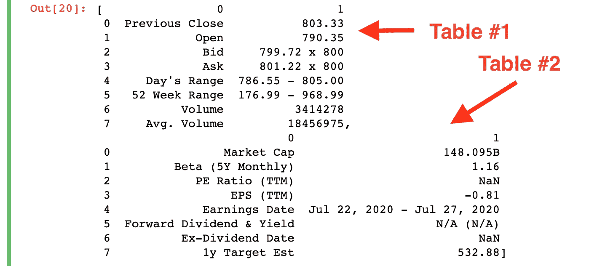
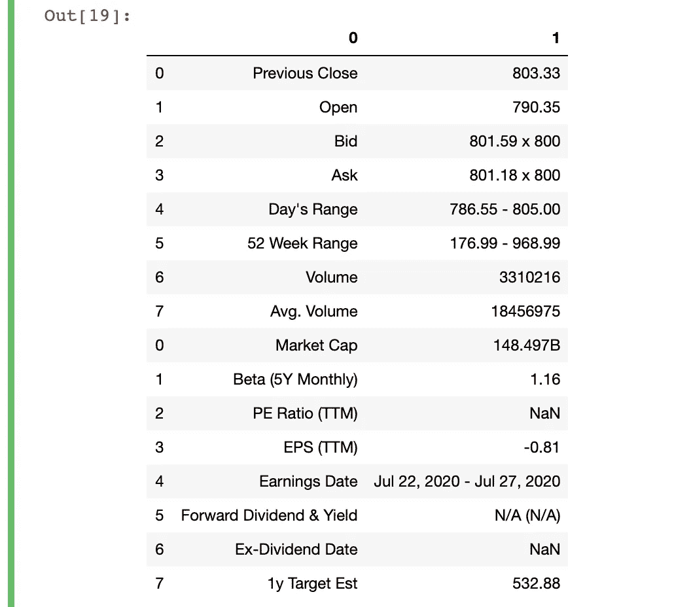
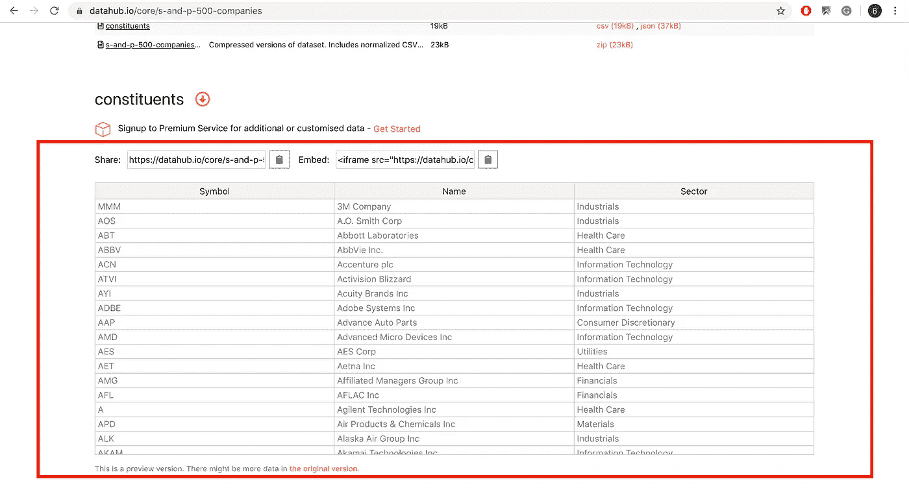
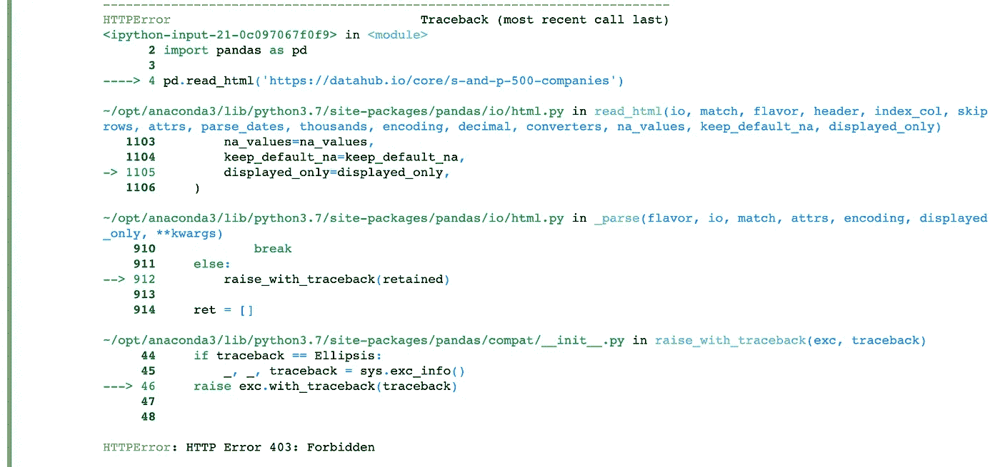
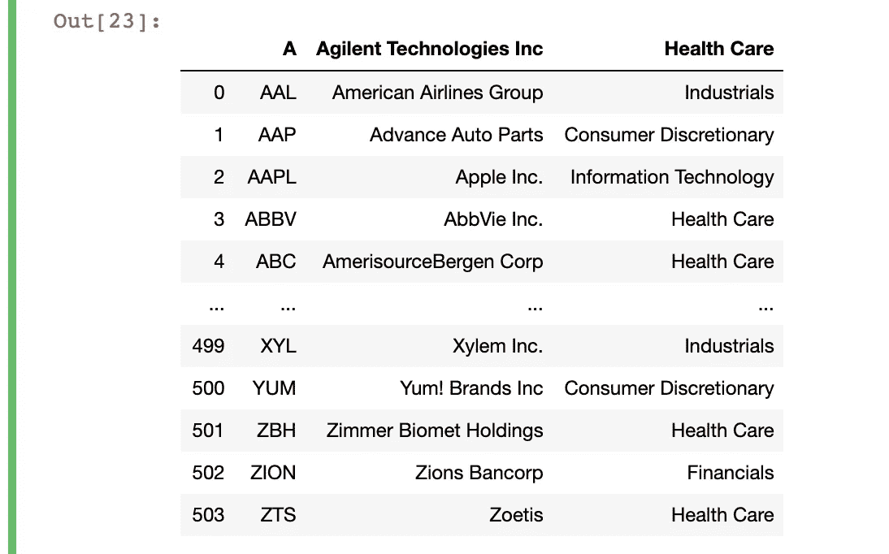

# 从有熊猫的网站上获取表格的两种简单方法

> 原文：<https://towardsdatascience.com/2-easy-ways-to-get-tables-from-a-website-with-pandas-b92fc835e741?source=collection_archive---------9----------------------->

## 大蟒

## pd.read_html 和 pd.read_clipboard 概述


图片由@ [siscadraws](https://www.instagram.com/siscadraws/) (Instagram)创建

**熊猫**图书馆因其易于使用的数据分析能力而闻名。它配备了先进的索引，数据帧连接和数据聚合功能。Pandas 还有一个全面的 I/O API ,你可以用它从各种来源输入数据，并以各种格式输出数据。

在很多情况下，您只需从网站上获取一个表格，用于您的分析。下面看看如何使用熊猫 read_html 和 read_clipboard 从网站上获取表格，只需几行代码。

*注意，在尝试下面的任何代码之前，不要忘记导入熊猫。*

```
import pandas as pd
```

# 1.pandas.read_html()

让我们试着在这个例子中得到这张与 Tesla 主要高管的表格:



雅虎财务表埃隆·马斯克和其他特斯拉高管的信息

read_html 函数有这样的描述:

> 将 HTML 表格读入到一个`*DataFrame*`对象的`*list*`中。

该函数在您提供的输入(URL)中搜索 HTML 相关标签。它总是返回一个**列表**，即使站点只有一个表。要使用该函数，您需要做的就是将您想要的站点的 URL 作为该函数的第一个参数。运行 Yahoo Finance 站点的函数如下所示:

```
pd.read_html('[https://finance.yahoo.com/quote/TSLA/profile?p=TSLA'](https://finance.yahoo.com/quote/TSLA/profile?p=TSLA'))
```



read_html 的原始输出

要从该列表中获取数据帧，您只需添加一项:

```
pd.read_html('[https://finance.yahoo.com/quote/TSLA/profile?p=TSLA')[0](https://finance.yahoo.com/quote/TSLA/profile?p=TSLA')[0)]
```

添加“[0]”将选择列表中的第一个元素。我们的列表中只有一个元素，它是 DataFrame 对象。运行这段代码会得到以下输出:



带有列表索引选择的 read_html 的输出

现在，让我们试着获取这个包含 Tesla 股票汇总统计数据的表格:


特斯拉股票的雅虎财务汇总表

我们将尝试与之前相同的代码:

```
pd.read_html('[https://finance.yahoo.com/quote/TSLA?p=TSLA'](https://finance.yahoo.com/quote/TSLA?p=TSLA'))
```



read_html #2 的原始输出

看起来我们得到了所有需要的数据，但是现在列表中有两个元素。这是因为我们在上面的截图中看到的表格在 HTML 源代码中被分成了两个不同的表格。我们可以像以前一样做同样的索引，但是如果你想把两个表合并成一个，你需要做的就是像这样**连接**两个列表元素:

```
separate = pd.read_html('[https://finance.yahoo.com/quote/TSLA?p=TSLA'](https://finance.yahoo.com/quote/TSLA?p=TSLA'))
pd.concat([separate[0],separate[1]])
```



read_html 中两个列表元素的 pd.concat 输出

您还可以做很多事情来处理这些数据进行分析——只需重命名列标题就是一个很好的开始。但是到这一步大约花了 12 秒，如果您只需要静态站点的测试数据，这是非常好的。

# 2.pandas.read_clipboard()

下面是我们可以尝试获得的标准普尔 500 公司信息表:



来自 datahub.io 的 S&P500 信息

数据是在 ODC 许可下分发的，这意味着它可以在网站上免费共享、创建和改编数据。我最初打算将这个站点用于我的 read_html 示例，但是在我第三次运行这个函数之后，我遇到了一个错误。

```
pd.read_html('[https://datahub.io/core/s-and-p-500-companies'](https://datahub.io/core/s-and-p-500-companies'))
```



尝试读取 _html datahub.io 时出现 HTTP 403 错误

当您尝试访问一个网页，并且该网站成功理解您的请求，但不会授权它时，会发生 HTTP 403 错误。当您试图访问您无权访问的站点时，可能会发生这种情况。

在这种情况下，您可以从浏览器访问该站点，但该站点不允许您从脚本访问它。许多网站都有关于抓取“robots.txt”文件的规则，你可以通过在网站 URL 的顶级域名后添加“/robots.txt”找到该文件。例如，"https://facebook.com/robots.txt"就是脸书的。

为了避免这样的错误，您可能想将数据复制到 Excel 表中，然后用 pd.read_excel 函数加载该文件。

相反，熊猫提供了一个功能，允许你直接从你的剪贴板复制数据！read_clipboard 函数有这样的描述:

> 从剪贴板中读取文本并传递给 **read_csv**

如果您以前使用过 pandas，您可能使用过 pd.read_csv 来获取一个本地文件，以便在数据分析中使用。read_clipboard 函数只是获取您复制的文本，并将其视为 csv 文件。它将根据你复制的文本返回一个**数据帧**。

要从 datahub.io 获取标准普尔 500 表，请从浏览器中选择并复制该表，然后输入下面的代码。

```
pd.read_clipboard()
```



pd.read_clipboard 的输出

完美！我们有一个现成的数据框架，正如从网站上看到的一样！

你可以查看 [read_html](https://pandas.pydata.org/docs/reference/api/pandas.read_html.html) 和 [read_clipboard](https://pandas.pydata.org/docs/reference/api/pandas.read_clipboard.html#pandas.read_clipboard) 文档以获得更多信息。在那里，你会发现你可以用这些功能做更多的事情来定制你想要从网站输入数据的方式。

祝你 I/O 好运！