# 使用 Python 创建一个简单的“PhotoShop”

> 原文：<https://towardsdatascience.com/2-lines-of-python-code-to-edit-photos-187dc76a84c5?source=collection_archive---------21----------------------->


由 [veerasantinithi](https://pixabay.com/users/veerasantinithi-6722948/) 在 [Pixabay](https://pixabay.com/photos/holiday-travel-vacation-summer-2880261/) 上拍摄的照片

## 使用 PIL(枕头)获取图像 RGB，并使用 NumPy 进行修改

当我们想要编辑一张照片时，我们通常会拿出一些专业工具，如 PhotoShop。即使有很多更容易使用的工具，它们有相当多的功能可以满足我们的大部分需求，我们通常仍然需要下载、安装并花一点时间来学习如何使用它们。

然而，如果你是一名程序员，或者更好的 Python 开发者，用 Python 编辑你的照片可能会容易得多。或者，可能只是为了好玩，理解一个图像如何用数字表示，以及如何修改这些低级特征以达到高级需求，仍然是很酷的。

在本文中，我将演示如何使用 Python 中的两个库——PIL 和 NumPy——只用 2-3 行代码就实现了大多数基本的照片编辑功能。

# 准备


照片由 [geralt](https://pixabay.com/users/geralt-9301/) 在 [Pixabay](https://pixabay.com/photos/bulletin-board-stickies-post-it-3127287/) 上拍摄

我们不需要做任何准备，因为库枕内置在相对较新的 Python 中。另外，我相信如果你用 Python 编程，你的 Python 环境中必须有 NumPy，因为它是我们必须拥有的最基本的库之一。

我们需要做的就是导入这两个库。

```
from PIL import Image
import numpy as np
```

对于枕头库，我们只需要它的`Image`模块。还有，如果你不熟悉 Pillow，请注意我们导入的包`PIL`和它的库名不一样。这并不罕见，但要注意这一点。

然后，我们需要一张照片来编辑。这个星球上我最喜欢的地方之一是澳大利亚维多利亚大洋路上的十二使徒。所以，让我们用那里的一张照片。感谢网站 [Pixabay](https://pixabay.com/photos/apostles-great-ocean-road-2965525/) 上的 [JVAstudio](https://pixabay.com/users/JVAstudio-5369971/) ，我们有了这样一个神奇的。

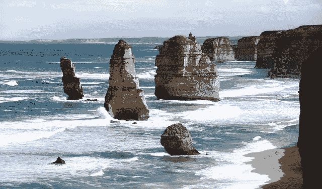

由 [JVAstudio](https://pixabay.com/users/JVAstudio-5369971/) 在 [Pixabay](https://pixabay.com/photos/apostles-great-ocean-road-2965525/) 上拍摄的照片

# RGB 值如何表示照片

我们现在有一张照片，所以我们可以很容易地使用 PIL 加载到内存中。

```
image = Image.open('apostles-2965525_640.jpg')
```

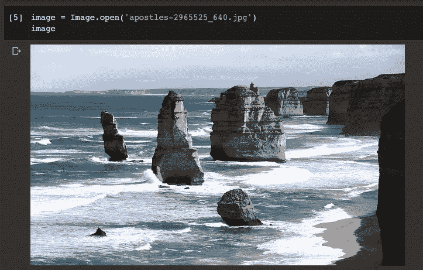

如果我们检查对象`image`的类型，它不是可以直接操作的东西。

```
type(image)
```

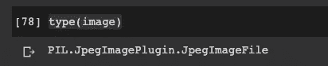

现在，我们可以使用 NumPy。下面，来自 PIL 的图像对象是一个 3D 数组。我们可以很容易地将其转换为 NumPy 数组。之后，因为它已经被转换成一个多维数组，我们可以检查它的形状

```
img_data = np.array(image)
img_data.shape
```

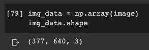

示出了图像具有 377 像素高、640 像素宽，并且 3 是分别为红色、绿色和蓝色(RGB)的通道。如果你有其他不同尺寸的照片，不要担心，我将在这篇文章中介绍的一切都是通用的。

我们可以打印第一个像素的值，这是左上角的一个，但有所有 3 个通道。

```
img_data[:1,:1,:]
```

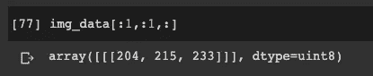

这意味着，对于第一个像素，我们有 204 个红色，215 个绿色和 233 个蓝色。它们是什么意思？用于表示像素的所有值必须在[0，255]的范围内。我们在每张照片中看到的颜色由三个值组成，它们组合成一种“颜色”(这里我们忽略代表透明度的 alpha，因为它与本文无关)。此外，较高的数字意味着该通道中的颜色较浅。换句话说，(255，255，255)是纯白的，(0，0，0)是纯黑的。因此，我们对左上角像素使用(204，215，233)是有意义的，因为它是天空的一部分，非常接近白色。

# 照片编辑

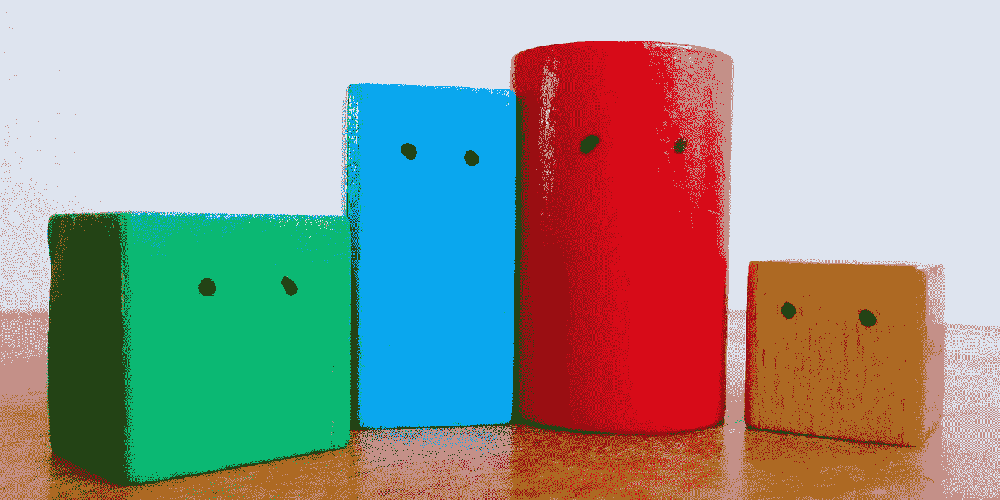

[辅导](https://pixabay.com/users/Counselling-440107/)在 [Pixabay](https://pixabay.com/photos/wooden-blocks-colorful-consulting-443728/) 上的照片

现在，让我们看看我们能做些什么来编辑照片！正如我们刚才解释的 RGB 值，所以我们可以分离通道，让照片用单一的元颜色表示。

## 颜色通道分离

还记得我们有 3 个通道作为数组的第三维吗？分离通道就像从第三维切割 3D 阵列一样简单。

为了确保我们的新照片只有一个通道的颜色，我们需要确保其他两个通道的所有值都为零。因此，我们需要用全零初始化一个 3D 数组，然后用原始照片的值更新相应的通道。

```
img_chn_red = np.zeros(img_data.shape, dtype='uint8')
img_chn_red[:,:,0] = img_data[:,:,0]
image_red = Image.fromarray(img_chn_red)
```

因为“RGB”红色先出现，所以我们需要对 3D 数组进行切片，以获得第一个通道的所有值。同样，使用明确的数据类型初始化零也很重要。否则，默认零是浮点类型，不支持用于生成图像。

结果是这样的。


同样，我们也可以分开绿色通道。只需将原始数组切片，获得第二个通道。

```
img_chn_green = np.zeros(img_data.shape, dtype='uint8')
img_chn_green[:,:,1] = img_data[:,:,1]
image_green = Image.fromarray(img_chn_green)
```

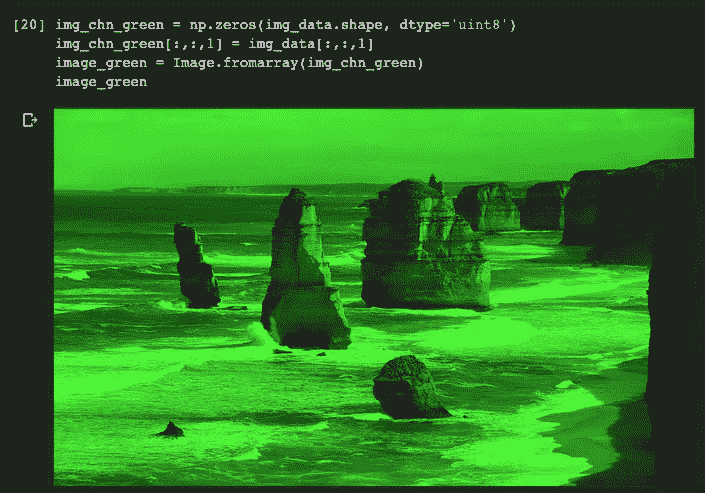

和蓝色通道。

```
img_chn_blue = np.zeros(img_data.shape, dtype='uint8')
img_chn_blue[:,:,2] = img_data[:,:,2]
image_blue = Image.fromarray(img_chn_blue)
```

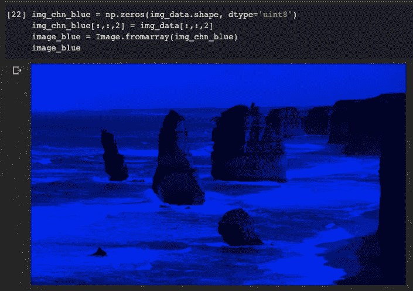

在本例中，我们完全过滤了数组，使其包含来自特定通道的值。想象一下，如果你在某个通道上应用一个系数，你也可以改变色温。

## 裁剪照片

我们已经得到了图像的数组，并且知道每个维度的含义。因此，很容易将图像裁剪到合适的大小。

在这种情况下，我们不想破坏颜色，所以我们应该保持第三维不变，并通过定义第一维(高度)和第二维(宽度)的范围来划分数组。

```
img_cropped_data = img_data[60:250, 200:500, :]
img_cropped = Image.fromarray(img_cropped_data)
```

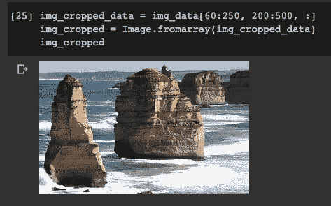

## 翻转照片

如果我们翻转 3D 阵列，那么我们就翻转照片。请注意，我们可以在第一个轴上翻转(上下颠倒)，或在第二个轴上翻转(左右翻转)，但我们不能在第三个轴上这样做，因为它会改变颜色。

```
img_flipped_data = np.flip(img_data, axis=1)
img_flipped = Image.fromarray(img_flipped_data)
```

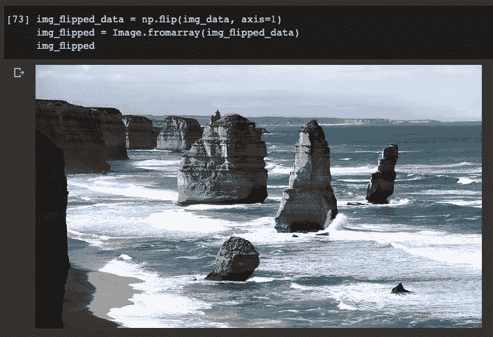

## 反转颜色

一旦我们知道数组中的每个值都在范围[0，255]内，我们就可以通过从 255 中减去每个值来反转颜色。使用 NumPy 广播功能非常容易做到这一点。

```
img_reversed_data = 255 - img_data
img_reversed = Image.fromarray(img_reversed_data)
```

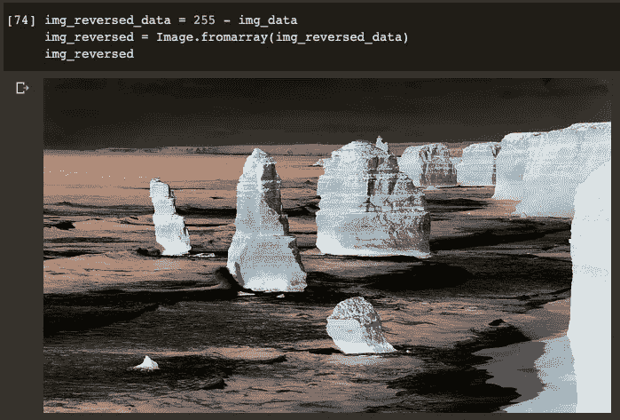

## 旋转照片

我用照片编辑软件的大部分时间都是旋转照片，相信你可能也一样:)这个也很容易，因为 NumPy 提供了旋转一个数组的功能。

```
img_rotated_data = np.rot90(img_data)
img_rotated = Image.fromarray(img_rotated_data)
```

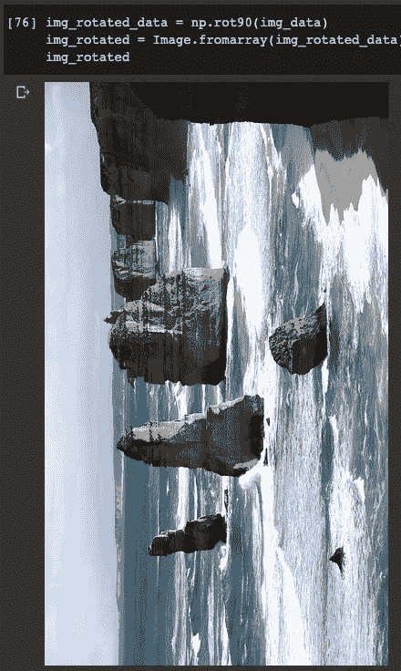

# 摘要


由[免费拍摄的照片](https://pixabay.com/users/Free-Photos-242387/)在 [Pixabay](https://pixabay.com/photos/writing-write-person-paperwork-828911/) 上

在本文中，我介绍了如何使用 Python 内置库 Pillow 将一张照片读入 NumPy 数组。然后，我们可以对这个多维 NumPy 数组做很多事情，实现很多不同类型的照片编辑功能。

当然，我们还可以对照片做更多的处理。所以，发挥你的创造力去发现更多很酷的编辑功能吧。从字面上看，我们可以用 NumPy 多维数组做什么，必须对应于一种类型的照片编辑。

本文使用的所有代码都可以在我的 Google Colab 笔记本中找到。

[](https://colab.research.google.com/drive/1AQsgj_B3FKhbT47uSeZc9MT3njIZtd1k?usp=sharing) [## 数字+ PIL 编辑图像

### 通道分离、颜色反转、图像裁剪、翻转和旋转

colab.research.google.com](https://colab.research.google.com/drive/1AQsgj_B3FKhbT47uSeZc9MT3njIZtd1k?usp=sharing) [](https://medium.com/@qiuyujx/membership) [## 通过我的推荐链接加入 Medium 克里斯托弗·陶

### 作为一个媒体会员，你的会员费的一部分会给你阅读的作家，你可以完全接触到每一个故事…

medium.com](https://medium.com/@qiuyujx/membership) 

**如果你觉得我的文章有帮助，请考虑加入灵媒会员来支持我和成千上万的其他作家！(点击上面的链接)**