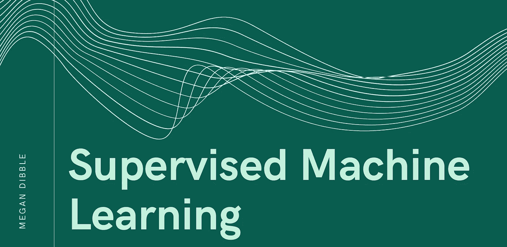
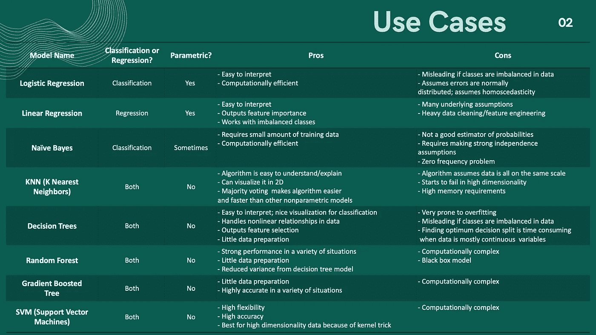
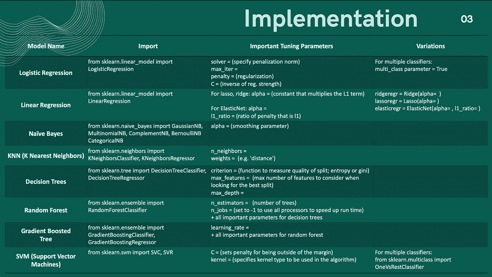

# 两个月的监督机器学习课程，包含在两个图表中

> 原文：<https://towardsdatascience.com/2-months-of-supervised-machine-learning-curriculum-in-2-charts-259970e38a63?source=collection_archive---------31----------------------->

这是我希望在数据科学训练营时拥有的参考表

我目前正在 Thinkful.com 参加一个数据科学训练营。到目前为止，我真的很喜欢它，但当我通过监督的机器学习单元时，我有时会被模型的数量(以及何时/如何使用每个模型)淹没。因此，在 [Thinkful](https://medium.com/u/7cc43c51dd38?source=post_page-----259970e38a63--------------------------------) 课程、Scikit-Learn 文档和我出色的数据科学导师( [Abdullah Karasan](https://medium.com/u/ce43a6fa0142?source=post_page-----259970e38a63--------------------------------) )的帮助下，我制作了这些摘要图表供我参考，也帮助其他人学习。

下面的第一个图表概述了何时使用各种机器学习模型。当然，还有更多的模型，但我试图涵盖所有的大模型。

在选择了要尝试的模型之后，我会不断地查阅过去的 Jupyter 笔记本或 scikit-learn 文档。因此，当您在 Python 中实现这些模型时，下面的图表是一个快速参考表。

添加一些交叉验证，matplotlib 可视化，然后嘭！你正在完成一个完整的项目。

当我有一些空闲时间时，我也在考虑制作一个“*你是哪个机器学习模型？”* BuzzFeed 风格的测验，适合我所有的数据科学爱好者，敬请关注。*

如果这些图表中有你不同意或想补充的内容，请在下面评论或给我发消息！感谢您的阅读，如果您发现这是一个有用的资源，请与您认识的正在学习数据科学的其他人分享。

*感谢 canva.com 为这些图片提供模板*

*编辑:我没有设计测验，但我写了一篇关于它的有趣的短文:

 [## 你是哪个机器学习模型？

### 对一些经典模型如何工作的轻松、诙谐、非科学的描述

towardsdatascience.com](/which-machine-learning-model-are-you-7ac635101d3b)