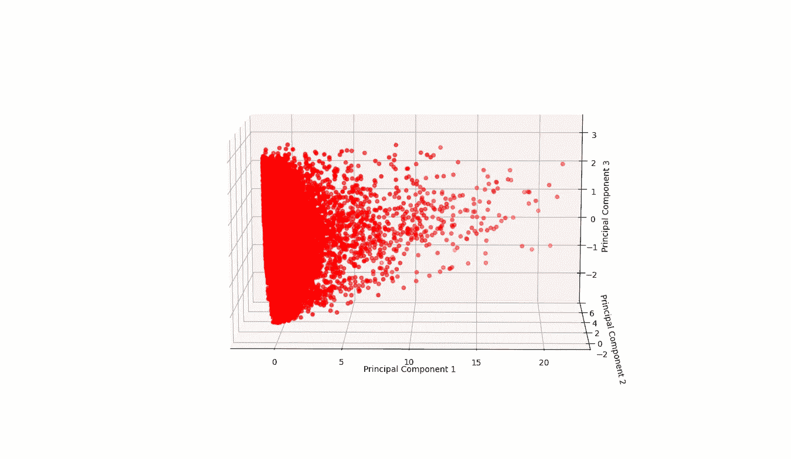
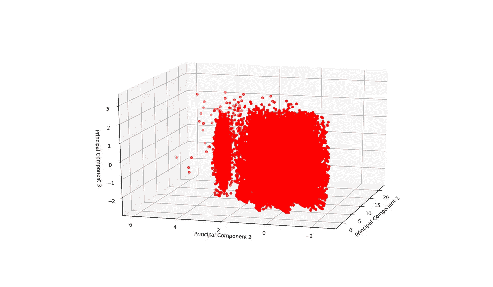
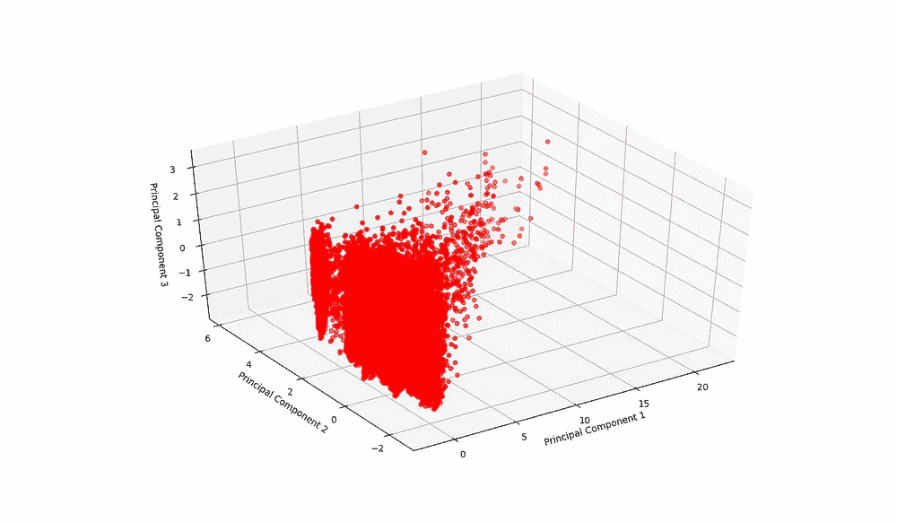

# 2-PCA 与 3-PCA

> 原文：<https://towardsdatascience.com/2-pca-vs-3-pca-1bb33dfc3a2b?source=collection_archive---------46----------------------->

## 拥有三个主成分比拥有两个主成分更有成效吗？

主成分分析用于减少数据集中的维度(特征)数量。比方说，我们的数据集中有 10 个维度/特征。基于一个假设(或胡乱猜测)放弃 7-8 个特性并不是一个明智的做法。解决这个问题的一种方法是特征选择技术(比如卡方检验)。特征选择技术帮助我们选择对应于目标特征的最重要的“k”个特征。但同样，这不会是所有功能的整体表示(相反，它只是从“n”个功能中选择的几个功能)。

为了解决这个问题，我们采用了主成分分析(PCA)降维技术。我们将拥有的主要组件将是数据集中所有特征的总体表示。通过这种方式，可以最大限度地减少信息损失。

现在我们已经理解了 PCA 的重要性，我们将更深入地检查拥有 3 个主成分并在三维图中绘制它们是否比拥有 2 个主成分的 PCA 和一个二维图更有成效？

为了简单起见，我没有展示我所使用的数据集，而是直接展示了我在数据集上使用 PCA 技术(n=3)获得的三个主要成分。

```
The Principal Components are as follows
       Principal component 1  Principal component 2  Principal component 3
0                  -0.593113               0.877027               1.782426
1                  -0.582788               0.926408               0.235875
2                  -0.593406               0.885406               1.026393
3                  -0.590781               0.913825               1.057599
4                  -0.557457               1.003013               0.771994
5                  -0.590091               0.892999               1.754761
6                  -0.532054               1.071892               0.614311
7                  -0.600141               0.873119               1.374094
8                  -0.604967               0.862305               1.689937
9                  -0.590725               0.910980               1.151600
10                 -0.571536               0.955599               1.269035
11                 -0.612102               0.921839               0.601810
12                 -0.638983               1.028594              -0.658701
13                 -0.538442               1.069557              -0.315858
14                 -0.545885               1.042621              -0.439177
15                 -0.213216              -1.068956               1.624847
16                 -0.585643               0.958585               0.566338
17                 -0.528046               1.081252               0.814836
18                 -0.586254               1.015987               0.560427
19                 -0.588309               0.893676               1.748155
20                 -0.545498               1.042484               0.044207
21                 -0.525951               1.099272              -0.239815
22                 -0.545391               1.036316               0.249829
23                 -0.553054               1.015097               1.361015
24                 -0.549921               1.043496              -0.028772
25                 -0.541706               1.044087               0.500173
26                 -0.580348               0.927584               0.693961
27                 -0.565069               0.983091              -0.060931
28                 -0.569777               0.958700               0.706427
29                 -0.572816               0.956895               0.263877
...                      ...                    ...                    ...
38991               4.154215               0.411276               2.074023
38992              -0.405145              -0.943906              -0.979199
38993              -0.294493              -0.724124               0.182590
38994               0.946546              -0.426986              -2.315427
38995               3.755563               0.385886              -2.343638
38996               1.362237              -0.325860               0.135436
38997               3.085934               0.127931               0.233758
38998               5.803189               0.739613              -0.598750
38999               4.126051               0.320192              -1.142892
39000               5.285017               0.732141              -2.113228
39001               4.235777               0.488489              -2.422174
39002               5.337110               0.681343              -1.865339
39003               2.046786              -0.255520               0.512485
39004               6.575937               1.052580               0.414128
39005              -0.549162              -0.773501              -0.453899
39006              -0.489873              -0.747580              -2.543332
39007              -0.403737              -0.943530              -0.979133
39008               5.632072               0.761396              -1.419298
39009               1.532861              -0.252514              -1.259331
39010               0.283742              -0.684903              -0.729878
39011              13.207580               2.725922               0.237523
39012              -0.558653              -0.799741              -0.618546
39013              -0.734531              -0.815442               0.755882
39014              -0.563215              -0.746943              -1.349881
39015              -0.600636              -0.858194              -1.319464
39016               1.536320              -0.299190              -0.164502
39017              -0.553627              -0.785324              -0.576759
39018              -0.554424              -0.957772              -0.897795
39019              -0.744299              -0.842957               0.631088
39020              -0.558107              -0.957167              -1.901427
```

你可以看到我有 39020 个元组。让我们也看看三个主要成分的方差比。

```
The Variance Ratios are
[0.24679625 0.16479195 0.15822251]
```

**让我们想象一下****你习惯于只有两个分量的主成分分析，而你的分析中没有第三个分量。这意味着在我们的场景中，您只有前两个主要组件。好吧！让我们画出前两个主要部分。**

****

**图 1，双组分五氯苯甲醚(由作者绘制)**

**考虑到在数据集中寻找聚类是我们的主要目标，那么我们可以从上面的图(图 1)中清楚地看到，没有明显的聚类出现。这意味着，双组分 PCA 现在未能满足我们的期望。**

**好吧，三组分主成分分析能完成吗？为什么要怀疑呢，现在让我们通过绘制所有三个组件来检查一下。**

****

**图 2，三组分五氯苯甲醚(角度 1)(作者绘制)**

**但是同样，我无法在图中找到任何这样的集群。我们现在要做的是尝试沿着所有三个轴旋转这些图，并尝试从中找到一些洞察力。**

********

**图 3，三组分五氯苯甲醚(角度 2 和 3)(作者绘制)**

**瞧啊。从上面的图(图 3)中，我可以得出结论，在我的数据集中有两个可能的集群。假设我的数据集是对学校学生的调查，主要谈论他们使用笔记本电脑和手机，那么很明显，我可以看到有两个独立的学生群体，我们现在可以继续进一步分析这一断言，即一个大的学生群体和一个小的学生群体出现在数据集中，前者或后者更习惯使用笔记本电脑或手机。**

**为什么三分量主成分分析比两分量主成分分析能给我们更多的启示？检查一下我们得到的方差比。仅考虑前两个因素时，比率合计约为 0.4 (40%)。也就是说，前两个部分加在一起只占全部数据的 40%。但是当我们把三个比例都加起来，大概在~0.55 左右(55%)。数据集要素整体表示的百分比明显更高。**

**总之，当两个方差比率的总和非常低，并且该图没有给我们任何洞察力时，那么使用第三个主成分是非常有效的。当甚至 3-PCA 都不能给我们洞察力时，那么考虑其他降维技术是一个更好的选择。在我的另一个分析中，仅使用第一个主成分(0.99 方差比)，可以从图中获得有意义的见解。(链接:[https://towards data science . com/an-insight-into-performance-fundamental-data-analysis-9c 67 c 62 e 0766](/an-insight-into-performing-fundamental-data-analysis-9c67c62e0766))。因此，方差比在确定我们用来绘图的主成分数时起着非常重要的作用。**

*****感谢您的宝贵时间！如果你喜欢这个故事，一定要和你的朋友分享。*****

*****可以在***[***LinkedIn***](https://www.linkedin.com/in/arunprasad98/)***上关注我。再次感谢您！*****