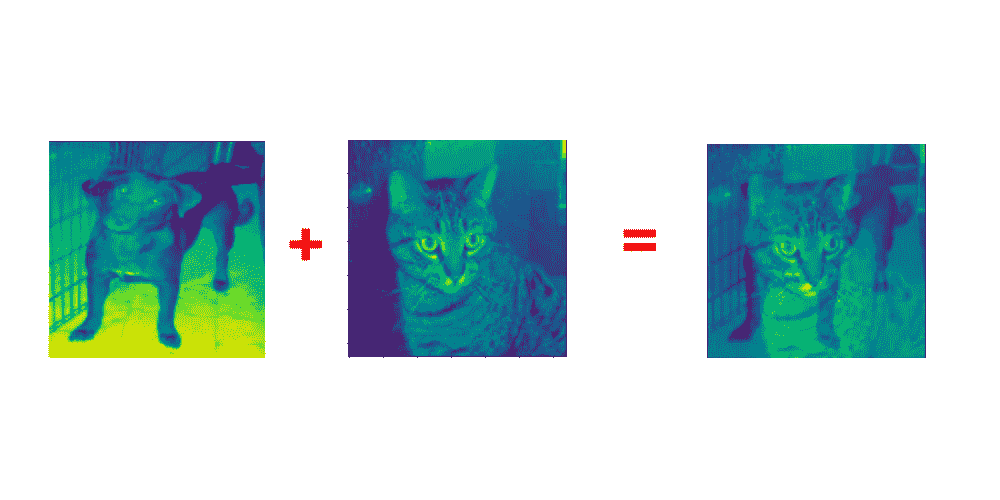
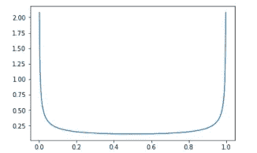

# 训练深度学习模型时使用 MixUp 增强的 2 个理由

> 原文：<https://towardsdatascience.com/2-reasons-to-use-mixup-when-training-yor-deep-learning-models-58728f15c559?source=collection_archive---------7----------------------->

## 为您的培训渠道增加新功能的绝佳机会！


[https://unsplash.com/photos/lvhu6dlFyLs](https://unsplash.com/photos/lvhu6dlFyLs)

## 介绍

早在 2018 年，在这篇[论文](https://arxiv.org/abs/1710.09412)中就介绍了 MixUp 的想法，并立即被许多 ML 研究人员引入管道。MixUp 的实现非常简单，但是它仍然可以为您的模型性能带来巨大的好处。

混合可以用这个简单的等式来表示:

```
newImage = alpha * image1 + (1-alpha) * image2
```

这张*新图片*只是你训练集中两张图片的简单混合，就这么简单！那么，*新图像*的目标值是什么呢？

```
newTarget = alpha * target1 + (1-alpha) * target2
```

这里重要的是，你并不总是需要[一个热编码](https://hackernoon.com/what-is-one-hot-encoding-why-and-when-do-you-have-to-use-it-e3c6186d008f)你的目标向量。如果你不做一个酒店编码，将需要自定义损失功能。我将在实现部分更深入地解释它。

这是混音增强的输出。在这种情况下，我将 alpha=0.3，并将狗和猫的图像混合在一起。



那么，如果你还没有在你的增强方法中使用它，你为什么要尝试这种混合的想法呢？

**1。正规化**

MixUp 非常擅长为计算机视觉任务正则化 ML 模型。正如创作者在这里所说的，你可以在单个 GPU 上训练 DNN 6 分钟，仍然可以在 CIFAR 10 数据集上获得 94%的准确率！此外，如果您使用 melspectrogram 这样的东西作为模型输入，您甚至可以将这种类型的增强嵌入到声音管道中。

**2。简单快速**

正如我在上面所说的，MixUp 概念很容易掌握，但是，你应该小心实现步骤，这将在下面描述。在速度方面，该方法的创造者在他们的实验中遇到了一些问题，但成功解决了，这使得这种增强类型真的很快。

## 混合实施

在真实世界场景中，MixUp 将编码如下:

1.  取一批训练数据。
2.  来自贝塔分布的样本混淆*阿尔法*值。(非常高的概率*α*接近 0 或 1)



3.打乱您的训练数据批次，以获得原始批次中图像的配对图像。

4.应用图像对的混合公式。

这个方法的创建者也提供了一个 PyTorch 兼容的回调和丢失，用于模型训练。

万一你想掌握你的 PyTorch 编码技巧(在创建回调、自定义损耗和自定义管道方面)，特别是计算机视觉应用，我强烈推荐[这本书](https://amzn.to/31BVAqc)开始你的旅程。这对我帮助很大。

## **总结**

我个人在任何可能的时候都使用并继续使用这个增强概念，并且在使用它的时候，我不断地得到模型性能的提升。希望你会发现这个概念对你自己也有帮助。