# 2020 年云原生开发的 20 个最佳 Visual Studio 代码扩展

> 原文：<https://towardsdatascience.com/20-best-visual-studio-code-extensions-for-cloud-native-development-in-2020-e0358e50ba87?source=collection_archive---------16----------------------->

## 借助这些 VS 代码扩展，改善您的云原生开发体验和生产力

托德·夸肯布什在 [Unsplash](/s/photos/tool?utm_source=unsplash&utm_medium=referral&utm_content=creditCopyText) 上的照片

> 在过去的几年里，我们看到了云原生软件开发的快速增长。根据 [**Canalis insights**](https://www.canalys.com/newsroom/worldwide-cloud-infrastructure-services-Q1-2020) 的数据，2020 年全球云服务在 Q1 实现了 34%的增长**。在后 COVID 时代，企业将会以更快的速度采用云计算。因此，无论您是否正在积极从事云原生项目，看看 2020 年的云原生开发都是一个不错的主意。**

作为一名软件工程师，我更喜欢使用现代的 IDE。最重要的是，**现代 IDE 帮助我专注于创造性的任务(例如，编码),并带走大量重复、乏味的任务**。此外，它们帮助我通过使用一个工具来保持我的注意力，并且**减少我大脑昂贵的上下文切换**。2016 年刚开始做 AWS 云的时候，我错过的一件事就是开发者体验，也就是缺乏 IDE 支持。如果我需要测试我的 Lambda 函数，唯一的方法就是部署在 AWS 上。

幸运的是，随着以 Azure 为首的云提供商越来越关注 IDE 对云原生开发的支持，事情在过去几年发生了巨大的变化。有几个优秀的 IDE，如 **VS Code、JetBrains IDE 或 AWS Cloud 9** ，它们提供了优秀的云原生开发者体验。

> 在这篇文章中，我将主要关注云原生开发的 VS 代码。

# 为什么 VS 代码

如果考虑软件开发的各个领域， **VS 代码是排名第一的开源免费 IDE** 。微软已经在 2015 年开发并发布了 VS 代码。由于其强大的功能和先进的开发人员体验，它很快就吸引了软件开发人员社区。2019 年**堆栈溢出开发者调查**将 VS 代码列为最受欢迎的 IDE:

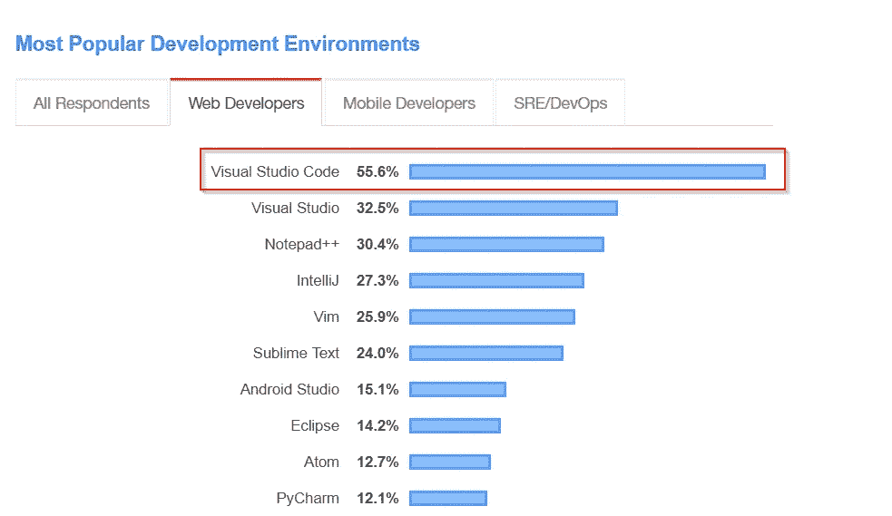

来源:[栈溢出开发者调查](https://insights.stackoverflow.com/survey/2019#development-environments-and-tools)

与其他强大的 IDE (Eclipse 或 IntelliJ IDEA)相比，VS 代码使用了更少的内存和 CPU。VS 代码还提供了额外的特性，比如通过扩展进行云原生开发。另一个重要因素是微软正在开发 VS 代码和 Azure 云服务。因此，VS 代码为 Azure 云开发提供了最佳的开发者体验。

> 这里我将列出 20 个优秀的云原生开发 VS 代码扩展，以及重要的云原生服务的 30000 英尺概述。

# 1.码头工人

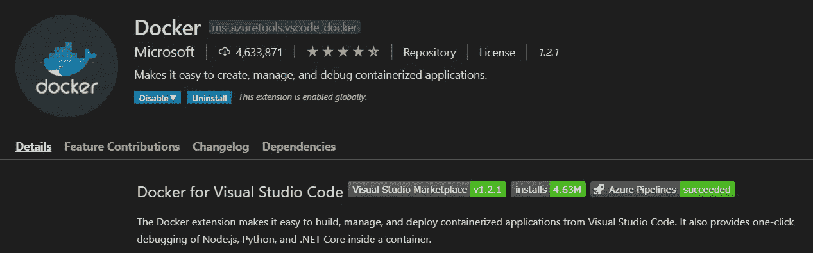

当 **Google** 在内部**使用容器技术时，Docker** 是第一个开源的颠覆性容器化技术，它彻底改变了软件交付/软件部署的格局。此外，容器化是云原生开发的支柱，Docker 是目前排名第一的容器技术。Docker 的另一个强大功能是，您可以使用几乎所有软件(如数据库、应用程序)的 dockered 版本，而无需直接安装它们，从而保持您的工作机器整洁。

Docker 为容器管理提供了强大的 CLI，例如安装容器、在容器中交付软件以及许多其他功能。如果您和我一样喜欢使用 UI 来管理容器，那么您可以使用 Docker 扩展来全面了解 Docker 环境，并可以通过 UI 执行所有的 Docker 操作。一旦我知道了这个扩展，我就很少使用 CLI 进行 Docker 操作。

## 链接:

 [## Docker — Visual Studio 市场

### Docker 扩展使得从 Visual Studio 代码构建、管理和部署容器化的应用程序变得容易。它…

marketplace.visualstudio.com](https://marketplace.visualstudio.com/items?itemName=ms-azuretools.vscode-docker) 

# 2.库伯内特斯

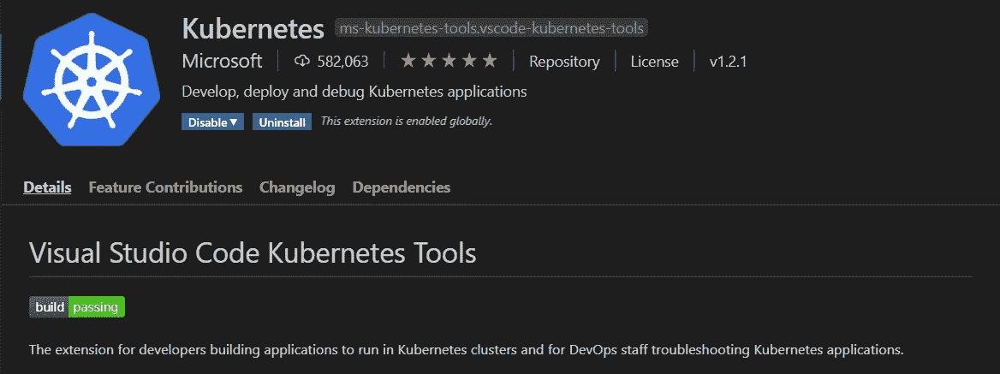

如果你认为 Docker 是云原生开发的核心组件，那么 **Kubernetes** 就是云原生开发的操作系统。简而言之，Kubernetes 就是容器编排和容器管理系统。最初，公共云市场由亚马逊 AWS 服务主导，该服务使用专有技术。Kubernetes 正在引领云原生计算再次开源，并得到所有主要公共云提供商的大力支持。

Kubernetes 还附带了一个 CLI，它提供 Kubernetes 集群的部署、运行和管理。Kubernetes VS Code extension 还提供了 Kubernetes 集群的 360 度视图，包括名称空间、节点、工作负载、网络、存储和配置。它还概述了注册的 Cloud Kubernetes 服务和连接的 Helm 存储库。

## 链接:

 [## Kubernetes — Visual Studio 市场

### 该扩展适用于开发人员构建在 Kubernetes 集群中运行的应用程序，也适用于 DevOps 人员的故障排除…

marketplace.visualstudio.com](https://marketplace.visualstudio.com/items?itemName=ms-kubernetes-tools.vscode-kubernetes-tools) 

# 3.AWS 工具包

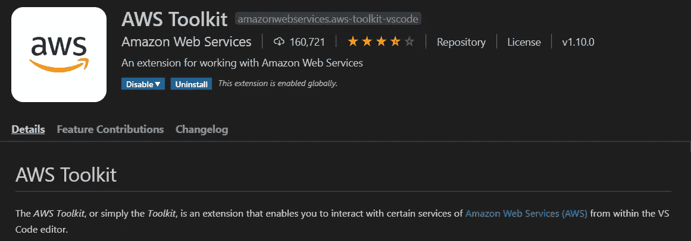

**亚马逊 AWS** 是目前最大的云提供商。随着 AWS 不断创新，它将在未来几年继续主导云原生环境。AWS 有自己基于浏览器的云原生 IDE [Cloud9](https://aws.amazon.com/cloud9/) ，为 AWS 开发提供了最好的开发体验。不幸的是，IDE 对于 AWS 开发来说是一个优秀的工具，但对于通用软件开发或多云开发来说却不是。

幸运的是，亚马逊还提供了一个 VS 扩展“AWS 工具包”，可以与许多 AWS 服务进行交互，并提供出色的开发者体验。它提供了每个区域的云形成、Lambda、阶跃函数和模式的简要概述。如果你使用 AWS CDK 开发，这个扩展给 CDK 浏览器。它还在 VS 代码命令面板中提供了 AWS 命令。如果您使用 AWS，这是一个必备的扩展。

## 链接:

 [## AWS 工具包— Visual Studio 市场

### AWS 工具包，或简称工具包，是一个扩展，使您能够与亚马逊的某些服务进行交互…

marketplace.visualstudio.com](https://marketplace.visualstudio.com/items?itemName=AmazonWebServices.aws-toolkit-vscode) 

# 4.节点的 AWS Lambda 样板代码片段。射流研究…

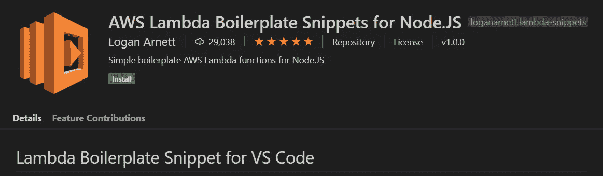

亚马逊通过引入 **AWS Lambda** 彻底改变了软件开发的格局。它引入了“无服务器”计算，开发人员只需编写代码，AWS 负责部署和扩展。此外，AWS Lambda 还推出了“按使用付费”原则，即用户仅在使用 AWS Lambda 时付费。虽然你可以用任何流行的编程语言写 Lambda，Node。JS 因其轻量级的特性和更快的启动时间而在这一领域非常受欢迎。

这段 VS 代码提供了许多片段，这样您就可以专注于编写实际的业务代码，而 VS 代码会处理单调的样板代码。

## 链接:

 [## 节点的 AWS Lambda 样板代码片段。JS — Visual Studio 市场

### Visual Studio 代码的扩展—节点的简单样板 AWS Lambda 函数。射流研究…

marketplace.visualstudio.com](https://marketplace.visualstudio.com/items?itemName=loganarnett.lambda-snippets) 

# 5.Azure 帐户

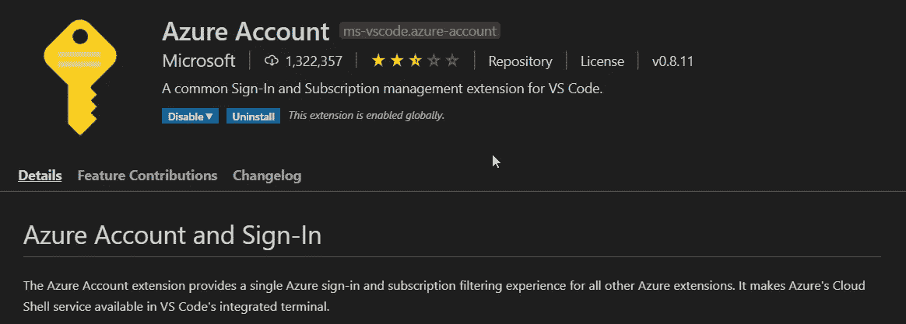

微软 Azure 是目前第二大公共云提供商，也是去年增长最快的云提供商。微软在其各种产品(例如，Visual Studio)中注重开发人员体验的历史由来已久。NET，VS 代码)。难怪微软非常重视通过在 VS 代码中实现各种云原生扩展来提供优秀的云原生开发体验。

Azure Account 是为所有 Azure VS 代码扩展提供单一 Azure 登录和订阅过滤的 VS 代码扩展。它在 Visual Studio 命令面板中添加了许多 Azure 登录和订阅命令。还在 VS Code 的集成终端中增加了 Azure 云壳服务。

## 链接:

 [## Azure 帐户— Visual Studio 市场

### Azure 帐户扩展为所有其他 Azure 提供了单一的 Azure 登录和订阅过滤体验…

marketplace.visualstudio.com](https://marketplace.visualstudio.com/items?itemName=ms-vscode.azure-account) 

# 6.Azure CLI 工具

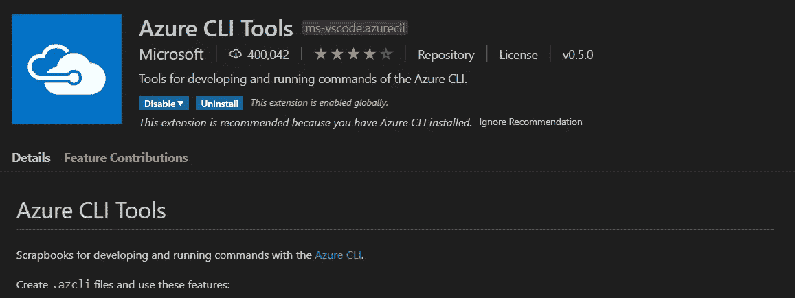

有时候，记住所有的 Azure CLI 命令会让人不知所措。因此，我习惯于将命令保存在一个单独的文本文件中。Azure CLI 工具扩展通过提供剪贴簿来开发和运行 Azure CLI 命令，使生活变得更加轻松。你只需要添加一个文件。azcli 扩展，这个扩展将帮助你使用 Azure CLI 完成几乎所有的功能。它提供了智能感知命令、命令片段、运行命令、显示命令文档等等。

## 链接:

 [## Azure CLI 工具— Visual Studio 市场

### 使用 Azure CLI 开发和运行命令的剪贴簿。创造。azcli 文件并使用这些功能…

marketplace.visualstudio.com](https://marketplace.visualstudio.com/items?itemName=ms-vscode.azurecli) 

# 7.蓝色仓库

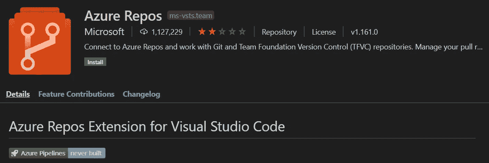

如果你使用的是 Azure DevOps，那么这个 VS 代码扩展会非常适合你。它提供了与 Azure DevOps 的连接，监控你的构建，管理 pull 请求，并与 Git 源代码库一起工作。如果您使用集中式 Team Foundation 版本控制，那么此扩展将有助于您使用它。

## 链接:

 [## Azure Repos — Visual Studio 市场

### 此扩展允许您连接到 Azure DevOps 服务和 Team Foundation Server，并为 Team…

marketplace.visualstudio.com](https://marketplace.visualstudio.com/items?itemName=ms-vsts.team) 

# 8.Azure 函数

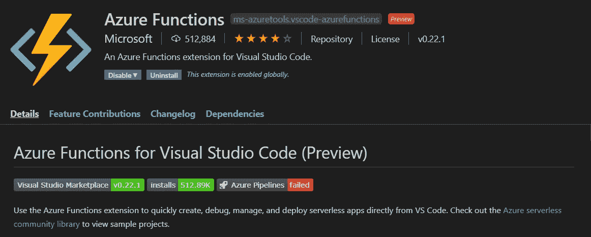

Azure Functions 是来自 AWS Lambda 等 Azure 云平台的无服务器或 FaaS 产品。这个 VS 代码扩展使开发者能够直接从 VS 代码中创建、调试、管理和部署 Azure 功能。如果你使用 Azure Cloud，这个扩展将为你节省大量的时间和精力。

## 链接:

 [## Azure 函数— Visual Studio 市场

### 使用 Azure Functions 扩展直接从 VS 代码快速创建、调试、管理和部署无服务器应用程序…

marketplace.visualstudio.com](https://marketplace.visualstudio.com/items?itemName=ms-azuretools.vscode-azurefunctions) 

# 9.Azure 应用服务

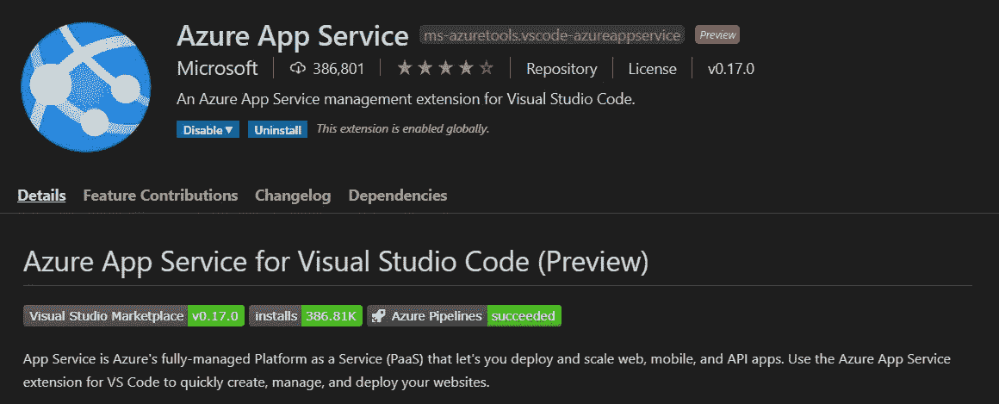

Azure App Service 是 Azure 的完全托管的 PaaS，用于构建、部署和扩展 web、移动和 API 应用。有了这个扩展，你可以在 Azure Cloud 上创建、管理和部署 Azure 应用。

## 链接:

 [## Azure 应用服务— Visual Studio 市场

### App Service 是 Azure 的完全托管的平台即服务(PaaS ),让您可以部署和扩展 web、移动和 API…

marketplace.visualstudio.com](https://marketplace.visualstudio.com/items?itemName=ms-azuretools.vscode-azureappservice) 

# 10.Azure 数据库

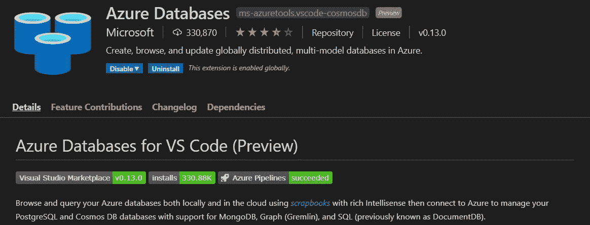

Azure 还提供了各种托管数据库: **Azure SQL 数据库，托管实例的 Azure 数据库，Azure Cosmos DB** 。它还提供了许多来自 Azure marketplace 的其他流行数据库，如 **Gremlin(图形数据库)、MongoDB(文档数据库)**。你可以对不同种类的数据库使用不同的工具，或者使用 Azure Databases 扩展，通过使用剪贴簿来管理和查询你的本地/云数据库。另外，这些扩展还提供了智能感知和特定于数据库的特性(例如，Graph for Gremlin)。

## 链接:

 [## Azure 数据库— Visual Studio 市场

### 使用具有丰富智能感知的剪贴簿，在本地和云中浏览和查询您的 Azure 数据库…

marketplace.visualstudio.com](https://marketplace.visualstudio.com/items?itemName=ms-azuretools.vscode-cosmosdb) 

# 11.Azure 资源管理器(ARM)工具

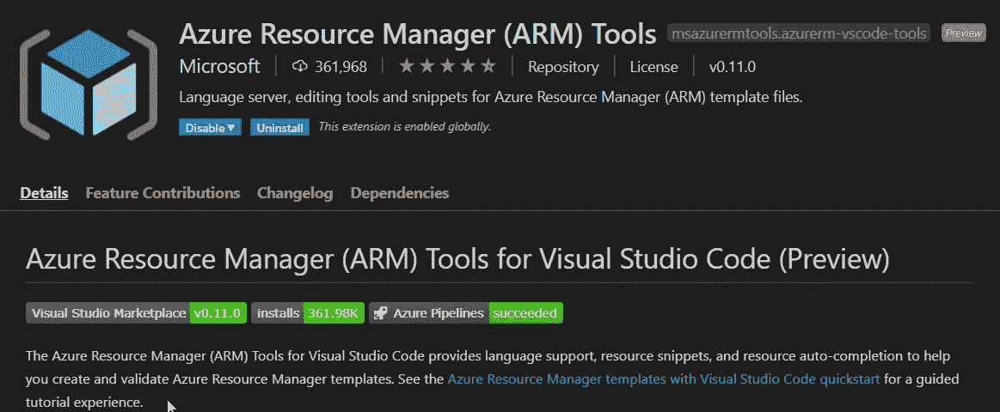

Azure Resouce Manager 是 Azure 上完全托管的“基础设施即代码”平台。这个 VS 代码扩展通过提供大量的功能，包括语言支持、代码片段、资源自动完成，使得使用 ARM 工具更加容易。因此，创建和验证 Azure 资源管理器模板对开发者有很大帮助。

## 链接:

 [## Azure 资源管理器(ARM)工具— Visual Studio 市场

### Azure Resource Manager(ARM)Tools for Visual Studio 代码提供了语言支持、资源片段和…

marketplace.visualstudio.com](https://marketplace.visualstudio.com/items?itemName=msazurermtools.azurerm-vscode-tools) 

# 12.Azure 存储

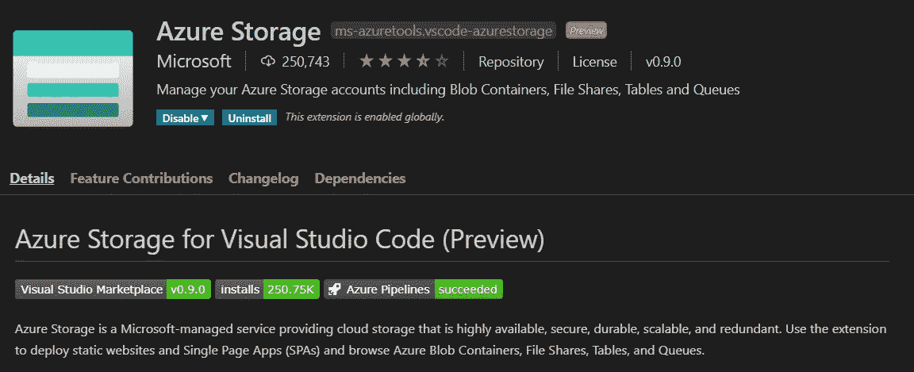

Azure 存储帐户是存储数据对象的托管集合:blobs、文件、队列、表和磁盘。通过这个 VS 代码扩展，你可以浏览 Azure Blob 容器、文件共享、表格和队列，并且可以直接将静态网站和单页面应用(spa)部署到 Azure Blob 中。

## 链接:

 [## Azure 存储— Visual Studio 市场

### Azure Storage 是微软管理的服务，提供高度可用、安全、持久的云存储…

marketplace.visualstudio.com](https://marketplace.visualstudio.com/items?itemName=ms-azuretools.vscode-azurestorage) 

# 13.云代码

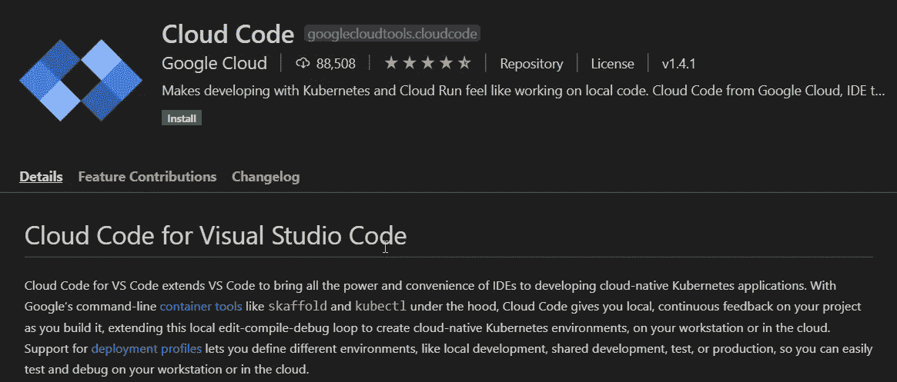

虽然**谷歌云平台(GCP)** 目前落后于 AWS 和 Azure，但它也提供一些优秀的云服务，尤其是在机器学习/AI 方面。如果你是一名学生或开发者，想要在云计算方面有一些实践经验，那么 **GCP 提供 12 个月的 300 美元免费信贷**。

GCP 还提供了一个 VS Code 扩展云代码，可以快速轻松地编写、运行和调试云原生应用。与 AWS 一样，与 Azure 不同，它也是一个伞状扩展，提供了许多功能。

它提供 Kubernetes 来管理本地 Kubernetes 集群或 GKE Kubernetes 集群。还提供了云跑来创建和部署云跑 App。最后但同样重要的是，它提供了云 API 来访问和启用所有 Google 云 API，在您的项目中添加云客户端库。如果你正在使用 GCP，这也是一个必须具备的扩展。

## 链接:

 [## 云代码— Visual Studio 市场

### 面向 VS Code 的云代码扩展了 VS Code，将 ide 的所有功能和便利用于开发云原生…

marketplace.visualstudio.com](https://marketplace.visualstudio.com/items?itemName=GoogleCloudTools.cloudcode) 

# 14.哈希公司地形

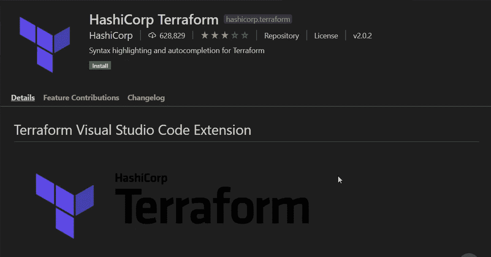

如果你在一个多云场景中工作，那么你可能已经使用过 **Terraform** 。尽管公共云提供商有自己的“**基础设施即代码**”服务，但您应该使用供应商中立的“基础设施即代码”来避免供应商锁定。由 **HashiCorp Inc.** 开发的 Terraform 是云计算环境中最流行的“基础设施代码”。

Terraform 有自己的配置语言来定义配置文件。这个 VS 代码扩展将帮助你有效地使用 Terraform 配置文件。它提供了语法高亮、快捷方式、右括号和引号。

## 链接:

 [## hashi corp terra form—Visual Studio 市场

### hashi corp Terraform Visual Studio Code(VS Code)扩展增加了语法突出显示和其他编辑功能，适用于…

marketplace.visualstudio.com](https://marketplace.visualstudio.com/items?itemName=HashiCorp.terraform) 

# 15.Cloudfoundry 清单 YML 支持

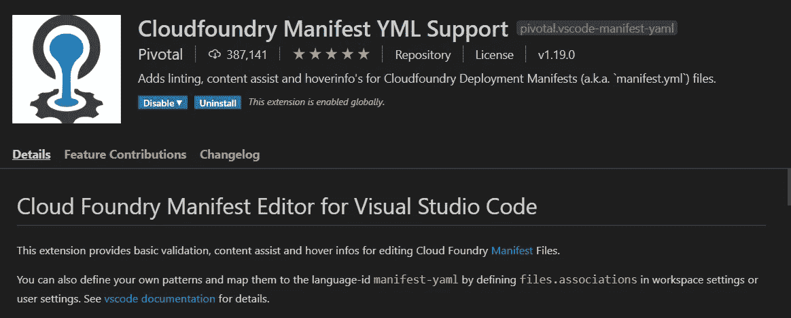

Kubernetes 是底层容器编排框架。但是在企业中，您将使用一些高级 PaaS 来管理您的 Kubernetes 集群。目前，用于管理 Kubernetes 的两个 PaaS 系统是流行的和广泛使用的: **Cloud Foundry 和 OpenShift** 。和其他很多云原生系统一样，Cloud Foundry 也使用 YML 进行配置。这个 VS 代码扩展为 Cloud Foundry 配置提供了一些必要的特性:验证、内容辅助、悬停信息。

## 链接:

 [## Cloudfoundry 清单 YML 支持— Visual Studio 市场

### 该扩展为编辑 Cloud Foundry 清单文件提供了基本的验证、内容帮助和悬停信息。你…

marketplace.visualstudio.com](https://marketplace.visualstudio.com/items?itemName=Pivotal.vscode-manifest-yaml) 

# 16.YAML

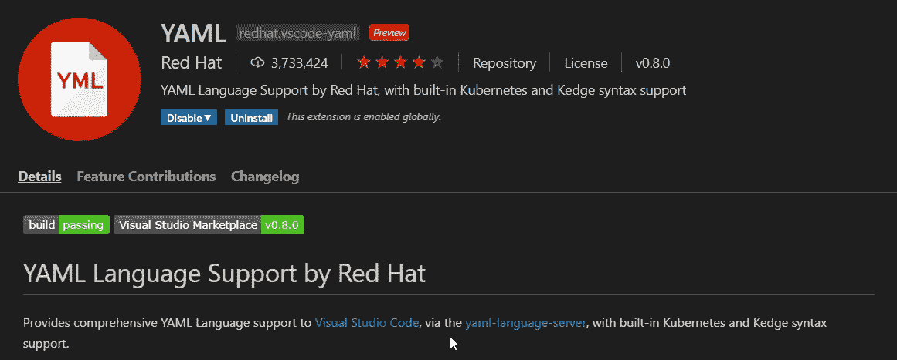

在云原生开发中，您必须处理 YAML 文件。无论您是编写 Docker compose 文件、Kubernetes 配置文件、Helm chart 还是公共云模板文件，YAML 无处不在。YAML 文件的一个警告是，它是空间敏感的。幸运的是，VS 代码有很好的扩展，使得使用 YAML 更加容易。它提供了代码自动完成、YAML 验证、自动格式化程序和许多其他功能。它还内置了对 Kubernetes 语法的支持。

## 链接:

 [## YAML — Visual Studio 市场

### 通过 yaml 语言服务器为 Visual Studio 代码提供全面的 YAML 语言支持，内置…

marketplace.visualstudio.com](https://marketplace.visualstudio.com/items?itemName=redhat.vscode-yaml) 

# 17.虚拟代码-图标

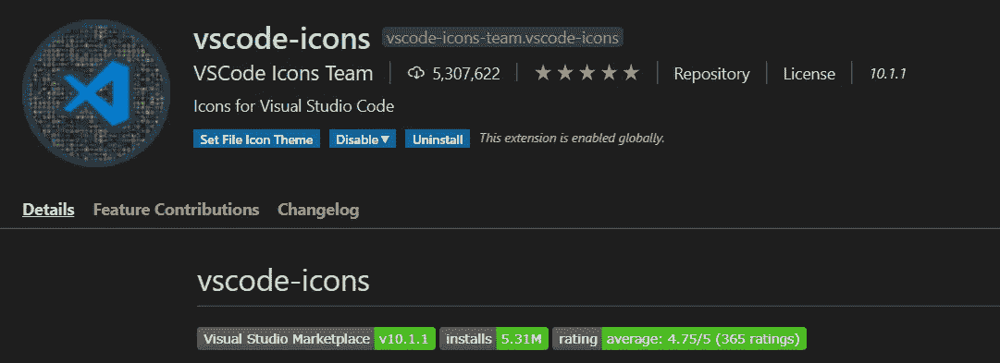

云原生开发意味着你必须处理不同类型的文件:特定于编程语言的文件、Docker 文件、各种 YAML 文件、JSON 文件以及许多其他类型的文件。你知道不同的文件类型可以有漂亮的图标吗？如果您安装了这个扩展，那么您就可以根据文件扩展名对不同的文件类型进行出色的可视化展示。530 万下载量，是必备的 VS 代码扩展之一。

# 链接:

 [## vscode-icons — Visual Studio 市场

### 将图标添加到您的 Visual Studio 代码中(支持的最低版本:1.31.1)要安装该扩展，只需执行…

marketplace.visualstudio.com](https://marketplace.visualstudio.com/items?itemName=vscode-icons-team.vscode-icons) 

# 18.吉特朗斯

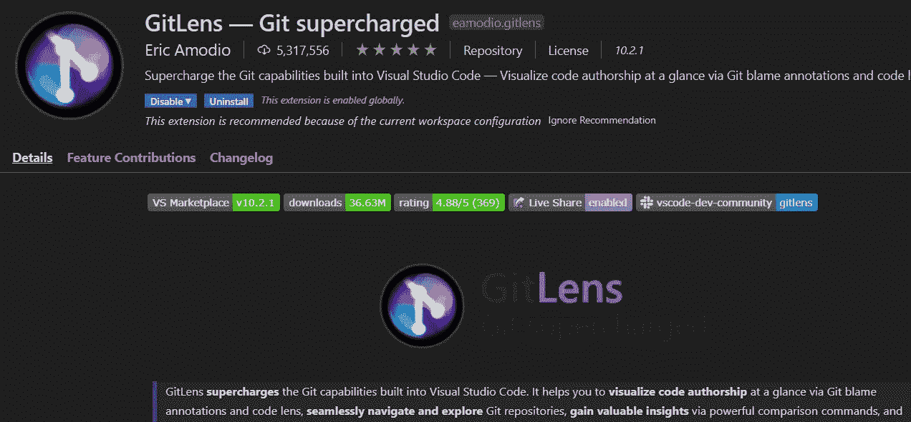

**Git** 无疑是现代软件开发中使用最多的 VCS 系统。不管你是为你的公司开发还是在你的私人项目中工作，你可能都在使用 Git。虽然 Git 提供了大量的命令集来执行任务，但我更喜欢 Git 的 UI。

市场上有一些优秀的 Git UI 工具(例如 SourceTree)，但是使用这些工具会引入上下文切换。GitLens 不仅在 VS 代码中提供了出色的 UI 支持，而且它还将 Git UI 功能提升到了一个新的水平。这个扩展提供了 Git 工作流的 360 度视图，并在一个小视图中提供了所有的 Git 功能。

# 链接:

 [## GitLens — Git 增压— Visual Studio 市场

### Visual Studio 代码扩展—增强内置于 Visual Studio 代码中的 Git 功能—可视化代码…

marketplace.visualstudio.com](https://marketplace.visualstudio.com/items?itemName=eamodio.gitlens) 

# 19.Visual Studio 智能代码

如果你正在使用 Gmail，你可能已经使用了人工智能辅助的邮件自动完成功能。我发现人工智能打字很有帮助，节省了我的时间。你知道 VS 代码里也有 AI 辅助的代码自动完成扩展吗？有了 **Visual Studio IntelliCode** 扩展，你可以拥有许多重要编程语言(例如，TypeScript/JavaScript、Python、Java)的人工智能辅助开发特性。虽然有一些其他的人工智能辅助开发扩展，但我认为这是最好的。

# 链接:

 [## Visual Studio intelli code—Visual Studio 市场

### Visual Studio 代码的扩展—人工智能辅助开发

marketplace.visualstudio.com](https://marketplace.visualstudio.com/items?itemName=VisualStudioExptTeam.vscodeintellicode) 

# 20.代码运行程序

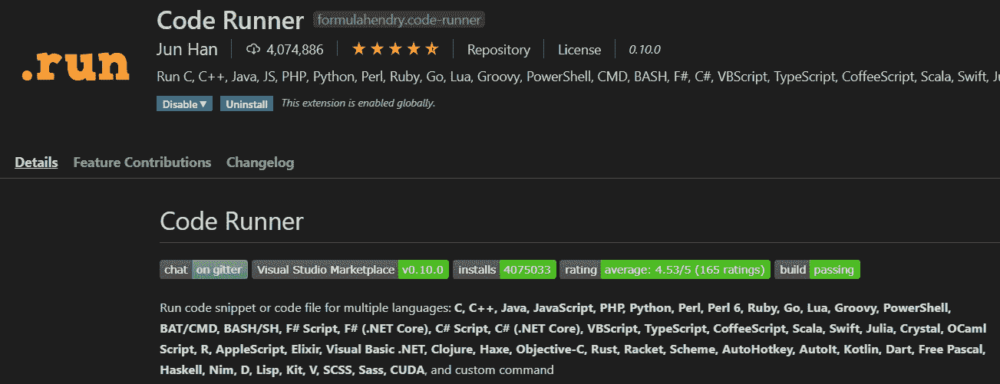

在您的云原生开发期间，您需要运行您的代码或代码片段。此外，您可能对特定的 Shell 有偏好。**这个 VS 代码扩展提供了在各种 shell 中运行几乎所有主流编程语言的代码或代码片段的可能性**。下载量超过 400 万，也是最受欢迎和必备的 VS 代码扩展之一。

# 链接:

 [## 代码运行器— Visual Studio 市场

### Visual Studio 代码扩展—运行 C、C++、Java、JS、PHP、Python、Perl、Ruby、Go、Lua、Groovy、PowerShell、CMD…

marketplace.visualstudio.com](https://marketplace.visualstudio.com/items?itemName=formulahendry.code-runner) 

# 类似文章:

 [## 2020 年高效 Web 开发的 20 个最佳代码扩展

### Visual Studio 代码扩展可以提高您的工作效率，并使编码变得更加有趣

towardsdatascience.com](/20-best-vs-code-extensions-for-productive-web-development-in-2020-95bf904ceb69)  [## 2020 年最受欢迎的 10 种编程语言

### 针对求职者和新开发人员的顶级编程语言的深入分析和排名

towardsdatascience.com](/top-10-in-demand-programming-languages-to-learn-in-2020-4462eb7d8d3e)  [## 关于 2020 年软件发展趋势的 20 个预测

### 云、容器、编程、数据库、深度学习、软件架构、Web、App、批处理、流、数据湖…

towardsdatascience.com](/20-predictions-about-software-development-trends-in-2020-afb8b110d9a0)