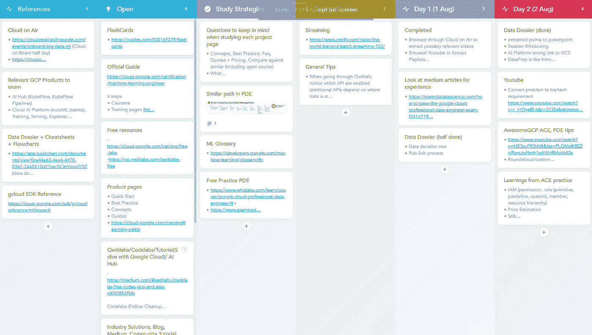

# 20 天谷歌云专业机器学习工程师考试(测试版)

> 原文：<https://towardsdatascience.com/20-days-to-google-cloud-professional-machine-learning-engineer-exam-beta-b48909499942?source=collection_archive---------2----------------------->

## 将自己投入深渊的旅程

威廉·费格森在 [Unsplash](https://unsplash.com?utm_source=medium&utm_medium=referral) 上拍摄的照片

**————————2020 年 10 月 15 日更新— — — — — — — —** 恭喜！你正式成为谷歌云认证的专业机器学习工程师。

我在 https://cloud . Google . com/certification/sample-questions/machine-learning-engineer
上尝试了一套新的 10 道样题，我认为它们比 70%的考试题都要难。
————**更新结束— — —**

2020 年 8 月 1 日，我查看了一周前显示“*我们有足够的 beta 测试者，注册已关闭*”的注册页面，发现它又出奇地活跃了。我查看了考试预约日历，看到最晚的日期是 2020 年 8 月 21 日，之后即使滚动到 2021 年 8 月也没有可用的时间。

GCP 考试通常推荐 3 年以上的行业经验，包括 1 年以上使用 GCP 设计和管理解决方案的经验，这些我都没有，但你只能试用一次，所以我接受了挑战，于是一个计划产生了:[https://www.meistertask.com/projects/2gpnfy1fmf/join/](https://www.meistertask.com/projects/2gpnfy1fmf/join/)

**如果您想进行编辑，请先导出项目，然后将您自己从原始项目中移除，然后将项目导入您自己的 MeisterTask 帐户。不要存档原件，因为它会影响我的副本和每个未来的读者。**

**你可以通过格式化卡片上的要点来为这个原创做出贡献。我的第一个版本被另一个读者删除了，这个重新导入的版本没有合适的项目符号。除了项目符号格式之外，请不要在此原件上添加任何其他编辑内容，如果您愿意，可以在自己的副本上进行编辑。**

我知道有时间一遍就看完所有的材料，所以注意力和效率是至关重要的，然后我发现用 PowerPoint 制作抽认卡，上面贴满我看过的材料的截图(大约 120 张),真的有助于记忆。[https://drive . Google . com/file/d/1 flg qfco 8 dctx-g 4 djl 7 kqyc 2s y1 mbt 6 w/view？usp =分享](https://drive.google.com/file/d/1fLGQfco8DcTx-g4djL7KQYc2SY1MbT6w/view?usp=sharing)

不幸的是，我没有完成 Coursera 上 Google Cloud 上 TensorFlow 推荐的机器学习，只浏览了大数据和机器学习基础知识，以及 Google Cloud Platform Specialization 上 TensorFlow 高级机器学习的前两门课程(它们涵盖了大部分必要内容)。然而，浏览所有其他推荐课程的幻灯片对考试非常有帮助(尤其是高级专业化认证中的第 5 门课程)。考试中涵盖的大量知识也来自谷歌的机器学习速成课程。

我的大部分备考小技巧已经收集在上面的 MeisterTask planner 里了，所以我会在考完试后分享一下我的想法。

# 第一部分:ML 问题框架

能够把问题中的外行语言翻译成机器学习术语，比如用什么样的算法解决什么现实生活中的问题。仔细看问题，不像只看标签类型那么直白。有些问题似乎完全是面向业务的，需要理解业务指标以及什么对客户有好处。

# 第 2 部分:ML 解决方案架构

IAM 和权限可能已经通过所提供的 MCQ 选项进行了隐式测试，所以请了解哪些 GCP 产品在一般的 IAM 之外具有额外的安全特性。了解在数据管道的每个阶段(接收、转换、存储、分析)可以使用什么产品。仔细阅读该公司目前的状况，不要选择重复该公司已经做过的事情或太远的事情。
了解 GPU 和 TPU 加速之间的差异，以及是什么让这两种选择都不可能或不可取，这样一旦你看到问题的关键点，选择就一目了然了。大致了解 KMS、CMEK、CSEK 是做什么的，以及它们是如何用于处理隐私要求的。

# 第 3 节:数据准备和处理

熟悉将建模要求转化为正确的特征工程步骤(散列、箱、交叉)，以及可重复的训练-测试-分割散列。在这一点上，MLCC([https://developers.google.com/machine-learning/crash-course](https://developers.google.com/machine-learning/crash-course))做得很彻底。应该比较和理解特征选择的统计方法。配额和限额通过显示管道中特定阶段的替代产品的选项进行隐性测试。了解数据流和云函数的常见用法会有所帮助。
了解 TFrecords 如何出现在数据管道中，以及涉及它们的一般 ML 流程，例如何时转换为 TF records，如何使用 TF records 进行训练-测试-拆分。能够识别数据泄漏和处理类不平衡(MLCC 涵盖这一点)

# 第 4 部分:ML 模型开发

了解 GCP 的建模工具(BQML，SparkMLlib，AutoML，ML API，AI Platform)的范围，以及它们将学习转化为完全自定义代码的无代码程度。建模速度和准确性是相互竞争的要求。了解数据/代码如何在 GCP ML 组件之间移动，并留意导入/导出快捷方式及其格式。
知道 AI 解释对什么类型的数据有什么样的解释。

# 第 5 部分:ML 管道自动化和流程编排

大多数问题的提问水平都比我预期的要高，所以用 Qwiklabs 运行 Kubeflow pipelines UI，查看示例代码以了解组件是如何连接的，并理解 TFX 与 Kubeflow 的区别就足够了。请注意，与 GCP 相比，有些事情可以在内部完成。了解如何快速构建 Kubeflow 管道。在没有灵活性但是快速的复制粘贴开发和完全的灵活性但是从零开始的耗时的开发之间总是有一个竞争的关注点。两者都不总是更好，这取决于公司在技能和产品方面的情况，以及他们当前使用或计划使用的基础设施和库，所以请阅读该问题。

# 第 6 部分:ML 解决方案监控、优化和维护

了解在开发过程中分析模型性能的工具。并持续评估模型在生产中的性能。管道简化技术将在 Google 云平台专业化的 TensorFlow 高级机器学习的第二个课程中介绍。

# 一般考试提示

有些问题很短，你可以在 5 秒钟内回答。有些时间燃烧者的选择比问题更长。通过仔细阅读需求和常识，一些选项是可以猜对的。理解问题想要什么，并选择做正确的事情，不多也不少。有些选项是其他选项的子集。有时，最佳答案不能满足问题的 100%要求，但其他选项甚至更错。有时最接近的答案表明你做了一些不受欢迎的事情来解决一个更重要的问题，所以有牺牲的成分。没有多少“勾选所有正确的”问题。有一些一般性的 python 问题和 Tensorflow 调试问题需要真正的实践经验，Qwiklabs 不会提供，因为它们只能教如何成功，而不能教如何失败。

首先阅读选项，形成一个从问题中寻找决策变量的心理决策树。“将 2 个决策变量上的 2 个选项置换成 4 个 MCQ 选项”的情况似乎很少，但主要是略有不同的选项，最多有 4 个选项全部正确，但仅满足 0–20%、50%、70%、90–100%有效性的要求。多部分选项的某些部分是重复的，因此没有必要在那里进行选择。一旦你分析了选项，问题的大部分可能是不相关的，所以继续阅读问题是浪费时间。过滤掉不相关的选项是有效的速度助推器。如果选项中的差异不明显，并且您必须阅读整个问题，请始终从公司当前状态的大画面开始，他们处于 SDLC 的哪个阶段。如果您知道问题是关于部署的，那么可以排除所有关于开发的选项。由多个部分组成的选项可能会让人们困惑，并使其变得更难，但这也意味着有更多的机会被淘汰，所以即使你不理解选项的所有部分，你也只需要找到一个部分，使整个选项出错。

如果时间允许，不仅要证明为什么你的选择是正确的，还要证明为什么所有其他的选择都没有在你的第一遍中通过。如果时间紧迫，证明选项错误比证明可能正确的选项符合所有需求更容易。我只剩下 24 分钟来复习 58/120，并且只复习了 20。

# 处理考试用户界面

问题是逐页加载的，每页上有 4 个按钮(后退、前进、查看全部、提交)。不要提交，直到所有的问题都完成并审查。评论页面将显示有多少人回答，并在您标记为评论的人旁边标上星号。有一个低门槛的标记审查(我有 58/120)，因为它花费了大量的时间反复点击后退按钮，并寻找一些你没有标记审查，但后来想。然而，如果你在中间意识到你没有 1 分钟的时间来复习，开始有一个更高的复习门槛，因为结尾有太多星号意味着你可以花时间复习你已经非常确定的东西，而不是那些真正需要复习的东西。“查看全部”页面只显示您的问题编号(带可选星号)和您的选择，根本没有问题预览文本，所以除非您有很好的记忆力，否则很难知道哪个编号对应哪个问题，所以您可能需要浏览所有星号。

在第一遍时，在每个问题下面的评论框中记下(不确定这个框是否只是测试版功能)为什么某些选项是错误的，这样当你回来复习时，你不会从零开始重新开始这个问题，并且可以立即思考可能正确的竞争选项。注释框的另一个用途是记录你不确定的概念。您可能会遇到未来的问题，通过在问题中给出答案来解决这种不确定性，例如什么工具一起使用，哪些工具调用哪些工具。谷歌有提供不存在的选项的历史，但如果你看到相同的选项/概念出现在不止一个问题中，这很可能是可能的。

不要连续点击两次后退按钮，以防止意外提交，因为第一次点击后，提交按钮将加载到光标的正下方。“后退”和“前进”大约需要 3-5 秒的时间来加载，此时计时器停止计时，因此您可以在页面加载时有更多的时间来思考。不要使用 shift 键输入大写字母，否则你会使用 Ctrl+C/X 或其他组合锁定你的考试(我被锁定了两次，幸运的是我在现场进行了锁定，所以监考人员会在那里解锁，不知道如果远程进行，它会如何工作)。

# 学习策略

**如果有时间**

先跟着推荐的课程走，再去上教程(在 https://cloud.google.com/docs/tutorials[上搜索 ai 平台](https://cloud.google.com/docs/tutorials)你就覆盖了 95%，剩下的是 GCS，PubSub，云函数，Bigquery)。这些课程涵盖了大部分考试内容。另一个好处是当你已经知道这些概念时，阅读教程将会把单个的工具和概念组织成一个完整的架构。然后，您可以使用来自工具的知识来询问以下问题:在此体系结构中，一个工具相对于另一个工具的性能如何，如何扩展其限制，它能否连接到另一个源/接收器，1 个工具的配额/限制如何影响管道中另一个工具的限制，哪里/哪些工具是常见的瓶颈，哪里很少是瓶颈，无服务器部分在哪里(2 种类型:可以配置与不需要配置)，以及哪些部分不是无服务器的。

在执行 Qwiklabs 时打开多个工具是有用的，例如始终保持虚拟机控制台页面打开，以了解您的 1-click GKE 集群部署实际上是在特定设置下默认供应 3 个虚拟机，或者您在 AI 平台笔记本中的“Open JupyterLab”单击已经在幕后供应了一个特定机器类型的虚拟机，或者当您执行一些 Qwiklabs 时自动运行的启动脚本已经在幕后设置了一些 git 克隆。保持 GCS 控制台打开也很重要，因为如此多的 GCP 人工智能工具依赖于桶。

**如果你没有时间**

立即阅读教程和文档(概述、最佳实践、常见问题)。这是一条更困难的道路，因为在浏览教程时会有许多未知的概念，它们可能太深入了，那种知识水平涵盖了< 10% of what’s tested. However, they serve as the fastest starting point for the learner to know the unknowns.

**了解 g cloud SDK** [【https://cloud.google.com/sdk/gcloud/reference】](https://cloud.google.com/sdk/gcloud/reference/ml/speech)
这是了解 Google 有什么以及它是如何命名的最快方法。展开每个部分以查看方法名称，您将了解哪些服务是可用的，而无需浏览 GCP 控制台 UI。此页面还会提醒您可能错过的文档页面，并帮助您解决测试要使用的正确命令的问题。

> "恐怕我太嫩了，不会去做的。"

乔纳森·博尔巴在 [Unsplash](https://unsplash.com?utm_source=medium&utm_medium=referral) 上的照片

第一天，我完全不知道考试指南中的 53/81 要点是什么意思，也不知道如何达到这些要点。在研究了 https://developers.google.com/machine-learning/crash-course 之后，我也意识到一些我认为我了解的 28/81，并不是它应该的样子。

由于这些原因，我认为没有必要拥有大量的 ML 知识。

1.  考试很少有实现/调试问题，主要集中在 GCP 工具选择和解决方案架构(有时开源工具作为选项，但通常 GCP 工具因无服务器可扩展性而胜出)。如果需要实施的话，我肯定不会尝试 20 天的学习。
2.  即使有人以前做过一些事情(例如处理不平衡的数据)，他也可能没有按照谷歌建议的方式去做。是的，这并不客观，而且确实有谷歌推荐的做法需要记忆。
3.  考试的很大一部分是关于 GCP 特定的工具、命令和工作流。如果有人不研究 GCP，他不会知道什么是可能的，或者开发，测试，部署，监控工作流是如何使用 GCP 工具完成的。知道如何在 GCP 之外做并不意味着这是正确的答案。在考试环境中，内部工具或在本地完成通常是错误的。
4.  让考试变得异常困难对谷歌不利。有足够经验的人不需要证书来证明什么。太难会阻碍人们为考试而学习，这意味着更少的 GCP 用户，更少的考试费，更少的开源公司雇佣这些考生，并在公司层面转向 GCP。

一些支持以往经验益处的论点:

1.  Dataflow 基于 Apache Beam，Airflow 上的 Cloud Composer，Kubeflow 上的 AI 平台 pipelines，所以如果你已经使用了开源版本，你可以更快地浏览教程中的代码，并知道为什么一些工具与多选中的另一个工具相比是多余的，显然是错误的选择。但是再次记住，实现很少被测试。更重要的是了解 GCP 特定的源和汇可用于数据流，以及 GCP 管道如何允许某些工作流/快捷方式，这可能是开源工具所无法实现的。
2.  阅读/经历更多的人可以更好地从给定的特性和模糊的需求中辨别出哪种业务度量适用于哪种情况，或者哪种 ML 问题可以被构建。然而，在常识接管之前，只有非常基本的 ML，技术术语是必需的。
3.  阅读/经历更多的人会知道做某事的更多方法或某事可能出错的更多方法及其负面影响，并使用这些知识来识别和推断当呈现一个场景时哪里出错了以及采取什么步骤来修复它。(例如，数据泄漏、不良的训练-测试-分割、训练-服务偏斜、拟合不足)。然而，知道解决方案是不够的，因为您还必须知道首先要尝试什么，这里又出现了 google 推荐的实践来学习。

作为最后的免责声明，如果没有以前的经验，任何人都不太可能在 20 天内通过这一关，这有助于回答调试问题，并对评估指标(如精度、召回率、F1、AUC)做出更快的反应，但这篇文章希望激励那些认为这可以做到的人。

如果你还有任何问题或者想分享你的经验，请随时在 Linkedin 上联系我:[https://www.linkedin.com/in/hanqi91/](https://www.linkedin.com/in/hanqi91/)