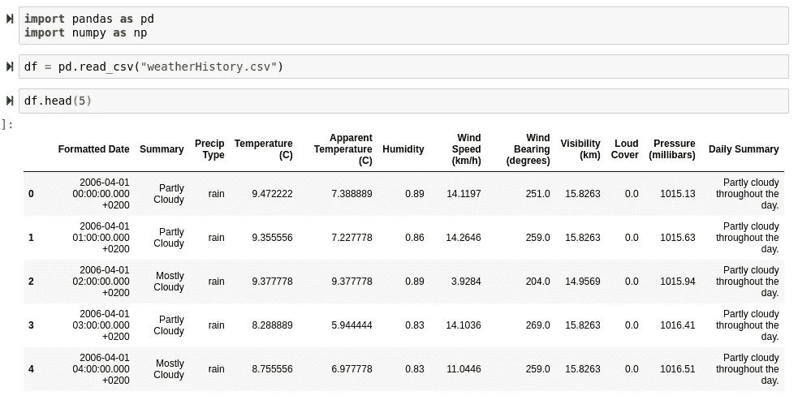
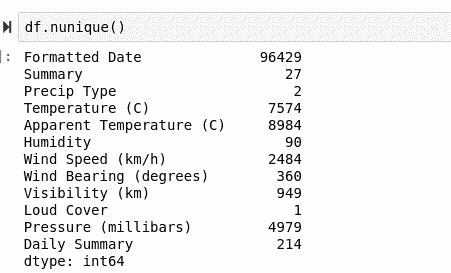
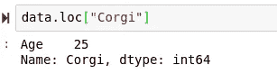

# 数据科学的 20 个大熊猫技巧

> 原文：<https://towardsdatascience.com/20-great-pandas-tricks-for-data-science-3a6daed71da0?source=collection_archive---------7----------------------->

## 你应该每天使用的 20 个大熊猫技巧


(图片由作者提供)

# 介绍

除非你是 Python 数据科学的新手，或者你的路由器上连接了某种设备来阻止所有与熊猫有关的传入数据包，否则你可能听说过熊猫。Pandas 是 Python 数据组织、清理和 IPython 显示的首选库，在过去 10 年中，它已经成为读取和处理数据的行业标准。在处理数据方面，Pandas 不仅在很大程度上满足并超出了所有人的预期，它还与 Numpy 紧密相连，并与 Numpy 合作得非常好——将它进一步整合到 Pythonic 数据科学包的奇妙生态系统中。

虽然 Pandas 很受欢迎，并且大多数使用 Python 的科学家都非常频繁地使用它，但它仍然是一个非常深入的库，具有许多特性。这些特性中有很多很容易被忽略，但是它们的价值却不能被夸大。幸运的是，今天我在 Pandas library 中整理了 20 个鲜为人知的特性，它们将帮助任何数据科学家掌握这个软件包！

> [笔记本](https://github.com/emmettgb/Emmetts-DS-NoteBooks/blob/master/Python3/20%20Pandas%20tricks.ipynb)

# 数据帧

数据框是熊猫图书馆的核心特征。尽管数据框本身就是一个强大的功能，但是如果没有强大的功能和操作，它们最终只是被美化了的字典。幸运的是，Pandas 为您提供了这些非常酷的方法来探索您的数据、清理您的数据和调整您的数据。对于以下所有示例，我将使用此数据框:



(图片由作者提供)

这些数据是早至 1910 年、晚至 2006 年的历史天气数据

## df.describe()

Pandas 中最被低估的功能之一是一个叫做 describe()的简单函数。对数据框使用 describe 函数会产生一个非常统计的结果，它会告诉您需要单独了解的每一列的值。这是了解给定列中大多数数据的位置的好方法，而不需要考虑平均值。了解了标准偏差、最小-最大值和平均值，也就很容易知道数据中的方差有多大。使用这个函数是一个非常好的方法，可以非常快速地获得每一列的以下所有统计数据:

*   意思是
*   数数
*   标准偏差
*   第一个四分位数
*   第二个四分位数(中位数)
*   第三四分位数
*   最小值
*   最大值

```
df.describe()
```


(图片由作者提供)

## df.groupby()

groupby()函数是一个很棒的函数，可用于根据分类值或数值的连续等级来重新组织您的观察值。该函数只是将相同或相似的值最接近地放在一起。

```
df.groupby(['Temperature (C)']).mean()
```


(图片由作者提供)

## df.stack()

stack 函数可用于返回具有更多最内层的数据框和序列类型。通过旋转数据框来创建新的最内层。第一个参数控制堆叠哪个或哪些层:

```
df.stack([0])
```


(图片由作者提供)

Stack 似乎并没有对这些数据做什么。这种功能只有在桌子主要是可旋转的时候才能感觉到。

## df.apply()

应用函数用于使用 Python 函数在整个数据框或系列类型中应用算术或逻辑代码。虽然这当然可以应用于数据框，但我只打算将其应用于系列，因为该数据框包含字符串和日期时间数据类型。

```
df["Temperature (C)"].apply(np.sqrt)
```


(图片由作者提供)

## df.info()

info 函数可用于数据框，以提供有关数据框的信息，这些信息通常与性能而非统计数据相关。如果您想要检查内存分配或数据框内每个系列的数据类型，这将非常有用。

```
df.info()
```


(图片由作者提供)

## df.query()

Query 是一个 Pandas 函数，允许在整个数据框中应用条件掩膜。query 和典型的条件掩码之间的唯一显著区别是，query 函数可以接受一个将被解释为条件语句的字符串，而条件掩码将使用布尔值屏蔽数据，然后返回为真的条件。

```
df.query('Humidity < .89')
```


(图片由作者提供)

## df.cumsum()

cumsum 函数可用于获取数据框和熊猫系列类型的累积和。这意味着数字将按降序相加，并在此过程中不断相加。

```
df.cumsum()
```


> 坏消息。

不幸的是，内核似乎已经死亡。因为我的 Jupyter 内核今天感觉特别情绪化，所以我会让她(她是女的)休息一下，而是只在一个系列上运行这个函数。


(图片由作者提供)

## 条件掩码

Pandas 库里面我最喜欢的特性之一是能够很容易地用条件屏蔽数据帧。虽然有办法用滤镜做到这一点！()方法在我最喜欢的语言中，朱莉娅，这是我真正想念的一件事，我希望能被带入语言中。首先，你需要提出一个条件，在这个例子中，我们将使用低于 14 级的风速。

```
our_mask = df["Wind Speed (km/h)"] < 14
```

接下来，我们将通过简单地设置一些与布尔相等的东西作为索引来应用这个掩码:

```
seconddf = df[our_mask]
```

现在我们的数据框不包含大于或等于 14:


(图片由作者提供)

## df.melt()

熔化与 pivot 函数相反，pivot 函数会将您的数据转换为横向格式。如果你想改变观察结果和特征，这是很有用的。但是，需要注意的是，在某些情况下，如果不提供参数或更改数据框的结构，效果可能不如预期。我正在处理的数据框就是一个很好的例子:

```
df = df.melt()
```


(图片由作者提供)

## df.explode()

你有没有因为某种原因碰到过类似这样的数据？：


(图片由作者提供)

除了与数据框上的 A 相对应的观测值之外，所有其他值都是具有单个整数的精确观测值。幸运的是，我们可以简单地在数据框上运行 explode 来纠正这一点。Explode 将“分解”数据框内的所有可迭代集合，并将它们放入单独的观测值中。

```
data.explode("B")
```


(图片由作者提供)

## df.nunique()

我们有一个包含许多类别的数据框架，我们希望找到一个分类问题的解决方案。唯一的问题是，我们不想使用一个容易过度拟合的模型，如果我们有这么少的类别，该模型最终会矫枉过正。这在数据科学家的典型日常生活中是很常见的场景。幸运的是，这个问题的解决方案非常简单——需要对所有唯一值进行计数。更幸运的是，Pandas 通过 nunique 函数让这一切变得异常简单！

```
df.nunique()
```



(图片由作者提供)

这将提供数据框中所有要素及其相应唯一值计数的综合列表。

## df.infer_objects()

在处理脏数据时，您可能会遇到的另一件事是最初被认为不是脏数据的类型。使用 df.infer_objects()是在数据框内更改这些数据类型的一个很好的潜在节省时间的方法。infer_objects 函数根据经验猜测每一列的数据类型，并将整个系列设置为该类型。

```
df.infer_objects()
```


(图片由作者提供)

## df.memory_usage()

内存使用是 return most 可能已经假定的一个函数。虽然我们使用 info()函数大致了解了数据框中的内存使用情况，但 memory_usage 要全面得多，它将允许我们找出哪些列消耗了大部分内存。

```
df.memory_usage()
```


(图片由作者提供)

## df.select_dtypes()

select_dtypes 函数可用于根据类型从数据框中提取某些列。一个很好的例子就是 apply，我们希望将 np.sqrt()应用于整个数据框，但是由于数据框中的字符串，我们只能对单个系列执行此操作。

```
df.select_dtypes(float).apply(np.sqrt)
```


(图片由作者提供)

## df.iterrows()

iterrows()函数是一个简单的生成器类型，它将生成一个新的迭代数组—每列一个。如果您需要将所有行压缩到一个可迭代对象中，这非常有用:

```
rowlist = df.iterrows()
```

现在我们可以迭代这个生成器:


(图片由作者提供)

## 压型

提到熊猫数据分析，就很难不谈到熊猫概况。尽管它需要另一个库，但它无疑是 Pythonic 数据科学家拥有的最好的工具之一，只需一个函数调用就可以快速浏览数据。你可以在这里查看:

[](https://github.com/pandas-profiling/pandas-profiling) [## 熊猫简介/熊猫简介

### 文档|松弛|堆栈溢出从 pandas 数据帧生成配置文件报告。熊猫 df.describe()…

github.com](https://github.com/pandas-profiling/pandas-profiling) 

为了使用它，只需调用

```
df.profile_report()
```

这将在一个方便的 HTML 传单中提供对您的数据的彻底检查，该传单易于理解并且与 IPython 完全兼容！

# 系列

Pandas 系列类型虽然可能不像数据框那样是 Pandas 的组成部分，但肯定有其重要性。与普通列表的功能相反，熊猫系列有很多不同的选项，这些选项在其他地方都不被支持。这些工具通常包括大多数数据科学家期望从 Python 中获得的典型生活质量工具。

## Series.isin()

isin 函数将返回一个条件掩码，如果序列中的给定观察值在它所调用的值列表内，该条件掩码将返回 true。例如，我们可以为我们的:PrecipType 列中的每个值是否为“rain”创建一个掩码:

```
df["Precip Type"].isin(["rain"])
```


(图片由作者提供)

## Series.where()

Where 将对给定的系列应用一个条件，并返回满足所述条件的值。where 函数几乎直接以该函数用途的 SQL 等价物命名。

```
df["Summary"].where(df["Summary"] != "Mostly Cloudy")
```


(图片由作者提供)

## Loc 和 ILoc 系列

如果您不熟悉 iloc 和 loc，那么您可能应该开始练习了——因为这两个非常重要！经验法则是`loc is used for labels`和`iloc is used for integer-based indexing.` 首先，让我们尝试在一个系列类型上使用 iloc，看看我们会得到什么回报。

```
df["Precip Type"].iloc[2]
```


(图片由作者提供)

我们在这里得到“rain”作为回报，因为它是我们的“Precip Type”列中的第二个索引。让我们再来看看数据帧头:


(图片由作者提供)

或者，我们可以使用 loc 而不是 iloc 来获取基于索引中标签的值。考虑以下数据帧:

```
data = pd.DataFrame({"Age": [25, 35,45]}, index = ["Corgi", "Maltese", "Pug"])
```


(图片由作者提供)

现在，我们可以对任何给定的索引调用 loc，并接收带有每个特性的整个观察集:

```
data.loc["Corgi"]
```



(图片由作者提供)

> 我现在才意识到 25 岁对一只狗来说太老了。

实际上，我不确定这将返回什么数据类型，所以我也很想知道这是什么类型:


(图片由作者提供)

> 谁能想到呢？

## Series.rank()

rank 函数可用于根据值在数据中相对于最小值和最大值的位置为值提供数值等级。这在一系列不同的原因中是有用的，但是在 Wilcox 秩和检验中可以看到秩的巨大应用，Wilcox 秩和检验是一种使用秩来返回概率的统计检验。

```
df["Humidity"].rank()
```


(图片由作者提供)

# 结论

不用说，Pandas 是一个管理和清理大型数据集的神奇库。熊猫让很多事情变得简单多了，坦白地说，这些事情在其他语言中很难。虽然有很多其他语言的伟大软件包试图完成类似的任务，但它们中的大多数让我怀念熊猫处理复杂问题的出色方式。

使用这些功能，几乎可以保证科学家可能遇到的大多数问题都能得到解决。虽然 Pandas 是一个非常深入的库，但总是有一个伟大的功能可以加快你的工作，让你更快地找到有趣的东西，这是很棒的！