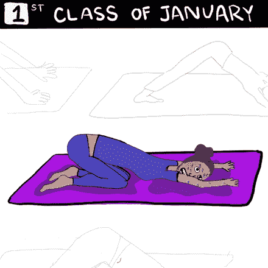
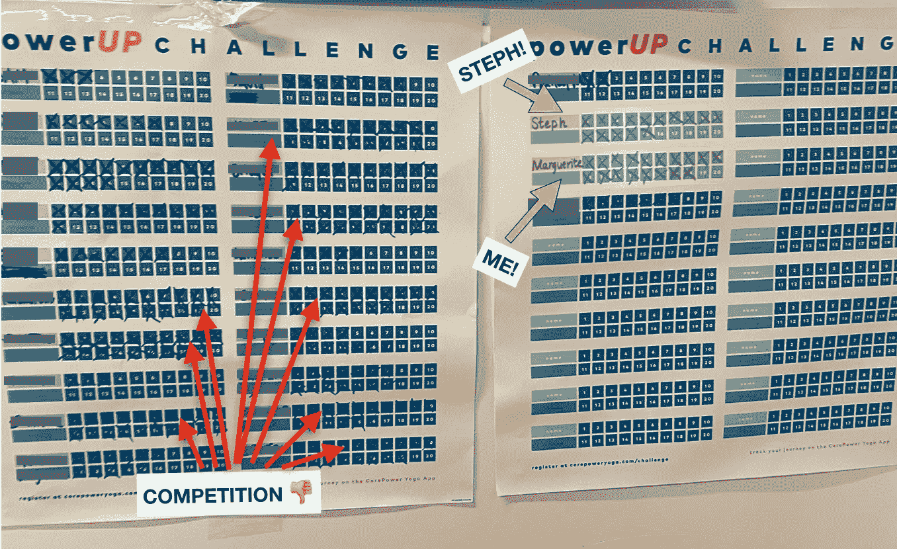
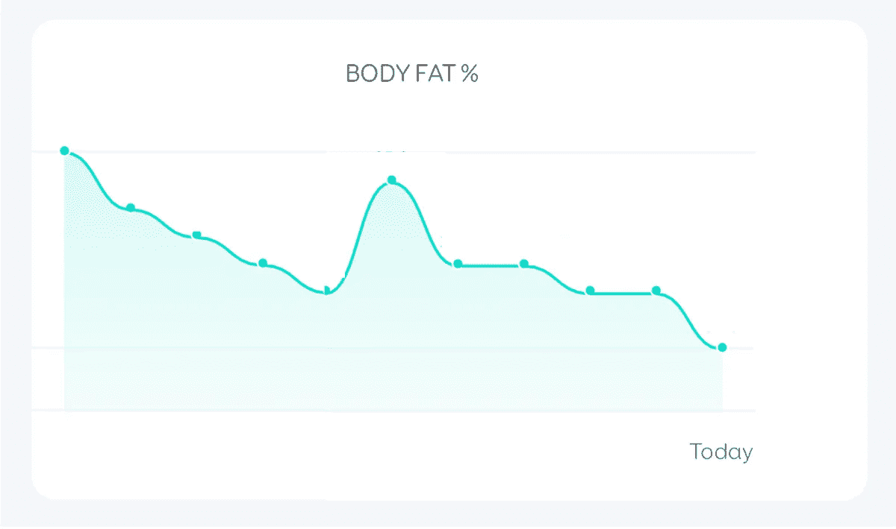
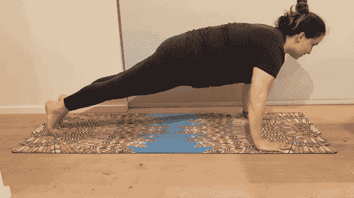
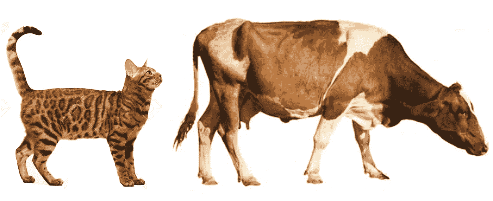

# 几率有多大？

> 原文：<https://towardsdatascience.com/20-hot-yoga-classes-31-days-ef6a8d9e1bd4?source=collection_archive---------36----------------------->

我是如何计算这个一月的日子的

## 计算我在瑜伽馆抽奖中获胜的几率——以及参加抽奖是什么感觉

# 接受挑战

新年刚过，我的朋友 Steph Tong 找到我，想和她一起参加一个比赛(“力量挑战”)，在一月份完成 20 节瑜伽课。出于#newyearnewme 的心态，我很快就同意了，尽管当时我的身材已经完全走样了。

# 关键外卖

这比我预想的要有挑战性得多。我面临着预期的精神挑战，即定期早起，以及身体挑战，即把锻炼计划增加到前一个月的 4 倍。

我很惊讶这有多重复。核心力量(瑜伽。我们要去的工作室)有一个相当严格的序列。这意味着序列变得单调，同样的肌肉群在我每次锻炼时都会受到冲击。我很高兴从这一切中变得更强壮、更灵活，但我无法告诉你 2 月 1 日来做其他事情时我有多兴奋。

# 我们中彩票的可能性有多大？

## 我和 Steph 有 10.93%的机会赢得比赛

任何完成这 20 门课程的人都可以参加比赛并获得奖品(老实说，这也是吸引我和斯蒂芬的原因之一)。根据我们当地工作室跟踪每个人进展的公告板，看起来 Steph 和我将是我们工作室 10 个人中完成挑战的两个人。实际上并不要求进入这个板，所以可能有人进入了而没有跟踪。然而，划掉那些框已经非常令人满意了，所以我不能想象任何人不会抓住这个机会。

这个公告板允许我和 Steph 工作室的参与者跟踪我们 20 节课的进度。注意:这张照片拍摄于 1 月 27 日，所以我在推断谁将在剩下的 4 天内完成挑战。

每个工作室都会给一个人颁发一个奖项，所以我们知道我们每个人都有十分之一的**机会**赢得这个奖项。

剩下的 21 个奖项将颁发给任何工作室的任何人，因此确定这些几率会有点棘手。我在这里做了一些假设:

*   获奖者将被替换选出(我只是假设他们不会给同一个人一个以上的奖项)
*   其他工作室也有 10 人完成了挑战。我不知道这是否合理，但我不知道还能做什么。

在 US⁴有 225 个工作室(注意:当我在谷歌上搜索这个数字时，我看到了一篇有趣的纽约时报文章，关于核心力量的 model⁵).业务这意味着大约有 2250 人将获得 21 项国家大奖。

我发现了一个有用的在线 calculator⁶，它允许我在没有替换的情况下计算抽样，以确定我们的胜算(这个计算器有很多选项，除了我使用它的目的之外，你还可以调整)。斯蒂芬和我各有 0.04%(2250 分之一)的机会赢得特定的国家奖，T2 有 0.93%的机会赢得任何国家奖。

当我们把这个加到我们赢得当地奖项的 10%的机会上，我们每个人都有 **10.93%的机会赢得某样东西**。

当然，真正的奖励是对我们健康的承诺，我们等等等等…🙄。Steph 和我来这里是为了免费的东西！

# 其余的经历，按数字来说

我一直在使用 Euphy 应用程序来跟踪我的进展——主要是因为我喜欢它们的可视化效果。

## 轻了 6 磅

## 每节课 5 美元…95 美分

也许承诺一个月反复去同一个工作室的最好的部分是，你真的可以无限制地花你的钱。(Planet Money 有一个很棒的插曲，讲述了大多数健身房是如何不期望或不希望你这样做的)。

我可以享受每月 119 美元的新会员费。如果我不是新来的，每门课应该是 9.50 美元:/。

## 4 处我无法解释的瘀伤

## 我不会再做的 3 个姿势

我是一个不灵活的人。结果，当我太努力去做那些意味着伸展我的小腿、腿筋等的姿势时，我开始给我的膝盖施加很大的压力。

我做了一些研究，并调整了我的实践，排除了以下内容:

*   半鸽式——我可以做同样的伸展运动，而不会让我的膝盖在全鸽式或坐姿 4 字形中爆炸。
*   **跑步者的弓箭步**
*   **战士 1** —不知道这个姿势怎么不伤到大家。如果我把后膝向外，臀部向前，我的膝盖会尖叫“我不是为这个而生的！”

## 我更有信心的两个姿势

*   **椅子姿势**——这套曾经令人痛苦和困惑的酷刑指令现在开始感觉至少比坐在潮湿的公园长椅上要好。
*   如果我说实话，我曾经跳过这个体式(如果我在木板和扑通一声趴在地板上之间停下来，会有什么区别吗？)现在，我*实际上*在两者之间做了一个停留。这很难，但我在努力！

正如你所看到的，还有改进的空间，但是我得到了很好的助攻！

## 1 尴尬的实现

十多年来，我一直把猫和牛的姿势混在一起。意识到自己的错误后，我一时感到羞愧，但我并不真的和猫在一起..或者奶牛。糟糕，\_(ツ)_/。

在我看来，看看这只猫摆出的牛的姿势，还有这只牛摆出的猫的姿势！(图片来源:123rf.com 和 shutterstock.com)

## 0 提示穿什么在高温瑜伽中感觉舒服

[1]“顶点体式”是一个用来描述(通常)这一类中最具挑战性的体式的术语。这个练习的目的是给你力量和灵活性来接近我们的击球姿势。

[2][https://www . NPR . org/2019/06/12/731987365/episode-590-the-planet-money-workout](https://www.npr.org/2019/06/12/731987365/episode-590-the-planet-money-workout)

[3][https://www . gaiam . com/blogs/discover/4-瑜伽错误会导致膝盖疼痛](https://www.gaiam.com/blogs/discover/4-yoga-mistakes-that-can-cause-knee-pain)

[4]https://www.corepoweryoga.com/yoga-studio/all-locations

[5][https://www . nytimes . com/2019/04/06/style/core power-yoga-teacher-training . html](https://www.nytimes.com/2019/04/06/style/corepower-yoga-teacher-training.html)

[6][https://www.omnicalculator.com/statistics/probability](https://www.omnicalculator.com/statistics/probability)设 P(A)为 1/2250*100(中选一等奖的几率)。将 P(B)设置为 100，因为您没有第二个条件。将“尝试时”设置为 21(奖品数量)。将下拉列表更改为“至少出现一次”(我的名字被选为 21 个名字之一)。