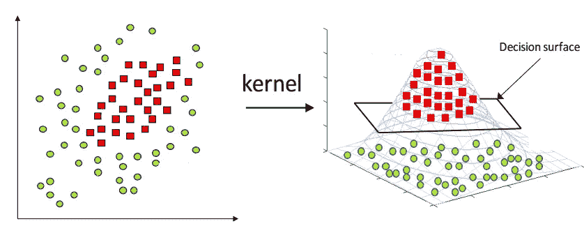

# 数据科学家必须知道的 20 个机器学习面试问题

> 原文：<https://towardsdatascience.com/20-machine-learning-interview-practice-problems-3c86a572eeec?source=collection_archive---------2----------------------->

## 用这些面试问题磨练你的机器学习知识

图片由[穆罕默德·哈桑](https://pixabay.com/users/mohamed_hassan-5229782/?utm_source=link-attribution&utm_medium=referral&utm_campaign=image&utm_content=4082314)拍摄，来自[皮克斯拜](https://pixabay.com/?utm_source=link-attribution&utm_medium=referral&utm_campaign=image&utm_content=4082314)

鉴于我的文章、[谷歌的数据科学面试脑筋急转弯](/googles-data-science-interview-brain-teasers-7f3c1dc4ea7f)、[亚马逊的数据科学家面试练习题](/amazon-data-scientist-interview-practice-problems-15b9b86e86c6)、[微软数据科学面试问答](/microsoft-data-science-interview-questions-and-answers-69ccac16bd9b)、 [5 个数据科学家常见的 SQL 面试问题](/40-statistics-interview-problems-and-answers-for-data-scientists-6971a02b7eee)的受欢迎程度，我在网上收集了一些机器学习数据科学面试问题，并尽我所能进行了回答。开始了。

> ***请务必*** [***订阅此处***](https://terenceshin.medium.com/membership) ***并至我的*** [***个人简讯***](https://terenceshin.substack.com/embed) ***千万不要错过另一篇关于数据科学的文章指南、技巧和提示、人生教训等等！***

## 问:什么是交叉验证？

交叉验证本质上是一种用于评估模型在新的独立数据集上表现如何的技术。交叉验证最简单的例子是将数据分成两组:定型数据和测试数据，其中定型数据用于构建模型，测试数据用于测试模型。

## 问:如何定义/选择指标？

没有放之四海而皆准的标准。选择用于评估机器学习模型的度量取决于各种因素:

*   是回归还是分类任务？
*   商业目标是什么？精确度与召回率
*   目标变量的分布是什么？

可以使用的指标有很多，包括调整后的 r 平方、MAE、MSE、准确度、召回率、精确度、f1 分数等等。

*如果你想了解更多关于如何评估你的机器学习模型的信息，请查看我的文章*[*‘如何用 Python 代码评估你的机器学习模型’*](/how-to-evaluate-your-machine-learning-models-with-python-code-5f8d2d8d945b)*！*

## 问:解释什么是精确和召回

**回忆**试图回答“正确识别实际阳性的比例是多少？”

**Precision** 试图回答“多大比例的肯定识别实际上是正确的？”

摘自维基百科

## 问:解释什么是假阳性和假阴性。为什么这些对彼此很重要？举例说明假阳性比假阴性更重要，假阴性比假阳性更重要，以及这两种错误同等重要

一个**假阳性**是当一个条件不存在时对其存在的不正确识别。

**假阴性**是对实际存在的条件不存在的错误识别。

假阴性比假阳性更重要的一个例子是癌症筛查。与其说有人得了癌症，后来才发现没有，不如说有人没得癌症。

这是一个主观的论点，但从心理学的角度来看，假阳性可能比假阴性更糟糕。例如，赢得彩票的假阳性可能比假阴性更糟糕，因为人们通常不会期望赢得彩票。

## 问:监督学习和无监督学习有什么区别？给出具体的例子

**监督学习**涉及学习基于示例输入-输出对将输入映射到输出的函数[1]。

例如，如果我有一个包含两个变量的数据集，年龄(输入)和身高(输出)，我可以实现一个监督学习模型，根据年龄预测一个人的身高。

由作者创建

与监督学习不同，**非监督学习**用于从输入数据中进行推断和发现模式，而不参考标记的结果。无监督学习的一个常见用途是根据购买行为对客户进行分组，以找到目标市场。

*查看我的文章'* [*六分钟解释所有机器学习模型*](/all-machine-learning-models-explained-in-6-minutes-9fe30ff6776a) *'如果你想了解更多这方面的信息！*

## 问:假设您需要使用多元回归生成一个预测模型。解释你打算如何验证这个模型

有两种主要方法可以做到这一点:

**A)调整后的 R 平方**。

r 平方是一种度量，它告诉你因变量的方差在多大程度上是由自变量的方差来解释的。更简单地说，当系数估计趋势时，R 平方表示最佳拟合线周围的散布。

然而，添加到模型中的每个额外的独立变量**总是**增加 R 平方值——因此，一个有几个独立变量的模型可能看起来更适合，即使它不是。这就是调整后的 R 的用武之地。调整后的 R 补偿每个额外的独立变量，并且仅在每个给定变量将模型改进到超出概率可能的程度时才增加。这很重要，因为我们正在创建一个多元回归模型。

**B)交叉验证**

大多数人常用的方法是交叉验证，将数据分成两组:训练数据和测试数据。*参见第一个问题的答案，了解更多信息。*

## 问:NLP 代表什么？

NLP 代表**自然语言处理**。它是人工智能的一个分支，赋予机器阅读和理解人类语言的能力。

## 问:什么时候你会使用随机森林来对抗 SVM，为什么？

为什么随机森林是比支持向量机更好的模型选择，有几个原因:

*   随机森林允许您确定要素的重要性。SVM 不能这么做。
*   随机森林比 SVM 建造起来更快更简单。
*   对于多类分类问题，支持向量机需要一种 one-vs-rest 方法，这种方法扩展性差，占用内存多。

## 问:什么是主成分分析？解释你会用主成分分析来解决哪类问题。

从最简单的意义上来说，PCA 涉及将高维数据(例如 3 维)投影到更小的空间(例如 2 维)。这导致数据的维度降低(2 维而不是 3 维)，同时保持模型中的所有原始变量。

PCA 通常用于压缩目的，以减少所需的内存并加速算法，以及用于可视化目的，使汇总数据更容易。

## 问:为什么朴素贝叶斯这么差？如何改进使用朴素贝叶斯的垃圾邮件检测算法？

朴素贝叶斯的一个主要缺点是，它有一个很强的假设，即假设这些特征彼此不相关，但事实通常并非如此。

改进这种使用朴素贝叶斯的算法的一种方法是对特征去相关，使得假设成立。

## 问:线性模型的缺点是什么？

线性模型有几个缺点:

*   线性模型有一些强有力的假设，在应用中可能不成立。它假设线性关系、多元正态性、没有或很少多重共线性、没有自相关和同方差
*   线性模型不能用于离散或二元结果。
*   您不能改变线性模型的模型灵活性。

## 问:你认为 50 个小决策树比一个大决策树好吗？为什么？

问这个问题的另一种方式是“随机森林是比决策树更好的模型吗？”答案是肯定的，因为随机森林是一种集成方法，需要许多弱决策树来形成强学习器。随机森林更准确、更健壮，并且不容易过度拟合。

## 问:为什么均方差不是衡量模型性能的好方法？你有什么建议？

均方误差(MSE)对大误差给予相对较高的权重，因此，MSE 往往过于强调大偏差。更可靠的替代方法是 MAE(平均绝对偏差)。

## 问:线性回归需要哪些假设？如果这些假设中的一些被违反了呢？

这些假设如下:

1.  用于拟合模型的样本数据是代表人口的
2.  **X 和 Y 的均值之间的关系是**线性****
3.  **残差的方差对于 X 的任何值都是相同的**(同方差)****
4.  **观察是相互独立的**
5.  **对于 X 的任意值，Y 都是**正态分布**。**

**极端违反这些假设将使结果变得多余。对这些假设的小的违反将导致估计的更大的偏差或方差。**

## **问:什么是共线性，如何处理共线性？如何去除多重共线性？**

**当多元回归方程中的一个自变量与另一个自变量高度相关时，就存在多重共线性。这可能是有问题的，因为它破坏了一个独立变量的统计意义。**

**您可以使用方差膨胀因子(VIF)来确定自变量之间是否存在多重共线性-标准基准是，如果 VIF 大于 5，则存在多重共线性。**

## **问:如何检查回归模型是否很好地拟合了数据？**

**有几个指标可供您使用:**

****R 平方/调整后的 R 平方:**相对拟合度。*这在之前的回答*中已经解释过了**

****F1 得分**:评估所有回归系数都等于零的原假设与至少一个不等于零的替代假设**

****RMSE:** 绝对契合度。**

## **什么是决策树？**

****

**图片来自 Kaggle**

****决策树**是一种流行的模型，用于运筹学、战略规划和机器学习。上面的每个方块被称为一个**节点**，节点越多，你的决策树就越精确(一般来说)。决策树中做出决策的最后节点被称为树的**叶**。决策树直观且易于构建，但在准确性方面有所欠缺。**

## **问:什么是随机森林？为什么好？**

**随机森林是一种建立在决策树基础上的[集成学习](https://en.wikipedia.org/wiki/Ensemble_learning)技术。随机森林包括使用原始数据的[自举数据集](https://machinelearningmastery.com/a-gentle-introduction-to-the-bootstrap-method/)创建多个决策树，并在决策树的每一步随机选择一个变量子集。然后，该模型选择每个决策树的所有预测的模式。依靠“多数获胜”模型，它降低了单个树出错的风险。**

****

**例如，如果我们创建一个决策树，第三个，它会预测 0。但是如果我们依赖所有 4 个决策树的模式，预测值将是 1。这就是随机森林的力量。**

**随机森林提供了其他几个好处，包括强大的性能，可以模拟非线性边界，不需要交叉验证，并赋予功能重要性。**

## **问:什么是内核？解释内核技巧**

**核是一种计算两个向量 **𝐱** x 和 **𝐲** y 在某个(可能是非常高维的)特征空间内点积的方法，这就是为什么核函数有时被称为“广义点积”[2]**

**核心技巧是一种使用线性分类器来解决非线性问题的方法，方法是将线性不可分的数据转换为高维线性可分的数据。**

****

**摘自分析 Vidhya**

## **问:在拟合 SVM 之前进行降维是否有益？为什么或为什么不？**

**当特征的数量大于观察的数量时，那么执行维数减少通常会改善 SVM。**

# **感谢阅读！**

**如果你喜欢我的工作，想支持我…**

1.  **支持我的最好方式就是在**媒体**这里[关注我](https://medium.com/@terenceshin)。**
2.  **在成为第一批在**Twitter**上关注我的人之一。我会在这里发布很多更新和有趣的东西！**
3.  **此外，成为第一批订阅我的新 **YouTube 频道** [这里](https://www.youtube.com/channel/UCmy1ox7bo7zsLlDo8pOEEhA?view_as=subscriber)！**
4.  **在 **LinkedIn** [这里](https://www.linkedin.com/in/terenceshin/)关注我。**
5.  **在我的**邮箱列表** [这里](https://forms.gle/UGdTom9G6aFGHzPD9)注册。**
6.  **查看我的网站，[**terenceshin.com**](https://terenceshin.com/)。**

# **参考**

**[1] Stuart J. Russell，Peter Norvig，人工智能:一种现代方法(2010 年)，普伦蒂斯霍尔**

**[2]阿列克谢·格里戈里耶夫，[如何直观地解释什么是内核？](https://stats.stackexchange.com/questions/152897/how-to-intuitively-explain-what-a-kernel-is) (2016)，栈交换**

# **相关文章**

** [## 6 分钟解释所有机器学习模型

### 最流行的机器学习模型的直观解释。

towardsdatascience.com](/all-machine-learning-models-explained-in-6-minutes-9fe30ff6776a)  [## 数据科学家的 40 个统计面试问题和答案

### 为你的面试复习统计知识的资源！

towardsdatascience.com](/40-statistics-interview-problems-and-answers-for-data-scientists-6971a02b7eee)**