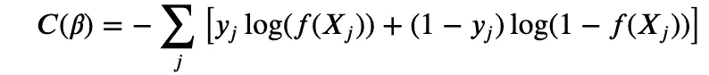
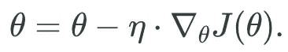
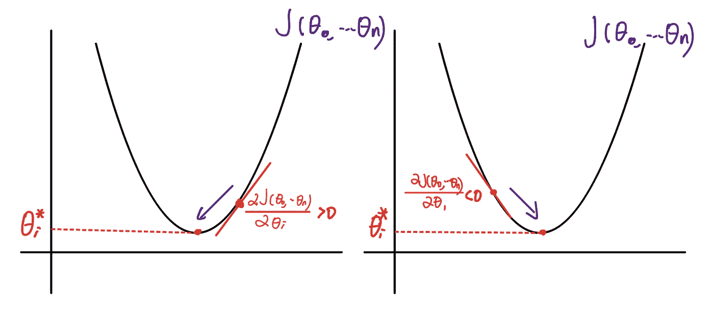
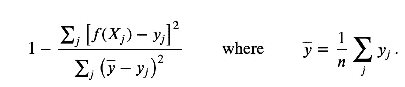

# 准备数据科学面试的 20 个机器学习相关问题

> 原文：<https://towardsdatascience.com/20-machine-learning-related-questions-to-prepare-for-interviews-93bcba72f911?source=collection_archive---------7----------------------->

Clem Onojeghuo 在 [Unsplash](https://unsplash.com/s/photos/job-interview?utm_source=unsplash&utm_medium=referral&utm_content=creditCopyText) 拍摄的照片

## 自信的指甲数据科学访谈，第 1 部分

机器学习相关的问题在面试中总是占很大一部分。数据科学家、机器学习工程师等职位要求潜在候选人对机器学习模型有全面的了解，并熟悉使用这些模型进行分析。在与面试官讨论你的一些项目以展示你对某些模型的理解时，面试官会问一些关于模型选择、特征选择、特征工程、模型评估等基本的机器学习问题。在这篇文章中，我将讨论 20 个与机器学习相关的问题，并解释我如何在面试中回答这些问题。

> **型号规格**

**1、什么是有监督的机器学习问题，什么是无监督的机器学习问题？**

通过检查问题中是否有要预测的目标值或标签，可以很容易地区分它们。监督机器学习将数据与目标值进行映射，以便模型将使用从数据中提取的特征来预测目标值。例如，用线性回归来预测房价；使用逻辑回归预测一个人是否会拖欠债务。

无监督的机器学习问题没有预测的目标值，但正在学习从数据中发现一般模式。例如，基于模式对数据进行聚类；基于特征方差的降维。

**2、什么是分类问题，什么是回归问题？**

分类问题和回归问题都是有监督的机器学习问题，因此问题中存在目标值。分类问题具有代表类别的离散目标值。对于二元分类问题，只有正类和负类。回归问题需要预测连续的目标值，如房价、等待时间等。

**3、一个机器学习模型的参数和超参数是什么？**

参数是在模型的拟合过程中生成的，而超参数是默认定义的或通过 GridSearchCV 搜索指定的。以岭回归为例，参数是所有特征的系数，而超参数是指定模型中正则化级别的α。

**4、什么是 logistic 回归的成本函数？**

逻辑回归使用交叉熵作为成本函数:

具有交叉熵的成本函数同时惩罚不确定性和不正确的预测。以高置信度做出的不正确预测对总和的影响最大。例如，当 y_j = 0，而你的模型预测 f (X_j) = 0.9 时。代价将是-log(0.1)，接近无穷大。

**5、什么是 SVM，什么是支持向量？**

支持向量机(SVM)是一种监督机器学习算法，通常用于解决二分类问题。它还可以应用于多类分类问题和回归问题。

支持向量是距离分离超平面最近的数据点。它们是最难分类的数据点。此外，支持向量是训练集的元素，如果被移除，其将改变划分超平面的位置。我有一篇文章解释了更多关于 SVM 的概念:

 [## 用数学细节解释支持向量机

### 支持向量机(SVM)是一种监督机器学习算法，通常用于解决二元…

towardsdatascience.com](/explain-support-vector-machines-in-mathematic-details-c7cc1be9f3b9) 

**6、什么是梯度下降和随机梯度下降？**

每个机器学习模型都有一个代价函数 J (θ_0，θ_1，…θ_n)，其中θs 是参数。为了在拟合过程中找到最佳参数，我们正在解决一个优化问题:

最小 J (θ_0，θ_1，…θ_n)

w.r.t θ_0，θ_1，…θ_n

梯度下降通过一阶迭代解决了这个问题:

它从θs 的随机值开始，并根据一阶偏导数不断更新θs。当偏导数为正时，我们减小θ，反之亦然:

当偏导数达到零或足够接近零时，迭代停止并达到局部/全局最小值。ɳ是学习率，当它很小时，它需要更长的时间来收敛，但如果它很大，成本函数可能不会在每次迭代中减少，在某些情况下可能会发散。

随机梯度下降是一种优化方法，它单独考虑每个训练观察，而不是一次全部考虑(正常梯度下降会这样)。它不是计算成本函数的精确梯度，而是使用每个观察值来估计梯度，然后在该方向上迈出一步。虽然每个单独的观察将提供真实梯度的差的估计，但是给定足够的随机性，参数将收敛到良好的全局估计。因为随机梯度下降每次只需要考虑一个观测值，所以它可以处理太大而不适合内存的数据集。

**7、K-means 怎么选 K？**

我们选择预先在 K-means 算法中定义的聚类数，并且 K 值在技术上和实践上都是确定的。

首先，我们需要绘制[肘形曲线](https://www.geeksforgeeks.org/elbow-method-for-optimal-value-of-k-in-kmeans/)，该曲线测量相对于 K 的失真(距聚类中心的平方距离的平均值)或惯量(样本距最近聚类中心的平方距离的总和)。注意，随着 K 的增加，我们将始终减少失真和惯量，如果 K 等于数据点的数量，则它们的值将为零。我们可以使用肘形曲线来检查下降速度，并在值下降相当慢时选择“肘点”处的 K。

实际上，我们需要选择更容易解释或者实际可行的 K。例如，如果您的公司只有资源(劳动力和资本)将客户分为三类，那么您必须将 K 设置为 3。

**8、什么是在线学习？**

在线学习是用新数据更新拟合，而不是重新拟合整个模型。它通常应用于两种情况。一种是当您的数据按顺序出现时，您希望逐步调整您的模型以适应新数据。另一种情况是，当您的数据太大而无法一次全部训练时，您可以使用随机梯度下降或根据您使用的模型指定批量大小。

> **模型评估**

**9、欠拟合和过拟合有什么区别？**

欠拟合是指模型不够复杂，无法学习数据模式，过拟合是指模型过于复杂，拾取的是噪声而不是模式。当拟合不足时，您的模型在训练集和测试集中的性能都很差，您需要包括更多的功能，或者使用更复杂的模型。过度拟合时。该模型将在训练集中表现得非常好，但它不能推广到新数据，这意味着它在测试集中表现很差。您需要使用更简单的模型，或者通过正则化、打包或丢弃来删除一些要素。

**10、偏倚和方差之间的权衡是什么？**

偏差是衡量你的模型表现有多差，因此它是一个衡量拟合不足的指标。方差是对过度拟合的一种度量，即测量您的模型在多大程度上符合数据中的噪声。

**11、什么是正规化，L1 和 L2 的正规化有什么区别？**

我们通常在线性模型中使用正则化来控制过拟合。正则化是在拟合模型时将参数的大小添加到成本函数中。因此，它迫使模型选择较少的特征或减少特征参数的大小，并减少过度拟合的机会，尤其是当有大量特征时。

L1 正则化将参数的绝对值添加到成本函数，而 L2 正则化添加参数的平方。在线性回归中，L1 正则化是拉索回归，L2 正则化是岭回归。L1 正则化可以将无用特征的参数降为零，从而可以用于特征选择。L2 正则化不能使任何参数降为零，但可以使值大大降低。此外，由于 L2 使用的是平方值，因此它会严重惩罚“异常值”，即非常大的参数。L1 正则化适用于具有较少特征的模型，每个特征都有较大或中等的影响，而 L2 正则化适用于具有许多特征的模型，每个特征都有较小的影响。

**12、如何从贝叶斯的角度解读 L2 正则化？**

从贝叶斯的角度来看，参数由以下因素决定:

最大似然估计

其中 p (β|y，X)是后验分布，p (β)是先验分布，p (y|X，β)是似然函数。当忽略先验分布，仅最大化似然函数来估计β时，我们没有任何正则化。当有关于先验分布的假设时，我们增加了正则化，这意味着我们对该模型可以选择的β设置了一些限制。对于 L2 正则化，我们增加了一个假设，即β服从均值等于零的正态分布。

关于贝叶斯统计的更多信息，你可以阅读我的以下文章:

 [## 贝叶斯统计终极指南

towardsdatascience.com](/the-ultimate-guide-to-bayesian-statistics-ed2940aa2bd2) 

**13、如何评价回归模型，如何评价分类模型？**(也包括效力)

评价一个模型，需要从技术上和实际上评价它的性能。从技术上讲，根据不同的场景，我们使用 MSE、MAE、RMSE 等来评估回归模型，使用准确度、召回率、精确度、F 值、AUC 来评估分类模型。我有一篇文章描述了评估分类模型的度量标准的选择:

 [## 模型评估分类度量的最终指南

### 将机器学习模型与假设检验相结合。别扯头发了，读读这篇文章。

towardsdatascience.com](/the-ultimate-guide-of-classification-metrics-for-model-evaluation-83e4cdf294d9) 

在实践方面，我们需要评估在这种情况下模型是否准备好部署和使用业务度量。如果我们正在改进一个旧模型，我们可以比较旧模型和新模型之间的技术指标，看看新模型是否有更好的性能。如果这是您正在构建的最佳模型，那么您需要用业务度量来定义“良好的性能”。例如，如果我们遵循模型的错误预测，损失是多少，这在很大程度上取决于业务场景。如果发送广告是廉价的，那么模型仍然是好的，以低精度。但是，如果发送广告是昂贵的，那么我们需要有更高的精度。

**14、如何评价线性回归模型？**

有几种方法可以评估线性回归模型。我们可以使用平均绝对误差(MAE)、均方误差(MSE)、均方根误差(RMSE)等指标来评估模型。请注意，如果您不希望异常值影响您的模型性能，那么您应该使用 MAE 而不是 MSE。除了这些指标，我们还可以使用 R 平方或调整的 R 平方(R2)。R-Squared 是将您构建的模型与基线模型进行比较的度量，其中基线模型始终预测 y 的平均值。

如果您的模型比基线模型差，R 平方可以小于零。校正的 R 平方根据您的模型用于进行预测的要素数量来校正 R 平方。如果增加一个要素并没有比预期更好地提高模型性能，调整后的 R 平方将会降低。

请注意，MAE 和 MSE 在没有上下文的情况下都很难解释，因为它们取决于数据的规模。但是，因为 R 平方具有固定的范围，所以接近 1 的值总是意味着模型对数据拟合得相当好。

**15、什么是装袋和助推？我们为什么要使用它们？**

Bagging 正在并行训练集成模型。我们有一个用随机选择的子样本(有替换)和特征训练的相同模型的集合。最终预测结合了所有模型的预测。对于分类问题，需要多数票。而对于回归问题，它取所有模型预测的平均值。装袋通常用于对抗过度拟合，随机森林就是一个很好的例子。

Boosting 是垂直训练模型。它采用一系列模型，每个模型都采用前一个模型的输出。它对重新加权的数据进行训练，以专注于以前模型出错的数据。最终的预测在最后被合并成一个加权平均值。Boosting 是一种对抗欠拟合的技术，梯度增强决策树就是一个很好的例子。

你应该在时间序列数据集上使用什么交叉验证技术？

默认的交叉验证技术在将数据拆分到不同的文件夹之前对其进行混洗，这对于时间序列分析来说是不希望的。时间序列数据的顺序很重要，我们不想在未来的数据上训练，也不想在过去的数据上测试。相反，我们需要保持秩序，只训练过去。

有两种方法:“滑动窗口”和“正向链接”。首先，我们保留数据的顺序，并将它们分成不同的文件夹。在滑动窗口中，我们在折叠 1 上训练，在折叠 2 上测试。然后我们在折叠 2 上训练，在折叠 3 上测试。我们将完成，直到我们测试最后一次折叠。在前向链接中，我们在折叠 1 上训练，在折叠 2 上测试。然后我们在折叠 1+2 上训练，在折叠 3 上测试。然后在折叠 1+2+3 训练，在折叠 4 测试。我们会停下来，直到我们测试完最后一次折叠。

> **数据准备**

**17、什么是数据规范化，为什么？**

数据标准化(或缩放)使所有连续要素的值范围更加一致。对于每个特征，我们减去特征平均值并除以其标准误差或范围。目标是让所有连续的要素都处于相同的比例。数据规范化至少在三种情况下有用:

1，对于使用欧几里得距离的算法:Kmeans，KNN:不同的标度扭曲了距离的计算。

2，对于用梯度下降优化的算法:不同尺度的特征使得梯度下降更难收敛。

3，用于降维(PCA):查找具有最大方差的特征组合

**18、如何处理缺失数据？**

答案在很大程度上取决于具体的场景，但这里有一些选择:

1，当数据集的大小不会显著减小时，删除丢失的行/列，除非将其过滤掉会使样本有偏差。

2、用均值/中值/众数代替缺失值:可能会有问题，因为它降低了特征的方差，忽略了这个特征与其他特征之间的相关性。

3、通过构建插值器或基于其他特征预测它们来预测值

4、将缺失值作为一个单独的特征:也许某些值是因为特定的原因而缺失的，可以对数据分析有所帮助。

**19、如何处理不平衡数据集？**

不平衡的数据集使得正常的分类指标，如准确性，不能很好地工作。有几种方法可以处理不平衡的数据集:

1、根据问题选择不同的度量来评估模型:F 值、召回率、准确率等。

从较大的集合中丢弃一些观察值:通过随机丢弃该集合中的一些数据来对较大的集合进行下采样。

3、增加较小集合的观测值:通过制作较小集合中数据点的多个副本(可能导致模型过拟合)或使用合成数据创建(例如 SMOTE)来对较小集合进行上采样，在 SMOTE 中，我们使用较小集合中的现有数据来创建看起来像现有数据点的新数据点。

**20、什么是降维？为什么和如何？**

降维是在拟合模型之前降低数据的维度(特征的数量)。

***维度诅咒*** 是进行降维的首要原因。维度诅咒是说当维度增加时，首先每个维度的数据密集度降低，其次更高的维度使模型更容易过度拟合。

根据问题的不同，有不同的技术来进行降维。最严格的正向方式做主成分分析(PCA)，这是一种无监督的机器学习算法，只保留方差最大的不相关特征。

在文本分析过程中，通常需要降低维数，因为矢量化矩阵是一个稀疏矩阵。哈希矢量器将在将数据拟合到模型中之前降低维度。

这都是准备面试的二十个机器学习相关问题。你可以将它们用作准备面试的清单，或者作为帮助你更好地理解机器学习基础知识的学习指南。我写过其他关于统计学问题的面试指南:

 [## 为数据科学面试做准备的 22 个统计问题

### 自信的钉钉数据科学访谈，第 2 部分

towardsdatascience.com](/22-statistics-questions-to-prepare-for-data-science-interviews-d5651a8b3c56) 

概率中的一些练习题:

 [## 数据科学面试的 12 个概率练习题

### 自信地完成数据科学面试，第 3 部分

towardsdatascience.com](/12-probability-practice-questions-for-data-science-interviews-2ec5230304d9) 

案例研究问题:

 [## 在数据科学面试中组织您对案例研究问题的回答

### 自信地完成数据科学面试，第 4 部分

towardsdatascience.com](/structure-your-answers-for-case-study-questions-during-data-science-interviews-a14a02d21e6c) 

行为问题:

 [## 为数据科学面试准备行为问题

### 自信地完成数据科学面试，第 5 部分

towardsdatascience.com](/prepare-behavioral-questions-for-data-science-interviews-96e97f13be15) 

感谢您的阅读！这是我所有博客帖子的列表。如果你感兴趣的话，可以去看看！

 [## 我的博客文章库

### 我快乐的地方

zzhu17.medium.com](https://zzhu17.medium.com/my-blog-posts-gallery-ac6e01fe5cc3)  [## 阅读朱(以及媒体上成千上万的其他作家)的每一个故事

### 作为一个媒体会员，你的会员费的一部分会给你阅读的作家，你可以完全接触到每一个故事…

zzhu17.medium.com](https://zzhu17.medium.com/membership)