# 每个数据科学家都应该知道的 20 种数字运算

> 原文：<https://towardsdatascience.com/20-numpy-operations-that-every-data-scientist-should-know-fb44bb52bde5?source=collection_archive---------4----------------------->

## NumPy 构成了数据科学领域中许多 Python 库的基础。


图片由 [Jae Rue](https://pixabay.com/users/designwebjae-1753371/?utm_source=link-attribution&utm_medium=referral&utm_campaign=image&utm_content=3109378) 来自 [Pixabay](https://pixabay.com/?utm_source=link-attribution&utm_medium=referral&utm_campaign=image&utm_content=3109378)

数据科学的一切都始于数据，数据有多种格式。数字、图像、文本、x 光、声音和视频记录只是数据源的一些例子。无论数据以何种格式传入，都需要转换成数字数组进行分析。因此，在数据科学中有效地存储和修改数字数组是至关重要的。

**NumPy** (数字 Python)是一个科学计算包，它提供了许多创建和操作数字数组的方法。它形成了许多广泛使用的与数据科学相关的 Python 库的基础，如 Pandas 和 Matplotlib。

在这篇文章中，我将介绍 NumPy 数组上 20 种常用的操作。这些操作可分为四大类:

*   创建数组
*   操纵数组
*   组合数组
*   带数组的线性代数

我们首先需要导入 NumPy:

```
import numpy as np
```

# **创建数组**

1.  **特定范围内的随机整数**

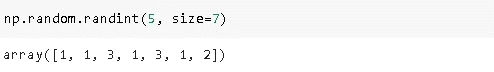

第一个参数决定了范围的上限。缺省情况下，下限是 0，但是我们也可以指定它。**尺寸**参数用于指定尺寸，如预期。

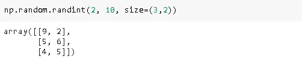

我们创建了一个介于 2 和 10 之间的 3x2 整数数组。

**2。在 0 和 1 之间随机浮动**

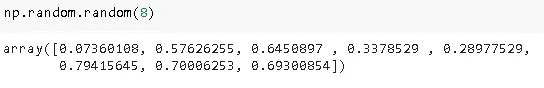

介于 0 和 1 之间的一维浮点数组。创建随机噪声数据是有用的。

**3。来自标准正态分布的样本**

Np.random.randn()用于从标准正态分布(即零均值和单位方差)创建样本。

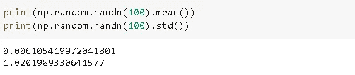

我们创建了一个有 100 个浮点数的数组。

**4。带有 1 和 0 的矩阵**

矩阵可以被认为是二维数组。我们可以分别用 0 和 np 个 1 创建一个矩阵。

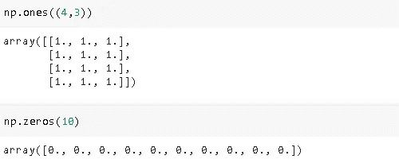

我们只需要指定矩阵的维数。

**5。单位矩阵**

单位矩阵是对角线上有一个 1，每隔一个位置有一个 0 的方阵(nxn)。Np.eye 或 np.identity 可以用来创建一个。

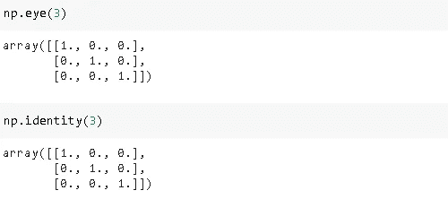

6。阿兰格

Arange 函数用于创建在指定间隔内具有均匀间隔的序列值的数组。我们可以指定起始值、终止值和步长。

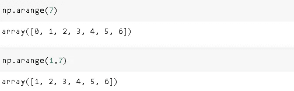

默认起始值为零，默认步长为一。

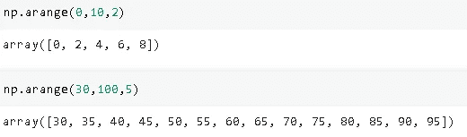

7。只有一个值的数组

我们可以使用 **np.full.** 创建一个在每个位置都有相同值的数组

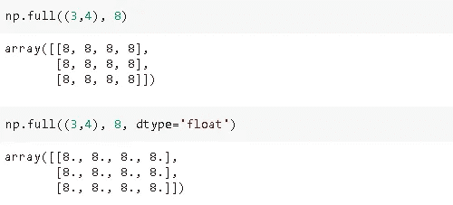

我们需要指定要填充的尺寸和数量。此外，可以使用 **dtype** 参数更改数据类型。默认数据类型是整数。

# **操纵数组**

让我们首先创建一个二维数组:

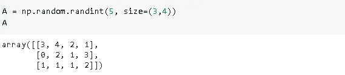

**8。散开**

Ravel 函数展平数组(即转换为一维数组)。

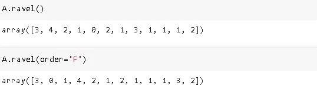

默认情况下，通过逐行添加来展平数组。通过将 **order** 参数设置为 F (Fortran 风格)，可以将其更改为列方式。

**9。重塑**

同样，它重塑了一个数组。A 的形状是(3，4)，大小是 12。

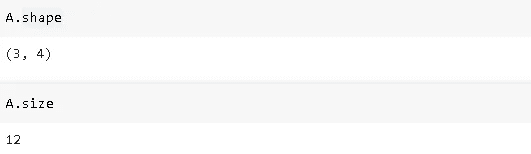

我们需要保持尺寸，它是每个维度中尺寸的乘积。

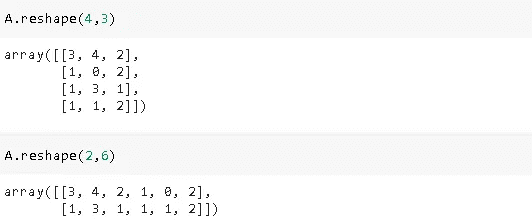

我们不必指定每个维度的大小。我们可以让 NumPy 通过传递-1 来计算维度。

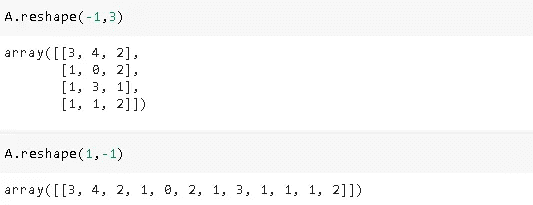

**10。转置**

转置矩阵就是交换行和列。

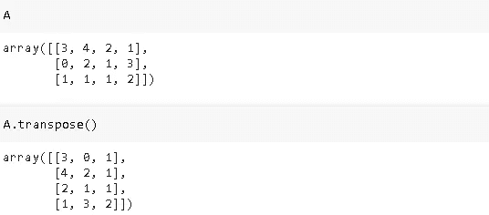

**11。Vsplit**

将一个数组垂直拆分成多个子数组。

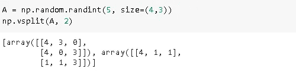

我们将一个 4x3 的阵列分成 2 个子阵列，形状为 2x3。

我们可以在分割后访问特定的子数组。

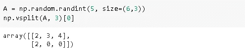

我们将一个 6×3 的数组分成 3 个子数组，得到第一个子数组。

**12。Hsplit**

它类似于 vsplit，但水平工作。

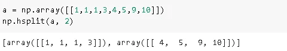

如果我们对一个 6x3 的数组应用 hsplit，得到 3 个子数组，得到的数组将具有(6，1)的形状。

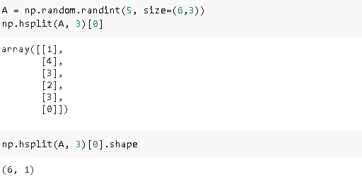

# **组合数组**

在某些情况下，我们可能需要组合数组。NumPy 提供了以多种不同方式组合数组的函数和方法。

13。串联

类似于熊猫的 **concat** 功能。

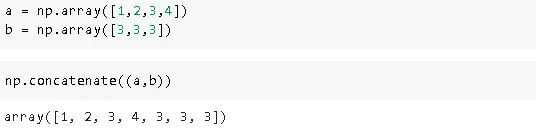

我们可以使用 **reshape** 函数将这些数组转换成列向量，然后垂直连接。

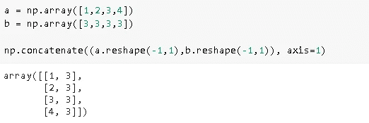

14。Vstack

它用于垂直堆叠数组(一行在另一行之上)。

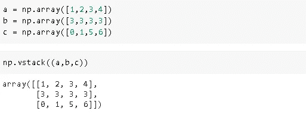

它也适用于高维数组。

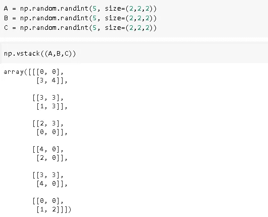

15。Hstack

与 **vstack** 相似，但水平工作(列方向)。

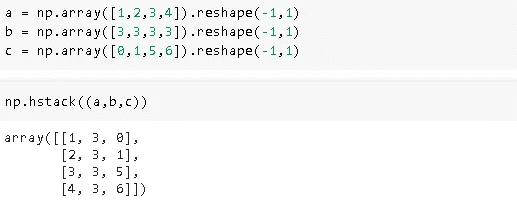

# **带有 NumPy 数组的线性代数(numpy.linalg)**

线性代数是数据科学领域的基础。NumPy 是使用最广泛的科学计算库，它提供了大量的线性代数运算。

16。详细信息

返回矩阵的行列式。

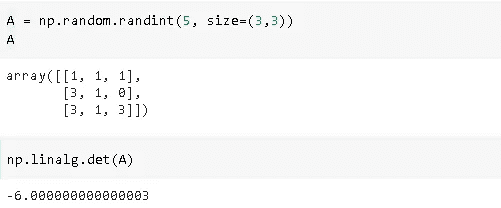

矩阵必须是正方形(即行数等于列数)才能计算行列式。对于高维数组，后两维必须是正方形。

17。Inv

计算矩阵的逆矩阵。

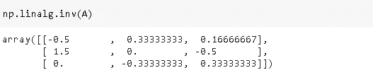

矩阵的**逆**是与原矩阵相乘时给出单位矩阵的矩阵。不是每个矩阵都有逆矩阵。如果矩阵 A 有逆，则称其为**可逆**或**非奇异。**

18。Eig

计算方阵的特征值和右特征向量。

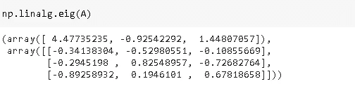

**19。圆点**

计算两个向量的点积，即元素相对于其位置的乘积之和。第一个向量的第一个元素乘以第二个向量的第一个元素，依此类推。

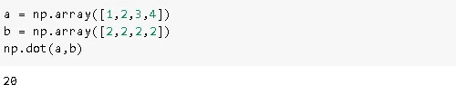

**20。马特穆尔**

它执行矩阵乘法。

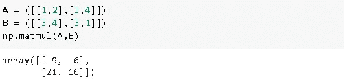

我们已经介绍了 NumPy 的基本操作。NumPy 上有更高级的操作，但最好先理解基础知识。

感谢您的阅读。如果您有任何反馈，请告诉我。