# 20 个熊猫功能将加速您的数据分析过程

> 原文：<https://towardsdatascience.com/20-pandas-functions-that-will-boost-your-data-analysis-process-f5dfdb2f9e05?source=collection_archive---------3----------------------->

## 举例说明。


照片由[恒电影](https://unsplash.com/@hengfilms?utm_source=unsplash&utm_medium=referral&utm_content=creditCopyText)在 [Unsplash](https://unsplash.com/s/photos/style?utm_source=unsplash&utm_medium=referral&utm_content=creditCopyText) 拍摄

Pandas 是一个主要使用的 python 数据分析库。它提供了许多功能和方法来加快数据分析过程。使 pandas 如此普遍的是它的功能性、灵活性和简单的语法。

在这篇文章中，我将举例说明熊猫的 20 个功能。其中一些很常见，我相信你以前也用过。其中一些对你来说可能是新的。但是，所有这些都会为您的数据分析过程增加价值。

我们开始吧。

```
import numpy as np
import pandas as pd
```

# **1。查询**

我们有时需要根据条件过滤数据帧或应用掩码来获得某些值。过滤数据帧的一个简单方法是**查询**函数。让我们首先创建一个样本数据帧。

```
values_1 = np.random.randint(10, size=10)
values_2 = np.random.randint(10, size=10)
years = np.arange(2010,2020)
groups = ['A','A','B','A','B','B','C','A','C','C']df = pd.DataFrame({'group':groups, 'year':years, 'value_1':values_1, 'value_2':values_2})df
```

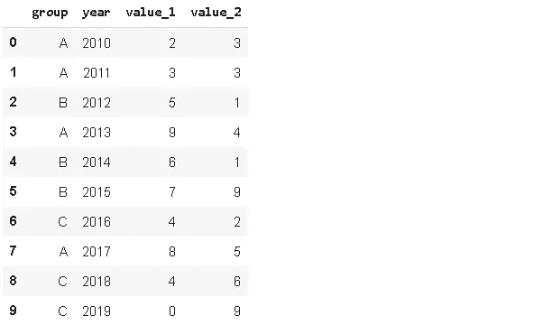

使用查询功能非常简单，只需编写过滤条件即可。

```
df.query('value_1 < value_2')
```

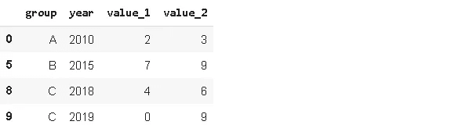

# **2。插入**

当我们想在数据帧中添加一个新列时，默认情况下它会被添加到末尾。然而，pandas 提供了使用**插入**功能在任意位置添加新列的选项。

我们需要通过传递一个索引作为第一个参数来指定位置。该值必须是整数。列索引从零开始，就像行索引一样。第二个参数是列名，第三个参数是包含值的对象，这些值可以是**系列**或类似于**数组的**对象。

```
#new column
new_col = np.random.randn(10)#insert the new column at position 2
df.insert(2, 'new_col', new_col)df
```

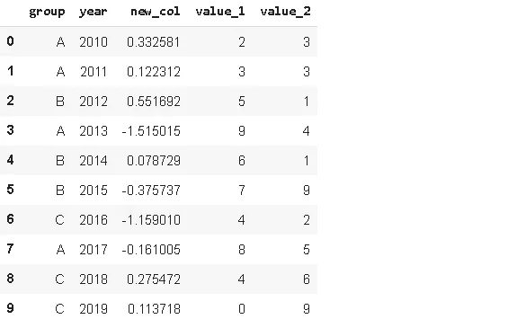

# **3。累计和**

数据框架包含 3 个不同组的一些年值。我们可能只对每年的值感兴趣，但在某些情况下，我们也需要一个累计和。Pandas 提供了一个简单易用的函数来计算累计和，即 **cumsum** 。

如果我们只应用累计和，组(A，B，C)将被忽略。这种累积值在某些情况下可能没有用，因为我们无法区分不同的组。放心吧！这个问题有一个非常简单方便的解决方案。我们可以通过应用**分组，然后再应用**累加**函数。**

```
df['cumsum_2'] = df[['value_2','group']].groupby('group').cumsum()df
```


# **4。样品**

样本方法允许您从**系列**或**数据帧**中随机选择数值。当我们想从分布中选择一个随机样本时，这是很有用的。

```
sample1 = df.sample(n=3)
sample1
```


我们用 n 参数指定值的数量，但是我们也可以将一个比率传递给 **frac** 参数。例如，0.5 将返回一半的行。

```
sample2 = df.sample(frac=0.5)
sample2
```

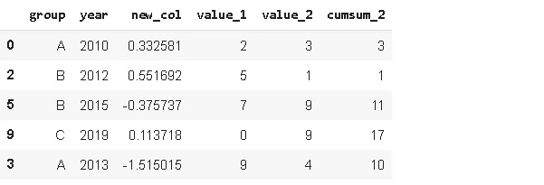

为了获得可再现的样本，我们可以使用 **random_state** 参数。如果将整数值传递给 random_state，则每次运行代码时都会产生相同的样本。

# **5。其中**

“Where”用于根据条件替换行或列中的值。默认的替换值是 NaN，但是我们也可以指定替换值。

```
df['new_col'].where(df['new_col'] > 0 , 0)
```

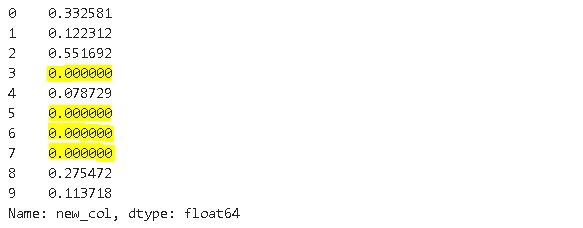

“where”的工作方式是选择符合条件的值，并用指定的值替换剩余的值。**其中(df['new_col'] > 0，0)** 选择“new_col”中所有大于 0 的值，其余值替换为 0。因此，where 也可以被认为是一个掩码操作。

重要的一点是,**这里的**对于熊猫和 NumPy 来说并不完全一样。我们可以获得相同的结果，但语法略有不同。使用 **DataFrame.where** ，选择符合条件的值**作为**，其他值替换为指定值。 **Np.where** 还要求指定符合条件的值。以下两行返回相同的结果:

```
df['new_col'].where(df['new_col'] > 0 , 0)np.where(df['new_col'] > 0, df['new_col'], 0)
```

# **6。Isin**

在处理数据帧时，我们经常使用过滤或选择方法。 **Isin** 方法是一种高级过滤。例如，我们可以根据选择列表过滤值。

```
years = ['2010','2014','2017']
df[df.year.isin(years)]
```


# **7。Loc 和 iloc**

Loc 和 iloc 用于选择行和列。

*   位置:按标签选择
*   iloc:按职位选择

**loc** 用于通过标签选择数据。列的标签是列名。我们需要小心行标签。如果我们不指定任何特定的索引，pandas 默认创建整数索引。因此，行标签是从 0 开始向上的整数。与 **iloc** 一起使用的行位置也是从 0 开始的整数。

使用 iloc 选择前 3 行和前 2 列:

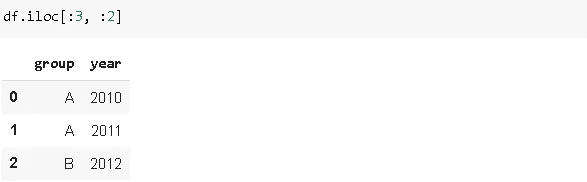

用 loc 选择前 3 行和前 2 列:

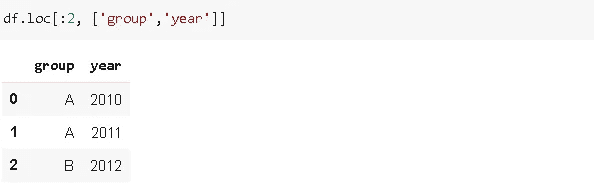

**注**:当使用 loc 时，包括指数的上限，而使用 iloc 时不包括。

选择行“1”、“3”、“5”和列“年”和“值 _1”:

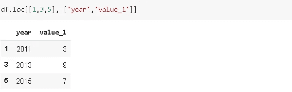

# 8。Pct_change

此函数用于通过系列中的值计算百分比变化。假设我们有一个包含[2，3，6]的系列。如果我们将 pct_change 应用于这个序列，返回的序列将是[NaN，0.5，1.0]。从第一个元素到第二个元素有 50%的增加，从第二个到第三个元素有 100%的增加。Pct_change 函数在比较时间序列中元素的变化百分比时非常有用。

```
df.value_1.pct_change()
```

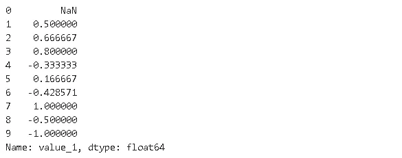

# 9。排名

Rank 函数为值分配等级。假设我们有一个包含[1，7，5，3]的序列 s。分配给这些值的等级将是[1，4，3，2]。

```
df['rank_1'] = df['value_1'].rank()
df
```

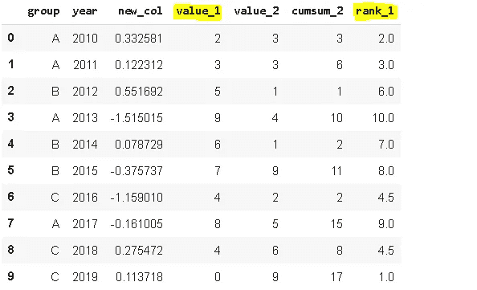

# 10。融化

Melt 用于将宽数据帧转换为窄数据帧。我所说的宽是指具有大量列的数据帧。一些数据帧的结构是连续的测量值或变量用列来表示。在某些情况下，将这些列表示为行可能更适合我们的任务。考虑以下数据帧:

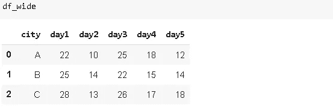

我们有三个不同的城市，在不同的日子进行测量。我们决定用一列中的行来表示这些日子。还会有一列显示测量结果。我们可以通过使用**融化**功能轻松实现这一点:

```
df_wide.melt(id_vars=['city'])
```

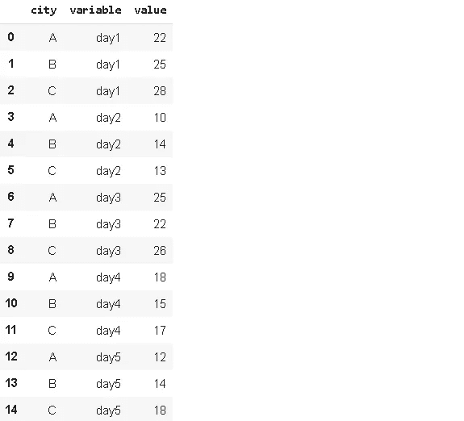

默认情况下，变量和值列的名称是给定的。我们可以使用 melt 函数的参数 **var_name** 和 **value_name** 来指定新的列名。

# **11。爆炸**

假设您的数据集在单个观测值(行)中包含一个要素的多个条目，但您希望在单独的行中对它们进行分析。

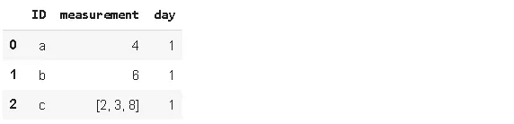

我们希望在单独的行上看到第“1”天“c”的测量值，使用 **explode 很容易做到这一点。**

```
df1.explode('measurement').reset_index(drop=True)
```

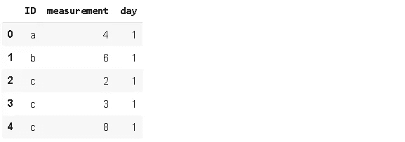

# **12。努尼克**

Nunique 计算列或行中唯一条目的数量。它在分类特征中非常有用，尤其是在我们事先不知道类别数量的情况下。让我们看看我们的初始数据框架:

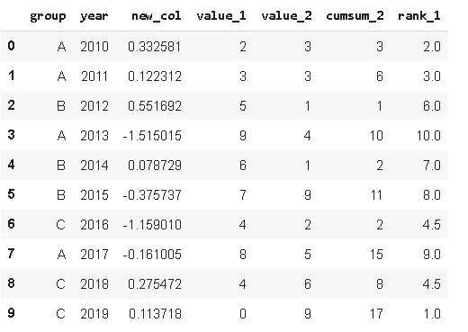

```
df.year.nunique()
10df.group.nunique()
3
```

我们可以直接对数据帧应用唯一函数，并查看每列中唯一值的数量:

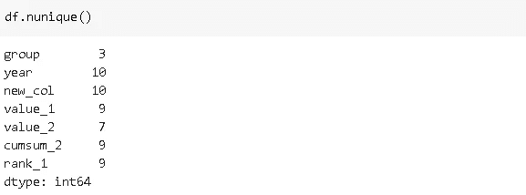

如果**轴**参数设置为 1，nunique 返回每行中唯一值的数量。

# **13。查找**

它可用于根据其他行、列对上的值在数据帧中查找值。这个函数最好通过一个例子来解释。假设我们有以下数据帧:


对于每一天，我们有 4 个人的测量值和一个包含这 4 个人的名字的列。我们希望创建一个新列，在“个人”列中显示个人的度量。因此，对于第一行，新列中的值将是 4(列“Alex”中的值)。

```
df['Person_point'] = df.lookup(df.index, df['Person'])
df
```


# **14。推断 _ 对象**

Pandas 支持广泛的数据类型，其中之一是**对象**。对象包含文本或混合(数字和非数字)值。但是，如果有不同的选项可用，则不建议使用对象数据类型。使用更具体的数据类型可以更快地执行某些操作。例如，我们更喜欢用整数或浮点数据类型来表示数值。

**infer_objects** 尝试为对象列推断更好的数据类型。考虑以下数据帧:

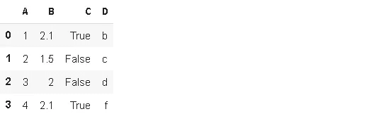

```
df2.dtypes
A    object 
B    object 
C    object 
D    object 
dtype: object
```

所有的数据类型都是对象。让我们看看推断的数据类型是什么:

```
df2.infer_objects().dtypesA      int64 
B    float64 
C       bool 
D     object 
dtype: object
```

这可能看起来微不足道，但是在有很多列的情况下绝对有用。

# 15。内存使用量

Memory_usage()以字节为单位返回每列使用的内存量。这在我们处理大型数据帧时尤其有用。考虑下面有一百万行的数据帧。

```
df_large = pd.DataFrame({'A': np.random.randn(1000000),
                    'B': np.random.randint(100, size=1000000)})df_large.shape
(1000000, 2)
```

以及每列的内存使用量(以字节为单位):

```
df_large.memory_usage()
Index        128 
A        8000000 
B        8000000 
dtype: int64
```

整个数据帧的内存使用量，以兆字节为单位:

```
df_large.memory_usage().sum() / (1024**2) #converting to megabytes15.2589111328125
```

# **16。描述**

Describe 函数计算数字列的基本统计数据，包括计数、平均值、标准偏差、最小值和最大值、中值、第一个和第三个四分位数。因此，它提供了数据帧的统计摘要。

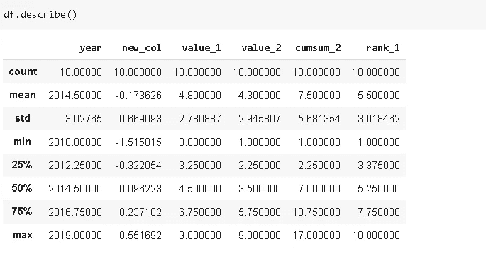

# **17。合并**

Merge()根据共享列中的值组合数据帧。考虑以下两个数据帧。


我们可以基于列中的共享值来合并它们。设置合并条件的参数是“ **on** 参数。


基于 column_a 中的公共值合并 df1 和 df2。merge 函数的 **how** 参数允许以不同方式组合数据帧。how 的可能值为“内部”、“外部”、“左侧”、“右侧”。

*   inner:只有在**对**参数指定的列中具有相同值的行(默认值为 **how** 参数)
*   外部:所有行
*   左侧:左侧数据帧中的所有行
*   右侧:右侧数据帧中的所有行

# 18。Select_dtypes

Select_dtypes 函数根据对数据类型设置的条件返回数据帧列的子集。它允许使用 **include** 和 **exlude** 参数来包含或排除某些数据类型。

```
df.select_dtypes(include='int64')
```

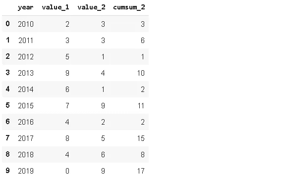

```
df.select_dtypes(exclude='int64')
```

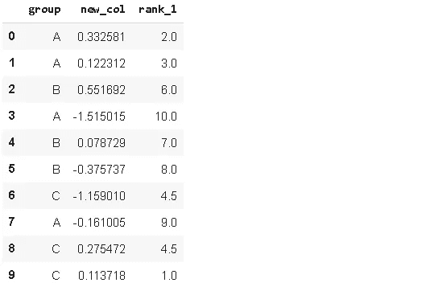

# 19。替换

顾名思义，它允许替换数据帧中的值。

```
df.replace('A', 'A_1')
```

第一个参数是要替换的值，第二个参数是新值。

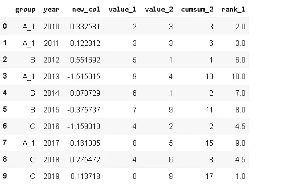

我们还可以同时传入一个字典进行多次替换。

```
df.replace({'A':'A_1', 'B':'B_1'})
```

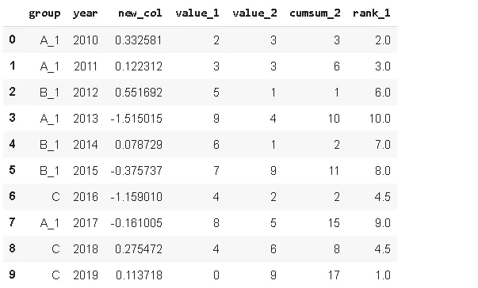

# 20。应用地图

Applymap 函数用于将函数应用于数据帧的元素。请注意，如果操作的矢量化版本可用，它应该优先于 applymap。例如，如果我们想将每个元素乘以一个数，我们不需要也不应该使用 applymap 函数。在这种情况下，简单的矢量化运算(例如 df * 4)要快得多。

然而，在某些情况下，我们可能没有矢量化运算的选项。例如，我们可以使用熊猫数据帧的 **Style** 属性来改变数据帧的样式。以下函数将负值的颜色更改为红色。

```
def color_negative_values(val):
   color = 'red' if val < 0 else 'black'
   return 'color: %s' % color
```

我们需要使用 applymap 函数将该函数应用于数据帧。

```
df3.style.applymap(color_negative_values)
```

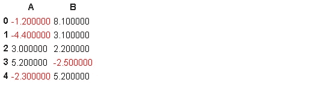

感谢您的阅读。如果您有任何反馈，请告诉我。