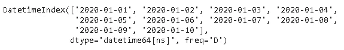

# 20 分掌握熊猫时间序列分析

> 原文：<https://towardsdatascience.com/20-points-to-master-pandas-time-series-analysis-f90155ee0e8a?source=collection_archive---------30----------------------->

## 如何处理时间序列数据？


马库斯·温克勒在 [Unsplash](https://unsplash.com/s/photos/stock-price?utm_source=unsplash&utm_medium=referral&utm_content=creditCopyText) 上的照片

时间序列数据有许多定义，所有这些定义都以不同的方式表示相同的含义。一个直截了当的定义是，时间序列数据包括附加到连续时间戳的数据点。

时间序列数据的来源是周期性的测量或观察。我们观察很多行业的时间序列数据。仅举几个例子:

*   一段时间内的股票价格
*   每日、每周、每月销售额
*   过程中的定期测量
*   一段时间内的电力或天然气消耗率

在这篇文章中，我将列出 20 点，帮助你全面理解如何处理熊猫的时间序列数据。

1.  **不同形式的时间序列数据**

时间序列数据可以是特定日期、持续时间或固定定义间隔的形式。


时间戳可以是一天中的日期，也可以是给定日期中的纳秒，具体取决于精度。例如，“2020–01–01 14:59:30”是一个基于秒的时间戳。

**2。时间序列数据结构**

Pandas 提供灵活高效的数据结构来处理各种时间序列数据。


除了这 3 种结构，Pandas 还支持日期偏移概念，这是一种考虑日历算法的相对持续时间。

**3。创建时间戳**

最基本的时间序列数据结构是时间戳，可以使用 **to_datetime** 或 **Timestamp** 函数创建

```
import pandas as pdpd.to_datetime('2020-9-13')
Timestamp('2020-09-13 00:00:00')pd.Timestamp('2020-9-13')
Timestamp('2020-09-13 00:00:00')
```

**4。访问时间戳保存的信息**

我们可以获得存储在时间戳中的关于日、月、年的信息。

```
a = pd.Timestamp('2020-9-13')a.day_name()
'Sunday'a.month_name()
'September'a.day
13a.month
9a.year
2020
```

**5。访问不太明显的信息**

时间戳对象还保存关于日期算法的信息。例如，我们可以问这一年是否是闰年。以下是我们可以获得的一些更具体的信息:

```
b = pd.Timestamp('2020-9-30')b.is_month_end
Trueb.is_leap_year
Trueb.is_quarter_start
Falseb.weekofyear
40
```

**6。欧式日期**

我们可以使用 to_datetime 函数来处理欧式日期(即首先是一天)。dayfirst 参数设置为 True。

```
pd.to_datetime('10-9-2020', dayfirst=True)
Timestamp('2020-09-10 00:00:00')pd.to_datetime('10-9-2020')
Timestamp('2020-10-09 00:00:00')
```

注意:如果第一项大于 12，熊猫知道它不能是一个月。

```
pd.to_datetime('13-9-2020')
Timestamp('2020-09-13 00:00:00')
```

7。将数据框架转换为时间序列数据

to_datetime 函数可以将具有适当列的 dataframe 转换为时间序列。考虑以下数据帧:


```
pd.to_datetime(df)0   2020-04-13 
1   2020-05-16 
2   2019-04-11 
dtype: datetime64[ns]
```

8。超出时间戳

在现实生活中，我们几乎总是处理连续的时间序列数据，而不是单个日期。Pandas 也使得处理时序数据变得非常简单。

我们可以将日期列表传递给 to_datetime 函数。

```
pd.to_datetime(['2020-09-13', '2020-08-12', 
'2020-08-04', '2020-09-05'])DatetimeIndex(['2020-09-13', '2020-08-12', '2020-08-04', '2020-09-05'], dtype='datetime64[ns]', freq=None)
```

返回的对象是 DatetimeIndex。

创建日期序列有更实用的方法。

**9。使用 to_datetime 和 to_timedelta 创建时间序列**

可以通过向时间戳添加 TimedeltaIndex 来创建 DatetimeIndex。

```
pd.to_datetime('10-9-2020') + pd.to_timedelta(np.arange(5), 'D')
```


“d”用于“day ”,但还有许多其他选项可用。点击可以查看[的全部名单。](https://pandas.pydata.org/pandas-docs/stable/reference/api/pandas.to_timedelta.html)

**10。日期 _ 范围功能**

它提供了一种更灵活的方法来创建 DatetimeIndex。

```
pd.date_range(start='2020-01-10', periods=10, freq='M')
```


periods 参数指定索引中的项数。freq 是频率，M 表示一个月的最后一天。

就 freq 参数的参数而言，date_range 非常灵活。

```
pd.date_range(start='2020-01-10', periods=10, freq='6D')
```


我们已经创建了一个频率为 6 天的索引。

11。周期 _ 范围函数

它返回一个 PeriodIndex。语法类似于 date_range 函数。

```
pd.period_range('2018', periods=10, freq='M')
```


**12。timedelta_range 函数**

它返回一个 TimedeltaIndex。

```
pd.timedelta_range(start='0', periods=24, freq='H')
```


**13。时区**

默认情况下，熊猫的时间序列对象没有指定的时区。

```
dates = pd.date_range('2019-01-01','2019-01-10')dates.tz is None
True
```

我们可以使用 **tz_localize** 方法给这些对象分配一个时区。

```
dates_lcz = dates.tz_localize('Europe/Berlin')dates_lcz.tz
<DstTzInfo 'Europe/Berlin' LMT+0:53:00 STD>
```

**14。创建一个带有指定时区的时间序列**

我们还可以使用 **tz** 关键字参数创建一个带有时区的时间序列对象。

```
pd.date_range('2020-01-01', periods = 5, freq = 'D', tz='US/Eastern')
```


**15。偏移**

假设我们有一个时间序列索引，并希望偏移特定时间的所有日期。

```
A = pd.date_range('2020-01-01', periods=10, freq='D')
A
```


让我们给这个系列增加一个星期的偏移。

```
A + pd.offsets.Week()
```


16。移动时间序列数据

时间序列数据分析可能需要移动数据点来进行比较。**移位**功能及时移位数据。



```
A.shift(10, freq='M')
```


17。Shift vs tshift

*   移位:移位数据
*   tshift:移动时间索引

让我们创建一个带有时间序列索引的数据帧，并绘制它以查看 shift 和 tshift 之间的差异。

```
dates = pd.date_range('2020-03-01', periods=30, freq='D')
values = np.random.randint(10, size=30)
df = pd.DataFrame({'values':values}, index=dates)df.head()
```


让我们把原始的时间序列和移动的时间序列一起画出来。

```
import matplotlib.pyplot as pltfig, axs = plt.subplots(nrows=3, figsize=(10,6), sharey=True)
plt.tight_layout(pad=4)
df.plot(ax=axs[0], legend=None)
df.shift(10).plot(ax=axs[1], legend=None)
df.tshift(10).plot(ax=axs[2], legend=None)
```


18。使用重采样功能进行重采样

时间序列数据的另一个常见操作是重采样。根据任务的不同，我们可能需要以更高或更低的频率对数据进行重新采样。

重采样创建指定内部的组(或箱),并允许您对组进行聚合。

让我们创建一个包含 30 个值和一个时间序列索引的熊猫序列。

```
A = pd.date_range('2020-01-01', periods=30, freq='D')
values = np.random.randint(10, size=30)
S = pd.Series(values, index=A)
```

下面将返回 3 天期间的平均值。

```
S.resample('3D').mean()
```


19。Asfreq 功能

在某些情况下，我们可能对特定频率下的值感兴趣。Asfreq 函数返回指定间隔结束时的值。例如，我们可能只需要上一步中创建的序列中每 3 天的值(不是 3 天的平均值)。

```
S.asfreq('3D')
```


20。滚动

滚动是对时间序列数据非常有用的操作。滚动意味着创建一个指定大小的滚动窗口，并对该窗口中的数据执行计算，当然，该窗口会滚动数据。下图解释了滚动的概念。


(图片由作者提供)

值得注意的是，计算是在整个窗口都在数据中时开始的。换句话说，如果窗口的大小为三，则第一次聚合在第三行完成。

让我们对我们的系列应用 3 天滚动窗口。

```
S.rolling(3).mean()[:10]
```


# **结论**

我们已经全面介绍了熊猫的时间序列分析。值得注意的是，Pandas 提供了更多的时间序列分析。

官方[文档](https://pandas.pydata.org/docs/user_guide/timeseries.html)涵盖了时间序列的所有函数和方法。乍一看，这似乎是详尽无遗的，但你会通过练习变得舒适。

感谢您的阅读。如果您有任何反馈，请告诉我。