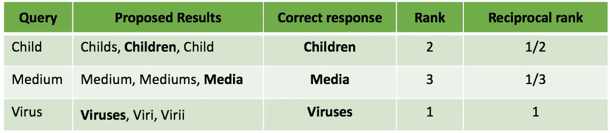
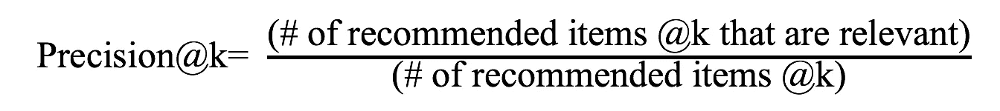
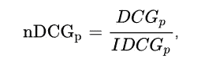
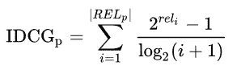
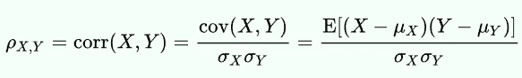
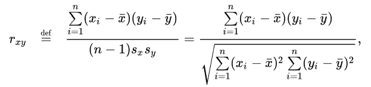
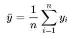
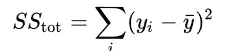
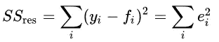
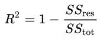

# 20 个流行的机器学习指标。第 2 部分:排名和统计指标

> 原文：<https://towardsdatascience.com/20-popular-machine-learning-metrics-part-2-ranking-statistical-metrics-22c3e5a937b6?source=collection_archive---------3----------------------->

## 简要介绍机器学习中用于评估分类、回归、排名、统计、视觉、NLP 和深度学习模型的最重要指标

丹·弗里曼在 Unsplash 上拍摄的照片

# 介绍

在这篇文章的第一部分，我介绍了用于评估分类和回归模型的 10 个指标。在这一部分中，我将介绍用于评估为排名开发的模型(也称为学习排名)的度量标准，以及统计模型的度量标准。特别是，我将讨论以下 5 个指标:

*   *平均倒数排名(MRR)*
*   *k 点精度*
*   *DCG 和 NDCG(归一化贴现累计收益)*
*   *皮尔逊相关系数*
*   *决定系数(R )*

# 排名相关指标

排序是机器学习中的一个基本问题，机器学习试图根据项目在特定任务中的相关性对项目列表进行排序(例如，根据页面与给定查询的相关性对谷歌页面进行排序)。它在电子商务和搜索引擎中有广泛的应用，例如:

*   电影推荐(如**网飞**和 **YouTube** )，
*   在**谷歌**上的页面排名，
*   在亚马逊上对电子商务产品进行排名，
*   查询自动完成，
*   在 **vimeo** 上进行图片搜索，
*   在 **Expedia** / **预订**上搜索酒店。

在学习排序问题中，该模型试图预测给定任务的项目列表的排序(或相对顺序)。排序问题的算法可以分为:

*   ***逐点模型:*** 试图预测数据集中每个查询-文档对的(匹配)得分，并使用它对项目进行排序。

*   ***列表式模型:尝试直接优化上述评估指标之一的值，对训练数据中的所有查询进行平均。***

***在评估过程中，给定几个查询的项目列表的基本顺序，我们想知道这些项目列表的预测顺序有多好。***

***对于评估排名问题，提出了各种度量标准，例如:***

*   ***维护、修理和更换***
*   ***精度@ K***
*   ***DCG 和 NDCG***
*   ***地图***
*   ***肯德尔氏τ***
*   ***斯皮尔曼氏 rho***

***在本帖中，我们关注上面的前 3 个指标，它们是排名问题最流行的指标。***

> ***其中一些指标可能非常琐碎，但为了完整起见，我决定涵盖它们。所以请随意跳过你熟悉的那些。没有任何进一步的原因，让我们开始我们的旅程。***

## ***11- MRR***

***平均倒数排名(MRR)是评估排名模型的最简单的指标之一。MRR 本质上是一组查询 Q 的“第一相关项目”的倒数排名的平均值，并且被定义为:***

******

***为了说明这一点，让我们考虑下面的例子，其中模型试图通过屏蔽 3 个猜测来预测英语单词的复数形式。在每种情况下，也给出了正确的答案。***

******

***该系统的 MRR 可以被发现为:***

*****MRR = 1/3 *(1/2+1/3+1/1)= 11/18*****

***MRR 的局限性之一是，它只考虑其中一个项目(最相关的一个)的排名，而忽略了其他项目(例如介质，因为介质的复数形式被忽略)。对于我们想要浏览相关项目列表的情况，这可能不是一个好的度量。***

## ***12-k 精度***

***k (P@k)处的精度是另一个流行的度量，它被定义为“前 k 个文档中相关文档的数量”:***

******

***例如，如果您在 Google 上搜索“洗手液”，在第一页中，10 个链接中有 8 个与洗手液相关，则该查询的 P@10 等于 0.8。***

***现在要找到一组查询 Q 在 k 处的精度，可以找到 Q 中所有查询的 P@k 的平均值。***

***P@k 有几个限制。最重要的是，它没有考虑相关文档在前 k 个中的位置。在这种情况下，手动评估模型也很容易，因为只需要检查前 k 个结果来确定它们是否相关。***

***注意，recall@k 是另一个流行的指标，可以用非常相似的方式定义。***

## ***13- DCG 和 NDCG***

***标准化的贴现累积收益(NDCG)可能是评估学习排序系统的最流行的度量。与之前的指标不同，NDCG 考虑了文档的顺序和相对重要性，并重视将高度相关的文档放在推荐列表的前列。***

***在给出 NDCG 的官方定义之前，我们先介绍两个相关的指标，累积收益(CG)和折现累积收益(DCG)。***

*****一组检索到的文档的累积增益(CG)** 是它们与查询的相关性分数的总和，定义如下。***

******

***这里我们假设每个文档与一个查询的相关性分数是给定的(否则它通常被设置为一个常数值)***

*****贴现累积增益(DCG)** 本质上是 CG 的加权版本，其中使用对数缩减因子来将相关性分数与结果的位置成比例地贴现。这很有用，因为在实践中，当分析系统的性能时，我们希望给予前几个项目(比后面的项目)更高的优先级。DCG 被定义为:***

******

***还有另一个版本的***

******

*****归一化贴现累积收益(NDCG)** 试图进一步增强 DCG，以更好地适应现实世界的应用。由于检索到的项目集在不同的查询或系统中可能大小不同，NDCG 试图使用 DCG 的规范化版本(通过除以理想系统的 DCG)来比较性能。换句话说，它通过相关性对结果列表的文档进行排序，找到位置 p 处的最高 DCG(由理想系统实现)，并用于将 DCG 归一化为:***

******

***其中，IDCG 是“理想贴现累积收益”，定义如下:***

******

***NDCG 是一个流行的指标，但也有其自身的局限性。它的一个主要限制是它不能惩罚结果中的坏文档。它可能不适合测量可能经常有几个同样好的结果的查询的性能(尤其是当我们主要对前几个结果感兴趣时，因为它在实践中是这样做的)。***

# ***统计指标***

***尽管人们可以将机器学习视为应用统计学，并因此将所有的 ML 度量作为某种统计度量，但有一些度量主要由统计学家用来评估统计模型的性能。这里一些流行的指标包括:皮尔逊相关系数、决定系数(R)、斯皮尔曼等级相关系数、p 值等等。这里我们简单介绍一下相关系数，和 R 平方。***

## ***14-皮尔逊相关系数***

***皮尔逊相关系数可能是整个统计学和机器学习领域中最流行的度量之一。它的应用非常广泛，几乎用于统计建模的每个方面，从特征选择和降维，到正则化和模型评估等等。***

***两个随机变量(或任意两个向量/矩阵)的相关系数显示了它们的统计相关性。***

***两个随机变量 X 和 Y 线性相关系数定义如下:***

******

***这里的μ和σ分别表示每个变量的均值和标准差。***

***在大多数情况下，变量的基本统计分布是未知的，我们所拥有的只是随机变量的 N 个样本(你可以把它想象成一个 N 维向量)。在这些情况下，我们可以使用两个 N 维向量 X 和 Y 的**样本相关系数**，如下所示:***

************

***两个变量的相关系数在[-1，1] 中总是一个**值。
**已知两个变量是独立的**当且仅当它们的相关性是 **0** 。*****

## ***15-决定系数(R)***

***决定系数或 R，正式定义为可从自变量预测的因变量方差的比例。***

***为了更好地理解这意味着什么，让我们假设一个数据集有 N 个样本，对应的目标值为 y_1，y_2，…，y_N。让我们假设我们的模型对这些样本的对应预测值为 f_1，f_2，…，f_N。***

***现在，我们可以定义以下用于计算 R 的术语:***

*   ***观察数据的平均值:***

******

*   *****总平方和**(与数据的方差成比例):***

******

*   ***残差平方和，也叫**残差平方和**:***

******

***那么 R 的最一般定义可以写成如下:***

******

***在最好的情况下，模拟值与观察值完全匹配，这导致 **R =1** 。
总是预测观察数据平均值的模型将具有 **R =0** 。***

# ***摘要***

***在这篇文章中，我介绍了用于评估排名和统计模型性能的 5 个流行指标。在这篇文章的下一部分，我将介绍用于评估计算机视觉、NLP 和深度学习模型性能的 5 个更高级的指标。***

# ***参考***

***[1] Christopher M. Bishop，“**模式识别与机器学习”，** springer，2006。***

***[2]杰罗姆·弗里德曼、特雷弗·哈斯蒂和罗伯特·蒂布拉尼。”**统计学习的要素”，**施普林格统计丛书，2001。***

***[3] Tilo Strutz，“**数据拟合和不确定性:加权最小二乘法的实用介绍及其他”，** Vieweg 和 Teubner，2010 年。***