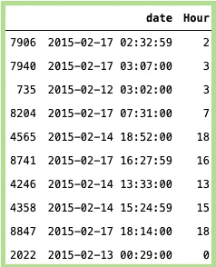
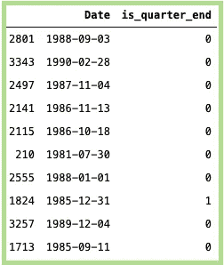

# 使用日期和时间的时间序列的 20 个简单而强大的功能

> 原文：<https://towardsdatascience.com/20-simple-yet-powerful-features-for-time-series-using-date-and-time-af9da649e5dc?source=collection_archive---------32----------------------->

## 时间序列模型的特征工程！

在 [Unsplash](https://unsplash.com?utm_source=medium&utm_medium=referral) 上由 [Aron 视觉](https://unsplash.com/@aronvisuals?utm_source=medium&utm_medium=referral)拍摄的照片

时间序列只不过是相对于时间观察到的一系列数据点。在数据科学中，时间序列主要是一个独立变量，目标是使用历史数据预测未来。传统上，时间序列问题是通过 ARIMA 模型利用其滞后和差分特性来解决的。然而，对于意外事件，记录的信号显示了趋势的更动态的性质，因此仅使用这些传统方法很难获得准确的模型。

时间序列被认为是机器学习中最关键和最难解决的问题之一。

实践者制定了一种现代方法，通过手动特征工程将时间序列转换为表格数据格式来解决机器学习问题。有许多数据集可以用来解决特定的时间序列问题。针对财务、供应链等领域的问题。基于日期和时间的功能可以在捕捉趋势和理解数据方面发挥重要作用，尤其是在时间序列数据方面。

这篇文章主要讲述了一些可以基于*日期和/或时间*纯粹由**创建**的特性。这些特性中有一些是非常常用的，但是还有一些特性可能值得关注和考虑。

> 下面显示的特征工程并不一定意味着它将被机器学习算法作为特征消费，并给出准确的预测。有时，需要不同的维度来更好地查看数据，这只有通过创建此类要素才能实现。

## 必需的软件包:

*   *熊猫*
*   *日期时间*
*   *日历*

**占用检测**数据集来自 [*UCI 机器学习知识库*](http://archive.ics.uci.edu/ml/datasets/Occupancy+Detection+)

数据集的示例如下所示:

## 1.日期:

上面代码的输出

## 2.时间:

上面代码的输出

## 3.小时:

上面代码的输出

## 4.分钟:

上面代码的输出

## 5.第二:

上面代码的输出

获取每日最低温度的数据集，可在找到[。数据集的头部如下所示:](https://raw.githubusercontent.com/jbrownlee/Datasets/master/daily-min-temperatures.csv)

## 6.一年中的星期:

上面代码的输出

## 7.一周中的某一天:

上面代码的输出

## 8.一年中的某一天:

上面代码的输出

## 9.两个日期之间的天数差异:

此功能计算两个日期之间的天数差异。下面是一个显示今天和过去某个 x 日期之间的例子。

上面代码的输出

## 10.两个日期在月份上的差异:

这个特性类似于上面我们用月而不是天来计算两个日期之间的差异。下面是一个显示今天和过去某个 x 日期之间的例子。

上面代码的输出

## 11.离月底还有几天:

这是一个有趣的特性，可以计算离月底还有多少天。在接近月底的趋势下，这真的很有帮助

上面代码的输出

类似地，人们也可以计算 ***天从月的开始。*** 也可以算 ***日 _ 至 _ 感恩节等。***

## 12.一年中的第几个季度:

该功能主要是确定一年中的季度。

上面代码的输出

## 13:确定是否是季度初:

此功能用于确定日期是否是季度的开始。

上面代码的输出

输出通常是布尔型的。将真假映射到 1 和 0

## 14:确定是否是季度末:

这与上面的功能相反，在上面的功能中，我们确定日期是否是季度末。

上面代码的输出

## 15.年份:

该功能用于从日期开始计算*年*。

上面代码的输出

## 16.月份:

该功能用于从日期开始计算*月份*。

上面代码的输出

## 17.日期:

该功能用于从日期开始计算*日*。

上面代码的输出

## 18.确定它是否是月初:

根据日期，此功能确定它是否是月初

上面代码的输出

## 19.确定现在是否是月末:

根据日期，此功能确定是否是月末

上面代码的输出

## 20.确定是否是闰年:

有时，当数据持续时间较长时(比如 10-15 年)，或者如果数据的粒度是每年一次，那么这个特性可能非常有用。不用手动查找和创建，人们可以使用 *datetime* 库直接确定它是否是闰年。

上面代码的输出

## 结论:

感谢您阅读文章。我希望你会觉得它有用。这些是我在处理时间序列问题时经常用到的一些特征。正如我之前提到的，这有助于发现数据背后隐藏的大量事实。正如有人正确指出的那样——“你越是折磨数据，它就越能说话”。非常感谢任何反馈/意见。如果您知道任何有趣的功能，请发表评论并与社区分享！