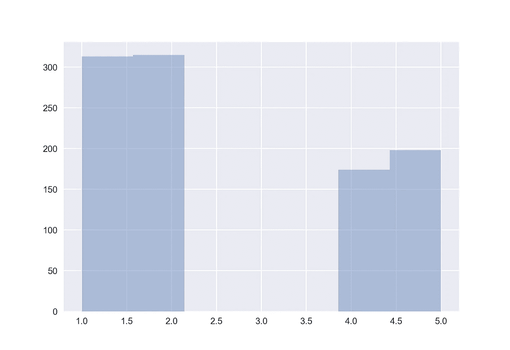
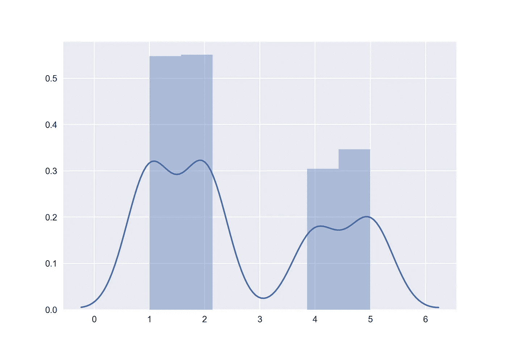

# 2019 小说《冠状病毒:人们的想法》

> 原文：<https://towardsdatascience.com/2019-novel-coronavirus-peoples-thoughts-8c06c3caf20e?source=collection_archive---------18----------------------->

## 使用 Twitter 对 2019 年新型冠状病毒爆发进行简单的情感分析

图片来源:[NIAID](https://www.flickr.com/photos/niaid/)on[Flickr](https://www.flickr.com/photos/niaid/49531042877/in/album-72157712914621487/)(CC0)

***免责声明:*** *本文旨在适应、学习和理解一个情感分析及其潜在用途。这不是任何官方研究的一部分，研究结果也不适合任何形式的决策。*

由于著名的**冠状病毒 *(nCov-19)*** ，公众产生了相当大的恐慌。因此，在这篇文章中，让我们来看看公众的恐慌程度和(一些人)使用人们发布的推文的积极程度。

# 下载数据

在这个实验中，我们将使用标签为**#冠状病毒、#COVID19 和#冠状病毒爆发**的推文。从 3 月 1 日开始，有 1000 条推文被删除。这些将作为一个`json`字符串保存到一个名为`data.json`的文件中，以便于解析。

此外，我们将使用来自 http://www.cs.jhu.edu/~mdredze/datasets/sentiment/的 [**的数据进行培训。我使用了一个数据集，其中的商品评论从 1 星到 5 星不等。我下载了**](http://www.cs.jhu.edu/~mdredze/datasets/sentiment/)**[**processed _ stars . tar . gz**](http://www.cs.jhu.edu/~mdredze/datasets/sentiment/processed_stars.tar.gz)**文件，将子文件夹中的所有`all_balanced.review`文件提取并聚集到单独的路径`data/processed_stars_all`。****

**通过一点点编码，我们可以轻松地从 [twitter](https://www.tweepy.org/) 获取数据。在这篇文章中，我已经下载了 1000 条推文。代码应该是这样的:**

# **预处理数据**

**因为我们是从公共来源下载数据，所以我们必须使用一些预处理，以便为下游分析保留有用的措辞。很少有预处理自然语言内容的常用技术。**

## **符号化**

**这里我们将文本分解成句子，即**句子分词**，并将句子再次分解成作品，即**单词分词**。在本文中，我们将立即执行单词标记化，因为推文大多比典型的社交媒体内容短。**

## **停用词的删除**

**英语由几个停用词组成，这些停用词在句子中增加意义，但在上下文中没有意义。例如像`is` `are` `was` `has`等词语。不要为我们的用例增加价值。**

## **词汇标准化**

**在这个过程中，我们摆脱了单词的形式，从而保留了单一的表征。比如说； ***玩*** ， ***玩*** ， ***可玩*** 等。可以将 ***简化为*** 并保留核心意思。**

**这种正常化有两种形式。**

1.  ****词干** —这就是我们去掉词缀(前缀和后缀)的地方。与单词“ ***play*** ”相关的例子就属于这一类**
2.  **这就是我们使用上下文感知进行词干提取的地方。例如，知道一个单词是名词还是动词对词干有很大的影响。比如说； ***烘干机*** 可能会变成 ***烘干机*** 而实际上它是一个名词。在本文中，为了简单起见，我们将跳过引理满足。**

# **训练模型**

**机器学习分类的起点之一是**朴素贝叶斯分类器**。在本文中，我们将使用一个**多项式朴素贝叶斯分类器(MNB)** 。术语多项式很重要，因为我们的训练数据集由评论星(1-5 星)组成，因此有 5 个可能的标签。**

## **输入**

**我们的输入是压缩文件中的行的形式`feature:<count> …. feature:<count> #label#:<label>.`第一步，我将创建句子，并以 TF-IDF 格式传输它们。这种格式通常可以补偿出现在多个文档中的常用词。这些词通常信息量较少，因为它们的丰度很高。为了查询简单，我将这些数据存储在一个`pandas`数据帧中。**

## **训练和预测**

**下面是我们分析的完整代码。我将在代码下面解释这个过程，这样你可以很容易地理解。**

**可以通过将我们的数据拟合到模型中来进行训练。在我们的例子中,`text_tf = tf.fit_transform(data[‘sentence’])` line 做到了。我们通过在`text_tf_tw = tf.transform(sentences_processed_tw)`中将 twitter 数据转换成 TF-IDF 形式来执行预测。注意，我们在这里使用预处理的 tweet 文本。这种转换将使用我们在培训中使用的单词语料库。因此，新词或推特用户的俚语不会对我们的分析产生任何影响。我们在`predicted_tw = clf.predict(text_tf_tw)`行做预测。**

**这个模型只有大约 70%的准确性，这不是很好，但对于学习和发现来说是一个很好的模型。包含更多社交媒体术语的更大数据集确实会提供更好的训练和准确性。**

# **结果的解释**

**正如您可能已经在我的代码中注意到的，我们简单地绘制了一个直方图，并使用核密度估计(KDE)图来查看分布的性质。它看起来像下面。**

****

**柱状图**

****

**KDE 归一化直方图**

**在该图中，x 轴上的 1-5 对应于恒星或阳性性质。因此，1 表示消极情绪，5 表示积极情绪。我们可以清楚地看到，人们有消极或积极的想法，这清楚地代表了社会的两极分化性质(也可能不是)。**

# **可能的进一步扩展**

**虽然除了文本之外，我没有使用任何其他信息，但我们可以结合时间序列数据和位置信息，以说明谁有不好的想法，以及恐慌可能如何在各国蔓延。在这个领域进行认真的探索将会带来有趣的商机，比如销售口罩(我很确定企业正在这么做)。**

**我相信您已经很好地阅读并看到了大数据的潜在力量！**

**感谢阅读。如果你觉得这很有趣，请留下你的想法。**

**干杯！**