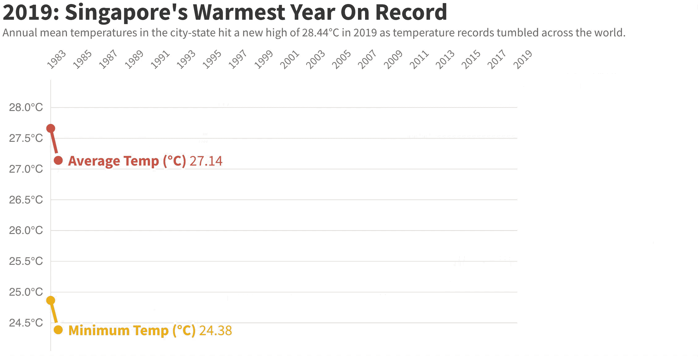
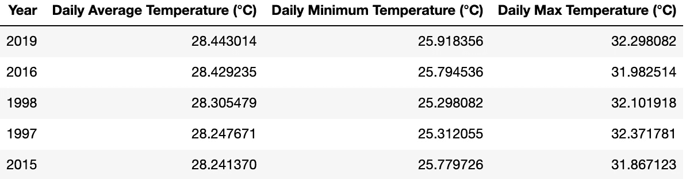
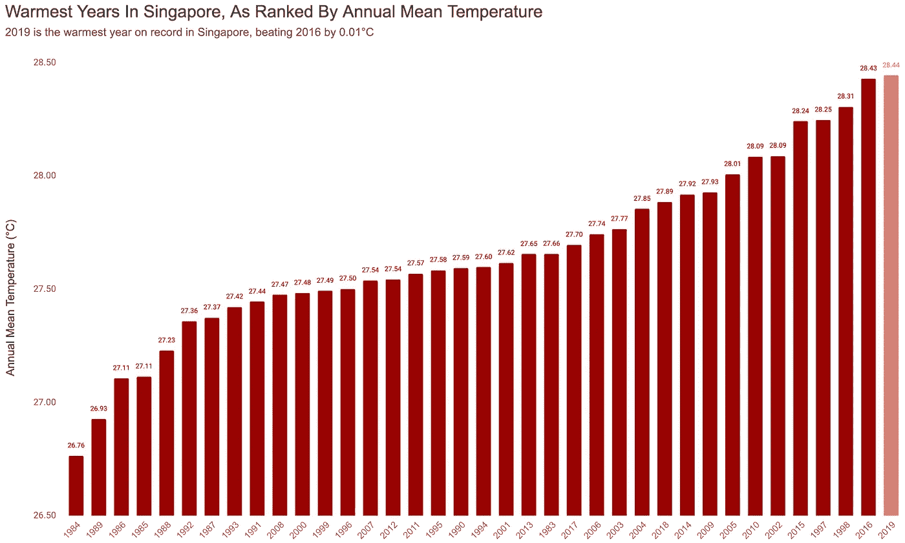
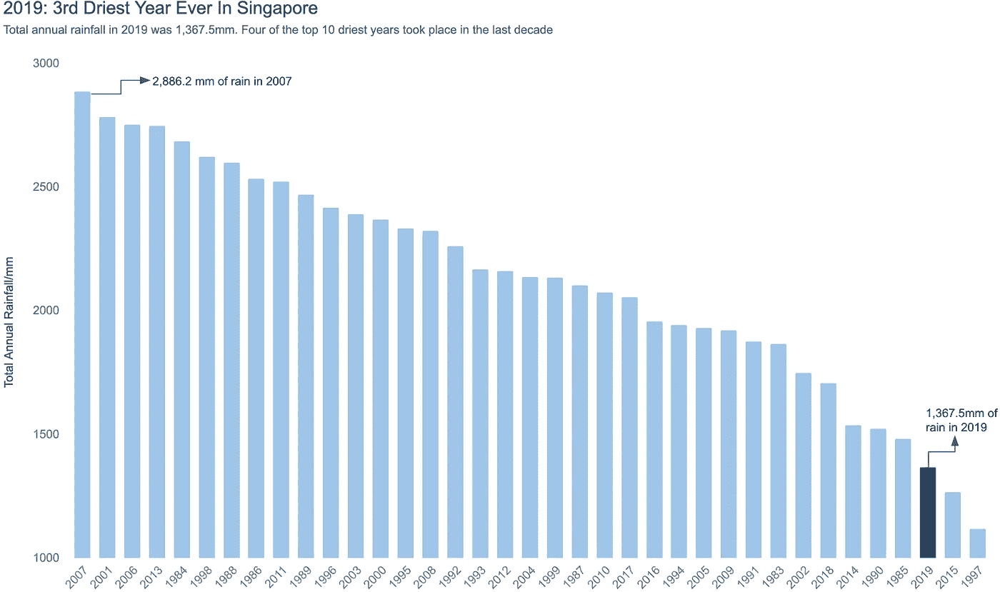
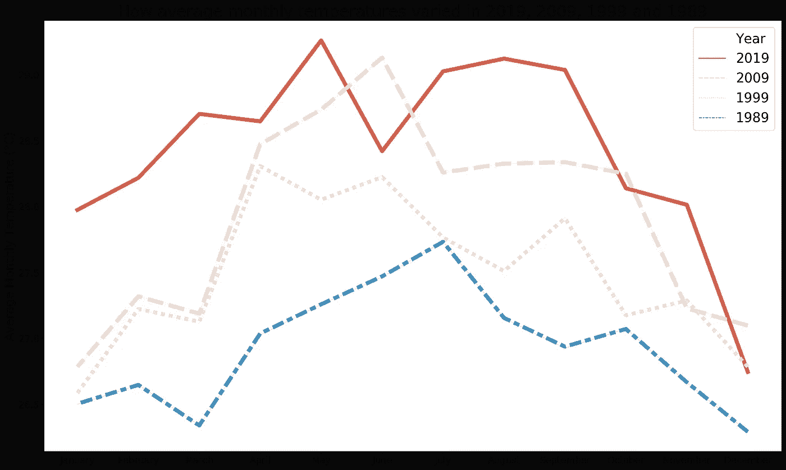
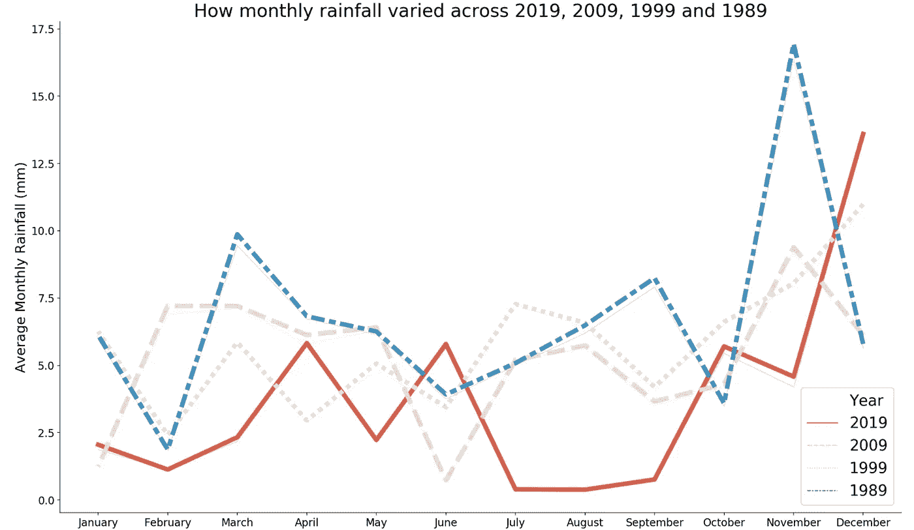

# 2019 年:新加坡有记录以来最热的一年

> 原文：<https://towardsdatascience.com/2019-singapores-warmest-year-on-record-6b9ab1c42e11?source=collection_archive---------43----------------------->

2019 年，这个城市国家的年平均气温达到 28.44 摄氏度，比 2016 年的纪录高出 0.01 摄氏度

资料图片:蔡金汉

2019 年，全球气温记录大幅下降，科学家宣布，这一年是自 1880 年有记录以来第二热的一年。[2010-2019 年也是现代最温暖的十年](https://public.wmo.int/en/media/press-release/wmo-confirms-2019-second-hottest-year-record)。

新加坡也不例外，2019 年的年平均气温达到 28.44 摄氏度，成为有记录以来最热的一年。根据 T4 国家环境局(NEA)的数据，2019 年也是自 1869 年以来第三干旱的一年。

让我们仔细看看 2019 年的主要天气趋势，以及它们与前几年的对比:

通过[繁荣](https://flourish.studio/)创造的线图竞赛

# **数据和笔记本**

这篇文章的原始数据来自新加坡气象局的网站，该网站有 1980 年以来的公共气象记录。1980 年至 1982 年的许多数据点缺失，因此这里的图表比较期仅限于 1983 年至 2019 年。

天气数据被编辑和重组为两个独立的 CSV 文件，以帮助可视化过程。你可以在这里下载[，在这里](https://github.com/chuachinhon/weather_singapore_cch/blob/master/data/weather_1983_2019_full.csv)下载[。](https://github.com/chuachinhon/weather_singapore_cch/blob/master/data/weather_rank.csv)

与这篇文章相关的两个笔记本已经被上传到这个[项目](https://github.com/chuachinhon/weather_singapore_cch)的 Github repo。这里有(数据准备)，这里有(部分图表)。

# 图表 1: 2019 年，按年平均温度排名

除了令人担忧的上升趋势之外，图表 1 中令人震惊的是，迄今为止最热的 10 年中有一半来自过去十年——2019 年(第一)、2016 年(第二)、2015 年(第五)、2010 年(第七)和 2014 年(第十)。

2019 年和 2016 年创下的气温纪录也超过了 1997 年和 1998 年的纪录，当时新加坡和世界都感受到了厄尔尼诺效应对[的冲击。](https://sg.news.yahoo.com/el-nino-and-its-effects-on-the-world-061623781.html)

根据 NEA 的数据，新加坡 2019 年的年平均温度比 1981-2010 年的长期平均温度高 0.9 摄氏度。

# 图表 2:温暖的夜晚

不仅仅是白天更暖和。根据天气记录中的每日最低温度，夜间温度也在 2019 年创下新高。

图表 2 中排名前 5 位的年份中有 4 年来自过去十年的后 5 年，这是全球变暖加速的又一个明显迹象。

# 图表 3: 2019 年，有记录以来第三个最干旱的年份

不出所料，2019 年也是有记录以来最干旱的年份之一。2019 年，新加坡樟宜气候站记录的全年降雨量仅为 1，367.5 毫米。

根据 NEA 的数据，这一数量比 1981-2010 年的长期平均水平低 37%，使 2019 年成为自 1869 年以来有记录以来第三干旱的一年。

2010 年至 2019 年的十年平均气温为 27.95 摄氏度，超过了 2000 年至 2009 年的 27.75 摄氏度和 1990 年至 1999 年的 27.65 摄氏度。但通过绘制 10 年间隔的年度天气模式图，更容易看出这些变化。

让我们比较一下新加坡在过去 40 年(2019 年、2009 年、1999 年和 1989 年)末期的天气模式。

# **图表 4:2019 年、2009 年、1999 年和 1989 年**各月气温变化对比

图表 4 中的红色粗线显示了 2019 年的月平均气温如何普遍超过了 2009 年、1999 年和 1989 年的类似时间点，只有少数例外，如 2009 年 6 月。

其他引人注目的趋势包括:

*   1 月份平均气温的大幅上升，从 1989 年的 26.5 摄氏度上升到 2019 年的 27.97 摄氏度，上升了 1.47 摄氏度
*   在 1989 年、1999 年和 2009 年，在熟悉的 6 月至 7 月高峰之后，月平均气温开始下降。但在 2019 年，月气温与年中趋势相反，反而升至 7 月至 9 月期间的新高。2019 年 8 月和 9 月的月平均气温分别为 29.12 摄氏度和 29.03 摄氏度，是新加坡这两个月的最高气温。

# 图表 5:比较 2019 年、2009 年、1999 年和 1989 年的月降雨量变化

在绘制类似的降雨量而非平均气温图表时，我们可以看到年中趋势的类似变化。在 1989 年、1999 年和 2009 年，6 月西南季风到来后，月总降雨量有所增加。

但在 2019 年，7 月至 9 月的月降雨量降至新低。2019 年 12 月是四年来降雨量最多的一年，但后期的激增不足以弥补今年其他更干燥的月份。正如我们在图表 3 中看到的，2019 年是新加坡有史以来第三干旱的一年。

# **新常态？**

2019 年没有打破任何单日天气记录。例如，1998 年 3 月 26 日，在过去 37 年中记录的最高日最高温度为 36℃。在 2019 年，记录的最高日最高温度是 3 月 12 日，当时樟宜气候站的水银柱达到了 34.8 摄氏度。

同样，2019 年最大的日降雨量仅为 92.2 毫米(10 月 27 日)。这还不到 2011 年 1 月 30 日创下的 216.2 毫米降雨量纪录的一半。

但是总体来看，从上面的图表中可以清楚地看出，新加坡的天气模式已经进入了一个高温少雨的新常态。这不仅会导致更大的个人不适，还会产生相当大的政策影响。

首先，随着家庭更频繁、更长时间地使用风扇和空调，我们可以预计能源消耗将会上升。更干燥的天气意味着新加坡将不得不更多地依赖再生水和海水淡化厂来满足其需求，这反过来又进一步增加了能源的使用。

进入新的十年，还不清楚未来几年新加坡天气模式的变化速度会加快多少。但是套用作家欧内斯特·海明威的话来说，不受欢迎的变化往往会“逐渐地，然后突然地”发生。

和往常一样，如果您发现代码中有任何错误，请 ping 我@

推特: [@chinhon](https://twitter.com/chinhon)

领英:【www.linkedin.com/in/chuachinhon 

如果你对研究新加坡的天气数据集感兴趣，这里是我使用相同记录的早期项目:

*   [检测天气异常值](/detecting-abnormal-weather-patterns-with-data-science-tools-5fae48586469)
*   [可视化变化的天气模式](/visualising-singapores-changing-weather-patterns-1983-2019-a78605fadbdf?source=---------9------------------)
*   [Q3 烤焦器](/scorcher-as-global-records-tumbled-spore-baked-under-one-of-the-warmest-q3-ever-436837cb5b0?source=---------2------------------)
*   [使用“经典”机器学习模型和 Keras 进行天气预测](/weather-predictions-classic-machine-learning-models-vs-keras-41604f8553e2)