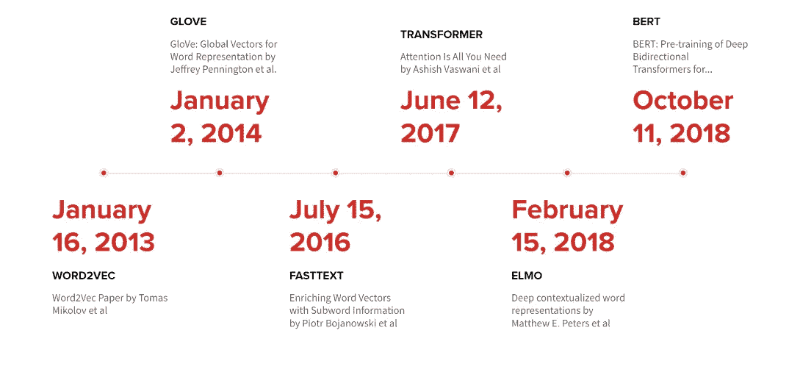
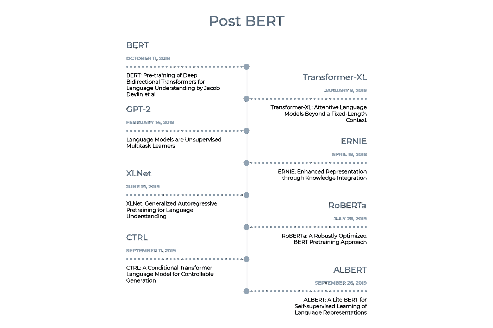
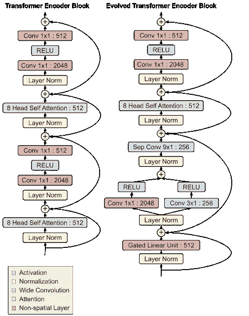
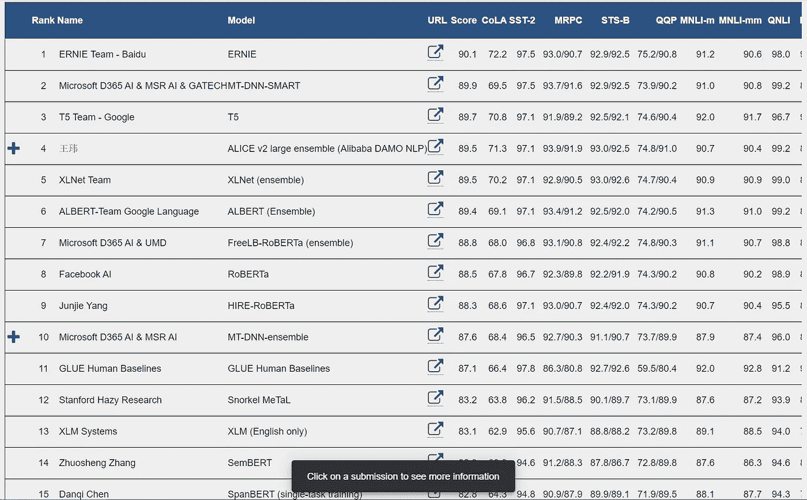
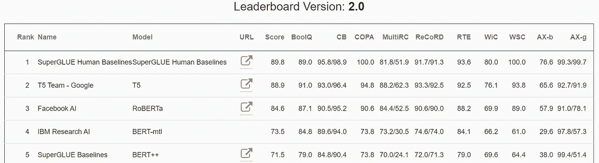
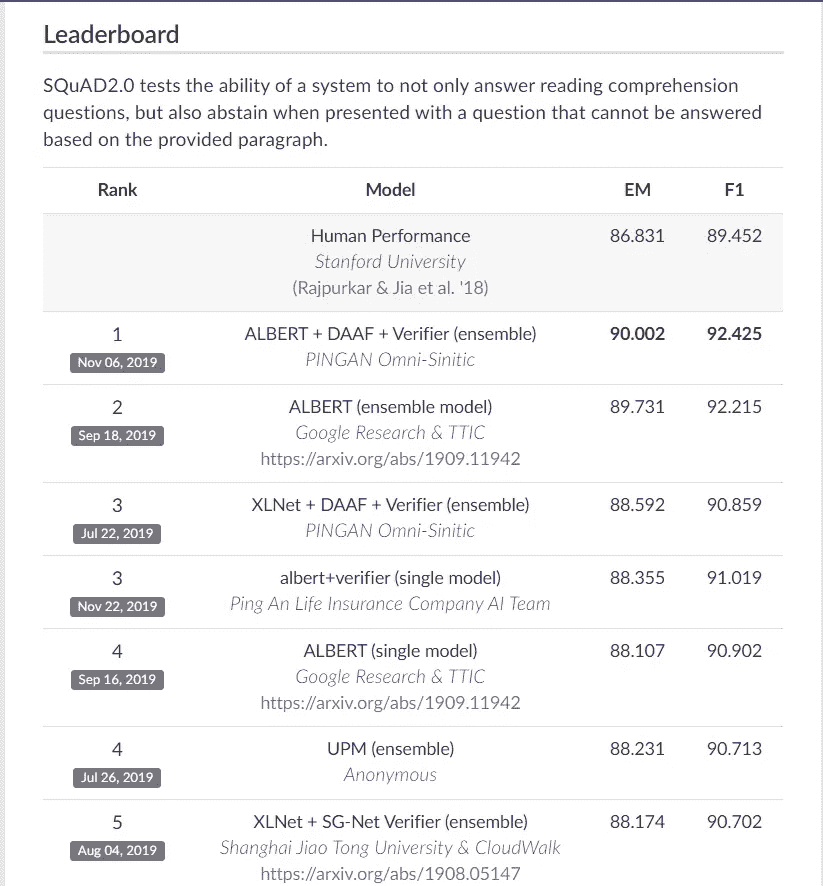

# 2019 —伯特和变压器年

> 原文：<https://towardsdatascience.com/2019-year-of-bert-and-transformer-f200b53d05b9?source=collection_archive---------8----------------------->

## 一篇关于 2019 年 BERT 和 NLP 项目的短文

BERT 论文于 2018 年底发布，之后在 2019 年，我们看到了自然语言处理(NLP)和自然语言理解(NLU)领域的大量活动，从 BERT 在谷歌的搜索生产中使用到其他几个架构，这些架构显示出了比 BERT 更好的结果。BERT 在情感分析、问题回答、句子相似度等多项自然语言处理任务中表现出色。我在 2019 年 1 月使用 BERT 预训练的权重进行了一个[项目](https://blog.insightdatascience.com/using-transfer-learning-for-nlp-with-small-data-71e10baf99a6)，所以这可能是因为我在这一领域工作，但我在任何地方都会看到一些关于 BERT 的参考资料——比如中型文章、iOS 上的 BERT、BERT 的硬件加速、Kaggle 比赛、受 BERT 启发的更大模型等。我也认为[芝麻街](https://en.wikipedia.org/wiki/Sesame_Street)的名字与伯特的流行有一定关系，尽管开创名字潮流的功劳归于来自人工智能[艾伦研究所](https://allenai.org/)的 [ELMO 论文](https://arxiv.org/abs/1802.05365)(深度语境化的单词表达)。BERT 使用双向变压器和许多其他架构，这是在 BERT 也使用了某种形式的变压器之后出现的，基于论文“[注意力是你所需要的全部](https://arxiv.org/abs/1706.03762)”。

## BERT 之前的一些主要 NLP 项目的时间表:

一些主要 NLP 项目的时间表

[2013 年发布的 Word2Vec](https://arxiv.org/abs/1301.3781) 模型仍然非常受欢迎，它通常是任何 NLP 问题中的第一个尝试。[快速文本](https://fasttext.cc/)和[手套](https://nlp.stanford.edu/projects/glove/)嵌入也非常有用。

**语言模型**

ELMO— Elmo 使用双向 LSTM。预训练的 Elmo 重量可以从[这里](https://allennlp.org/elmo)下载。要使用 Elmo 嵌入，可以使用 [AllenNLP](https://github.com/allenai/allennlp/blob/master/tutorials/how_to/elmo.md) 库、 [Tensorflow hub](https://tfhub.dev/google/elmo/3) 或 [Flair](https://github.com/flairNLP/flair/blob/master/resources/docs/TUTORIAL_4_ELMO_BERT_FLAIR_EMBEDDING.md) 库。

[ULMFiT](https://arxiv.org/abs/1801.06146) —杰瑞米·霍华德和塞巴斯蒂安·鲁德的 ULMFiT 论文描述了为特定任务微调语言模型的技术，它使用了 LSTM 的。你可以在这里找到如何使用 ULMFiT 使用 fastai [。](https://docs.fast.ai/text.html)

上述两篇论文出现在 BERT 之前，没有使用基于变压器的架构。

**BERT** —原文是[这里](https://arxiv.org/abs/1810.04805)，还有一个很好的教程，里面有 Jay Alammar 的插图[这里](http://jalammar.github.io/illustrated-bert/)。预训练的重量可以从官方 Github repo [这里](https://github.com/google-research/bert)下载。BERT 也可以作为 Tensorflow hub [模块](https://tfhub.dev/google/collections/bert/1)使用。有各种各样的其他库，也可以很容易地使用预训练的嵌入来微调它们，稍后会在本帖中提到。下面的时间线是 2019 年之后出现的一些主要论文。谷歌甚至开始在产品中使用 BERT 来改善搜索结果。

BERT 之后的项目时间表

[Transformer-XL](https://arxiv.org/abs/1901.02860)—[2019 年 1 月发布的 Transformer-XL](https://ai.googleblog.com/2019/01/transformer-xl-unleashing-potential-of.html) 通过使用一种允许学习超出固定长度上下文的架构，对 Transformer 进行了改进。

《变形金刚》与《进化金刚》的对比— [来源](https://ai.googleblog.com/2019/06/applying-automl-to-transformer.html)

[进化变压器](https://arxiv.org/abs/1901.11117)——大约与 Transformer-XL 同时，[进化变压器](https://ai.googleblog.com/2019/06/applying-automl-to-transformer.html)发布，这是一种通过进行基于[进化的](https://ai.googleblog.com/2018/03/using-evolutionary-automl-to-discover.html)神经架构搜索(NAS)开发的变压器架构。

[GPT-2](https://cdn.openai.com/better-language-models/language_models_are_unsupervised_multitask_learners.pdf) —继伯特之后，我认为另一个获得最多新闻报道的项目是 OpenAI 的 [GPT-2](https://openai.com/blog/better-language-models/) ，因为它能够生成几乎类似人类的句子，而且 OpenAI 最初决定不发布最大的模型，因为担心该模型被用于制造假新闻等。近 10 个月后，他们发布了最大的型号。你可以通过[拥抱脸](https://huggingface.co/)在[https://talktotransformer.com/](https://talktotransformer.com/)和[https://transformer.huggingface.co/](https://transformer.huggingface.co/)玩模型。我想如果它换个名字，甚至是一个芝麻街角色，它会更受欢迎:)

[厄尼](https://arxiv.org/abs/1904.09223)和[厄尼 2](https://arxiv.org/abs/1907.12412) —目前厄尼 2.0 在 GLUE 排行榜上排名第一。 [Github 回购。](https://github.com/PaddlePaddle/ERNIE)

[XLNET](https://arxiv.org/abs/1906.08237)

[RoBERTa](https://arxiv.org/abs/1907.11692) —本文公正地衡量了 BERT 的各种超参数的影响，并表明原始 BERT 模型训练不足，通过更多的训练/调整，它可以超越最初的结果。目前，RoBERTa 的结果在 GLUE 排行榜上排名第 8！

[Salesforce CTRL](https://blog.einstein.ai/introducing-a-conditional-transformer-language-model-for-controllable-generation/) — CTRL 模型有 16 亿个参数，并提供控制人工文本生成的方法。

[ALBERT](https://arxiv.org/abs/1909.11942) —本文描述了参数缩减技术，以降低内存缩减并提高 BERT 模型的训练速度。[阿尔伯特·雷波](https://github.com/google-research/ALBERT)拥有预先训练好的砝码。艾伯特基本模型有 12M 个参数，而伯特基本模型有 110M 个参数！

[大鸟](https://arxiv.org/abs/1910.13034)

**基准测试**

评估这些语言模型的方法之一是 Glue Benchmark，它包括评估模型的各种 NLP 任务，如分类、QA 等。在其发布时，BERT 位于该表的顶端，但在短短一年内，它已移动到第 19 位(截至 2020 年 1 月 2 日)。

截至 2020 年 1 月 2 日的 Glue 基准排行榜— [来源](https://gluebenchmark.com/leaderboard)

现在有一个[强力胶](https://super.gluebenchmark.com/)基准测试，由更难的语言理解任务组成。

截至 2020 年 1 月 2 日的强力胶基准排行榜— [来源](https://super.gluebenchmark.com/leaderboard)

对于评估问答系统[班](https://rajpurkar.github.io/SQuAD-explorer/) ( **S** 坦福德**曲**估计**A**nswering**D**ataset)是常用的，BERT 和后来的基于 transformer 的模型也在这里名列前茅:

截至 2020 年 1 月 2 日的 SQuAD 2.0 排行榜— [来源](https://rajpurkar.github.io/SQuAD-explorer/)

还有各种其他排行榜，如 [ORB](https://leaderboard.allenai.org/orb/submissions/public) 、 [OpenBookQA](https://leaderboard.allenai.org/open_book_qa/submissions/public) 等关于[https://leaderboard.allenai.org/](https://leaderboard.allenai.org/)的排行榜，并且在大多数排行榜中都提到了伯特！

**其他 BERT 相关项目**

[蒸馏伯特](https://arxiv.org/abs/1910.01108)——更小的伯特使用来自 Huggingface 的模型蒸馏，博文[此处](https://medium.com/huggingface/distilbert-8cf3380435b5)。

威震天-LM——Nvidia 的高效训练超大型语言模型的项目。

[BioBERT](https://github.com/dmis-lab/biobert)——由 [DMIS 实验室](https://dmis.korea.ac.kr/)在生物医学领域训练的基于 BERT 的模型。

[德语伯特](https://deepset.ai/german-bert)

[CamemBERT](https://camembert-model.fr/) —基于脸书罗伯塔建筑的法语语言模型。

BERT 硬件加速——谷歌使用 TPU 更快地训练大型 BERT 模型，其他公司如[graph core](https://www.graphcore.ai/posts/new-graphcore-ipu-benchmarks)([code](https://github.com/graphcore/examples/tree/master/applications/popart/bert))和 [Habana](https://habana.ai/habana-labs-goya-delivers-inferencing-on-bert/) 也展示了他们的定制 SoC 如何加速 BERT 推理和训练。

[video Bert](https://arxiv.org/abs/1904.01766)—[video Bert](https://ai.googleblog.com/2019/09/learning-cross-modal-temporal.html)是一个跨模态(或多模态)深度学习的例子，其中模型以自我监督的方式从视频中学习。

[ViLBERT](https://arxiv.org/abs/1908.02265) —学习联合视觉和语言表征的视觉和语言 BERT 模型。

**NLP 库**

下面是一些我认为在 NLP 领域工作的人必须知道的库

Spacy — Spacy 是一个流行且快速的库，用于各种 NLP 任务，如标记化、词性等。它还带有预先训练好的模型，用于命名实体识别(NER)等。最近它通过 [spacy-transformers](https://github.com/explosion/spacy-transformers) 增加了对基于 transformer 的语言模型的支持，这个库使用了 Huggingface transformer 库。

这是第一个提供 BERT py torch 实现的库，最初它被称为“PyTorch-pretrained-bert”。后来，他们增加了更多的模型，如 GPT-2，XLNET 等，现在这个库就叫做“变形金刚”。在不到一年的时间里，它已经成为最受欢迎的 NLP 库之一，并使得使用 BERT 和其他模型变得非常容易。使用他们的另一个库(【https://github.com/huggingface/swift-coreml-transformers】)你可以在 iOS 上使用 BERT，GPT-2 等！

[AllenNLP](https://allennlp.org/) —这是艾伦人工智能研究所的 NLP 图书馆，建在 PyTorch 的顶部。

[Flair](https://github.com/flairNLP/flair) —也是一个 NLP 库，带有 NER、POS 等模型，也支持 [BERT、ELMO、XLNET](https://github.com/flairNLP/flair/blob/master/resources/docs/TUTORIAL_4_ELMO_BERT_FLAIR_EMBEDDING.md) 等嵌入。

[gluonlp](https://gluon-nlp.mxnet.io/)—它是基于 [Apache MXNet](https://mxnet.apache.org/) 之上的 NLP 工具包，是首批包含预训练 BERT 嵌入的库之一。它有很多有用的[例子/教程](https://gluon-nlp.mxnet.io/examples/index.html)。

希望在 2020 年，自然语言处理领域会有更多的创新和突破。要了解更多关于自然语言处理和人工智能的知识，你可以在 twitter 上关注我——[https://twitter.com/MSuryavansh](https://twitter.com/MSuryavansh)

 [## 使用迁移学习进行小数据的自然语言处理

### 使用较小的数据集实现高文本分类准确率。

blog.insightdatascience.com](https://blog.insightdatascience.com/using-transfer-learning-for-nlp-with-small-data-71e10baf99a6)  [## 比以往更好地理解搜索

### 如果说我在谷歌搜索工作的 15 年中学到了什么，那就是人们的好奇心是无止境的…

www.blog.google](https://www.blog.google/products/search/search-language-understanding-bert/)  [## 开源 BERT:自然语言处理的前沿培训

### 自然语言处理面临的最大挑战之一是训练数据的短缺。因为 NLP 是一个…

ai.googleblog.com](https://ai.googleblog.com/2018/11/open-sourcing-bert-state-of-art-pre.html)  [## 了解如何让 BERT 变得更小更快

### 在这篇博文中，我们将讨论如何让像 BERT 这样的大型模型变得更小更快。

blog.rasa.com](https://blog.rasa.com/compressing-bert-for-faster-prediction-2/)  [## ALBERT:一个用于语言表达自我监督学习的 Lite BERT

### 自从一年前 BERT 问世以来，自然语言研究已经采用了一种新的范式，利用了大量的…

ai.googleblog.com](https://ai.googleblog.com/2019/12/albert-lite-bert-for-self-supervised.html)