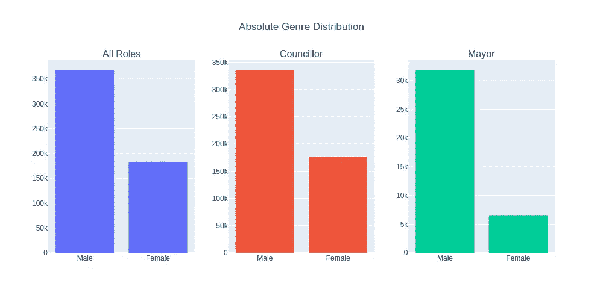
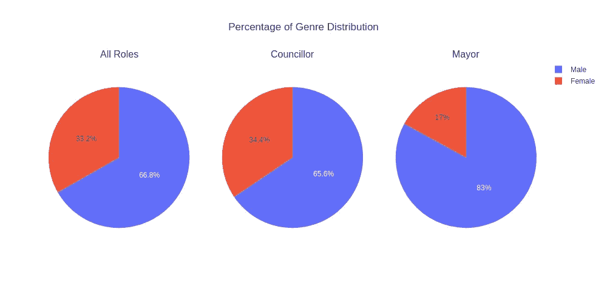
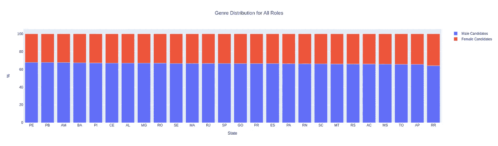
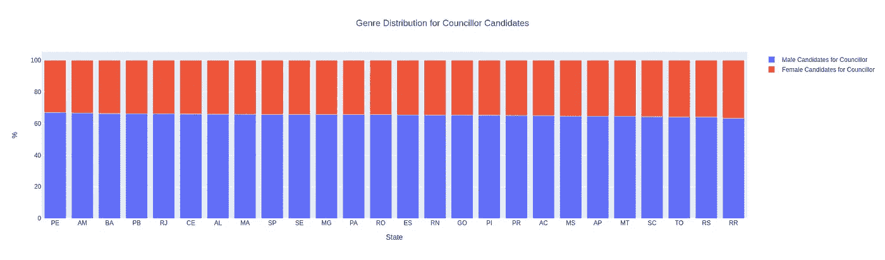
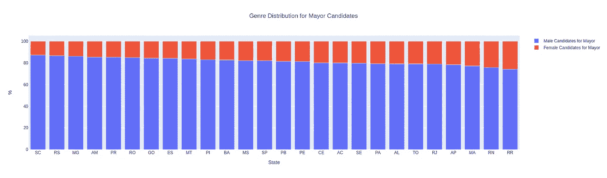
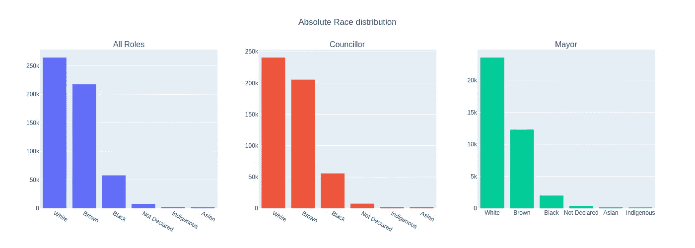
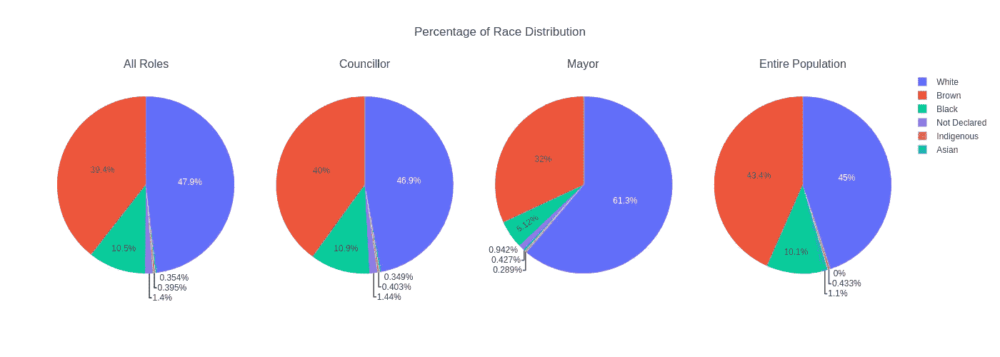
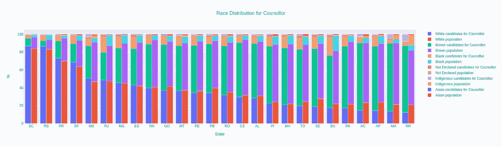

# 巴西 2020 年选举:候选人分布分析

> 原文：<https://towardsdatascience.com/2020-elections-in-brazil-an-analysis-of-candidate-distribution-e1d1aa2a1969?source=collection_archive---------76----------------------->

## 当涉及到他们的政治候选人时，巴西人得到了公平的代表吗？

这是一个关于巴西 2020 年选举候选人的简单 EDA(探索性数据分析)，选举市长和市议员。在我工作的时候，选举还没有举行。我们将关注这两个职位候选人的性别和种族分布。有关所用代码的详细信息，请查看[本 jupyter 笔记本](https://github.com/Pedrohgv/EDA_2020_Brazilian_Elections/blob/master/EDA_2020_Brazilian_Elections.ipynb)。用于此分析的候选数据可以在[这里](https://www.tse.jus.br/eleicoes/estatisticas/repositorio-de-dados-eleitorais-1/repositorio-de-dados-eleitorais)找到，种族分布数据可以在[这里](https://en.wikipedia.org/wiki/Race_and_ethnicity_in_Brazil)找到。

# 性别分布

首先，让我们看看这些职位候选人的性别分布。当然，完美的分布(代表总体人口的分布)应该是男女各半。下图显示了所有职位候选人以及每个职位候选人的绝对和相对性别分布情况。

*作者图片*

*作者图片*

上述图表显示了巴西各地候选人政治代表性的性别差异；尽管妇女占人口的 50%，但她们仅占候选人总数的 33.2%，因此在候选人中代表不足。这种差距在市长候选人的分布上甚至更大(市长是一个更重要的角色，女性仅占 17%)。现在，我们将通过分析每个州在性别代表性方面的概况来进一步了解。

*作者图片*

*作者图片*

*作者图片*

上述图表显示，在考虑所有职位的候选人时，各州之间的性别差异似乎没有太大差异，与全国范围内观察到的差异接近；然而，在观察市长候选人的分布时，我们可以看到，一些州的男性和女性候选人之间的不对称程度比其他州更大。例如，在圣卡塔林纳州，男性市长候选人占候选人总数的 87%以上。

# 种族分布

接下来，我们将分析候选人中的种族分布。为了做到这一点，我们必须获得巴西人口的种族分布数据。这个数据是从 IBGE(巴西地理和统计研究所)收集的官方数据，可以在这里找到[。以下图表显示了所有职位和每个职位候选人的绝对和相对种族分布情况，还有一个具体图表显示了整个人口的比例分布情况。](https://en.wikipedia.org/wiki/Race_and_ethnicity_in_Brazil)

*作者图片*

*作者图片*

从上面可以看出，所有候选人的种族分布似乎与人口分布没有太大差异。但在市长候选人方面，情况并非如此:61.3%的候选人是白人，而整个人口中只有 45%的人自称是白人。另一方面，棕色人种只占这个职位候选人的 32%,却占了总人口的 43.4%。黑人代表也不足，仅占市长候选人总数的 5.12%，而占人口比例的大约两倍(10.1%)。

现在，我们将进一步分析并分别可视化每个州的种族分布。

*作者图片*

*作者图片*

*作者图片*

同样，上面的图表显示了在考虑任何角色的候选人时类似于国家场景的行为，白人有时在一些州甚至略有不足(而在其他州略有过多)。然而，当我们看市长候选人时，这种情况发生了变化，白人在所有州都明显过多，唯一的例外是阿克里州和阿马帕州。

# 结论

从性别分布来看，我们可以看到两个职位的候选人中男性和女性之间存在明显的差距；然而，对于市长职位的候选人来说，这种差距要大得多。另一方面，市议员候选人的种族分布似乎遵循民族构成，而市长候选人的情况却并非如此，白人明显过多。一旦选举开始，不妨重新审视这项工作，分析其结果，并与候选人库的分析进行比较。