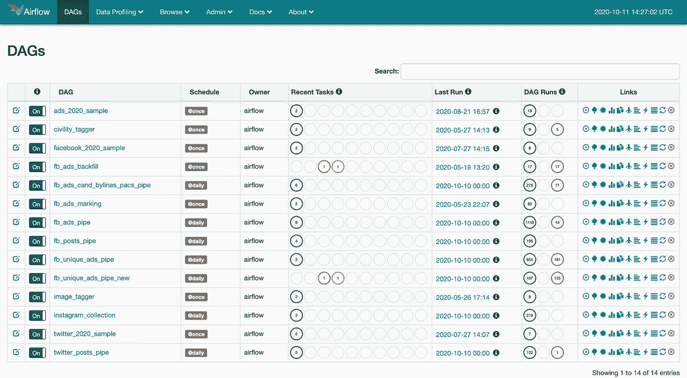
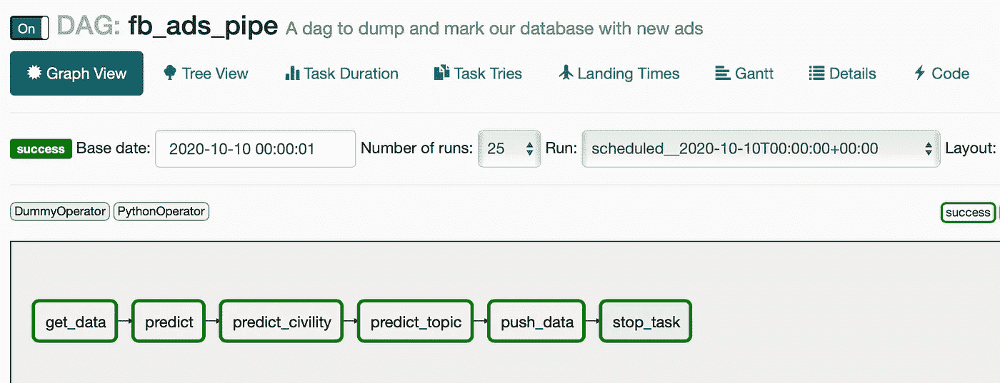
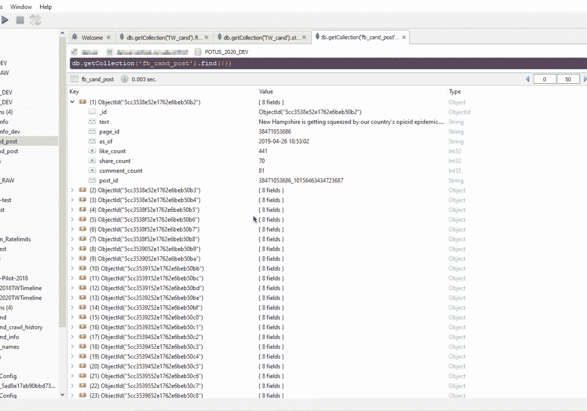
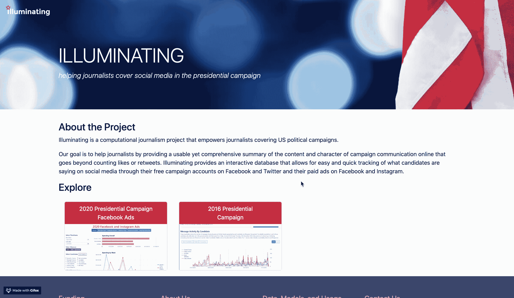
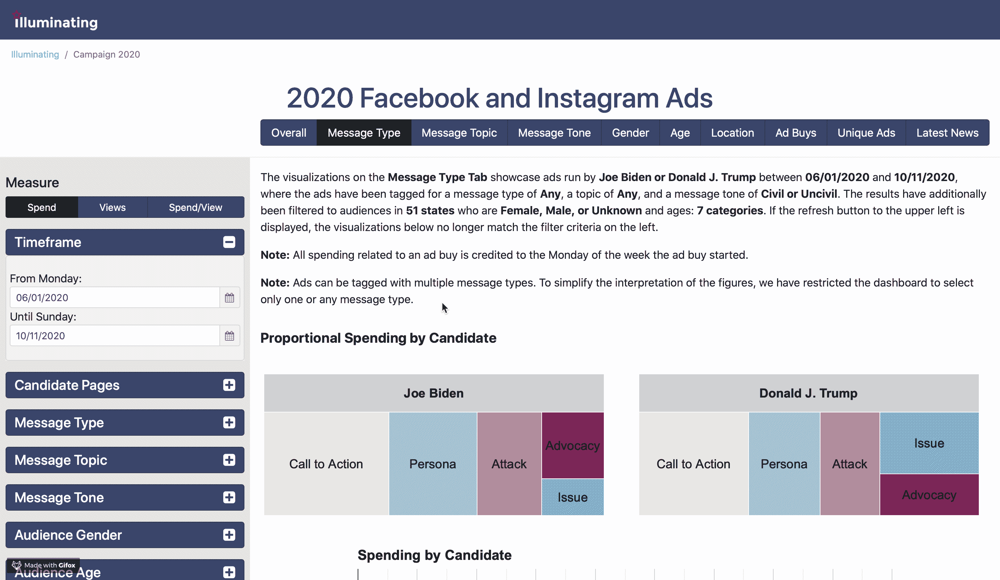

# 2020 年美国大选:我们如何使用数据科学来展示拜登和特朗普的广告策略？

> 原文：<https://towardsdatascience.com/2020-us-elections-how-we-use-data-science-to-unfold-ad-strategies-of-biden-and-trump-with-200095dd369a?source=collection_archive---------54----------------------->

封面由 Jay Kachhadia 设计，配有 Canva(背景图片由 Unsplash 提供)

2020 年美国大选正在全面展开，由于全球疫情对美国的打击如此之大，这是美国非常关键的一年。美国每四年举行一次选举，这是决定这个国家命运的一件大事。作为一名研究助理，我在攻读数据科学硕士学位的两年里一直从事于[照明项目](https://illuminating.ischool.syr.edu/)。尽管该项目最初起源于 2014 年各州州长选举期间。这个项目经过这些年的发展，现在已经变成了一个社交媒体选举分析平台。它帮助记者跟踪候选人的竞选策略。这个项目背后的策划者是[詹妮弗·斯特罗姆-格里](https://twitter.com/profjsg)、[杰夫·海姆斯利](https://twitter.com/JeffHemsley)，以及他们整个[照明团队](https://illuminating.ischool.syr.edu/team/)。该团队由社会科学家、行为科学家、语言科学家、数据工程师和机器学习工程师组成。

# 什么是启发性的？

Illuminating 是一个计算新闻学项目，旨在增强记者报道美国政治竞选的能力。它的目标是通过提供一个有用而全面的在线竞选宣传内容和特点的总结来帮助记者，而不仅仅是计算赞或转发。Illuminating 提供了一个交互式数据库，可以通过候选人在脸书和推特上的免费竞选账户以及他们在脸书和 Instagram 上的付费广告，轻松快速地跟踪候选人在社交媒体上的言论。

# 用于照明的技术(旧)

由于这个项目很老，用于照明的技术非常简单和可靠。我们曾经用内部开源工具来推动我们的 twitter 和脸书收集，这些工具基本上是访问 API 和收集数据的脚本，以及其他一些使用 SVM(支持向量机)来标记数据的脚本，以将内容分类到各种类别，并将它们推送到我们以前的 MySQL 数据库中。所有这些过程过去都在我们的服务器上运行(相信我，我们有许多服务器用于收集，以确保我们不会错过任何东西)。听起来很简单！但这并不是因为我们必须确保我们所有的收集器全天候运行，我们没有得到任何异常数据。

# 驱动下一代照明 2020 的新技术

照明收集和标记架构(使用 Canva 构建)

## 阿帕奇气流

我们一直在研究如何让这种基础设施具有弹性并且完美无瑕。所有这些都使用开源技术，我们有一个非常直接的选择: **Apache Airflow** 。多亏了 Airbnb，Airflow 在行业中被广泛用于创建数据管道和机器学习管道！

我们在服务器上部署了 Airflow，这些服务器完全用 Python 托管数据管道和机器学习管道(我喜欢 Python❤).这是全自动的，令人惊叹。2019 年夏天在 ViacomCBS digital 实习的时候接触到了 Airflow，瞬间爱上了它。虽然它有一个陡峭的学习曲线，但完全值得。

## 伯特

SVM 在自然语言处理分类任务方面表现不错。尽管如此，我们不得不提高我们的游戏水平，并尝试一些语言领域中最受欢迎的分类算法。当时有一个明显的赢家:**伯特。**我们使用了一个预先训练好的 BERT(来自变压器的双向编码器表示)基本模型(12 层，768 个隐藏，12 个头，110M 个参数)，它是在维基百科和英语教科书上训练的，感谢 Google！我们根据我们的分类任务微调 BERT 的最后一层。

## MongoDB

我们从 SQL 数据库 MySQL 切换到 NoSQL 数据库 **MongoDB** 。为什么是 MongoDB？由于其处理大量非结构化数据的能力，它具有更大的优势。它神奇地更快了。人们正在体验真实的 MongoDB 性能，这主要是因为它允许用户以对工作负载更敏感的不同方式进行查询。我们的基础设施上有数百万甚至数十亿条记录，涵盖自 2014 年以来的所有选举，其中包括来自 Twitter、脸书和 Instagram 等社交媒体平台的数据。

# 当前架构和数据收集

“照亮 2020”目前专注于总统候选人的政治广告，并用我们之前开发的代码簿对其进行分类。我们使用 Apache Airflow 来推动我们的数据管道，从脸书广告库 API 收集流媒体广告数据。该数据库每 4 小时更新一次新指标和新帖子，并由我们的机器学习模型进行标记。该数据包含来自脸书和 Instagram 的广告，适用于所有拥有有效脸书和 Instagram 账户的总统候选人。我们从主要候选人页面以及特朗普和拜登竞选团队在其他附属页面上购买的广告中提取广告及其元数据。我们不会为代表候选人的其他实体做广告，例如政治行动委员会。我们只收集那些参加辩论时间足够长的候选人的数据。脸书广告库 API 提供范围内每个广告的花费和印象数据，包括最小和最大数量。我们几乎自动化了从收集到机器学习再到用 Apache Airflow 采样数据的所有事情。

我们的气流有所有的管道(旧图像，你可以在这里看到每天的时间表)

在气流世界中，管道被称为 Dag(有向无环图)。每个管道都由多个任务组成，这些任务涉及通过我们的各种机器学习模型进行数据收集和标记，以便随时了解类别、礼貌和主题，并将所有内容推送到我们的 MongoDB 服务器。

我们的广告收集渠道/DAG 的快照

我们基本上在数据库中维护各种元数据，这基本上自动化了我们的流程中的一切。当我们在候选人的信息收集中添加一个投放日期时。它会自动阻止气流管道收集这些候选者，这意味着管道被智能地编程。

我们数据库中候选人信息的快照

在将数据推送到我们的 MongoDB 之后，我们从那里为我们的照明网络应用提供燃料。

# 照亮 2020

照亮登录页面

“照亮 2020”是 2020 年总统竞选广告分析的一站式商店，目前专注于拜登/特朗普的广告策略。这是一个绝对的发电站！你可以在这里获得更多关于我们广告分类类型的信息[。](https://illuminating.ischool.syr.edu/usage-guidelines-campaign-2020)

消息类型和消息音调分类

我是锡拉丘兹大学信息研究学院的一名硕士生，从事这个关于数据工程和机器学习基础设施的伟大学术研究项目。

# 来看看《照亮 2020》吧！

你可以在 https://illuminating.ischool.syr.edu 的[参观照明。该项目得到了约翰 s .和詹姆斯 L.](https://illuminating.ischool.syr.edu) [奈特基金会](https://knightfoundation.org/)、哥伦比亚大学数字新闻 [Tow 中心、](https://towcenter.columbia.edu/)[计算和数据科学](https://ischool.syr.edu/research/research-centers/ccds/)中心以及锡拉丘兹大学[信息研究学院](https://ischool.syr.edu/)BITS 实验室[的支持。当谈到 2020 年选举的广告分析时，它绝对是一个发电站，它会让你大开眼界。请投票选出 2020 年的最佳，因为这将决定这个国家的未来。](https://ischool.syr.edu/research/research-centers/behavior-information-technology-and-society-bits-lab/)

在 gmail dot com 的[myLastName][myFirstName]上提问，或者在 LinkedIn 上联系。