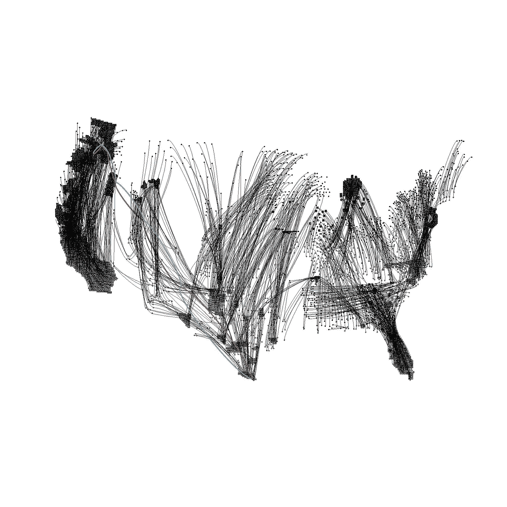

# 数据科学训练营体验的 2020 愿景

> 原文：<https://towardsdatascience.com/2020-vision-on-a-data-science-bootcamp-experience-b1464244cb4c?source=collection_archive---------41----------------------->

## 关于 Metis Bootcamp 的远程学习体验——预、中、后

美国农场工人迁移的数据可视化

以上是我在本科建筑论文项目中完成的第一批数据可视化之一。每个点代表 500 个人。我本来在图上有一个键，但是当时我的教授鼓励我把它去掉——这是一个糟糕的选择！这最终让我想到了为农民工家庭设计的移动校舍。

# 我从哪里来

这是一个建筑师/城市设计师/研究人员如何过渡到数据科学的故事。我遇到的大多数人认为架构师没有资格成为数据科学家，但是我相信对于像我这样的人来说，这是一个完全自然的转变。原因有两个:

1.  数据科学和架构都是数学、科学和艺术的混合体。
2.  数据科学和架构是技术学科，只有对非技术受众有用时才会大放异彩。

我可以在这里进行更深入的探讨——也许这是另一篇文章——但我进入数据科学职业的主要动机是将我的职业生涯更多地转向科学而不是艺术，并填补我在 AEC(建筑、工程和施工)行业和人工智能之间看到的差距。老实说，我受到了哈佛大学 GSD 毕业生斯塔尼斯拉斯·夏鲁的生成设计作品的启发，它为我打开了一扇门，让我可以选择多种途径来填补这一空白。

# 训练营前

## 会话

我哥哥也是一名数据科学家，当我在丹麦攻读城市规划和社会变革博士学位时，他让我开始思考数据可视化。我和他讨论了我正在考虑做一个数据科学训练营，他建议我应该先开始学习编程和教育自己，这样当我去训练营时，我就不是第一次看到这些材料了。这通常是我在考虑转型时从多个渠道得到的建议。这被证明是非常明智的建议。

## 准备

David Malan 教授的哈佛 CS50 课程是我开始学习编程的第一门课程，在将理论分解成代码方面非常出色。我看了一下 [Insight 研究员的职业转型准备材料](https://blog.insightdatascience.com/preparing-for-the-transition-to-data-science-e9194c90b42c)，并开始跟随我自己的一些选择。我从多伦多的一些教授那里学会了 python 编程，也学习了谷歌 Python 课程，从吴恩达学会了机器学习基础，从 Mode Analytics 学会了 SQL。还听了 OCDevel 的机器学习指南播客和其他一些比较理论化的 AI 书籍。我看了一些微积分、统计和概率的复习资料，这并不太难，因为我在 T4 的高中教育是为那些痴迷于数学的人设计的。我对这些工具的力量、它们的潜力以及我使用它们的能力感到非常兴奋。但是，我觉得我会从加速训练营体验中受益，因为:

*   我还没有完成一个端到端的独立数据科学项目。
*   我知道还有很多东西要学，我需要帮助把所有的工具放在一起。
*   我也想有一个真正的社区来加速我的成长。

## 训练营选择

我申请并被大会和 METIS 接受了他们的第一个在线实时队列。我与 GA 和 Metis 的毕业生交谈过，老实说，我并不觉得这两个项目有很大的不同，除了在 Metis，你可以端到端地做更多的项目，这正是我想要的。我住在洛杉矶，但是每天大概要开一个小时的车去大会的校园，所以我选择了 METIS 项目。我也听说了关于 Metis 的一些非常好的事情，真诚地喜欢他们的招生过程和他们提供的大幅折扣，因为这是他们提供的第一个在线直播课程。我对远程程序有一些担心:

1.  与我的同事和导师建立有意义的联系
2.  职业服务能够将我与当地雇主联系起来
3.  能够与讲师进行足够的一对一交流

# 在训练营期间

你可以在 Metis 的网站上阅读[课程和时间表，所以我不会在这里用这些来烦你。在整个训练营中，我最担心的三个问题基本上都解决了。我认为第二点非常正确，但是我从一开始就知道梅蒂斯拉的联系是有限的。](https://www.thisismetis.com/data-science-bootcamps?gclid=CjwKCAjwnIr1BRAWEiwA6GpwNWD1mWnZcIpCWLTEhizdi2aJVrR1sdKq3TnVwVo2mJ6fYJpHHSgL1hoCXc0QAvD_BwE)

## 在线平台中的社会化物流

现场在线群组由大约 10 人组成，但我们与芝加哥的现场群组保持联系。我们的在线直播小组成员大部分位于加利福尼亚和纽约。令我惊讶的是，我能够与我的同学和导师建立牢固的关系。我认为这其中的关键是每天的结对编程练习，以及下午的站立练习，在那里我们互相更新进展并寻求障碍的帮助。我与在线直播和面对面的人都建立了持久的联系。我喜欢在线学习体验的自主程度，因为我觉得我可以专注于工具和项目。

## 一个又宽又深的领域

我们有三位导师，在整个训练营中，很明显他们每个人都有自己对数据科学的特殊兴趣和经验——一位是 NLP，另一位是统计学，还有一位是推荐器和神经网络——但他们都有兴趣教我们他们知道什么以及他们是如何知道的。在训练营期间，在反思了给我们上课的高级数据科学家之后，我感到平静，因为我不需要深入了解所有事情，数据科学在实践中可以有非常不同的专业，每个人都有自己的专业知识和才能。

## 关注业务用例

令人惊讶的是，除非你要求，否则老师不会检查你的代码，而是对你的大部分陈述进行评分。我很惊讶演示文稿被强调了这么多，但我认为这是有意义的，因为代码、建模和度量只是让您编写关于您的模型的业务用例的故事的工具，通过演示文稿，这个故事变得更加清晰。我发现令人惊讶的是，对问题的探索和思考会提高模型的性能——通常比模型调整更有效。我还发现，即使是最简单的模型也能非常有效地运行。项目的重点不是拥有得分最高的最佳模型，而是为机器学习模型构建一个应用程序，了解模型的内部工作方式，并能够评估与您正在解决的业务问题有关的指标。

## 利用我的优势

在训练营期间，我擅长将机器学习工具的应用概念化到商业用例中，并且是制作清晰的图形吸引人的演示文稿的大师。我的团队包括擅长用画面讲故事的专业人士，拥有漂亮代码的程序员，或者擅长脑筋急转弯的数学家。我们在需要改进的地方互相帮助。我认为我们团队所代表的丰富经验对我们的每一次成功都很重要。每个人都有可以提供和学习的东西。

## 插曲

你可以看看我在训练营期间做的项目:

1.  电子设计自动化(Electronic Design Automation)

 [## 优化纽约街头团队

### 营销|数据科学| MTA 十字路口数据+地理数据

medium.com](https://medium.com/@anupamagarla/optimizing-nyc-street-teams-4f5e3bd89105) 

2.回归

 [## 预测动画电影的表现

### 客户演示

towardsdatascience.com](/predicting-animated-film-performance-fc32e3611c71)  [## 预测动画电影表现的数据管道

### 实施线性回归预测动画电影表现的技术演示。

towardsdatascience.com](/predicting-animated-film-performance-5d25748b7481) 

3.分类

 [## 国会选举中的选区翻转预测

### 预测国会选区党翻转

towardsdatascience.com](/district-flip-forecasts-in-congressional-elections-47324c71e7ab) 

4.自然语言处理

 [## 为家长构建基于内容的儿童图书推荐系统

### 睡前故事崩溃的解决方案

towardsdatascience.com](/building-a-content-based-childrens-book-recommender-for-parents-680e20013e90) 

5.激情工程

 [## 用机器学习探测洛杉矶的后院房屋

### 在 METIS 数据科学进行的项目 5/5 沉浸式解决我自己制造的一个商业问题

towardsdatascience.com](/prospecting-las-backyard-houses-with-machine-learning-8fdc191e1cf) 

## 在训练营表现出色

几件事让我在训练营表现出色:

1.  **准备**

我参加的关于编程和机器学习的免费在线课程，以及我在这一学科上所做的研究，都给了我帮助。课堂上讨论的大部分术语和概念，我都不是第一次听到了。我认为这种准备让我能够从容应对每一周，每周最多花 50 个小时在项目和讲座上。我知道其他人工作得更多，但我知道自己的极限，我对质量比对数量更感兴趣。

**2。提问**

我特别注意深入思考我对材料的任何疑问并提出来。

**3。通信**

定期与讲师和我的同事交流进展和挑战。我经常从我的同伴那里得到帮助，或者至少是一个共鸣板，这让我比独自思考时进步得更快。我也喜欢视觉和语言交流，这是作为一名数据科学家应该具备的重要技能。

**4。承诺、专注和时间限制**

我是一个职业生涯中期的过渡者，我在生活中比大多数同龄人走得更远，所以我需要做出承诺，更加专注，我做到了。我的导师帮助我制定了一些策略，比如对我的工作流程的不同部分进行时间限制和优先级排序，创建一个 MVP，然后在此基础上进行构建。

**5。练习**

一开始，我在上课前有规律地骑自行车(太平洋标准时间早上 7 点开始！)，这给了我很多精力和注意力。随着课程的进行，我没有时间那样做，但我仍然在一周内得到了几次乘坐。

# 训练营结束后

训练营结束还不到一个月，所以我以后肯定会有更多的话要说。然而，我确实觉得我的生活中有一个很大的空白，没有那样的日常结构，没有每天掌握一门全新的技术！

## 求职

我课程的最后几周是在新冠肺炎封锁期间，所以行业(除了互联网媒体公司)正在这个不确定的时期喘口气。这不是找工作的理想时机，但我的同学中有些人已经找到了数据科学/工程职位。找工作比我想象的要困难得多，尤其是因为我的大多数关系都在一个刚刚开始使用人工智能的领域。我希望在训练营之前或期间做的一件事是，开始培养与当地数据科学行业的联系——参加聚会和黑客马拉松——特别是在避难所到位协议之前。然而，好处是网上有太多的聚会。对我来说，我有兴趣将人工智能引入 AEC 行业，并计划利用这个不确定的时期建立该领域的技术技能，并与洛杉矶当地志同道合的人建立联系。

## 外卖

我觉得在 METIS 的经历让我充满力量，我不怕接受新技术或职业抱负。这是一次美妙的经历，不同于我经历过的任何其他教育经历(我也有过一些经历——文学学士、硕士、博士)。我认为我的团队中的每个人在离开训练营时都更好地了解了他们对什么样的数据科学感兴趣，他们的优势在哪里，以及如何利用这些优势。我会把这种经历推荐给任何对职业、时间和金钱有独特兴趣的人。