# 21 个数字函数将加速您的数据分析过程

> 原文：<https://towardsdatascience.com/21-numpy-functions-that-will-boost-your-data-analysis-process-1671fb35215?source=collection_archive---------23----------------------->

## 举例说明

SpaceX 在 [Unsplash](https://unsplash.com/s/photos/rocket?utm_source=unsplash&utm_medium=referral&utm_content=creditCopyText) 上拍摄的

*注:除非另有说明，所有图片均由作者创作。*

数据科学的一切都始于数据，数据有多种格式。数字、图像、文本、x 光、声音和视频记录只是数据源的一些例子。无论数据以何种格式传入，都需要转换成数字数组进行分析。

处理数字数组的最重要的工具之一是 NumPy，它是 Python 的一个科学计算包。

在本帖中，我们将介绍 20 个函数和方法，它们将有助于您的数据分析过程。

# **1。数组**

它用于从头开始创建一个数组或将一个列表或熊猫系列对象转换为一个数组。

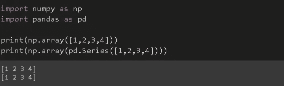

# **2。阿兰格**

它在指定的增量范围内创建一个数组。

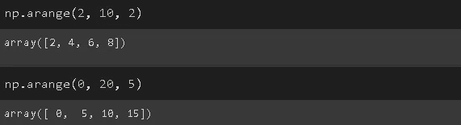

前两个参数是下限和上限(上限是唯一的)。第三个参数是步长。

# **3。林空间**

它在指定范围内创建一个具有等距元素的数组。

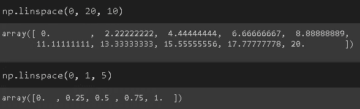

前两个参数决定了下限和上限。与 arange 函数不同，upper bound 是包含性的。第三个参数指定在该范围内需要多少个等距元素。

# **4。独特的**

它返回数组中唯一元素的数量。我们还可以使用 return_counts 参数查看每个元素在数组中出现的次数。

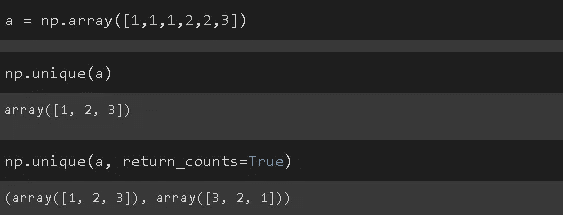

# **5。Argmax 和 argmin**

它们返回沿轴的最大值和最小值的索引。

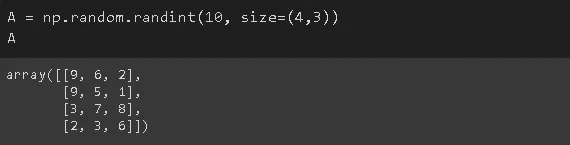

axis=1 的 Argmax 将返回每行中最大值的索引。axis=0 的 Argmin 将返回每列中最小值的索引。

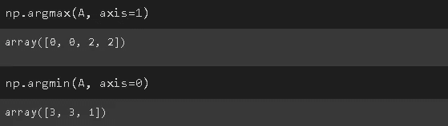

# **6。Random.random**

它创建一个在 0 和 1 之间随机浮动的数组。同样的操作也可以用 random_sample 函数来完成。

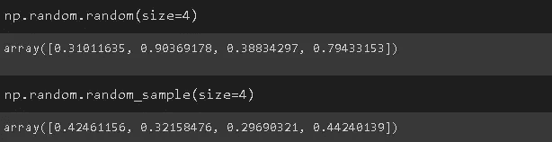

# **7。Random.randint**

它创建任意形状的整数数组。

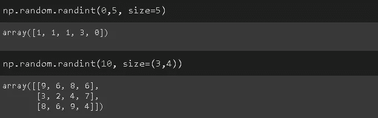

前两个参数决定了界限。如果只通过一个界限，则认为是上限，下限取为 0。

# 8。Random.randn

它返回标准正态分布的一个或多个样本(即零均值和单位方差)。

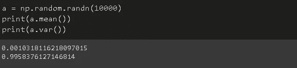

让我们也绘制这些值来观察标准的正态分布。

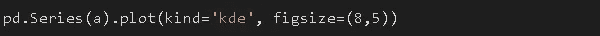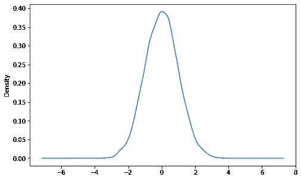

# 9。Random.shuffle

它通过打乱数组的元素来修改数组的顺序。

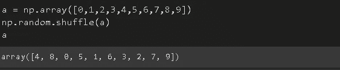

# 10。重塑

顾名思义，它改变数组的形状。必须保持整体大小。例如，形状为 3x4 的数组可以转换为形状为 2x6 的数组(大小为 12)。

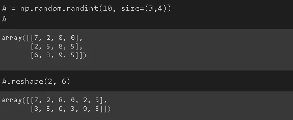

您还可以在一个维度中指定大小，并为另一个维度传递-1。Numpy 将推断形状。

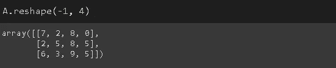

整形还用于增加数组的维度，这是处理机器学习或深度学习模型时的常见做法。

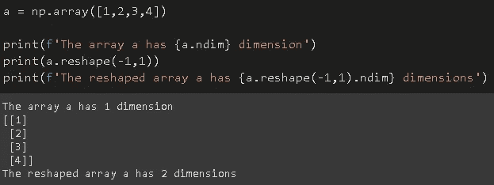

# **11。Expand_dims**

它扩展了数组的维度。

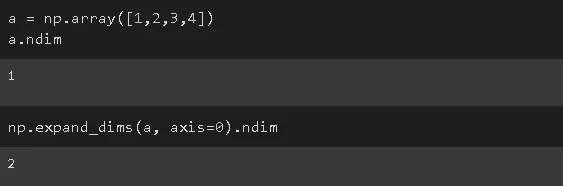

轴参数允许选择通过哪个轴进行扩展。axis=1 的 Expand_dims 等效于 shape(-1，1)。

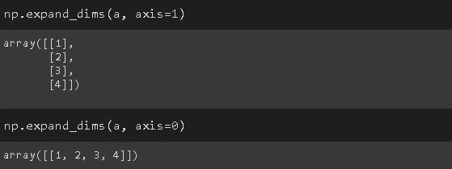

# **12。Count _ 非零**

它返回数组中非零元素的计数，这在处理高度稀疏的数组时会很方便。

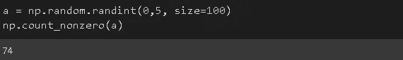

# **13。Argwhere**

它返回数组中非零元素的索引。

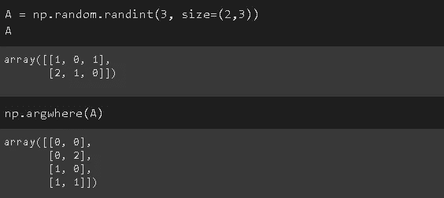

例如，第一行中的第二列为零，因此 argwhere 函数不会返回它的索引([0，1])。

# 14。零、一、满

这实际上是三个独立的功能，但它们的功能非常相似。它们用 0、1 或特定值创建数组。

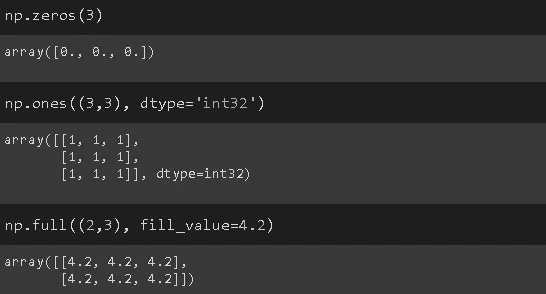

默认数据类型是 float，但可以使用 type 参数将其更改为整数。

# **15。眼睛和身份**

眼睛和身份都创建具有指定维度的身份矩阵。**单位矩阵，**表示为 **I，**是对角线上有 1 而其他位置都有 0 的方阵。

单位矩阵的特殊之处在于它在相乘时不会改变矩阵。在这个意义上，它类似于实数中的数字 1。

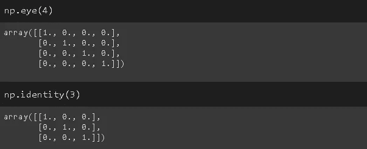

矩阵的**逆**是与原矩阵相乘时给出单位矩阵的矩阵。不是每个矩阵都有逆矩阵。如果矩阵 A 有逆，则称之为**可逆**或非奇异。

# 16。拉威尔

Ravel 返回一个扁平数组。如果你熟悉卷积神经网络(CNN)，汇集的特征映射在馈送到完全连接的层之前被展平。

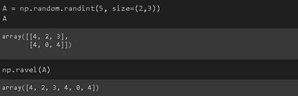

第二行连接在第一行的末尾。Ravel 函数还允许使用 **order** 参数进行列级连接。

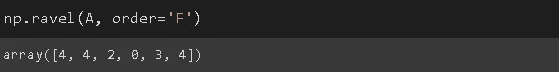

# 17。Hsplit 和 Vsplit

它们垂直(vsplit)或水平(hsplit)拆分数组。

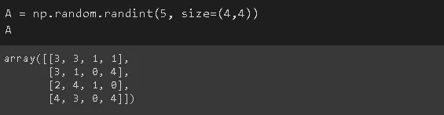

a 是一个形状为 4x4 的数组。水平拆分将产生两个 4x2 的数组。

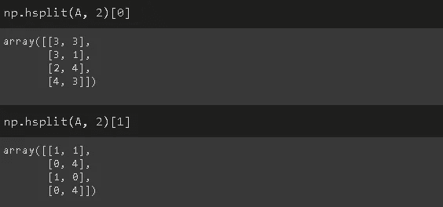

如果垂直拆分，则生成的数组将具有 2x4 的形状。

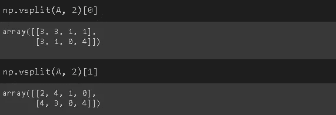

# 18。Hstack 和 Vstack

它们水平地(按列)和垂直地(一行一行地)堆叠数组

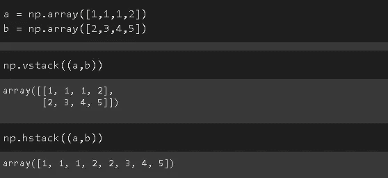

# 19。转置

它转置一个数组。在二维数组(即矩阵)的情况下，转置意味着交换行和列。

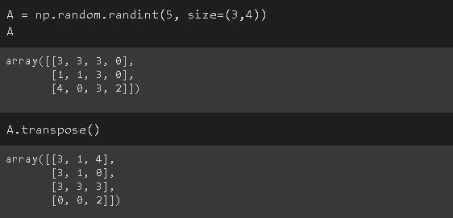

# 20。Abs 和绝对

abs 和 absolute 都返回数组中元素的绝对值。

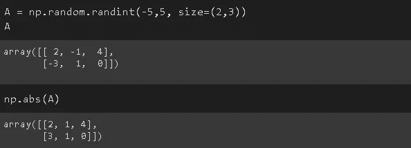

# **21。一圈又一圈**

它们都将浮点数舍入到指定的小数点位数。

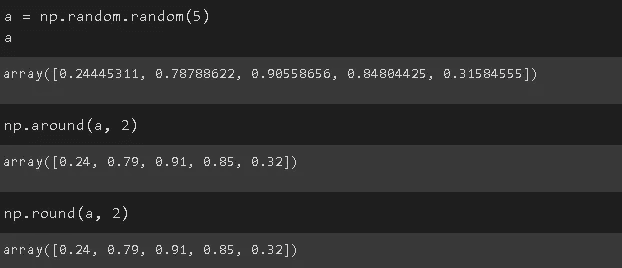

我们只介绍了使用 NumPy 可以完成的部分操作。但是，这些是您在典型的数据分析和操作过程中可能会用到的操作。

NumPy 被证明是一个非常灵活和高效的科学计算库。它是许多 Python 库(如 Pandas)的基础。

感谢您的阅读。如果您有任何反馈，请告诉我。