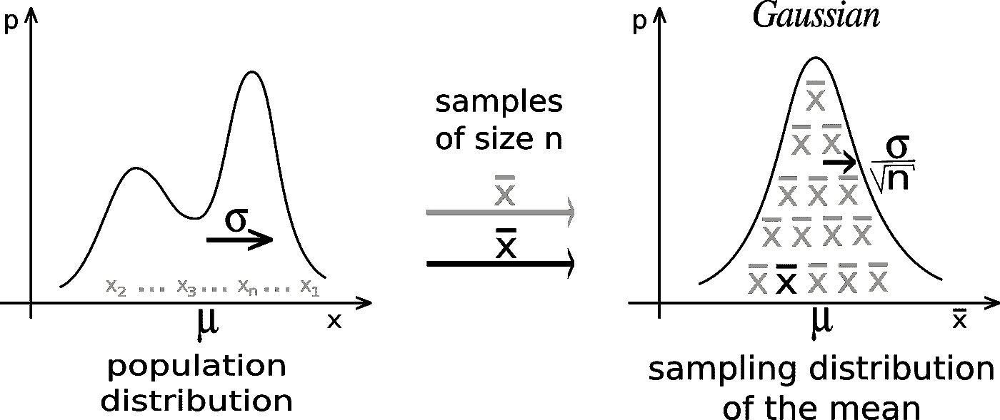
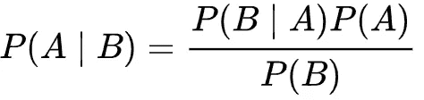
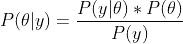
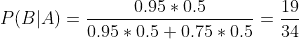
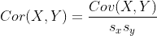
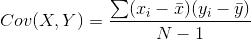
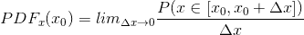

# 为数据科学面试做准备的 22 个统计问题

> 原文：<https://towardsdatascience.com/22-statistics-questions-to-prepare-for-data-science-interviews-d5651a8b3c56?source=collection_archive---------5----------------------->

Clem Onojeghuo 在 [Unsplash](https://unsplash.com/s/photos/job-interview?utm_source=unsplash&utm_medium=referral&utm_content=creditCopyText) 拍摄的照片

## 自信的钉钉数据科学访谈，第 2 部分

在我之前的文章中，我讨论了为面试做准备的机器学习问题:

 [## 准备面试的 20 个机器学习相关问题

### 自信地完成面试

towardsdatascience.com](/20-machine-learning-related-questions-to-prepare-for-interviews-93bcba72f911) 

在接下来的三篇文章中，我将提出一些概率练习题，并为数据科学面试准备案例研究和行为问题。请点击此处查看:

 [## 数据科学面试的 12 个概率练习题

### 自信地完成数据科学面试，第 3 部分

towardsdatascience.com](/12-probability-practice-questions-for-data-science-interviews-2ec5230304d9)  [## 在数据科学面试中组织您对案例研究问题的回答

### 自信地完成数据科学面试，第 4 部分

towardsdatascience.com](/structure-your-answers-for-case-study-questions-during-data-science-interviews-a14a02d21e6c)  [## 为数据科学面试准备行为问题

### 自信地完成数据科学面试，第 5 部分

towardsdatascience.com](/prepare-behavioral-questions-for-data-science-interviews-96e97f13be15) 

在这篇文章中，我将提出你在面试中可能会遇到的 22 个基本统计学问题。

**1、什么是假设检验？**

**假设检验**是一种统计推断的方法。基于从调查或实验中收集的数据，假设零假设为真，计算从数据中观察统计数据的概率(p 值)。然后，您决定是否拒绝比较 p 值和显著性水平的零假设。它被广泛用于测试一种效应的存在。

**2、什么是 p 值？**

**P 值**是在零假设为真的情况下观察到数据的概率。较小的 p 值意味着拒绝零假设的可能性较大。

**3、什么是置信度？**

假设检验中的**置信水平**是当零假设为真时，不拒绝零假设的概率；

P(不排斥 H0|H0 为真)= 1 - P(排斥 H0|H0 为真)

默认置信度设置为 95%。

**4、什么是置信区间？**

与点估计相反，**置信区间**是通过统计推断获得的参数的区间估计。其计算方法如下:

[点估计- cv*sd，点估计+ cv*sd]

其中，cv 是基于样本分布的临界值，sd 是样本的标准偏差。

在置信区间中解释置信是至关重要的。例如，如果我说等车时间的 95%置信区间是[5 分钟，10 分钟]，我实际上在说什么？请点击这里查看我的文章，了解更多详情:

 [## 如何解释置信区间中的置信

### 你有多自信？

medium.com](https://medium.com/an-idea/how-to-interpret-the-confidence-in-confidence-interval-3f3b37794089) 

**5、什么是统计力？**

**统计功效**测量当零假设为假时拒绝零假设的概率:

P(拒绝 H0|H0 是假的)= 1- P(不拒绝 H0|H0 是假的)

默认统计功效设置为 80%。

**6、什么是 I 型错误，什么是 II 型错误？**

**I 型错误**是 p(拒绝 H0|H0 为真)，是假阳性(感谢 [Koushal Sharma](https://medium.com/u/44eecac299be?source=post_page-----d5651a8b3c56--------------------------------) 捕捉到这里的错别字)，是⍺，是负一的置信水平；

**第二类错误**是 P(不排斥 H0|H0 是假)，是假阴性，是β，是 1 减统计功效。

在 I 型误差和 II 型误差之间有一个权衡，这意味着如果其他一切保持不变，为了减少 I 型误差，我们需要增加 II 型误差。

如果您对将 I 型错误和 II 型错误与机器学习模型中的分类度量联系起来感兴趣，请阅读我的文章了解更多详细信息:

 [## 模型评估分类度量的最终指南

### 将机器学习模型与假设检验相结合。别扯头发了，读读这篇文章。

towardsdatascience.com](/the-ultimate-guide-of-classification-metrics-for-model-evaluation-83e4cdf294d9) 

**7、什么是中心极限定理(CLM)？**

[**中心极限定理**](https://en.wikipedia.org/wiki/Central_limit_theorem) 指出，无论总体的原始分布是什么，当从总体中抽取随机样本时，随机样本的均值或和的分布接近正态分布，均值等于总体均值，随着随机样本的变大:

图片来自[维基百科](https://en.wikipedia.org/wiki/Central_limit_theorem#/media/File:IllustrationCentralTheorem.png)

**8、什么是大数定律？**

[**大数定律**](https://en.wikipedia.org/wiki/Law_of_large_numbers) 表示，随着试验次数变得足够多，试验的平均结果会变得更接近期望值。例如，当你掷一枚公平的硬币 1000 次时，你有一半的机会看到正面，而不是只掷 100 次。

**9、什么是标准误差？平均值的标准误差是多少？**

**统计的标准误差**是其抽样分布的标准偏差或该标准偏差的估计值。

使用 CLM，我们可以通过使用总体标准差除以样本大小 n 的平方根来估计均值的标准差。如果总体标准差未知，我们可以使用样本标准差作为估计值。

**10、如何选择一个实验的样本量？**

**样本大小**与样本的标准误差、期望的置信水平、功效和效果大小密切相关。样本大小随着样本的标准误差、置信水平和功效的增加而增加，或者随着样本的效应大小的减小而增加。请看这篇文章背后的直觉:

 [## 样本大小与标准误差、功效、置信水平和效应大小有什么关系？

### 使用图表来展示相关性

towardsdatascience.com](/how-is-sample-size-related-to-standard-error-power-confidence-level-and-effect-size-c8ee8d904d9c) 

**11、什么是自举？**

[**自举**](https://en.wikipedia.org/wiki/Bootstrapping_(statistics)) 是重采样技术之一。给定一个样本，你重复从它的 ***中随机抽取其他样本，并替换*** 。当样本量很小时，以及当您需要估计经验分布时，Bootstrapping 非常有用。我们可以使用 bootstrapping 来估计中位数的标准误差。请阅读下面的文章了解更多详情:

 [## 如何估计中位数的标准误差:自助策略

### 在这篇文章中，我将讨论我们可以用来估计中位数的标准误差的方法。我会先…

towardsdatascience.com](/how-to-estimate-the-standard-error-of-the-median-the-bootstrap-strategy-ed09cccb838a) 

**12、什么是样本偏倚？**

**样本偏差**是指用于统计推断的样本不能很好地代表整个总体。这是因为几个原因:

1、**抽样偏倚**:非随机抽样；

2、**选择偏倚**:样本不代表全部人群。例如，当你想估算所有成年人的平均收入时，在大学里通过一项调查；

3、**回答偏差**:要么是因为回答太少，要么是因为只有某些类型的受试者会回答调查。例如，针对教授教学技能的调查可能只有喜欢或真正讨厌教授的学生做出回应；

4、**存活偏差**:由于忽略了没有通过筛选过程的受试者而产生的偏差。

**13、如何检测离群值？**

**异常值**是与其他观察值显著不同的观察值。检测异常值与定义差异是一样的。最直接的方法是绘制变量，并找到远离其他数据点的数据点。为了量化差异，我们可以使用四分位数和**四分位数间距** (IQR)。IQR 是第三个四分位数减去第一个四分位数(Q3-Q1)。异常值是任何小于 Q1-1.5 * IQR 或大于 Q3+1.5*IQR 的数据点。

如果数据遵循正态分布，异常值是 Z 值大于 3 或小于-3 的点。

**14、什么是贝叶斯推断？**

**贝叶斯推断**是一种统计推断方法，其中 [**贝叶斯定理**](https://en.wikipedia.org/wiki/Bayes%27_theorem) 用于随着更多证据或信息变得可用而更新假设的概率。贝叶斯定理陈述如下:

其中 P(A)是先验信念，P(B)是证据，P(B|A)是 A 发生时事件 B 发生的条件概率。

关于贝叶斯统计的更多细节，请参考我的一篇文章:

 [## 贝叶斯统计终极指南

towardsdatascience.com](/the-ultimate-guide-to-bayesian-statistics-ed2940aa2bd2) 

**15、什么是最大似然估计(MLE)？**

**最大似然估计**是利用贝叶斯定理通过最大化似然函数来估计参数。根据贝叶斯定理:

其中 P(θ)是参数的先验分布；P(y|θ)是描述当我们有参数θ时观察到数据点 y 的可能性的似然函数；P(y)是证据，通常用来归一化概率。最大化 P(θ|y)是寻找最优θ的目标，其中我们最大化给定所有数据点 y 的θ的条件概率。在实践中，一旦我们知道分布，我们就可以很容易地计算 P(y|θ)。因此，我们通过最大化关于θ的似然函数 P(y|θ)来解决优化问题。

**16、利用贝叶斯定理求解** [**下列问题**](https://stats.stackexchange.com/questions/86015/amazon-interview-question-probability-of-2nd-interview)**:**

1、50%接受第一次面试的人会接受第二次面试

你的朋友中有 95%的人得到了第二次面试机会，他们觉得第一次面试很成功

你的朋友中有 75%没有得到第二次面试机会，他们觉得第一次面试很好

如果你觉得你第一次面试很好，你获得第二次面试的概率有多大？

解决这类问题的关键是仔细定义事件。假设你的朋友很好地代表了整个人口:

*   我们把对第一次面试感觉良好定义为事件 A，把收到复试事件 B 定义为；
*   根据 1，P(B)=0.5，这样 P(不是 B)就是 1 减 P(B)，也是 0.5；
*   根据 2，P(A | B)= 0.95；
*   根据 3，P(A |不是 B) = 0.75。
*   给定 P(B)，P(A|B)，P(A |非 B)，P(B|A)是什么？

根据贝叶斯定理:

因此:

**17、相关性和因果性的区别是什么？**

**相关性**是两个变量之间的关系，它可以是正的、负的、零的或很小的相关性，取决于以下等式的符号和大小:

X 和 Y 之间的相关性

其中:

X 和 Y 的协方差

Cov(X，Y)是两个变量的**协方差**，Cor(X，Y)通过 X 和 Y (Sx，Sy)的标准差归一化，使得相关性可以在-1 和 1 之间。当相关性等于-1 时，X，Y 具有完美的负相关性，当相关性等于 1 时，它们具有完美的正相关性。当相关性的绝对值接近零时，X，Y 相互之间的相关性很小。

**因果关系**更难捕捉，它是 X 和 Y 之间的关系，X 导致 Y 发生，反之亦然。例如，在一项研究中，你可能观察到人们每天吃更多的蔬菜更健康，吃蔬菜和健康水平之间显然有正相关。然而，如果仅仅基于这些信息，你不能声称吃更多的蔬菜会使你更健康，这是在陈述因果关系。您可能会观察到这种关系，因为您的研究中的受试者有其他健康的生活方式(省略变量)，可以提高他们的健康水平，吃蔬菜只是他们的健康习惯之一。寻找因果关系需要额外的信息和仔细的建模。更多细节，我有一篇讨论因果推理的文章:

 [## 因果推理:什么、为什么和如何

### 验证决策过程

towardsdatascience.com](/causal-inference-what-why-and-how-d7336b0081ec) 

**18、什么是辛普森悖论？**

**辛普森悖论**指的是在多个群体中观察到的趋势或关系在群体组合时消失或逆转的情况。为什么会有辛普森悖论的快速答案是混杂变量的存在。我有一篇文章用一个例子解释了辛普森悖论:

 [## 所谓的“辛普森悖论”

### 我们因为失去了它而变得更好

medium.com](https://medium.com/the-innovation/the-so-called-simpsons-paradox-6d0efdca6fdc) 

**19、什么是混杂变量？**

**混杂变量**是与因变量和自变量都相关的变量。例如，在检查吸烟和死亡率之间的因果关系时，年龄是一个混杂变量，因为随着年龄的增长，死亡率增加，吸烟率下降。不能控制年龄会造成统计推断中的辛普森悖论。

**20、什么是 A/B 测试，什么时候可以用，什么时候不可以用？**

**A/B 测试**是对 A 和 B 两个变量进行随机实验。通过统计假设测试或“双样本”假设测试，A/B 测试是一种比较单个变量两个版本的方法，通常通过测试受试者对 A 变量和 B 变量的反应，并确定两个变量中哪个更有效。它通常用于改善和优化用户体验和营销策略。

不是每个实验都可以通过 A/B 测试进行:

*   A/B 测试不利于测试长期效果
*   A/B 测试只能比较两个版本，但不能告诉你缺什么
*   当市场存在网络效应时，不能使用 A/B 测试。例如，你不能在同一市场上提高某些消费者的价格，同时降低其他消费者的价格，因为这将扭曲市场需求。

**21、什么是 PMF/PDF？**

**概率质量函数** ( **PMF** )是给出离散随机变量恰好等于某个值的概率的函数。PMF 对连续随机变量不起作用，因为对于连续随机变量 P(X=x)=0 对于所有的 x∈R .相反，我们通常可以定义**概率密度函数(PDF)** 。PDF 是概率的**密度**而不是概率质量；

x0 处的 PDF

**22、总结重要分布。**

我有一篇文章总结了最重要的分布，包括它们的假设、PDF/PMF、模拟等。请点击此处查看:

 [## 数据科学中必须知道的七种统计分布及其模拟

### 假设、关系、模拟等等

towardsdatascience.com](/seven-must-know-statistical-distributions-and-their-simulations-for-data-science-681c5ac41e32) 

这是所有 22 个基本的统计问题。帮助这篇文章帮助你准备你的面试或者刷新你在统计课上的记忆。感谢您的阅读！

这是我所有博客帖子的列表。如果你感兴趣的话，可以去看看！

 [## 我的博客文章库

### 我快乐的地方

zzhu17.medium.com](https://zzhu17.medium.com/my-blog-posts-gallery-ac6e01fe5cc3)  [## 阅读朱(以及媒体上成千上万的其他作家)的每一个故事

### 作为一个媒体会员，你的会员费的一部分会给你阅读的作家，你可以完全接触到每一个故事…

zzhu17.medium.com](https://zzhu17.medium.com/membership)