# 24x5 人工智能股票交易代理预测股票价格|实时交易

> 原文：<https://towardsdatascience.com/24x5-stock-trading-agent-to-predict-stock-prices-with-deep-learning-with-deployment-c15570720ae9?source=collection_archive---------4----------------------->


[乔丹·怀特菲尔德](https://unsplash.com/@whitfieldjordan?utm_source=medium&utm_medium=referral)在 [Unsplash](https://unsplash.com?utm_source=medium&utm_medium=referral) 上的照片

如果你最近关注股票市场，你会注意到新冠肺炎带来的剧烈波动。它一天涨一天跌，这是人工智能很容易预测的。如果有一个拥有人工智能能力的股票交易代理人来买卖股票，而不需要每小时监控，那岂不是很棒？

所以我决定创造一个机器人来交易。你会看到许多从 CSV 读取并创建神经网络的模型，LSTM，或深度强化模型(DRL)。然而，这些模型最终会出现在沙盒环境中，并且在真实环境中使用起来往往很棘手。所以我创造了人工智能管道，实时交易。毕竟，谁不想在股市里赚钱呢？所以让我们开始吧。下面是我们将遵循的实施流程。

1.  羊驼经纪人账户
2.  用于 API 交易的羊驼毛 python 包
3.  收集数据、EDA、特征工程
4.  人工智能模型与训练
5.  AWS 云托管代码并获得预测
6.  创建一个 lambda 函数和 API
7.  自动交易股票

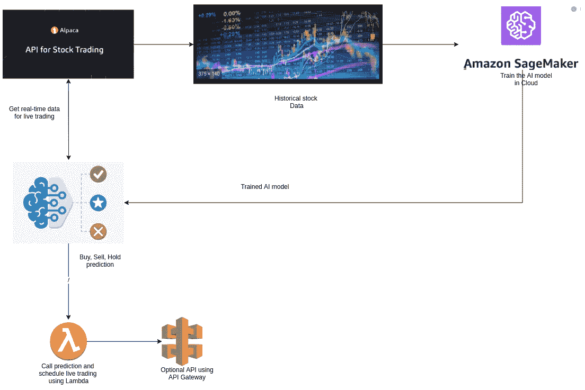

工作流程

# 羊驼经纪人账户:

目前，大多数经纪公司提供零交易费。然而，并不是所有的经纪公司都有 API 选项来交易。[羊驼](http://alpaca.markets)提供免费交易用 python API 进行交易。一旦您创建了一个帐户，您将有纸交易和现场交易的选择。我们可以在纸上交易中测试策略，并在现场交易中实施。这只是实时交易的一个关键变化。

# 用于 API 交易的羊驼毛 python 包:

如果能有本地环境，可以安装 [pip 包](https://pypi.org/project/alpaca-trade-api/)。安装后，您可以选择纸上交易或现场交易。


基于您的选择，您可以获得 API 和密钥。

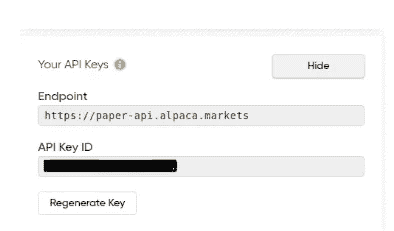

现在，这些键将在我们的代码中使用。

```
import alpaca_trade_api as tradeapiapi = tradeapi.REST('xxxxxxxx', 'xxxxxxxxxx',base_url='[https://paper-api.alpaca.markets'](https://paper-api.alpaca.markets'), api_version='v2',)
```

# 收集数据并转换

**获取数据**

使用羊驼的一个好处是你可以从多边形 API 中获得历史数据。时间范围可以是分钟、小时、天等。创建数据框后，图表应如下所示。

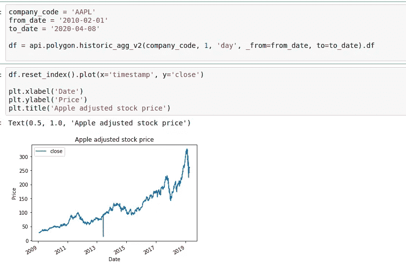

**特征工程**

像任何数据科学项目一样，我们需要创建与数据集相关的要素。实现的某些部分是从[这篇文章](/stock-market-action-prediction-with-convnet-8689238feae3)中引用的。我从上面的数据集中建立了大约 430 多个技术指标。特征包括动量，趋势，波动，RSI 等。

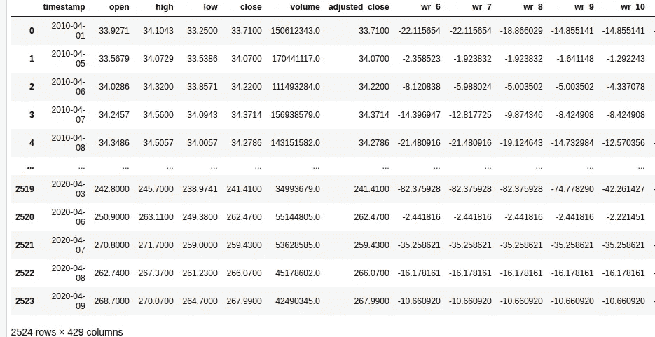

已经为每一天创建了特征。它可以很容易地创建为每小时或任何其他时间段。对于我们将要创建的一些模型，如 DRL LSTM，我们可能需要使用原始数据集。

创建标签和特征是我们必须创建逻辑来训练模型的地方。目前，我使用了本文中[的逻辑。](https://www.researchgate.net/publication/324802031_Algorithmic_Financial_Trading_with_Deep_Convolutional_Neural_Networks_Time_Series_to_Image_Conversion_Approach)

然而，创建逻辑可以根据您的需要进行更改。执行无监督学习时，不需要创建标签。

最后，需要对数据进行缩放。神经网络在缩放数据中工作得更好。第一个函数将使用训练数据拟合 scaler 对象，下一个函数用于缩放任何数据集。

```
# scale train and test data to [-1, 1]
def transform_scale(train):
    # fit scaler

    print(len(train.columns))
    scaler = MinMaxScaler(feature_range=(-1, 1))
    scaler = scaler.fit(train)
    # transform train
    return scaler# scale train and test data to [-1, 1]
def scale(dataset, scaler):
    # transform train
    dataset = scaler.transform(dataset)
    print(dataset.shape)
    return dataset
```

一旦我们创建了模型，我们必须准备好数据作为数据加载器。下面的函数将执行它。

```
def _get_train_data_loader(batch_size, train_data):
    print("Get train data loader.")

    train_X =    torch.from_numpy(train_data.drop(['labels'],axis=1).values).float()

    train_Y = torch.from_numpy(train_data['labels'].values).float()

    train_ds = torch.utils.data.TensorDataset(train_X,train_Y)return torch.utils.data.DataLoader(train_ds,shuffle=False, batch_size=batch_size)
```

# 人工智能模型

在本节中，我们将创建不同类型的模型。但是，这些模型对于时间序列数据集来说可能并不完美。我想展示如何使用具有完整管道的深度学习模型。

**全连接深度 NN**

> 这里我们将创建一个完全连接的深度神经网络。**模型本身并不花哨，我也不指望它能表现得更好。此外，它也不是一个适合时间序列数据的模型。我使用这个模型只是为了使用我们所有的功能，并且为了简单起见。**

然而，我们正从一个基本模型开始，以完善我们的管道。在下一节中，我将展示如何创建其他类型的模型。我们的 model.py 看起来像下面这个。

```
import torch.nn as nn
import torch.nn.functional as F# define the CNN architecture
class Net(nn.Module):
    def __init__(self, hidden_dim, dropout =0.3):

        super(Net, self).__init__()
        # Number of features
        self.fc1 = nn.Linear(427, hidden_dim)

        self.fc2 = nn.Linear(hidden_dim, hidden_dim*2)

        self.fc3 = nn.Linear(hidden_dim*2, hidden_dim)

        self.fc4 = nn.Linear(hidden_dim, 32)

        self.fc5 = nn.Linear(32, 3)

        self.dropout = nn.Dropout(dropout)

    def forward(self, x):

        out = self.dropout(F.relu(self.fc1(x)))

        out = self.dropout(F.relu(self.fc2(out)))

        out = self.dropout(F.relu(self.fc3(out)))

        out = self.dropout(F.relu(self.fc4(out)))

        out = self.fc5(out)

        return out
```

在创建了模型和所需的转换之后，我们将创建我们的训练循环。

我们将在 AWS Sagemaker 中训练我们的模型。这完全是一个可选步骤。模型可以在本地训练，模型输出文件可以用于预测。如果你在云端训练它，下面的代码可以用来训练。

您还需要一个具有 Sagemaker 设置的 AWS 帐户。如果你需要更多的信息或帮助，请查看我以前的文章，[使用 AWS Sagemaker | PyTorch](/train-a-gan-and-generate-faces-using-aws-sagemaker-pytorch-4d4c07ed0c38) 设置部分训练 GAN 并生成人脸。

一旦您拥有了所有需要的访问权限，您就可以开始拟合模型了，如下所示。下面的命令将把所有必要的代码和数据打包，用所需的容器创建一个 EC2 服务器，并训练模型。

```
from sagemaker.pytorch import PyTorch#Check the status of dataloader
estimator = PyTorch(entry_point="train.py",
                    source_dir="train",
                    role=role,
                    framework_version='1.0.0',
                    train_instance_count=1,
                    train_instance_type='ml.p2.xlarge',
                    hyperparameters={
                        'epochs': 2,
                        'hidden_dim': 32,
                    },)
```

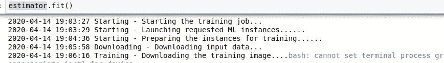

一旦您训练了模型，所有相应的文件将在您的 S3 桶。如果您在本地训练您的模型，确保您在相应的 S3 存储桶位置有文件。

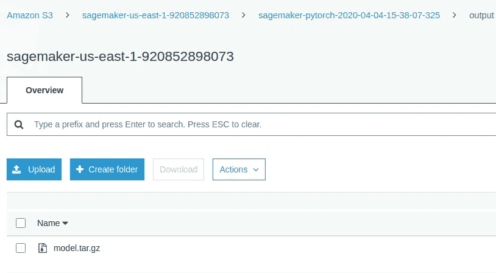

# AWS 云托管代码并获得预测

作为我们的下一个设置，我们将在 AWS Sagemaker 中部署模型。在 SageMaker 中部署 PyTorch 模型时，您需要提供 SageMaker 推理容器将使用的四个函数。

*   这个函数和我们在训练脚本中使用的是同一个函数，它告诉 SageMaker 如何从 S3 桶中加载我们的模型。
*   `input_fn`:这个函数接收发送到模型端点的原始序列化输入，它的工作是反序列化输入，使输入可用于推理代码。在这里，我们将每天或每小时从羊驼 API 创建新数据。
*   `output_fn`:这个函数获取推理代码的输出，它的工作是序列化这个输出，并将其返回给模型端点的调用者。这就是我们交易的逻辑。
*   `predict_fn`:推理脚本的核心是进行实际预测的地方，也是您需要完成的功能。将使用基础数据进行预测。它有三种结果买入、卖出和持有。

下面是加载模型和准备输入数据的代码

以上代码中需要注意的几点:

1.  模型和缩放对象需要在 S3 桶中。
2.  我们已经收集了许多天或几个小时的数据。这是 LSTM 类型网络所必需的。
3.  输入内容是股票代码。我们可以调整多个符号的代码。

在下面的代码部分，我们将创建输出并预测函数。

上述代码中需要注意的几点

1.  我们有三个等级购买、出售或持有。预测需要是这三者之一。
2.  我们需要关注预测和返回的内容。
3.  只有在资金充足(或资金有限)且数量有限的情况下才交易。

部署类似于训练模型。

```
from sagemaker.predictor import RealTimePredictor
from sagemaker.pytorch import PyTorchModelclass StringPredictor(RealTimePredictor):
    def __init__(self, endpoint_name, sagemaker_session):
        super(StringPredictor, self).__init__(endpoint_name, sagemaker_session, content_type='text/plain')model = PyTorchModel(model_data=estimator.model_data,
                     role = role,
                     framework_version='1.0.0',
                     entry_point='predict.py',
                     source_dir='../serve',
                     predictor_cls=StringPredictor,)# Deploy the model in cloud serverpredictor = model.deploy(initial_instance_count=1, instance_type='ml.m5.large')
```

如果你想测试这个模型，你可以执行下面的代码。这表示工作流程正在运行，你可以输出你的预测，并在发行的股票行情自动收报机上交易股票。

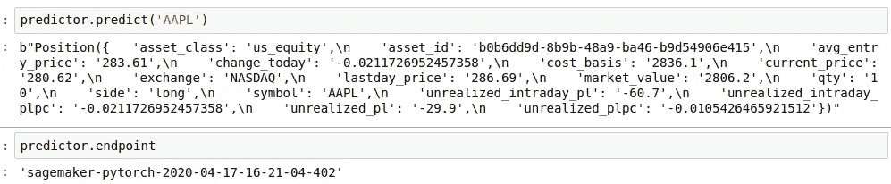

预测端点名称

您也可以从截图中的上述代码中获得端点名称。

# 创建一个 Lambda 函数和 API

这里将通过创建 Lamda 函数和 API 来完成管道。

**创建一个λ函数**

在 AWS lambda 服务中创建 lambda 函数。记得从上面的截图中更新端点名称。

**API 网关**

从 AWS API 网关服务中，创建一个 Rest API。然后命名并创建 API。

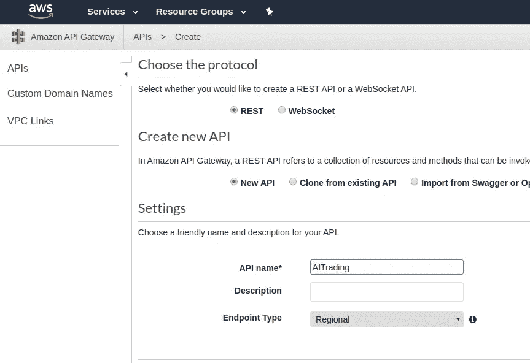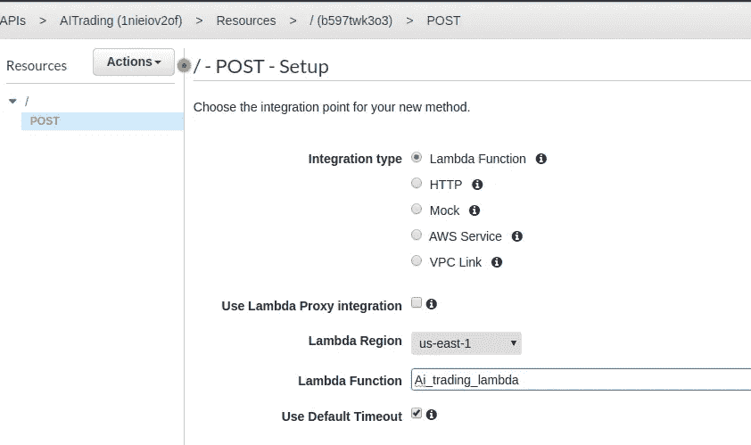

从操作下拉列表中创建帖子并部署。一旦创建好了，API 就准备好了。如果需要，您可以在任何 UI 中使用它。

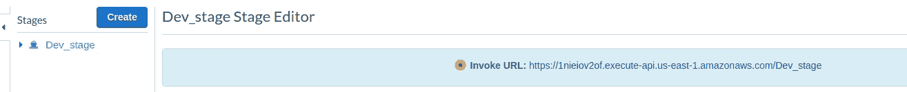

最后，我们有 Rest 端点，在这里我们可以创建 post 请求。可以用 Postman 或任何其他工具测试端点。如果不需要端点，可以通过跟随[这个链接](https://docs.aws.amazon.com/AmazonCloudWatch/latest/events/RunLambdaSchedule.html)来调度 lambda 函数。

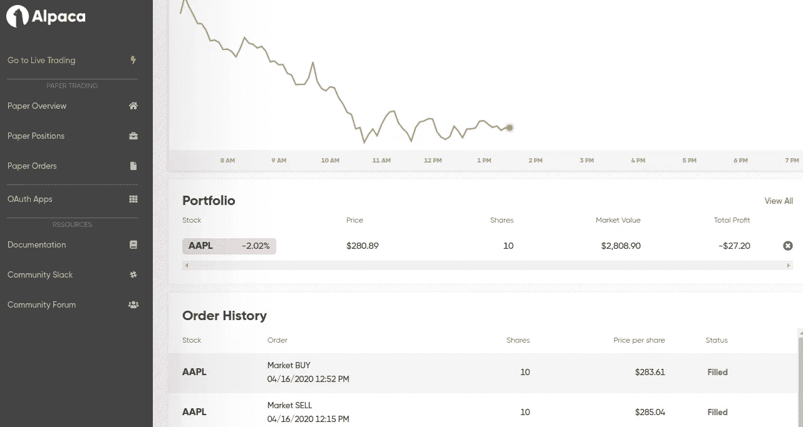

干杯！你可以在羊驼门户看到股票的买卖。预测是从我们的模型中预测出来的，实时数据被输入到模型中。

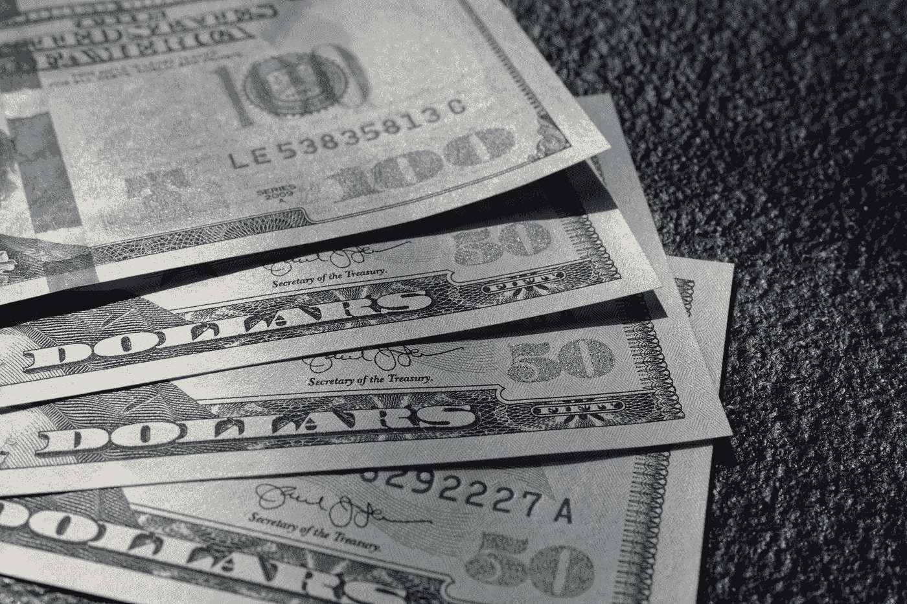

由[科林·沃茨](https://unsplash.com/@imagefactory?utm_source=medium&utm_medium=referral)在 [Unsplash](https://unsplash.com?utm_source=medium&utm_medium=referral) 上拍摄的照片

# 结论

我们已经训练了一个深度学习模型，并实时使用该模型的输出进行股票交易。我还是觉得有提升的空间。

1.  我在这里使用了深度神经网络模型。你在这里不需要任何模型。您可以简单地使用您的逻辑并创建管道。
2.  可以执行更好的特征工程和那些特征的选择。
3.  不同的模型架构(如 LSTM 或 DRL)需要针对时间序列数据集进行测试。
4.  需要对训练数据进行回溯测试。在本文中，我没有涉及回测。
5.  该模型可以以频繁的间隔重新训练。AWS Sagemaker 提供了一个没有太多麻烦的选项。

> 如果对本文有足够的兴趣，我将写一篇后续文章，通过回溯测试实时添加对特定股票的情绪分析，并添加其他模型架构。

***来自《走向数据科学》编辑的提示:*** *虽然我们允许独立作者根据我们的* [*规则和指南*](/questions-96667b06af5) *发表文章，但我们并不认可每个作者的贡献。你不应该在没有寻求专业建议的情况下依赖一个作者的作品。详见我们的* [*读者术语*](/readers-terms-b5d780a700a4) *。*

# 放弃

这篇文章完全是信息性的。本笔记本中的任何内容都不构成任何特定安全性的建议。所有交易策略使用风险自担。

有问题吗？评论？请在评论区留下您的反馈。

**查看其他文章**

1.  [24x7 实时加密交易|购买 Doge 或任何使用情绪加密的产品](https://medium.com/make-money-with-code/24x7-live-crypto-trading-buy-doge-or-crypto-using-sentiment-151400dfaaa3?sk=60cd35de6529f24fdbafa3a35ed22082)
2.  [利用赚钱+ AI |甘形象生成](https://medium.com/make-money-with-code/make-money-using-nft-ai-gan-image-generation-ea43989a08f6?sk=859e99c1b663e14f967f7276aed07448)

# 获取代码

*请订阅我的* [***简讯***](https://codesprout.substack.com/) *获取我的文章和其他更新的免费工作代码。*

**如果您喜欢，请:**

[](https://codesprout.substack.com/welcome)[](https://twitter.com/intent/follow?user_id=94995010)[](https://www.linkedin.com/in/shyambv/)