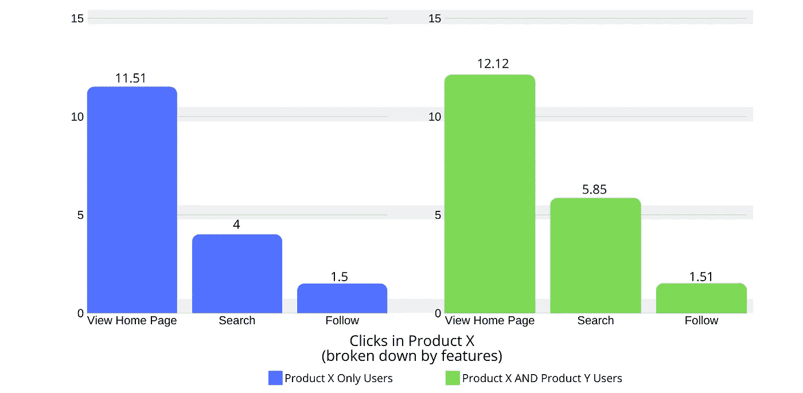

# 25 条提高数据素养的明智原则

> 原文：<https://towardsdatascience.com/25-sapient-principles-for-better-data-literacy-5ff5d42480a5?source=collection_archive---------31----------------------->

## 数据流畅的责任是对现实负责。只有这样，你才能做出最好的决定。

让我们将数据素养定义为分析、理解和交流数据的能力。如果我们还没有意识到，数据素养是数据驱动决策的一个重要组成部分。

[来源:xkcd](https://imgs.xkcd.com/comics/extrapolating.png)

转变产品团队分析的旅程是漫长的。我们终于到了这样一个地方，数据可以和我们说话，我们可以根据它告诉我们的东西做出决定。从本质上讲，这就是为什么读写能力可以在一个组织中创造或摧毁价值。误解的代价是巨大的。

在本帖中，我们将讨论如何通过以下方式提高您的数据素养:

*   原则
*   培训和实践

在我们讨论这些部分的时候，我会分享和剖析我最近看到的文盲现象。

让数据变得流畅不是一蹴而就的。磨练需要纪律、意识和合作。

# 数据读写原则

仔细想想，掌握数据就像学习一门新语言一样。有很多东西要学——新词汇、口语、语境和媒体。这里有一些让你进入正确心态的原则。

## 增强意识

*   **了解你的消息来源。**并非所有来源都相同。知道来源的内在偏差是什么。
*   **了解你的数据的局限性。**有时候你只有很小的历史观。或者，使用数据没有覆盖所有用例。
*   对你的自信现实一点。你的数据永远不会完美，所以不要期望它是完美的。不完美是可以的——你只需要表达出来。
*   确保数据是相关的。数据太多了。不要增加噪音。它会分散注意力，甚至打乱重要的决定。

## 在解释数据时

*   **注意盲点。**盲点表现为以下形式之一:(1)我们知道自己不知道的东西，(2)我们不知道自己不知道的东西。
*   **获取其他视角。**相信你的直觉，但也要接受他人对数据的解读。
*   探索不同的解释。解读读数的方式有很多种，所以在这里拓展你的横向思维。这些解释中有一种最接近事实。
*   保持简单。智慧表明最简单的解释是最好的。参见[奥卡姆剃刀](https://en.wikipedia.org/wiki/Occam%27s_razor)和[柯尔莫哥洛夫复杂度](https://en.wikipedia.org/wiki/Kolmogorov_complexity)。

## 在交流你的见解时

*   **讲故事。**在我的上一篇文章中，我谈到了讲故事在推动决策中的作用。这是让你的信息持久的好方法。
*   **使之相关。**同上，但值得重复。
*   **关注洞察力，而不仅仅是数据点。**人们很容易重复“事实”和花絮。将数据提炼为经验和行动要困难得多。
*   **要透明。数据流畅的一个责任是知识上的诚实。交流缺点、风险和注意事项。**
*   **分解一下。随着你变得越来越流利，你的基本分析也会变得越来越复杂。确保你能传达方法论。**

## 对本组织的期望

*   **投资培训。**您已经投资了数据和工具。坚持到底。资源有限的培训无法很好地扩展。
*   **奖励数据素养。**如果你想让数据素养成为一种能力，光学很重要。一定要认出表现流畅的人。
*   **根据重要目标调整培训**。我从《走向数据科学》的帖子[“培养数据素养的三个必须”](/3-musts-for-building-data-literacy-e8a9bb67bc9c)上得到这个。
*   从顶部开始。你需要展现奉献精神和数据素养的领导力。一个领导者茫然地看着别人，不知道发生了什么，这是非常令人失望的。

## 我要 800 美元的《谬误》。(那是 Jeopardy！参考)

假设你是一名高级产品主管。你在一则新闻标题中读到，微软团队的用户数超过了其竞争对手 Slack(2000 万对 1300 万)。你的同事转向你说:“我认为 Slack 仍然会赢。”好奇，你求她解释。

她看着你说，“他们的 CEO 说他们有 50 多个客户，资产超过 100 万美元。其中超过 70%是[微软] Office365 客户端。”句号。

资料来源:美国消费者新闻与商业频道

想要澄清，你问她赢的定义。她说，“他们从大的 Office365 客户那里获得收入，所以他们必须赢。”句号。

你的理由是，“这并不意味着他们会赢。尤其是如果你考虑到 Office365 的收入比 Slack 高出多少。除了他们两个的活跃用户之外，我们不知道其他任何事情。”

她自信地回答，“嗯，他们的 CEO 说……”然后你就不听了。

—

那里发生了什么？嗯，有几件事。

1.  **纯反流。**“首席执行官这样说。”
2.  **谬误或缺乏逻辑。“Slack 也被 Office 365 的客户收购了。”**
3.  **缺乏深度。当被问及“赢”的定义时，我没有意见。**
4.  缺乏好奇心。对探索其他观点或衡量标准不感兴趣。

# 数据素养培训与实践

俗话说，“有目的的练习才能完美”。这也适用于数据素养。

## 扫盲培训的四项原则

1.  最好的培训是与情境相关的。在创建培训课程时，选择一个重要的项目。列出你需要回答的关键问题。分析工具都是一样的——统计、代数、回归、决策树等等。将它们应用到相关的问题上，将会使这些教训变得有意义。
2.  **从基本面开始。**也就是说，每个人都需要了解一些基准工具。这些包括聚合、分布、基本统计和概率。 [Qlik 提供了一套很好的数据素养课程](https://qcc.qlik.com/course/view.php?id=811)——从基础到更高级的技术。
3.  坦然面对这种暧昧。计算一个数字很容易。知道用它做什么更有挑战性。(“好吧，现在你知道橄榄园每年烘烤 7 亿根面包棒。现在怎么办？”)
4.  不要骄傲自大。有些人会学一件事，然后表现得好像什么都知道。干这一行很容易自卑。

## 识字实践的四项原则

1.  **找项目练。**找到一组相关的项目，您可以应用团队学到的分析工具。尽可能用数据推理。挑战你的假设和他人的工作。那是健康的。
2.  **找导师。**这个应该是比较有数据流畅经验的人。相对于你来说，这些人可能处于“初级”职位，但可能接触到更多的数据。询问他们对数据的解释，并陈述你的情况。为相似的人建立一个共鸣板，以获得更大的效果。
3.  **公开展示。这是一个棘手的问题，因为它会让人神经紧张。但是，这是实地测试你的技能组合的最佳方式。你的成长来自于回答意想不到的问题的能力和看待事物的不同。你还将练习改变他人的视角。**
4.  **不断进化。**整合不同的数据源。混合数据源。随着您对现有领域越来越熟悉，您可以扩展您的范围。寻找不同的方式来呈现和可视化你的见解。学习新技术。

## 我要 2000 美元的“错误”。

*(在本例中，所有数字均基于真实发生的事件。名字是虚构的。)*

我猜想吉米是产品 x 的项目经理。首席执行官金问吉米，产品 Y 的使用是否对产品 x 的使用有任何影响。吉米分析了一些数字，得出了下面的图表。

“哇，使用产品 X **和产品 Y**的人点击产品 X 的次数更多。准确的说是多了 11.3%！”吉米

看到 11.3%的差异后，Jimmy 兴奋地向 CEO 汇报。“Kim，使用这两种产品的人点击产品 x 的可能性增加了 11.3%，”首席执行官 Kim 拍拍 Jimmy 的背，向公司介绍了这一惊人的发现。

**让我们就此打住。通过 Jimmy 的分析，我们可以发现两个突出的问题。**

1.  **没什么道理。**当然，数据显示增长了 11.3%，但我们不知道是什么导致了这一增长。稍后将详细介绍。
2.  那不太可能。这是一个比率。说 11.3%是一个用户点击的概率增加是假的。说他们有 11.3%的机会点击更多也是错误的。总的来说*比*多了 11.3%，不是概率上的。

**现在，回到故事…** 你，数据流畅的 PM，对这些数字很好奇。具体来说，你想知道 ***是什么*** 在驱动这些数字。您会注意到这些指标是产品 x 的所有特性的平均值。

如果你看看引擎盖下，可能会有一个解释，哪些功能是造成颠簸。你对数据进行处理，得出下面的图表。

X+Y 用户**真的**爱搜索，嗯？

它看起来像查看主页有一个不错的 5%的小颠簸。不过，这并不能解释 11.3%中的一半。

啊，但是看看搜索功能。X+Y 用户的搜索量有高达 46%的增长。这是一个非常重要的发现。

你正准备与 Jimmy 和 Kim 分享这一点，但随后你意识到:同样的搜索功能也用于产品 Y。来自产品 Y 的搜索可能算作产品 x 中的搜索。**计数有可能是错误的。**

整个故事都变了。 ***产品 Y 可能不会像 Jimmy 想的那样影响产品 X 的使用。甚至可能没有关系。***

祝你和组织里的其他人顺利解决这个问题。

—

我希望吉米的例子不是真的。吉米在现实生活中是一名高级项目经理。金确实告诉了成千上万的员工。那么它是在哪里分崩离析的呢？

*   没有探究“为什么”或颠簸背后的驱动因素。原问题问因果关系。吉米根本没有回答那个问题。甚至有可能产品 Y 对产品 X 的使用没有任何影响。
*   **不会讲故事。**见最后一点。
*   没有意识到数据的盲点。关键的洞察力与吉米的第一次分析只差一个数据片段。知道两个产品使用相同的搜索功能，就暴露了一个盲点。

你可以对这个分析提出一些批评，但是你会明白的。我认为吉米是一个有自知之明的人，早就纠正了他的读写问题。

在您发展数据素养的过程中，我们已经讨论了许多不同的原则和注意事项。进化不是一个轻易使用的词。如果你接受压力，那么有很多压力可以推动你的流利程度提高。

以上例子都是真实的。它们并不意味着减损或阻碍。相反，它们是为了让你意识到陷阱。

保持数据流畅是一项重大责任。那就是对现实负责，在思想上诚实，这样组织才能做出最好的决定。

## 注册订阅我的简讯:[投资您的产品分析技能组合](http://eepurl.com/gOQmIn)

## 阅读其他关于转变产品分析能力的帖子

 [## 卓越的分析始于经过验证的问题

### 分析最容易被忽视的方面也是最关键的——知道哪些问题很重要。

medium.com](https://medium.com/swlh/superior-analytics-starts-with-proven-questions-83e623fa27bf)  [## 获取您需要的产品使用数据—转变您的产品团队分析的第 3 部分…

### 目标是在几分钟内对问题提供有见地的答案。了解在哪里以及如何快速获得产品…

medium.com](https://medium.com/swlh/getting-the-product-usage-data-you-need-ae0b825fa8b)  [## 转变您产品团队的分析能力:您需要的数据

### 了解作为产品团队需要了解的数据。这篇文章涵盖了您需要转换的数据的基本原理…

medium.com](https://medium.com/swlh/the-data-you-need-to-transform-your-product-analytics-bd1659f9237b)  [## 转变产品团队的分析能力:文化

### 我发展企业组织的产品管理分析和决策文化的经验综合…

medium.com](https://medium.com/swlh/transforming-your-product-teams-analytics-prowess-culture-31fb32798b19)