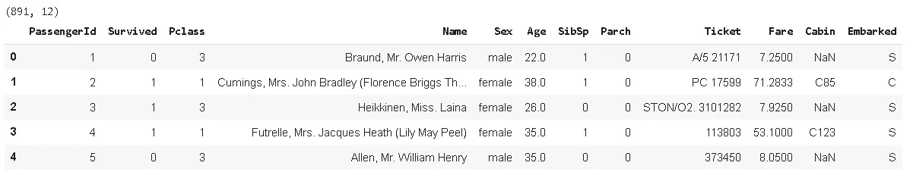
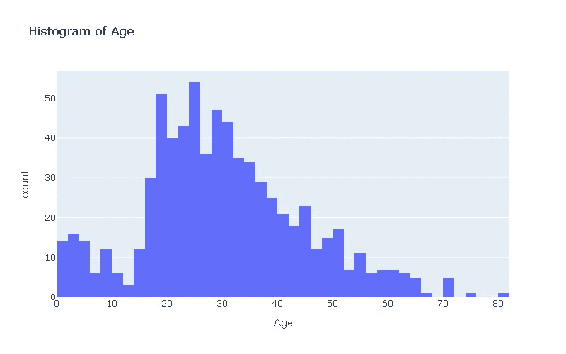
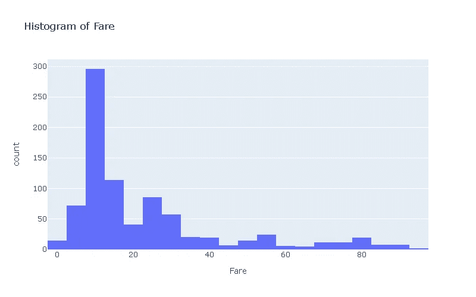
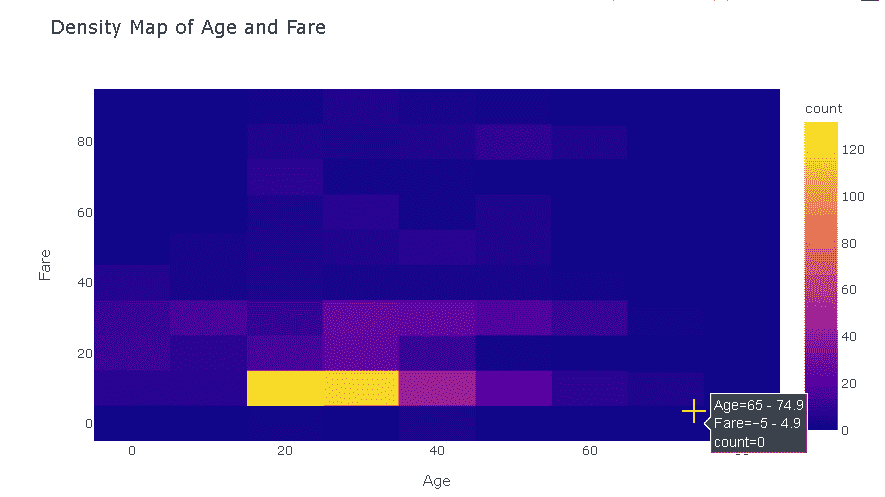
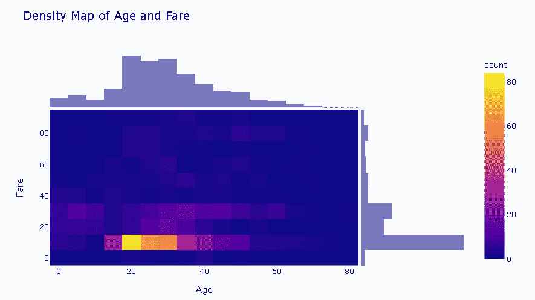
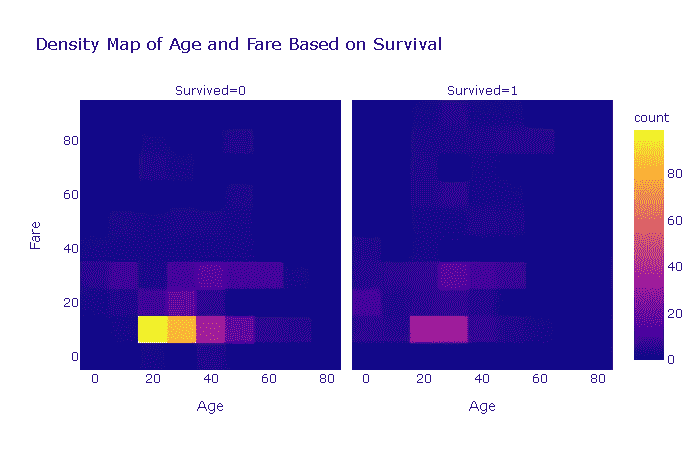

# 2D 直方图与 Plotly

> 原文：<https://towardsdatascience.com/2d-histograms-with-plotly-a5ef9370e02d?source=collection_archive---------43----------------------->

## 如何用 plotly 创建更多信息量的直方图？


[张家瑜](https://unsplash.com/@danielkcheung?utm_source=unsplash&utm_medium=referral&utm_content=creditCopyText)在 [Unsplash](https://unsplash.com/s/photos/small?utm_source=unsplash&utm_medium=referral&utm_content=creditCopyText) 上拍照

**Plotly Python** (plotly.py)是基于 plotly javascript (plotly.js)构建的开源绘图库。我喜欢 plotly.py 的一点是，它提供了一个高级 API ( **plotly express** )和一个低级 API ( **graph objects** )来创建可视化。使用 plotly express，我们可以用很少的代码行创建一个动态的、信息丰富的图。另一方面，我们需要用图形对象编写更多的代码，但是对我们创建的内容有更多的控制权。

在本帖中，我们将使用 plotly express 创建 **2D 直方图**，也称为**密度图**。

直方图是数据分析中常用的图表，用于概括数据的分布。在直方图中，数字或分类数据的分布以条形显示。每个条形代表一个值范围或类别，条形的高度与落入该范围的值的数量成比例。

让我们首先创建 1D 直方图，然后升级到 2D 直方图(或密度图)。我们将使用著名的泰坦尼克号生存数据集，该数据集在 Kaggle 上[这里](https://www.kaggle.com/c/titanic/overview)可用。

我们从将数据读入熊猫数据帧开始:

```
import numpy as np
import pandas as pddf = pd.read_csv("/content/titanic_train.csv")print(df.shape)
df.head()
```



我只使用包含 891 名乘客数据的训练数据集。我们首先在“年龄”和“费用”列上创建直方图。

```
#import plotly express
import plotly.express as pxfig = px.histogram(df, x="Age",
                   title="Histogram of Age",
                   width=800, height=500)fig.show()
```



我们的年龄范围很广，但大多在 20 至 30 岁之间。让我们看看“Fare”列的分布情况。

票价一栏有一些极值。出于演示目的，我将删除票价大于 100 的行。这些行约占整个数据集的 6%。

```
len(df[df.Fare > 100]) / len(df)
0.05948372615039282df = df[df.Fare < 100]
```

我们现在可以绘制“票价”列的直方图。

```
len(df[df.Fare > 100]) / len(df)
0.05948372615039282df = df[df.Fare < 100]
```



大多数票价都不到 20 英镑，当我们涨到 100 英镑时，数字就会减少。

是时候引入 2D 直方图了，它结合了 x 轴和 y 轴上的 2 个不同的直方图。因此，我们能够可视化重叠或并发的密度。

```
len(df[df.Fare > 100]) / len(df)
0.05948372615039282df = df[df.Fare < 100]
```



它看起来像是一个散点图，带有区域，而不是显示单个点。我们有一个划分票价-年龄组合的网格。plotly 的交互式绘图允许您查看每个分区代表的范围以及这些区域中的点数。黄色分区包含最多的乘客。随着颜色变暗，落入隔板的乘客数量减少。

我们还可以使用**边缘**参数来可视化构成该密度图的直方图。

```
fig = px.density_heatmap(df, x="Age", y="Fare",
                         title="Density Map of Age and Fare",
                         marginal_x="histogram",
                         marginal_y="histogram",
                         width=800, height=500)fig.show()
```



除了密度图之外，我们还可以看到年龄和费用直方图。

你可能已经知道，泰坦尼克号生存数据集的目的是根据数据集中给出的数据来预测一名乘客是否幸存。特征(阶级、年龄、性别、费用……)被用作独立变量来预测目标(幸存)变量。在实现机器学习模型之前，我们可以使用数据可视化来了解某些特征是否会影响存活率。

让我们使用 **facet_col** 参数来区分基于“幸存”列的“年龄”和“费用”的密度图。

```
fig = px.density_heatmap(df, x="Age", y="Fare",
       title="Density Map of Age and Fare Based on Survival", 
       facet_col="Survived")fig.show()
```



密度图看起来相似，但我们可以得出结论，位于左侧图中的黄色区域会降低存活的机会。对于这两个网格，非幸存乘客与幸存乘客的比率(183/66)高于整个数据集中的相同比率(535/303)。

```
df.Survived.value_counts()0    535 
1    303 Name: Survived, dtype: int64
```

我们已经用 plotly 覆盖了 2D 直方图(密度图)。当然，这只是这个神奇的图书馆的一小部分功能。我们可以使用 plotly 动态创建许多其他绘图类型。它的语法也很容易理解。在接下来的帖子中，我会尝试涵盖更复杂的情节。你也可以查看 plotly 文档，我认为它有很多不同的例子。就像任何其他主题一样，熟悉 plotly 的最好方法就是实践。因此，我建议创造大量的情节来提高你的技能。

感谢您的阅读。如果您有任何反馈，请告诉我。