# 分析了 Glassdoor 上的 2K 以上数据分析师工作

> 原文：<https://towardsdatascience.com/2k-data-analyst-jobs-on-glassdoor-analyzed-6db42336a2ae?source=collection_archive---------42----------------------->

## 工作列表数据集的探索性数据分析。


马库斯·温克勒在 [Unsplash](https://unsplash.com/s/photos/job-application?utm_source=unsplash&utm_medium=referral&utm_content=creditCopyText) 上的照片

我们生活在数据时代。越来越多的企业意识到从数据中创造价值的潜力。技术进步为收集和分析数据提供了高效的工具，这进一步推动了企业对数据科学和分析的投资。因此，我们比以往更多地在各种平台上看到像数据分析师、数据科学家、机器学习工程师这样的工作清单。

我最近在 kaggle 上偶然发现了一个数据分析师职位列表的[数据集](https://www.kaggle.com/andrewmvd/data-analyst-jobs)，它包含了来自 glassdoor 网站的 2253 个职位的详细信息。我想研究这个数据集，以深入了解工作的细节。使用数据分析工具也是一个很好的实践。

我们将在整个帖子中练习的技能:

*   熊猫的数据清理和分析
*   使用 NLTK 的基本自然语言处理(NLP)技术
*   用 matplotlib 和 seaborn 实现数据可视化

让我们从导入库开始。

```
#Data analysis
import numpy as np
import pandas as pd#NLP
import nltk
nltk.download("popular")#Data visualization
import matplotlib.pyplot as plt
import seaborn as sns
sns.set_style('darkgrid')
%matplotlib inline
```

我们现在可以把数据读入熊猫的数据框。

```
df = pd.read_csv("/content/DataAnalyst.csv")
print(df.shape)
df.columns
```

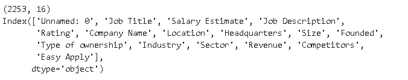

有 2253 个工作列表，上面有关于工作和公司的各种细节。

# **职位描述**

工作描述栏包含一个描述工作细节的长文本，以及对申请人的技能要求。为了获得一个大概的了解，我们可以阅读所有的职位描述，这绝对不是以数据分析为导向的方法。另一种更可取的方法是应用自然语言处理(NLP)技术来推断一些见解。我将使用 NLTK 库提供的工具，但是有许多文本预处理库也有相同的工具。

一种方法是统计每个单词的出现次数，以检查最常见的单词。我们首先将“job description”列转换成一个长文本文件，然后将其标记化。标记化简单地说就是将文本分割成更小的单元，比如单词。

```
from nltk.tokenize import word_tokenize
text = ''.join(df['Job Description'])
words = word_tokenize(text)
```

我们使用了 NLTK 的 **word_tokenize** 模块。在进一步发展之前，我们需要解决一些问题。第一个是降低所有字母。否则，“数据”和“数据”将被作为不同的词来处理。像“a”、“the”、“we”这样的词对我们的分析没有用，所以我们需要将它们从标记化列表中删除。最后，标点符号需要被删除，这样它们就不会被算作单词。

```
#lowercase letters
words = [word.lower() for word in words]#Remove punctuation and stopwords
punc = [',','.',';','-','"','!','--','?', '."',"'",':',')','(',"'s"]from nltk.corpus import stopwords
stop_words = stopwords.words('english')words_filtered = [word for word in words if word not in (stop_words + punc)]
```

我们使用列表理解来过滤初始的标记化列表。NLTK 的 FreqDist 函数提供了显示每个单词出现次数的频率分布。

```
fdist = nltk.FreqDist(words_filtered)
```

让我们检查一下最常见的单词:

```
fdist.most_common(20)
```

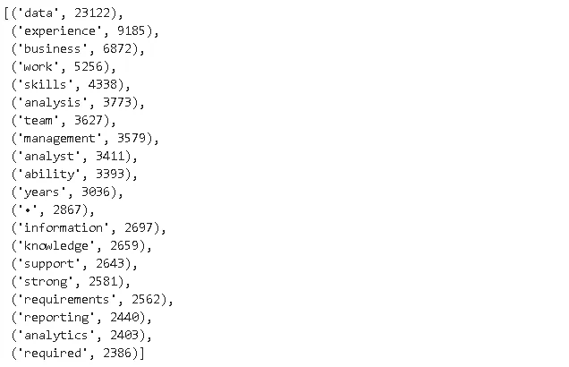

最常见的词是“数据”(令人惊讶！).“经验”一词紧随其后，因为企业通常会具体说明他们希望应聘者具备的经验。除了一些例外，这些词更像是一般的工作描述词。

我们可以使用 **fdist** 对象访问特定单词的出现次数。

```
fdist['software']
1160
```

“软件”这个词被写了 1160 次。让我们为数据分析师工作创建一个常见编程语言/技能的列表，并检查它们的频率。

```
common = ['sql', 'python', 'r', 'hadoop','java', 'javascript', 'c', 'c++']dict_a = {}
for i in common:
  dict_a[i] = fdist[i]plt.figure(figsize=(10,6))
plt.title("Common words in job descriptions", fontsize=14)
ax = sns.barplot(x=list(dict_a.keys()), y=list(dict_a.values()))
ax.tick_params(labelsize=12)
```

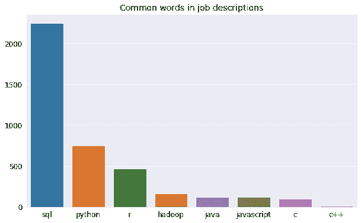

不出所料，SQL 是第一名。SQL 的频率几乎是每个作业列表 1 个。SQL 之后是 python 和 R。如果这些是“数据科学家”的工作，我们会看到 python 和 R 比 SQL 更常见。这让我们了解了数据分析师和数据科学家之间的区别。

检查经常一起出现的单词通常会提供更多信息。例如，bigram 意味着标记化列表中的两个相邻元素。这可以扩展到任何 n 值的 n 元语法。让我们使用 NLTK 的**二元语法**和**频率分布**函数创建一个频率分布。

```
bigrams_list = list(nltk.bigrams(words_filtered))
fdist2 = nltk.FreqDist(bigrams_list)fdist2.most_common(20)
```

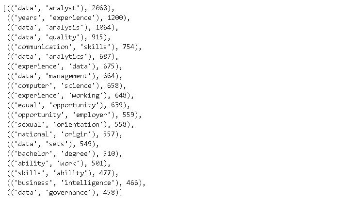

这个元组列表让我们对工作描述有了更多的了解。

# **薪资估算**

Glassdoor 提供了一个薪资估算的区间。

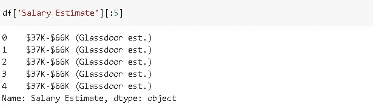

它也不是用于分析的理想格式。让我们先把它转换成一个漂亮干净的数字格式。最简单的方法似乎是以字符 2 和 3 为下限，7 和 8 为上限。但是，我们不能这样做，因为有些工资是 6 位数(如 123K)。另一种选择是先用熊猫的**剥离**方法将**拆分为“-”字符的上下限，然后修剪掉“$”和“K”。“薪金估计”列中只有一个值缺失，用“-1”表示。我将首先用最常见的值替换该值。**

```
df['Salary Estimate'].replace('-1', '$42K-$76K (Glassdoor est.)', inplace=True)lower = df['Salary Estimate'].str.split('-').str[0]
upper = df['Salary Estimate'].str.split('-').str[1]
```

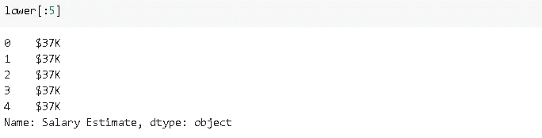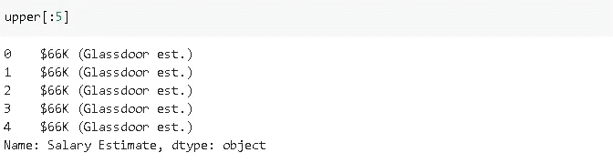

让我们从较低的开始，因为它更简单。我们只需要去掉右边的“K”和左边的“$”。

```
lower = lower.str.rstrip('K')
lower = lower.str.lstrip('$')
```

对于 upper，我们首先取前 5 个字符(考虑$121K)，然后将其剥离为 lower。

```
upper = upper.str[:5]
upper = upper.str.rstrip()
upper = upper.str.rstrip('K')
upper = upper.str.lstrip('$')
```

您可能已经注意到有一个额外的 rstrip。这是因为我们采用了前 5 个字符，这导致一些值在末尾有一个空格(例如$47K)。我们现在可以通过取上下限的平均值来创建一个新的列。

```
upper = upper.astype('float64')
lower = lower.astype('float64')
avg = ((upper + lower) / 2)*1000
df['Avg_Salary'] = avg
```

我们现在有了一个清晰的数字格式的平均值。让我们首先检查所有工作列表的平均估计工资。

```
df['Avg_Salary'].mean()
72117
```

总体平均约为 7.2 万美元。位置可能会影响平均工资。位置包含城市和州。我认为最好比较各州的情况，以便有一个更概括的概念。这是“位置”栏:

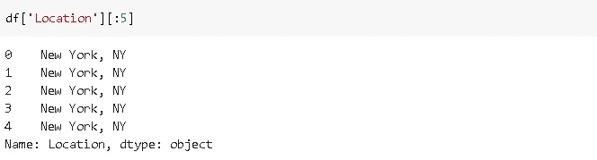

我们可以使用 pandas 字符串操作轻松创建一个“state”列。

```
df['State'] = df['Location'].str.split(',').str[1]
```

**Groupby** 函数可以用来查看不同州的平均工资。我希望看到平均工资和列表的数量，所以我将对 groupby 应用“agg(["mean "，" count"])，而不是只应用“mean”。

```
df[['Avg_Salary','State']].groupby('State').agg(['mean','count']).sort_values(by=('Avg_Salary','counts'), ascending=False)[:10]
```

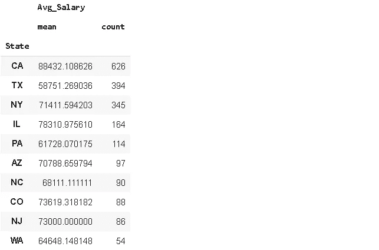

结果根据计数进行排序。加州拥有最多的工作列表和最高的平均工资。德克萨斯州有很多工作，但平均工资相对低于其他顶级州。

# **公司部门**

数据集还包含有关公司和行业的信息。我们先来看看哪些部门的数据分析师岗位最多。

```
df['Sector'].value_counts()[:10]
```

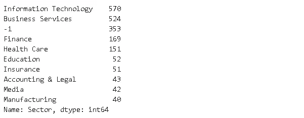

“-1”表示缺少值。有各种各样的部门显示了数据分析师的工作是如何分布的。任何领域的企业都可以从数据中创造价值。

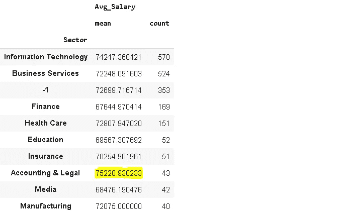

薪酬最高的行业是“会计和法律”，但平均工资也非常接近。

高薪工作对数据分析师的需求很大。比工作数量更重要的是，这些工作来自许多不同的行业和部门。这有力地表明了数据分析对企业的重要性。我认为，对数据分析师和科学家的需求将长期存在。

感谢您的阅读。如果您有任何反馈，请告诉我。