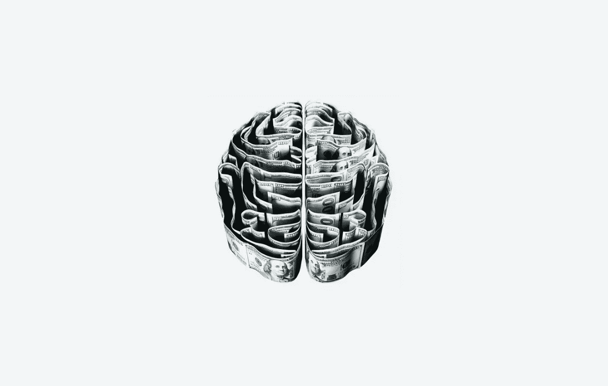

# 三，二，一，…人工智能起飞！

> 原文：<https://towardsdatascience.com/3-2-1-ai-lift-off-428fddb73f09?source=collection_archive---------56----------------------->

## 是的，你没看错。AI 已经爆炸了。

经过几十年的缓慢燃烧，人工智能已经孵化成为世界上主要科技公司整个议程的 P1。

*为什么？*相当简单，需要。面对不断生成和消耗的数据，人类需要一种能够学习并适应我们的新工具。那基本就是 AI 了。

我们以前认为不可能或科幻小说，今天正变得必要和高度期待的一些。技术领导者正在竞相开发人工智能解决方案，通过增加和增强人类智能为他们提供竞争优势。但是，如果我们停下来想一想，这个领域的所有进步都是基于同一个等式:

> 大数据+ GPU 增强+深度学习

*是的，我的朋友，我们有新的人工智能可口可乐配方*。

## 我称之为“基本方程式”。


由[上的](https://unsplash.com)[动作前进](https://unsplash.com/@actionvance)拍照

*如果你想了解更多，请访问*[***oscargarciaramos.com***](https://oscargarciaramos.com)

然而，正如我在我的文章 [***【小数据的反叛】***](https://medium.com/ai-in-plain-english/the-little-data-rebellion-ai-is-no-longer-just-for-the-big-guys-add5d99faafd?source=friends_link&sk=36f9ad862ad07560e0051c8abeb2ab0f) 中所说，我们有很大的机会展望未来，并发展我们的“基本方程”，利用小数据，更全面和有效的深度学习模型，新的硬件和无监督学习使用中的深度进步。

# **作为显著变量的深层推理**

很明显，深度学习在人工智能等式中变得越来越重要，当我们提到语音、视觉或自然语言处理的一些上下文时( [***)“嘿，Siri，我能帮你吗？”*T31)。**](/hey-siri-can-i-help-you-4065f38ae869?source=friends_link&sk=ec5634102f6253e900fc17c5e7b8050e)

然而，深度学习尚未展示其在辅助机器推理方面的全部能力，这是许多人工智能原型和解决方案所需的能力。深度学习已经帮助我们解决了定义明确的问题，例如，我们希望对数据进行分类。然而，下一步我们必须超越分类或感知，而是推理和理解。

目前，这些系统还没有常识。 ***推理*** 帮助我们处理广泛的认知任务，包括可能的上下文变化或意外事件。人类知道，如果他们把水放在玻璃杯里，除非杯子破了，否则水不会漏。机器是怎么知道的？

*那是玩阴的……*

是的，我们确实已经达到了这样的程度，在标记了自由文本段落之后，我们能够将自然语言句子转换成逻辑公式。我们需要采取的下一步将是使用推理机制，以最少的努力来工作和理解这些公式。

*我们如何变得更高效，进化出下一波深度学习？*

# **小数据**

是的，你是对的。**小**数据。

多少次我们听到“领域内没有足够的数据来馈入深度学习模型”或“数据集既不好也不相关，不足以训练模型”。我们都知道神经网络需要大量的数据来学习某项任务。然而，我们通常没有时间找到如此大量的高质量数据或资源来训练这些数据，从而导致项目时间、人工智能系统的训练、测试和改进出现偏差。

研究人员正在花费大量时间研究用更少的数据训练系统的新方法，这些方法即使规模很小，也比大量数据要好。

# **无监督学习**

正如我们已经看到的， ***监督学习*** 需要标记数据的繁重任务，这有时会非常令人沮丧，导致资源成本并在系统中引入偏差，因为这是一项“人工”任务。

然而，大多数人工智能远见者声称，纯粹的 ***无监督学习*** 是深度学习的圣杯，距离我们现在的位置以及能够在人工智能解决方案和模型训练的开发中实现它还很远。

当然，在不久的将来，我们将把自己定位在有监督和无监督学习之间。

我的朋友，还没有完全失去。

目前还有其他方法仍然需要监督，但它们正在帮助我们更深入地探索深度学习应用的世界:

*   ***强化学习*** ，或者说是一个系统做得好就奖励，做得不好就惩罚的方式，随着他们的学习。
*   ***迁移学习*** ，或者说如何将一个训练好的模型外推至一个完全新的问题。
*   ***主动学习*** ，系统只有在需要的时候才需要新的标注数据(*计算机标注 vs .人类*)。

*最后但同样重要的是，…*

# **效率和硬件**

大多数人工智能和分析部门专注于开发需要更小架构和更快运行的模型。

*为什么？*虽然 GPU 在训练和性能上有了质的飞跃，但仍然不够。为了训练一个模型，你仍然需要足够的计算能力和资源，首先是训练它，其次是维护它，这会降低创新和应用程序的性能。

硬件是不可能自己进化，克服计算复杂度的。算法模型增强和硬件开发之间必须存在共生关系。

```
*"Simulating Human thinking shouldn't be a matter of money".*
```



照片由[摩根·豪斯尔](https://unsplash.com/@morganhousel?utm_source=unsplash&utm_medium=referral&utm_content=creditCopyText)在 [Unsplash](https://unsplash.com/s/photos/brain?utm_source=unsplash&utm_medium=referral&utm_content=creditCopyText) 拍摄

## ***那么，接下来呢？***

正如凯文·凯利畅销书[](https://amzn.to/3eU1NRE)*的作者所说…*

*“鸟扇动翅膀飞行，但为了让人类飞行，我们必须发明一种不同的飞行方式——一种自然界中没有的飞行方式”。在人工智能的例子中，也会发生类似的事情。我们必须发明生物学上不存在的新型思维。*

***因此，这种智能并没有取代人的思维，而是增强了它”。***

*欢迎留下评论或分享这篇文章。跟随 [*我*](https://medium.com/@ogarciaramos) *未来的岗位。**

*如果你想了解更多，你可以通过[***oscargarciaramos.com***](https://oscargarciaramos.com/)找到我*