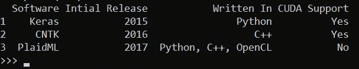
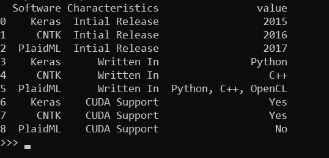
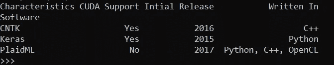
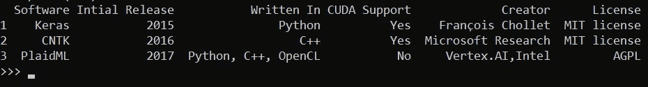
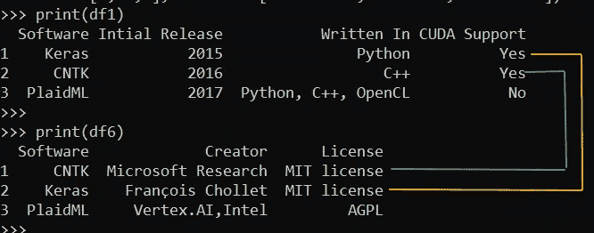
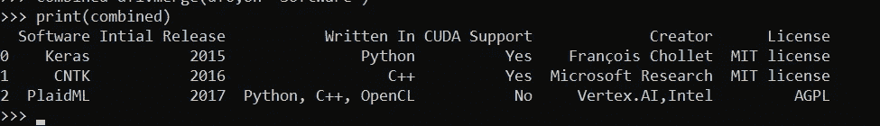

# 数据科学家的 3 种先进熊猫方法

> 原文：<https://towardsdatascience.com/3-advanced-pandas-methods-for-data-scientist-c7935152b2ca?source=collection_archive---------49----------------------->

## [内部 AI](https://towardsdatascience.com/data-science/home)

## Pandas 是数据科学家和机器学习专业人员可以使用的一把瑞士刀。3 种用于现实项目的先进而强大的方法


照片由[锡德·巴拉钱德朗](https://unsplash.com/@itookthose?utm_source=medium&utm_medium=referral)和[赛基兰·阿纳加尼](https://unsplash.com/@_imkiran?utm_source=medium&utm_medium=referral)在 [Unsplash](https://unsplash.com?utm_source=medium&utm_medium=referral) 拍摄

在我看来，Pandas 和 NumPy library 一起节省了数百小时的编程时间，是数据科学家和机器学习专业人员的宝贵工具。

如果没有很好地掌握这两个库，要成为一名优秀的数据科学家或机器学习专家几乎是不可能的。

大多数情况下，可用的原始数据只有很少的空白值，格式不正确，或者分散在几个不同的源中，带有一个主键。在这篇文章中，我将讨论三种先进的 pandas 数据准备和辩论技术，它们将有助于为机器学习算法输入设置正确的数据格式。

让我们从一个四列三行的简单样本数据帧开始。

```
import pandas as pddf1 = pd.DataFrame(
[["Keras", "2015", "Python","Yes"],
["CNTK", "2016", "C++","Yes"],
["PlaidML", "2017", "Python, C++, OpenCL","No"]],
index=[1, 2, 3],
columns = ["Software", "Intial Release",
"Written In","CUDA Support" ])print(df1)
```

样本数据帧具有三种不同的属性，即初始版本、写入和 CUDA 对三个机器学习库的支持。



数据帧 df1 —上述代码的输出

我们可以看到，机器学习库名称是其中一列，库的不同属性在各个列中。

让我们想象一下，机器学习算法期望不同格式的相同信息。它期望库的所有属性在一列中，各自的值在另一列中。

我们可以使用“*”函数将数据帧从当前格式转置为期望的排列。*

*在 id_vars 参数中指定了原始数据帧中的列，这些列与单独的列保持相同的排列。*

```
*df2=df1.melt(id_vars=["Software"],var_name='Characteristics')
print(df2)*
```

*在 id_vars 参数中指定了原始数据帧中的列，这些列与单独的列保持相同的排列。原始数据帧中的所有剩余属性都填充在“特征”列下，并且在相应的列中具有值。*

**

*df1 上“熔化”功能后的数据帧 df2 上述代码的输出*

*许多时候，收集的原始数据是将所有属性排列在一列中，在相应的列中提到值。机器学习算法要求输入数据的每个属性值都在单独的列中。我们可以使用 Pandas 中的“***”pivot***”方法将数据转换成所需的格式。*

```
*df3=df2.pivot(index="Software",columns="Characteristics",
values="value")print(df3)*
```

*本质上，“融”和“枢”是互补的功能。“Melt”转换一列中的所有属性和相应列中的值，而“pivot”转换一列中的属性和另一列中的值。*

**

*数据帧 df2 上的 Pivot 函数—上述代码的输出*

*有时，我们的原始数据分散在几个文件中，我们需要将它整合到一个数据集中。为了简单起见，首先，我们将考虑单个数据集中的数据点已经在正确的行序列中的情况。*

*在新的数据帧 df4 中，为机器学习库声明了另外两个属性。*

```
*df4 = pd.DataFrame(
[["François Chollet", "MIT license"],
["Microsoft Research", "MIT license"],
["Vertex.AI,Intel", "AGPL"]],
index=[1, 2,3],columns = ["Creator", "License"])print(df4)*
```

*我们可以使用" ***concat"*** 函数 ***将这个新的数据帧与原始数据帧连接起来。****

```
*df5=pd.concat([df1,df4],axis=1)
print(df5)*
```

*级联的数据帧 df1 和 df4 的输出在一个数据帧 df5 中具有原始的三个属性和两个新属性*

**

*数据帧 df1 和 df4 的连接—上述代码的输出*

*在现实生活中，单个数据集中的大多数时间数据点不在同一行序列中，并且有一个公共键(标识符)链接数据集中的数据点。*

*我们有一个数据帧 df6 来存储机器学习库的“创建者”和“许可”值。“软件”是该数据帧和原始数据帧 df1 之间的共同属性。*

```
*df6 = pd.DataFrame(
[["CNTK","Microsoft Research", "MIT license"],
["Keras","François Chollet", "MIT license"],
["PlaidML","Vertex.AI,Intel", "AGPL"]],
index=[1, 2,3],
columns = ["Software","Creator", "License"])print(df6)*
```

*我们可以看到数据帧 df6 的行序列与原始数据帧 df1 不同。在 df6 中，首先存储“CNTK”库的属性，而在数据帧 df1 中，首先提到值“Keras”。*

**

*数据帧 df1 和 df6 —上述代码的输出*

*在这种情况下，我们需要合并分布在几个数据集中的原始数据，并且各个数据集中的值不在相同的行序列中，我们可以使用“ ***merge*** ”函数将数据合并到一个数据帧中。*

```
 *combined=df1.merge(df6,on="Software")
print(combined)*
```

*在 merge 函数的“on”参数中提到了用于从不同数据集中识别正确对应值的公共键(唯一标识符)。*

**

*上述代码的输出—基于唯一标识符“软件”的合并数据帧 df1 和 df6*

****重述****

*在这篇文章中，我们学到了三个先进的熊猫功能是相当得心应手的数据准备。*

> *Melt:将属性/特征分离到一列中，并将值分离到相应的列中*
> 
> *透视:将一列中的属性/功能拆分到单独的一列中*
> 
> *Concat:沿行或列连接数据帧。*
> 
> *Merge:跨不同行序列中的数据帧和值合并具有唯一标识符的数据帧。*

****结论****

*熊猫可以帮助为机器学习算法准备正确格式的原始数据。本文中讨论的 Pandas 函数如“melt”、“concat”、“merge”和“pivot”可以用一行代码转换数据集，否则将需要许多嵌套循环和条件语句。在我看来，专业和业余数据科学家之间的区别不在于对奇异算法或超级优化超参数技术的了解。对 Pandas、NumPy 和 Matplotlib 的深入了解使一些人进入了专业联盟，并使他们能够以更干净的代码和更高的性能更快地获得结果。*

*你可以在 [5 用熊猫进行数据预处理的强大可视化](/5-powerful-visualisation-with-pandas-for-data-preprocessing-bbf6a2033efd)中学习用熊猫进行数据可视化。*

*此外，像专业数据科学家一样学习[探索性数据分析(EDA)高级可视化](/5-advanced-visualisation-for-exploratory-data-analysis-eda-c8eafeb0b8cb)。*