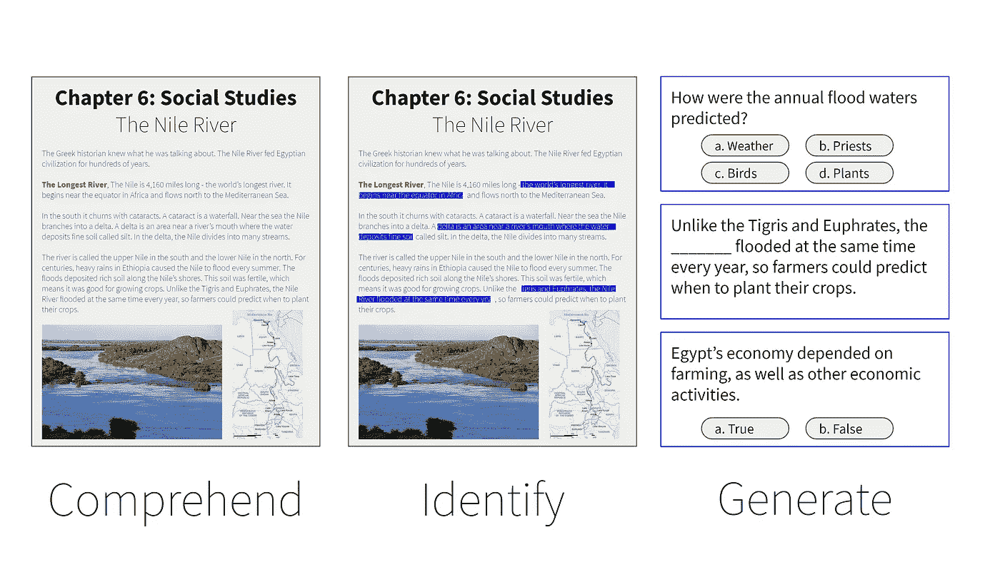
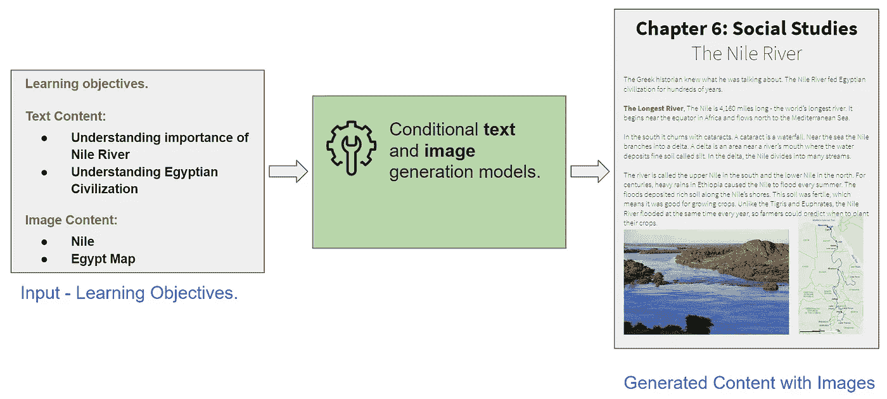

# Edtech 的 3 个人工智能创业想法利用了因新冠肺炎而兴起的在线直播课程

> 原文：<https://towardsdatascience.com/3-ai-startup-ideas-in-edtech-to-leverage-the-rise-of-live-online-classes-due-to-covid-19-2b52c16afe48?source=collection_archive---------33----------------------->

## Edtech 中使用最先进的计算机视觉和自然语言处理的创业想法。

图片来自 [Pixabay](https://pixabay.com/) 并由 [AiArtist Chrome 插件](https://chrome.google.com/webstore/detail/aiartist/odfcplkplkaoehpnclejafhhodpmjjmk)风格化(由我构建)

在 **K-12** (幼儿园到 12 年级)领域的在线辅导并不新鲜。有**独角兽**像 [**元辅道**](https://technode.com/2020/04/02/yuanfudao-is-now-one-of-chinas-most-valuable-ed-tech-startups/) (k-12 教育) [**VIPKid**](https://equalocean.com/education/20191008-vipkid-raises-an-undisclosed-amount-of-financing-from-tencent\) (英语学习)基于**中国**在线视频辅导。有 [**韦丹图**](https://tech.economictimes.indiatimes.com/news/startups/edtech-startup-vedantu-raises-24-million-in-funding-led-by-ggv-capital/74116640#:~:text=Edtech%20company%20Vedantu%20has%20raised,firm%20in%20August%20last%20year.) 在**印**就是迎合在线辅导。新加坡有几个小球员，比如泰诺比，在同一个场地发球。

由于新冠肺炎带来的在线课程的增加，许多初创公司都报告了更高的注册人数，其中一些公司最近从投资者那里拿到了巨额支票。投资者有 **FOMO** (害怕错过)，因此，一旦他们感觉到某些行业将会上涨，他们就会尽快行动。

今天，我们将在在线**视频**辅导/课程中看到一些**创意**，它们有可能变成**新的创业**，迎合**崛起**。

# **创业思路 1:利用计算机视觉进行视频直播课堂中的注意力分散检测。**

图片来自 [Pixabay](https://pixabay.com/)

在一堂**正常的课**中，有一位老师正在监督学生们**是否在注意**。但是在**直播视频课堂**上，老师不可能专注于每个学生的**视频反馈**。

因此，使用**计算机视觉**算法从**视频馈送**中自动识别**注意力分散的学生**并通知老师的过程至关重要。然后，老师可以向所有注意力分散的学生发出警告或轻触按钮发出轻柔的“乒”声。

在**视频流**中识别注意力分散还没有得到很好的研究，但是由于**自动驾驶**汽车的增加，在识别**注意力分散的司机**方面已经做了相当多的研究。一些研究直接适用于或经过**微小修改**后适用于班级中**学生**的注意力分散检测。

您还可以从视频流中检测出**打哈欠**和**疲劳**来识别不活跃的听众。

**注意力分散检测算法的几个要点:**

[视频馈送中的注意力分散检测](https://github.com/johannesharmse/distraction_detection)

[驾驶员注意力分散检测](https://github.com/Cianrn/Driver-Distraction-Detection)

[哈欠检测](https://medium.com/analytics-vidhya/yawn-detection-using-opencv-and-dlib-e04ba79b9936)

# 创业想法 2:自动评估(MCQs，对/错，填空)来减轻老师的工作量。

图片来自我们的创业推介资料

随着在线课程的兴起，老师们面临着一个新的挑战，即准备**演示**和**幻灯片**以使课堂更有吸引力。传统上，大多数老师仍然使用黑板来教学。但是有了在线轮班，他们有额外的工作量来准备演示文稿。

减轻他们工作负担的一个方法是将**评估创建**部分**自动化**。您可以使用最先进的**自然语言处理**算法来**理解**任何文本(章节)**识别**重要概念，**根据内容自动创建**评估(MCQs，是非题，填空题)。

**我自己的*关于评估自动化的研究*的几点提示:**

1.  [是非题生成](https://medium.com/swlh/practical-ai-automatically-generate-true-or-false-questions-from-any-content-with-openai-gpt2-9081ffe4d4c9)
2.  [选择题生成](/practical-ai-automatically-generate-multiple-choice-questions-mcqs-from-any-content-with-bert-2140d53a9bf5)
3.  [为英语语言学习生成代词疑问句](https://medium.com/swlh/practical-ai-generate-english-pronoun-questions-from-any-story-using-neural-coreference-fe958ae1eb21)
4.  [语法 MCQ 代](https://becominghuman.ai/practical-ai-using-pretrained-bert-to-generate-grammar-and-vocabulary-multiple-choice-questions-d92e4fbeeeaa)

您还可以使用自然语言处理(NLP)来检测在线直播**聊天**中的**欺凌**或识别**不清楚的**概念 **/** 话题**中提到的**等。然后老师可以快速复习**再解释**不清楚的概念或者**静音**欺负人等等

# 创业理念 3:根据学习目标自动创建内容。

图片来自我们创业公司的技术平台

对于**课程设计者**和**内容作者**，一个主要的挑战是**基于某些**学习目标**创建内容**。

学习目标是学生完成一门课程后的预期目标。在上图中，我们可以看到我们如何使用 AI 来**生成**一个**新章节**关于**"尼罗河"**开始与学习目标 **1)** 了解尼罗河的重要性和 **2)** 了解埃及文明。

我们可以通过从给出的**学习目标**中生成初始文本和图像来自动化这个过程。**课程设计者**可以进一步**编辑**并最终确定内容。使用 NLP 中最先进的条件文本生成模型(**2**等)和图像生成模型(**甘** s)实现这一点不再是不可能的。有了足够的数据和研究，我们可以建立一个强大的基线。

**该领域研究的几个指针:**

[控制文本生成](https://eng.uber.com/pplm/)

[用于可控文本生成的变压器语言模型](https://github.com/salesforce/ctrl)

[受约束的文本生成](https://arxiv.org/abs/2005.00558)

[可控文本到图像生成](https://github.com/mrlibw/ControlGAN)

快乐学习！

# 使用自然语言处理的问题生成——教程

我推出了一个非常有趣的 Udemy 课程，名为“使用 NLP 生成问题”,扩展了这篇博文中讨论的一些技术。如果你想看一看，这里是[链接](https://www.udemy.com/course/question-generation-using-natural-language-processing/?referralCode=C8EA86A28F5398CBF763)。

祝 NLP 探索愉快，如果你喜欢它的内容，请随时在 Twitter 上找到我。