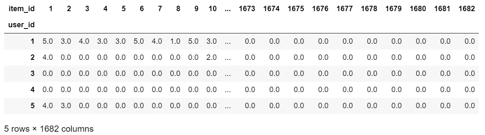
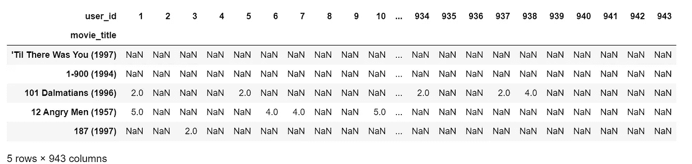
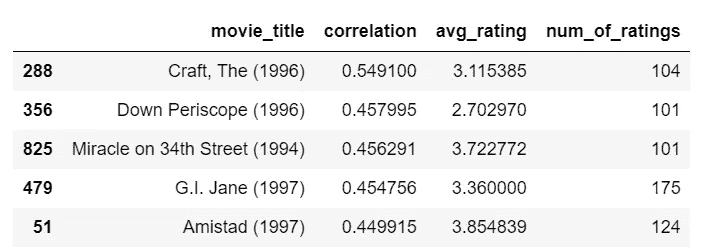

# 构建推荐系统的 3 种方法

> 原文：<https://towardsdatascience.com/3-approaches-to-build-a-recommendation-system-ce6a7a404576?source=collection_archive---------5----------------------->

## Python 推荐系统入门


[Slidebean](https://unsplash.com/@slidebean?utm_source=medium&utm_medium=referral) 在 [Unsplash](https://unsplash.com?utm_source=medium&utm_medium=referral) 上拍照

毫无疑问，推荐系统是在各种平台上增强用户体验的最明显的方式之一，也是将机器学习引入公司的一种方式。因此，许多公司一直在采用“*为你推荐*”的口号，这一口号已被亚马逊、网飞和 Youtube 等公司推广开来，它们通过实施自己版本的推荐来满足客户需求。

在讨论各种实现方法之前，我们首先将推荐系统定义为一种在将信息呈现给人类用户之前从信息流中丢弃冗余或无用信息的方法，或者更具体地说，它是一种信息过滤系统的子类，旨在预测用户对某个项目的“评级”或“偏好”(来源:[维基百科](https://en.wikipedia.org/wiki/Recommender_system#:~:text=A%20recommender%20system%2C%20or%20a,would%20give%20to%20an%20item.))。

有了这些知识，我们可以开始研究解决这个问题的一些方法了——关于这篇文章中生成的完整代码，请访问 my [**Github**](https://github.com/kurtispykes/recommender_system/blob/master/notebooks/02_kpy_ideas.ipynb) **。**

[](https://github.com/kurtispykes/recommender_system/blob/master/notebooks/02_kpy_ideas.ipynb) [## kurtispykes/推荐系统

### permalink dissolve GitHub 是超过 5000 万开发人员的家园，他们一起工作来托管和审查代码，管理…

github.com](https://github.com/kurtispykes/recommender_system/blob/master/notebooks/02_kpy_ideas.ipynb) 

在下面的演示中，我们将使用 [MovieLens 100k 数据集](https://grouplens.org/datasets/movielens/100k/)。

## 协同过滤


约翰·施诺布里奇在 [Unsplash](https://unsplash.com?utm_source=medium&utm_medium=referral) 上拍摄的照片

协同过滤是推荐引擎最流行的实现之一，它基于这样的假设，即过去达成一致的人将来也会达成一致，因此他们会像过去一样喜欢相似种类的项目。

协同过滤的一个例子可以是，一个朋友和我过去喜欢相同范围的书，并且他/她接着喜欢我没有读过的书，但是因为我们过去同意并且他/她喜欢我没有读过的新书，所以很可能我也会喜欢那本书，所以那本书会被推荐给我。该逻辑描述了所谓的基于用户的协同过滤。

从前面的例子来看，不是仅仅关注我的朋友喜欢什么，我们可以决定关注以前喜欢的项目的范围，并确保基于过去喜欢的项目之间的相似性向我推荐新的项目，其中相似性是通过使用项目的评级来计算的——“喜欢这个项目的用户也喜欢”。这种算法背后的逻辑被称为基于*项目的*协同过滤。

总之，这两种方法都属于协作过滤的范畴，即基于记忆的方法。让我们看一个 Python 中基于内存的方法的例子。

```
import numpy as np
import pandas as pd
from sklearn.metrics import mean_squared_error, pairwise# creating n x m matrix where n is user_id and m is item_id 
user_ratings = pd.pivot_table(rating, index="user_id", columns="item_id", values="rating").fillna(0)# user and item counts 
n_users = len(user_ratings.index)
n_items = len(user_ratings.columns)**print**(f"Users: {n_users}\nItems: {n_items}")
user_ratings.head()Users: 943
Items: 1682
```



现在我们有了所需格式的数据，我将随机生成一个训练和测试集，我们可以用它来测试我们的方法做得有多好。

```
# [https://www.ethanrosenthal.com/2015/11/02/intro-to-collaborative-filtering/](https://www.ethanrosenthal.com/2015/11/02/intro-to-collaborative-filtering/) def train_test_split(data: np.array, n_users: int, n_items:int): 
    # create a empty array of shape n x m for test
    test = np.zeros((n_users, n_items))
    train = data.copy()

    # for each user, we generate a random sample of 5 from movies they've watched
    for user in range(n_users):
        random_sample = np.random.choice(data[user, :].nonzero()[0], 
                                         size=5, 
                                         replace=False)
        # set the train to zero to represent no rating and the test will be the original rating
        train[user, random_sample] = 0\. 
        test[user, random_sample] = data[user, random_sample]

    return train, testtrain, test = train_test_split(data=user_ratings.to_numpy(), n_users=n_users, n_items=n_items)
```

构建协同过滤系统的第一步是计算用户(基于用户)或项目(基于项目)之间的相似性。

```
user_similarity = pairwise.cosine_similarity(train + 1e-9)
item_similarity = pairwise.cosine_similarity(train.T + 1e-9)**print**(user_similarity.shape, item_similarity.shape)(943, 943) (1682, 1682)
```

下一步是预测数据中未包含的评级。一旦我们做出了预测，我们就可以将我们的结果与实际测试数据进行比较，以评估我们模型的质量——评估指标超出了本教程的范围。

```
# predict user ratings not included in data
user_preds = user_similarity.dot(train) / np.array([np.abs(user_similarity).sum(axis=1)]).T# # get the nonzero elements
nonzero_test = test[test.nonzero()]
nonzero_user_preds = user_preds[test.nonzero()]user_rating_preds = mean_squared_error(nonzero_test, nonzero_user_preds)
**print**(f"UBCF Mean Squared Error: {user_rating_preds}")UBCF Mean Squared Error: 8.250006012927786
```

上面的代码是一个基于用户的协同过滤的例子。我们还可以进行基于项目的协同过滤。

```
# predict item ratings not included in data
item_preds = train.dot(item_similarity) / np.array([np.abs(item_similarity).sum(axis=1)])# get the nonzero elements
nonzero_item_preds = item_preds[test.nonzero()]item_rating_preds = mean_squared_error(nonzero_test, nonzero_item_preds)
**print**(f"IBCF Mean Squared Error: {item_rating_preds}")IBCF Mean Squared Error: 11.361431844412557
```

我们的算法不是很好，但希望你能明白其中的要点！

我们现在知道基于协作的方法可能被分类为基于*内存的*，我们已经在上面看到了它的 Python 实现。我们可以对协同过滤方法进行分类的另一种方式是基于模型的方法。

在这种方法中，使用不同的数据挖掘、机器学习算法来开发模型，以预测用户对未评级项目的评级(来源:[维基百科](https://en.wikipedia.org/wiki/Collaborative_filtering#Model-based))。

## 基于内容的过滤

另一种向用户推荐有用信息的流行方式是通过基于内容的过滤。这种技术基于项目的描述和用户偏好的简档。它最适合于这样的情况:已知一个项目的信息，但不知道用户的很多信息。因此，基于内容的过滤方法将推荐视为用户特定的分类问题。

基于内容的过滤的一个例子可以通过使用电影推荐场景来解释。想象一下，我们已经建立了一个相当新的网站，我们目前没有太多的用户信息，但我们确实有关于我们积压的电影的细节。我们要做的是获取电影的元数据/特征，如类型、演员、导演、电影长度等，并使用它们作为输入来预测用户是否喜欢一部电影。

上面的场景也暗示了我们有一个偏好的用户配置文件。这些数据可以通过用户询问来收集，这意味着用户可以设置他或她的过滤偏好，或者通过记录用户行为作为一种隐含的方法来收集。

> **注意**:您也可以使用混合方法来获得最佳数据收集策略。

让我们看看如何在 Python 中做到这一点…

```
# merge data so we know the features of each movie
movies = pd.merge(item, rating, right_on="item_id", left_on="movie_id")# create a pivot table
movies_pivot = pd.pivot_table(movies, index="user_id", columns="movie_title", values="rating")# Transpose only so it fit's in the screen
movies_pivot.T.head()
```



```
# avg ratings and rating counts
avg_rating = movies.groupby("movie_title")["rating"].mean()
num_ratings = movies.groupby("movie_title")["rating"].count()# getting counts and average ratings
ratings_counts = pd.DataFrame({"avg_rating": avg_rating,
                               "num_of_ratings": num_ratings})# joining the new values to movie data
full_movie_data = pd.merge(movies, ratings_counts, left_on="movie_title", right_index=True)# [https://towardsdatascience.com/recommender-system-in-python-part-2-content-based-system-693a0e4bb306](/recommender-system-in-python-part-2-content-based-system-693a0e4bb306)def get_similar_movies(full_movie_data: pd.DataFrame,
                       movie_matrix: pd.DataFrame,
                       movie_title: str,
                       min_num_of_ratings: int = 100,
                       n_recommendations: int = 5
                       ):
    """
    Get similar movies based on correlation with other movies 
    """
    # get most correlated movies
    similar_movies = movie_matrix.corrwith(movie_matrix[movie_title])
    # converting to a dataframe and dropping NaN's
    similar_corr_df = pd.DataFrame({"correlation":similar_movies})
    similar_corr_df.dropna(inplace=True)

    # store the oringinal dataframe
    orig = full_movie_data.copy()

    # merge with correlated dataframe but only keep specified columns
    corr_with_movie = pd.merge(left=similar_corr_df,
                               right=orig, 
                               on="movie_title")[
        ["movie_title", "correlation", "avg_rating", "num_of_ratings"]].drop_duplicates().reset_index(drop=True)

    # filter movies with less than min_num_of_ratings
    result = corr_with_movie[corr_with_movie['num_of_ratings'] > min_num_of_ratings].sort_values(
                                                                                     by='correlation',
                                                                                     ascending=False)
    return result.iloc[1:, :].head()# test function on Toy Story
get_similar_movies(full_movie_data, movies_pivot, "Toy Story (1995)")
```



## 混合推荐系统

混合系统在现实世界中更为常见，因为组合来自不同方法的组件可以克服各种传统缺点；在这个例子中，我们更具体地讨论来自协作过滤和基于内容的过滤的混合组件。

由郑 KY，帕克 DH，李 JH (2004) [1]的论文陈述“为了有效，推荐系统必须很好地处理两个基本问题。第一，稀疏评级问题；与需要预测的评级数量相比，已经获得的评级数量非常小。因此，从少量示例中有效生成是重要的。当用户数量很少时，这个问题在系统的启动阶段尤其严重。第二，第一流的问题；除非用户以前对某个项目进行过评级，否则无法推荐该项目。

> 这种方法可以显著改善推荐系统的预测。

作为给读者的任务，建立你自己的混合推荐系统！(完成后与我分享)

[1]荣凯。，朴 DH。李·JH。(2004) *混合协同过滤和基于内容过滤的改进推荐系统*。载于:Bubak M .、van Albada G.D .、Sloot P.M.A .、Dongarra J .(编辑)计算科学-ICCS，2004 年。ICCS 2004。计算机科学讲义，第 3036 卷。斯普林格，柏林，海德堡。【https://doi.org/10.1007/978-3-540-24685-5_37 

## 包裹

在这篇文章中，我们介绍了三种实用的推荐系统方法，以及如何使用 Python 实现其中的两种(协同过滤和基于内容的推荐)。我知道我没有深入研究算法背后的理论或性能指标来评估它们，但如果你想更深入地了解这些专长，那么我强烈推荐 Youtube 上的[吴恩达推荐系统](https://www.youtube.com/watch?v=giIXNoiqO_U&list=PL-6SiIrhTAi6x4Oq28s7yy94ubLzVXabj)播放列表。

让我们继续 LinkedIn 上的对话…

[](https://www.linkedin.com/in/kurtispykes/) [## Kurtis Pykes -人工智能作家-走向数据科学| LinkedIn

### 在世界上最大的职业社区 LinkedIn 上查看 Kurtis Pykes 的个人资料。Kurtis 有两个工作列在他们的…

www.linkedin.com](https://www.linkedin.com/in/kurtispykes/)