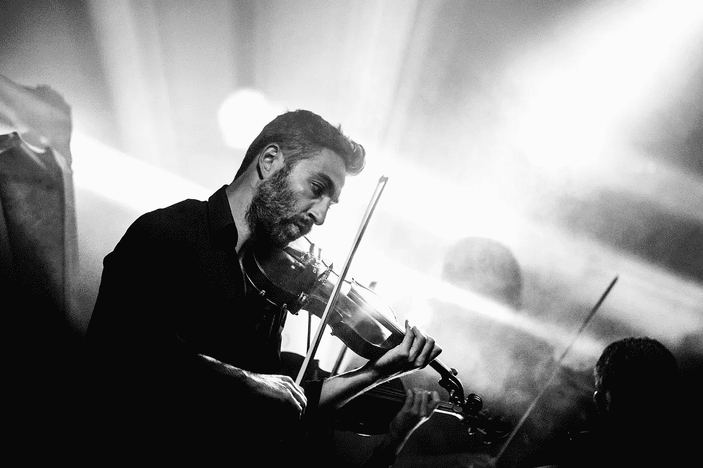
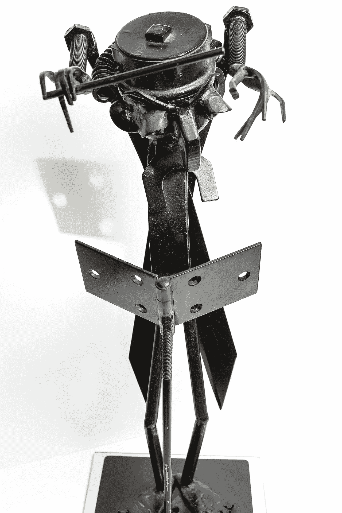

# 3 种看待自己作为 ML 从业者的方式

> 原文：<https://towardsdatascience.com/3-awesome-ways-to-look-at-yourself-as-a-ml-practitioner-50af91dd8e10?source=collection_archive---------48----------------------->

## 听众、艺术家还是作曲家？

T 他的想法我第一次是在这本书里看到的[这里](https://mml-book.github.io/)，但是我觉得它太好了，你们都得读一读。

显然，并不是所有的 ML 从业者都是生而平等的，至少有几种不同的类型。下面，我们将会看到一分为三，类似于人们与音乐的三种互动。

# 听众们

来源: [Pixabay](https://pixabay.com/ro/photos/sculptur%C4%83-bronz-ascultare-asculta-2209152/)

机器学习开源软件、在线课程和基于云的工具的浪潮让新来者不必担心 ML 管道的细节。

在 ML 的世界里，现成工具的可用性是一件好事，也是一件坏事。这是因为，虽然没有经验的用户可以很容易和容易地从机器学习中受益，但可以肯定的是，他们中的一些人并不真正知道他们在做什么，也不理解。因此，对他们的数据/模型得出错误的结论是很常见的。

这些被称为监听器，因为就像在音乐的情况下，用户能够选择不同类型的算法，辨别它们之间的表面差异，并从它们的使用中受益。

# 艺术家们

来源: [Pixabay](https://pixabay.com/ro/photos/violonist-concert-muzica-juc%C4%83tor-407185/)

与听众相比，艺术家有足够的勇气将不同的方法和分析插入到管道中。对于这一类人来说，非常重要的是他们掌握所用工具背后的数学知识的程度。他们并没有真正深入到所用方法的各个方面，但是他们很好地理解了背后的机制，以及需要调整什么来提高他们模型的性能。

这些人被称为艺术家，因为就像小提琴歌手一样，高技能的练习者可以将他们的乐器带入生活并激发观众，他们可以在他们的 ML 练习中增加一些趣味。

# 作曲家们

来源: [Pixabay](https://pixabay.com/ro/photos/o%C5%A3el-izolat-instrument-cheie-3176854/)

大师们来了。

可以边听边玩。你可以拉小提琴，而且会拉得很好。但可能创造自己的音乐作品并不是一件容易的事情。ML 从业者也一样。

的创造者:

1.  马尔可夫链和马尔可夫过程— [安德烈·马尔可夫](https://en.wikipedia.org/wiki/Andrey_Markov)
2.  第一个神经网络— [马文·明斯基](https://en.wikipedia.org/wiki/Marvin_Minsky)
3.  感知机— [弗兰克·罗森布拉特](https://en.wikipedia.org/wiki/Frank_Rosenblatt)
4.  许多其他伟大的概念…

属于作曲家的范畴。他们不仅喜欢“听音乐”，完美地“演奏”音乐，而且还“创作”了杰作。

很有可能，你现在可能不是一个作曲家，但是只要有纪律和热情，你可以做到。

# 最后的想法

这是一本小册子，应该如此对待。如果你热爱你所做的事情，并且你的工作提供了价值，你是哪种类型的 ML 从业者并不重要。

*如果你喜欢我的作品，可以考虑看看我的其他帖子:*

 [## 我们为什么用 0.05？

### 还是不是？

towardsdatascience.com](/why-do-we-use-0-05-8cd43a39edfa)  [## 标准偏差与标准误差

### [警告这太容易了] -包含简短的示例 R 代码

towardsdatascience.com](/standard-deviation-vs-standard-error-5210e3bc9c04) 

直到下次，继续学习。